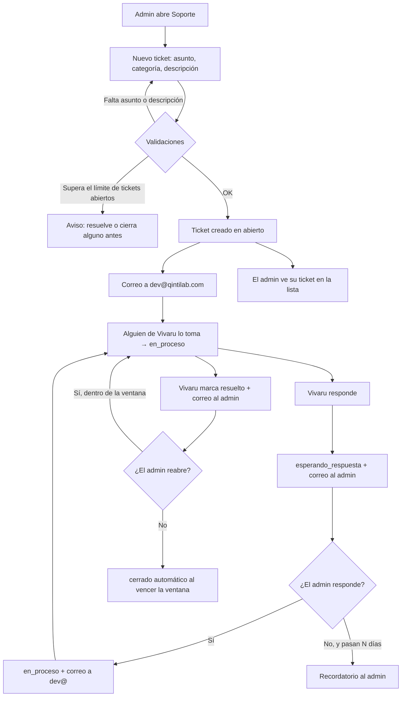

# PRD-V-FEAT-001 — Tickets de soporte al cliente

| | |
|---|---|
| **Tipo** | `FEAT` |
| **Portales** | `ADMIN` (alcance) · `SUPERADMIN` (alcance) · residente y portería: **no tocados** |
| **Módulo** | Configuración / Soporte |
| **Usuario principal** | `tenant_admin` — el administrador del conjunto |
| **Usuarios secundarios** | `superadmin` — quien atiende desde Vivaru |
| **Responsable** | David (producto) · equipo comercial (operación) |
| **Estado** | En staging · verificada |
| **Dependencias** | `functions/src/email.ts` (remitente verificado) · secret `RESEND_API_KEY` |
| **Riesgo** | Medio — datos personales en texto libre, y una cola que si nadie atiende deteriora la relación con el cliente |
| **Reversibilidad** | **Alta.** Es funcionalidad aditiva: se apaga ocultando la entrada del menú, sin migrar ni perder datos |
| **Fase / plan** | Todos los conjuntos, incluidos los que están en prueba |

> **Por qué merece PRD:** toca dos portales, crea una colección con permisos nuevos, introduce estados que alguien tendrá que operar a diario, y envía correo a personas. Cumple cuatro de los seis criterios de la puerta.

---

## 1 · Resumen ejecutivo

El administrador de un conjunto no tiene forma de pedir ayuda a Vivaru desde el producto: cuando algo falla, escribe a `dev@qintilab.com` y la conversación vive en un buzón, sin estado ni rastro. Esta PRD abre un canal dentro del portal — el administrador escribe, el equipo responde desde la consola, y ambos ven el hilo y en qué va. El valor no es la pantalla: es **dejar de perder solicitudes y saber cuántas hay, de qué son y cuánto tardamos**.

La decisión que permanece humana es toda: aquí no se automatiza nada, se ordena.

## 2 · Problema y baseline

**Cómo se resuelve hoy.** El administrador escribe a `dev@qintilab.com`. Alguien del equipo comercial lo lee y responde por correo. Si hace falta, se anota a mano en `/superadmin/support`, que hoy funciona como **bitácora interna**: el superadmin elige el conjunto de una lista y teclea a mano quién reportó.

**Lo que eso cuesta.** No hay estado ni dueño, así que una solicitud puede quedarse sin respuesta sin que nadie lo note. No hay historial por conjunto: quien atiende no sabe si es la tercera vez que preguntan lo mismo. Y no hay ningún número: no sabemos cuántas llegan, de qué tratan ni cuánto tardamos.

**Baseline: CERO.** No hay clientes todavía, así que hoy no llega ninguna solicitud de soporte (confirmado 2026-08-01).

**Eso obliga a reformular la justificación, y conviene decirlo claro:** esto **no arregla un dolor actual** — no se está perdiendo ninguna solicitud, porque no hay ninguna. Es **infraestructura para el primer cliente**: que cuando llegue, exista un canal en lugar de improvisar un buzón. Es una razón legítima, pero es distinta de la que suele justificar un módulo de soporte, y tiene dos consecuencias:

1. **La prioridad es discutible frente a cualquier cosa que sirva para *conseguir* clientes.** Con cero clientes, el trabajo comercial rinde más que el operativo. Esta PRD queda lista y bien definida; **cuándo se construye es una decisión de secuencia, no de diseño.**
2. **La métrica de éxito no puede ser de volumen** durante meses. La primera es operativa, no estadística: *cuando el primer cliente abra su primer ticket, recibe respuesta y el hilo queda registrado*. Las métricas de mediana y porcentaje solo tienen sentido a partir de unas decenas de tickets.

**Volumen esperado.** Cero al arrancar; decenas al mes cuando haya base instalada. Eso condiciona el diseño: **no hace falta una herramienta de helpdesk, hace falta una bandeja honesta.**

## 3 · Usuarios, roles y permisos

| Rol | Ve | Puede | **NO puede** |
|---|---|---|---|
| `tenant_admin` | Los tickets **de su propio conjunto** | Abrir un ticket · responder en el hilo · reabrir uno resuelto · cerrarlo | Ver tickets de otro conjunto · cambiar el estado a `en_proceso` o `resuelto` · ver las notas internas · borrar |
| `superadmin` | **Todos** los tickets, de todos los conjuntos | Responder · cambiar estado y prioridad · escribir notas internas · filtrar y buscar | Borrar (no hay borrado; ver §7) |
| `resident` | Nada | — | **Todo.** Su canal es PQRS, con su administración |
| `security_guard` | Nada | — | **Todo** |

**La razón de que el residente quede fuera** es deliberada: si un residente pudiera escribir a Vivaru, Vivaru se convertiría en primera línea de los problemas del conjunto, que es exactamente el trabajo del administrador. El soporte es entre Vivaru y su cliente.

**Las notas internas nunca las ve el cliente.** Es la única información asimétrica del modelo y hay que protegerla explícitamente en las reglas, no solo ocultarla en la interfaz.

## 4 · Objetivo, alcance y exclusiones

**Objetivo.** Que toda solicitud de un administrador a Vivaru quede registrada, con dueño, estado e historial, y que ambas partes vean lo mismo.

**Entra en el MVP**

- Pantalla de soporte en el portal del administrador: lista de sus tickets y detalle con hilo.
- Alta de ticket: asunto, categoría, descripción.
- Hilo de conversación en ambos sentidos.
- Cinco estados con transiciones definidas (§6).
- Bandeja del superadmin, reaprovechando `/superadmin/support`: filtros, prioridad, notas internas y **antigüedad visible**.
- Correo a `dev@qintilab.com` al abrirse un ticket y cuando el cliente responde.
- Correo al administrador cuando Vivaru responde o marca resuelto.
- **Evidencia adjunta**: hasta 3 archivos por mensaje, imágenes o PDF, 5 MB cada uno.

**No entra, y por qué**

| Excluido | Razón |
|---|---|
| ~~Adjuntos~~ | **Incluidos tras la implementación** (ver abajo). Resultó que Storage ya cubría la ruta y el patrón de subida existía dos veces en el producto. |
| **SLA y alertas de incumplimiento** | Sin baseline no sabemos qué plazo es realista. Primero medir. |
| **Base de conocimiento / autoservicio** | Requiere saber qué se pregunta. Los primeros meses de tickets son justamente esa investigación. |
| **Notificación in-app** | El correo basta para el volumen esperado. |
| **Chat en vivo** | Promete inmediatez que el equipo no puede sostener. |
| **Encuesta de satisfacción** | Sin volumen no dice nada. |
| **Que el residente abra tickets** | §3. Cambiaría el producto, no lo ampliaría. |

## 5 · Flujo funcional

**Casos límite que hay que resolver, no ignorar**

- **El conjunto está suspendido o vencido.** Puede abrir tickets igual (§7). Es justo cuando más lo necesita.
- **El administrador deja el conjunto.** El ticket pertenece al **conjunto**, no a la persona: el siguiente administrador ve el historial completo.
- **Dos administradores del mismo conjunto.** Ambos ven y responden los mismos tickets. No hay tickets privados entre administradores.
- **El cliente responde a un ticket cerrado.** No se permite; la interfaz ofrece abrir uno nuevo citando el anterior.

## 6 · Estados y transiciones

| Estado | Significado | Quién lo provoca | Sale hacia |
|---|---|---|---|
| `abierto` | Creado, nadie lo ha tomado | `tenant_admin` | `en_proceso`, `cerrado` |
| `en_proceso` | Alguien de Vivaru lo está atendiendo | `superadmin` | `esperando_respuesta`, `resuelto` |
| `esperando_respuesta` | Vivaru respondió; la pelota está en el cliente | `superadmin` (al responder) | `en_proceso` (el cliente contesta), `cerrado` (vence) |
| `resuelto` | Vivaru lo da por resuelto | `superadmin` | `en_proceso` (el cliente reabre), `cerrado` (vence) |
| `cerrado` | **Terminal.** No admite respuestas | `tenant_admin`, o el sistema al vencer | — |

**Reglas del ciclo de vida**

- **Pendiente de Vivaru** = `abierto` + `en_proceso`. Es la cifra que mide la cola, y sigue el mismo criterio que ya usa PQRS (`PENDING_TICKET_STATUSES`): lo que espera al cliente no cuenta como pendiente nuestro.
- **Reapertura**: desde `resuelto`, dentro de una ventana de **7 días**. Fuera de la ventana, ticket nuevo. *Implementado y probado.*
- **Cierre automático**: **NO implementado — queda en Fase 2.** La intención es que `esperando_respuesta` y `resuelto` pasen a `cerrado` tras 14 días sin actividad, con recordatorio antes. Mientras no exista, un ticket puede quedarse indefinidamente esperando al cliente: con cero clientes no molesta, pero es lo primero que hará falta cuando haya volumen.
- **`cerrado` es terminal y no se reabre.** Es lo que permite que el número de pendientes signifique algo.

## 7 · Contrato de datos y multi-tenancy

Se **reutiliza y extiende** la colección `supportTickets`, que ya existe con modelo, filtros y bandeja. No se crea una nueva.

| Campo | Tipo | Obligatorio | Lo escribe | Notas |
|---|---|---|---|---|
| `tenantId` | string | Sí | servidor | **Toda consulta de lista debe filtrarlo.** Las reglas no filtran: rechazan |
| `tenantName` | string | Sí | servidor | Denormalizado para la bandeja |
| `createdBy` | uid | Sí | servidor | Nunca del cliente |
| `createdByName`, `createdByEmail` | string | Sí | servidor | Del perfil, no tecleado |
| `category` | enum | Sí | cliente | `tecnico` · `facturacion` · `operativo` · `otro` |
| `subject` | string | Sí | cliente | Máx. 120 |
| `description` | string | Sí | cliente | Máx. 4000 |
| `priority` | enum | Sí | servidor (`media`) / superadmin | `alta` · `media` · `baja` |
| `status` | enum | Sí | servidor | §6 |
| `thread[]` | array | Sí | servidor | **Append-only** vía `arrayUnion`. `{id, role, authorUid, authorName, message, attachments?, createdAt}` |
| ~~`internalNotes`~~ | — | — | — | **Sustituido por la subcolección `internal`** (§11) |
| `createdAtIso` | string | Sí | servidor | ISO además del Timestamp: el límite diario filtra por rango y necesita un campo comparable |
| `createdAt`, `updatedAt`, `lastActivityAt` | timestamp | Sí | servidor | `lastActivityAt` alimenta antigüedad y cierre automático |
| `resolvedAt`, `closedAt` | timestamp | No | servidor | |

**Cambios sobre lo que existe hoy**

- `reportedBy` / `reportedByName` (texto libre, tecleado por el superadmin) quedan **obsoletos** para tickets nuevos: los sustituyen `createdBy` y `createdByName`, tomados del perfil. Los documentos antiguos se conservan tal cual; la bandeja muestra el que exista.
- **Resuelto de otra forma, y mejor**: las notas internas no son un campo renombrado sino una **subcolección** `supportTickets/{id}/internal`. El campo `notes` heredado se conserva sin uso. La razón es de seguridad, no de nombres — ver §11.
- `responseHistory` está declarado en el tipo y **nunca se ha escrito ni leído**. Se sustituye por `thread`, que sí se implementa.

**Comportamiento por estado del conjunto**

| Estado del conjunto | Puede abrir y responder |
|---|---|
| `active` | Sí |
| `trial` | **Sí.** Un prospecto con un problema sin resolver es un prospecto perdido |
| `suspended` | **Sí, y es deliberado.** Es el canal por el que deja de estar suspendido |
| `expired` | **Sí**, mismo motivo |

> `supportTickets` está **excluido a propósito** de la guarda `tenantOperable()` que dejó en solo lectura a suspendidos y vencidos. Es la única excepción del sistema y hay que conservarla.

**Retención y borrado.** No hay borrado — ni de tickets ni de adjuntos, para ningún rol. Un ticket cerrado es historial de la relación comercial. **Decidido: sin caducidad.** Con una captura por ticket y decenas de tickets al mes el coste es irrelevante. Queda anotado que son datos personales potenciales: si algún día hay una política de retención general, esto entra en ella.

## 8 · Reglas de negocio

1. Solo un usuario con rol `tenant_admin` puede abrir un ticket.
2. Un ticket pertenece al conjunto, no a la persona que lo abrió.
3. Un ticket `cerrado` no admite mensajes nuevos ni cambios de estado.
4. El cliente **no** puede fijar la prioridad; la asigna Vivaru.
5. El cliente **nunca** recibe el contenido de `internalNotes`, por ninguna vía —ni interfaz, ni correo, ni consulta directa.
6. El hilo es **append-only**: ningún mensaje se edita ni se borra.
7. Un conjunto no puede tener más de **5 tickets sin cerrar** a la vez. *Implementado: se cuenta antes de escribir.*
8. Un conjunto no puede abrir más de **10 tickets al día**. *Implementado.*
11. Un mensaje admite hasta **3 adjuntos**, de 5 MB cada uno, imágenes o PDF. *Implementado y validado en el servidor.*
9. `lastActivityAt` se actualiza con **cualquier** mensaje o cambio de estado.
10. Un conjunto suspendido o vencido conserva la capacidad de abrir y responder.

## 9 · Notificaciones y correo

Todo sale por `functions/src/email.ts`, con el remitente verificado `noreply@notificaciones.grupovivaru.com`.

| Evento | Destinatario | Contenido |
|---|---|---|
| Ticket creado | `dev@qintilab.com` | Conjunto, estado del conjunto, quién, categoría, asunto, descripción y **enlace a la bandeja** |
| El cliente responde | `dev@qintilab.com` | Conjunto, asunto, mensaje y enlace |
| Vivaru responde | Administrador del ticket | Asunto, mensaje y enlace a su pantalla de soporte |
| Vivaru marca resuelto | Administrador | Resumen y cómo reabrir |
| Recordatorio de inactividad | Administrador | Aviso de cierre automático próximo |

**El buzón se configura en `SUPPORT_NOTIFICATION_TO`**, con `dev@qintilab.com` por defecto. Variable propia y no reutilizar `LEAD_NOTIFICATION_TO`: soporte y comercial son colas distintas aunque hoy las mire la misma persona, y separarlas cuesta una línea ahora y una migración después.

**El correo no promete plazos de respuesta.** El producto no controla cuándo contesta una persona; prometerlo lo incumple la pantalla, no el equipo. Se dice *"te contactaremos"*, no *"en menos de X horas"* — el mismo criterio que ya se aplicó al acuse del asesor.

**Enriquecimiento recomendado del correo al equipo:** incluir estado del conjunto, plan, días de prueba restantes y avance de activación. Ese contexto ya se calcula y convierte un correo en un informe.

## 10 · Criterios de aceptación

**Deben funcionar**

1. Un `tenant_admin` abre un ticket y aparece en su lista en estado `abierto`.
2. Al crearse, llega correo a `SUPPORT_NOTIFICATION_TO` con enlace a la bandeja.
3. El superadmin ve el ticket en `/superadmin/support` con el conjunto correcto.
4. El superadmin responde → estado `esperando_respuesta` y correo al administrador.
5. El administrador responde → estado `en_proceso` y correo al equipo.
6. El superadmin marca `resuelto` → correo al administrador con la opción de reabrir.
7. El administrador reabre dentro de la ventana → vuelve a `en_proceso`.
8. Un administrador de un conjunto **suspendido** abre un ticket con éxito.
9. La bandeja muestra la antigüedad de cada ticket y permite filtrar por estado y conjunto.
10. Con dos administradores en el mismo conjunto, ambos ven y responden los mismos tickets.

**Deben fallar**

11. Un `resident` que intente leer o escribir en `supportTickets` → **denegado**.
12. Un `security_guard`, ídem → **denegado**.
13. Un `tenant_admin` que intente leer un ticket de **otro conjunto** → **denegado**.
14. Un `tenant_admin` que intente cambiar `status` o `priority` directamente → **denegado**.
15. Un `tenant_admin` que consulte el documento crudo **no recibe `internalNotes`**.
16. Responder a un ticket `cerrado` → **rechazado**.
17. Abrir un ticket superando el límite de abiertos → **rechazado con mensaje claro**.
18. Cualquier intento de borrado, por cualquier rol → **denegado**.
19. Una consulta de lista **sin** `where("tenantId","==",...)` → **denegada** (comportamiento esperado de las reglas).

Los casos 11–19 se cubren con pruebas de emulador en `tests/firestore.rules.test.ts`, que ya se pueden ejecutar.

## 11 · Arquitectura y dependencias

### Decisión obligatoria: **Cloud Function callable**, no escritura directa

Toda **escritura** —crear, responder, cambiar estado— pasa por callables. Cuatro razones, cualquiera bastaría:

1. **Manda correo.** El cliente no puede disparar correo saliente.
2. **Hay campos que el cliente no debe poder falsificar:** `createdBy`, `status`, `priority`, `tenantName` y las marcas de tiempo.
3. **El hilo es append-only.** Con escritura directa habría que reconstruir esa garantía en las reglas, que no es su fuerte.
4. **Hay límites por conjunto**, que exigen contar antes de escribir.

**La lectura sí va por reglas**, con `tenantAdminOrSuper(resource.data.tenantId)` — es una consulta simple y las reglas la protegen por completo.

> **El problema de `internalNotes`.** Si vive en el mismo documento, un `tenant_admin` con permiso de lectura lo recibe entero: las reglas de Firestore **no filtran campos**. Ocultarlo en la interfaz no es protegerlo.
>
> **Recomendación:** subcolección `supportTickets/{id}/internal/{docId}`, con lectura solo para `superadmin`. Es la única forma real de que el cliente no lo vea, y el costo es una consulta más en la bandeja interna.

### Componentes

| Pieza | Estado | Trabajo |
|---|---|---|
| `supportTickets` (colección y modelo) | Existe | Extender campos |
| `/superadmin/support` | Existe | Añadir hilo, antigüedad, y quitar el alta manual |
| Pantalla de soporte del admin | **No existe** | Nueva |
| Callables de soporte | **No existen** | Nuevas |
| Reglas de `supportTickets` | Existen, solo superadmin | Reescribir |
| Correo | Existe (`email.ts`) | Plantillas nuevas |
| Cierre automático | **No existe** | Job diario, o al leer |

**Dónde entra el administrador — decidido.** Entrada **«Soporte» en el grupo CONFIGURACIÓN del menú lateral**, en `/admin/soporte`. Se descartó la pestaña dentro de Configuración: quien busca ayuda está frustrado y con prisa, y un tercer nivel no se encuentra en ese estado.

**Cierre automático — pendiente para Fase 2.** Un job diario, reutilizando el patrón de `trialLifecycleDaily`. Evaluarlo al leer sería más barato pero deja tickets sin cerrar si nadie abre la bandeja.

**Índices — declarados.** Cuatro en `firestore.indexes.json`: `tenantId+createdAtIso` (límite diario), `tenantId+status` (conteo de abiertos), `tenantId+lastActivityAt` (lista del administrador) y `status+lastActivityAt` (bandeja). Los dos primeros no eran obvios y se descubrieron en ejecución: la callable fallaba con `INTERNAL`, que en el log era *«the query requires an index»*.

## 12 · Riesgos y mitigaciones

| Riesgo | Mitigación | Señal que lo detecta |
|---|---|---|
| **Nadie atiende la cola** y el canal empeora la percepción frente al correo | Dueño nombrado y revisión diaria (§G5) | Tickets `abierto` con más de 48 h |
| **`internalNotes` se filtra** al cliente | Subcolección con lectura solo superadmin | Prueba de emulador que debe fallar |
| **Datos personales** en texto libre | Sin adjuntos en MVP; retención declarada; sin borrado, pero con acceso acotado | Revisión al definir retención |
| **Abuso o bucle** que inunde el buzón | Límites por conjunto y por día | Pico de tickets de un mismo conjunto |
| **Se convierte en canal para residentes** vía el administrador | El canal del residente es PQRS; la categoría lo hace visible | Tickets `operativo` que en realidad son PQRS |
| **Convive con el correo** y la conversación se parte en dos | Al responder por correo, devolver al ticket. **Decidido: la respuesta por correo NO entra al hilo** en el MVP | Hilos que se cortan sin resolución |

## 13 · Despliegue, rollback y Story Map

**Orden obligatorio: reglas → functions → front.** Al revés, la interfaz llama a callables que aún no existen. Es el mismo orden que ya usamos y funcionó.

**Rollback.** Aditivo y de riesgo bajo: se retira la entrada del menú y el canal desaparece sin perder datos. Las reglas nuevas son más permisivas que las actuales — revertirlas devuelve `supportTickets` a solo-superadmin sin romper nada.

**Qué se valida dónde.** Todo el flujo y los permisos, en staging con pruebas de emulador y un recorrido real. **La entrega del correo solo se puede confirmar en producción**, porque staging no tiene `RESEND_API_KEY` — mismo caso que el canario del trial.

### Story Map

**MVP — completo y en staging**

1. ✅ Reglas de `supportTickets` reescritas + subcolección interna.
2. ✅ Seis callables: crear, responder, cambiar estado, reabrir, cerrar, nota interna.
3. ✅ Pantalla del administrador en `/admin/soporte`.
4. ✅ Bandeja del superadmin: hilo, antigüedad, notas internas, sin alta manual.
5. ✅ Correos con `SUPPORT_NOTIFICATION_TO`. *Envío implementado; entrega sin confirmar.*
6. ✅ Pruebas de emulador y verificación en staging.
7. ✅ **Adjuntos** — adelantados de Fase 2 al MVP: la infraestructura ya existía.

**Fase 2**

8. Cierre automático por inactividad (job diario).
9. Contexto enriquecido en el correo al equipo: plan, días de prueba, avance de activación.

**Fase 3**

10. SLA y alertas, ya con volumen real.
11. Base de conocimiento con las preguntas más repetidas.

## Lo que solo se supo construyendo

Cinco cosas que la PRD no podía anticipar y que conviene no volver a descubrir:

**Las reglas de Storage no pueden restringir un subcamino.** Suman permisos, no los restan. El límite de 5 MB para adjuntos tuvo que irse a la callable — donde además resultó mejor, porque lee el tamaño y el tipo reales en vez de fiarse del cliente.

**Las callables v2 recién creadas no nacen invocables públicamente** en este proyecto. Cloud Run devolvía 401 antes de ejecutar una línea. Hay que declarar `invoker: "public"`, como el resto de callables del producto.

**Endurecer las reglas rompió la consola sin que nadie lo notara.** Al prohibir la escritura directa en `supportTickets`, la bandeja del superadmin —que escribía así— quedó inoperante. No había forma de detectarlo salvo tocándola.

**Dos catálogos de lo mismo se separan.** El módulo del superadmin tenía sus propios estados en inglés. Ahora reexporta el contrato compartido: soporte es una cola vista desde dos lados.

**Las pruebas viejas defienden el diseño viejo.** `imp07-support-module` falló tres veces, y las tres con razón: fijaba el catálogo en inglés, la escritura directa y el alta manual. Reescribirlas —no borrarlas— dejó comprobado lo que de verdad importa ahora.

## Puertas## Puertas

| Puerta | Estado |
|---|---|
| `G0 Necesidad` | ✅ El problema existe; la medición es cero porque aún no hay clientes (§2) |
| `G1 Valor` | ✅ Baseline cerrado: **cero**, no hay clientes. Métrica inicial **operativa**: el primer ticket del primer cliente recibe respuesta y queda registrado. Las de volumen —mediana hasta primera respuesta, % resuelto sin salir del canal— se activan a partir de unas decenas de tickets |
| `G2 Datos y permisos` | ✅ Modelo y roles definidos y consistentes |
| `G3 Riesgo` | ✅ Auditable, reversible, con pruebas de los casos que deben fallar |
| `G4 Aceptación` | ✅ 19 criterios verificables |
| `G5 Operación` | ✅ **Cerrada.** Atiende el equipo comercial dentro de DevQintilab. Revisión **una vez al día**, cadencia calibrada a cero clientes. Ver la nota de caducidad abajo |
| `G6 Escala` | ✅ Decenas al mes; el diseño soporta un orden de magnitud más |

**Las siete puertas están superadas. Lista para desarrollo y para producción**, en cuanto se decida construirla.

## Verificación en staging (2026-08-01)

Ejecutada contra staging real con **cuatro sesiones distintas** —administrador,
residente, portería y un superadmin sintético—, pasando por las reglas y los
callables de verdad.

**20 de 20 criterios ejecutables en verde.** Ciclo completo: alta → respuesta de
Vivaru → respuesta del cliente → resuelto → reapertura → nota interna → cierre.
Y los que deben fallar, fallando: residente y portería no leen; el administrador
no accede a tickets de otro conjunto ni a las notas internas; nadie escribe el
documento directamente —tampoco el superadmin—; nadie borra; no se responde a un
cerrado; y una consulta de lista sin filtro de conjunto se deniega entera.

**La excepción de los suspendidos, probada en vivo:** un conjunto suspendido
abre un ticket (200) y sigue sin poder crear una unidad (403). Funciona sin
haber aflojado el candado de alrededor, que era el riesgo real de introducirla.

**Lo que NO se pudo verificar:** la entrega del correo. Staging no tiene
`RESEND_API_KEY`. El código lo envía y falla en silencio a propósito, para que un
problema de correo nunca deshaga una solicitud de ayuda. Solo se confirma en
producción, igual que pasó con el canario del trial.

**Sin recorrer con ojos:** la interfaz. La lógica y los permisos están
verificados por API; nadie ha visto todavía las dos pantallas renderizadas.

## Evidencia adjunta — y por qué el límite no está donde parecía

Se incluyó en el MVP tras comprobar que la infraestructura ya existía: las
reglas de Storage cubren `tenants/{tenantId}/**` con lectura para los miembros
del conjunto **y para el superadmin**, y el patrón de subida está implementado
dos veces en el producto (documentos y comprobantes de pago).

**El límite de 5 MB NO puede vivir en las reglas de Storage.** Las reglas *suman*
permisos, no los restan: una regla más estricta para `tenants/{id}/support/**`
sería una concesión adicional, no un límite, porque la general de
`tenants/{id}/**` ya concede hasta 25 MB. **No existe forma de hacer un
subcamino más restrictivo que su padre.**

Así que la validación vive en la callable, y resulta mejor sitio: lee el tamaño
y el tipo **reales** del archivo ya subido con el Admin SDK, en lugar de fiarse
de lo que declare el cliente — que es de quien desconfiamos. Lo que no pasa el
filtro **se borra**, porque un archivo subido que nunca llega a un ticket es
basura que nadie limpiaría.

**Verificado en staging (2026-08-01):**

| Caso | Resultado |
|---|---|
| Abrir ticket con evidencia válida | aceptado, guardado con tamaño y tipo reales |
| Ruta apuntando a **otro conjunto** | `PERMISSION_DENIED` |
| Ruta fuera de `support/` (p. ej. `documents/`) | `PERMISSION_DENIED` |
| Más de 3 adjuntos | `INVALID_ARGUMENT` |
| Tipo no permitido en la ruta correcta | rechazado **y el huérfano borrado (404)** |

## Operación — y su fecha de caducidad

| | |
|---|---|
| **Quién atiende** | Equipo comercial, dentro de DevQintilab |
| **Cadencia** | Una revisión al día |
| **Vía** | Correo a `dev@qintilab.com` + bandeja en `/superadmin/support` |

**Esta cadencia está calibrada a cero clientes y caduca sola.** Con una decena de conjuntos, una revisión diaria sigue bastando; a partir de ahí un ticket puede esperar hasta 24 horas antes de que alguien lo mire, y eso deja de ser aceptable. **Señal para revisarla:** el primer ticket que espere más de un día hábil sin primera respuesta, o el primer día con más de tres tickets nuevos. Ahí toca decidir entre subir la frecuencia, repartir por turnos, o dar el salto a una herramienta con SLA.

## Decisiones pendientes

Todas las de diseño están cerradas. Queda lo operativo:

1. **Recorrer las dos pantallas.** La lógica y los permisos están verificados por API; **nadie ha visto la interfaz**. Es lo único que bloquea la promoción a producción.
2. **Confirmar la entrega del correo**, que solo se puede hacer en producción — staging no tiene `RESEND_API_KEY`.
3. **Cuándo construir la Fase 2.** El cierre automático no corre prisa con cero clientes, pero es lo primero que hará falta cuando la cola tenga volumen.

## Historial

| Fecha | Cambio |
|---|---|
| 2026-08-01 | PRD escrita con la skill `crear-prd-vivaru`. G1 y G5 abiertas |
| 2026-08-01 | G1 cerrada (baseline = cero, no hay clientes) y G5 (equipo comercial, revisión diaria). Justificación reformulada: es infraestructura para el primer cliente, no un dolor actual |
| 2026-08-01 | Implementada en 5 incrementos. Verificada en staging: 20 criterios ejecutables + 71 pruebas de emulador |
| 2026-08-01 | Adjuntos adelantados de Fase 2 al MVP y verificados |
