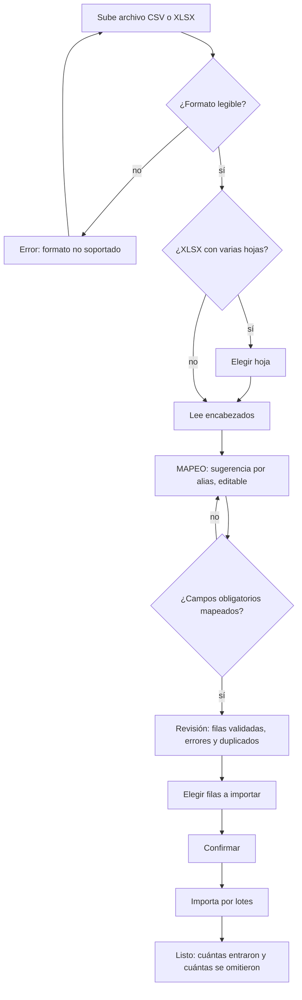

# PRD-V-FEAT-002 — Importación de datos del conjunto

| | |
|---|---|
| **ID** | `PRD-V-FEAT-002` |
| **Tipo** | `FEAT` |
| **Portales** | **`ADMIN`** (alcance). `SUPERADMIN` solo como consumidor de la métrica de activación |
| **Módulo** | Residentes · puesta en marcha del conjunto |
| **Usuario principal** | `tenant_admin` / `admin_tenant` |
| **Responsable** | David |
| **Estado** | **En staging** — MVP construido y desplegado el 14 de agosto de 2026. Producción, pendiente |
| **Dependencias** | **Ninguna.** No depende del programa de IA, ni del proveedor, ni del presupuesto |
| **Habilita** | `PRD-VAI-FEAT-001` — Onboarding asistido. Esta PRD construye el hueco donde aquella entra |
| **Riesgo** | **Medio.** Crear personas en masa es crear accesos en masa |
| **Reversibilidad** | **Parcial** — ver §13. Lo importado se puede borrar; los accesos creados exigen un paso aparte |

---

## 1. Resumen ejecutivo

Poner en marcha un conjunto exige cargar sus unidades y sus personas, y hoy eso
solo funciona si el archivo del cliente **coincide con la plantilla de Vivaru**.
Cuando no coincide —que es lo normal, porque cada administradora exporta de su
propio sistema— el importador devuelve filas vacías con error y no ofrece salida.
Esta PRD añade **un paso de mapeo de columnas** y un **catálogo único de campos
destino**, y acepta **XLSX** además de CSV.

El valor no es cosmético: la importación es un paso del recorrido de activación,
y **es el hueco exacto donde después entra el mapeo asistido por IA**. Sin un
paso de mapeo manual no hay nada que asistir.

## 2. Problema y baseline

### Lo que ya existe, verificado en el código

**No se parte de cero.** Hay dos asistentes en producción, montados en
`/admin/residents`:

| | `UnitBulkImportWizard.tsx` | `ResidentBulkImportWizard.tsx` |
|---|---|---|
| Tamaño | 645 líneas | 398 líneas |
| Pasos | Archivo → Revisión → Confirmar → Listo | igual |
| Formato | **CSV** (`accept=".csv,text/csv"`) | **CSV** |
| Parser | `papaparse` | `papaparse` |
| Valida por fila | sí | sí |
| Detecta duplicados | contra unidades existentes | por email y documento |
| Permite elegir filas | sí | sí |
| Plantilla descargable | `plantilla_unidades.csv` | `plantilla_residentes.csv` |

**Parser, reglas y preview están construidos.** Lo que falta es otra cosa.

### El problema real, en tres hechos

**1 · El catálogo de campos destino existe, pero implícito y duplicado.** Cada
asistente lleva su propia función `getField(raw, ...alias)` con una lista fija:

```
unidades    nombre|name|unidad|unit|displayname · torre|tower ·
            tipo|type · estado|status
residentes  nombre|name|fullname · email|correo|e-mail ·
            telefono|celular|phone|tel · documento|cedula|documentnumber|id ·
            unidad|unit|apartamento · rol|role|tipo
```

Son **dos espejos de la misma idea con listas distintas**. Y ya colisionan:
**`tipo` significa «tipo de unidad» en uno y «rol de la persona» en el otro.**
Un catálogo compartido que herede esa ambigüedad nace roto.

**2 · Un encabezado no reconocido no tiene salida.** Si la columna se llama
«Depto» o «Nombre del propietario», `getField` devuelve cadena vacía, la fila
queda con error y **la persona no tiene forma de decir qué columna es cuál**. El
archivo no se puede importar aunque contenga exactamente los datos correctos.

**3 · Solo CSV.** `xlsx` es dependencia del proyecto pero el importador no lo
acepta, y lo que exporta un sistema de administración suele ser XLSX.

### Baseline de activación — corregido

`PRD-VAI-FEAT-001` afirma «un recorrido de siete pasos de activación». **Es
inexacto y hay que corregirlo antes de medir nada.** El código
(`src/lib/onboarding/steps.ts`) tiene **dos pistas**:

| Pista | Pasos de activación | Bloques |
|---|---|---|
| `trial` | **7** | Pon a punto tu conjunto · Pruébalo de punta a punta |
| `cliente` | **10** | los dos anteriores **+ Empieza a cobrar** |

`activationStepsFor()` excluye el bloque «Descubre qué más hace Vivaru», que es
señal secundaria y no cuenta. **Los KPI de finalización y abandono se redefinen
por pista**; mezclarlas da un número que no describe ningún recorrido real.

**Baseline que falta y hay que capturar antes de construir** (`TBD`): cuántos
archivos se intentan importar hoy y cuántos terminan en importación efectiva. Hoy
no se instrumenta. **Sin ese dato no se puede afirmar que esta PRD mejoró nada**
— ver §10, criterio de aceptación `CA-13`.

## 3. Usuarios, roles y permisos

Roles canónicos según `src/lib/constants/roles.ts`. Existen alias históricos
(`admin_tenant`/`tenant_admin`, `superadmin`/`super_admin`,
`security`/`security_guard`) y las reglas deben tratarlos como equivalentes.

| Rol | Ve | Puede | **NO puede** |
|---|---|---|---|
| `tenant_admin` · `admin_tenant` | El asistente en su conjunto | Subir archivo, mapear columnas, revisar, elegir filas, importar | Importar a **otro** conjunto · saltarse la revisión · importar filas con error · crear campos destino nuevos |
| `resident` | Nada | Nada | Ver el asistente, incluso por URL directa |
| `security_guard` · `security` | Nada | Nada | Ver el asistente |
| `committee` | Nada | Nada | Importar. **Decisión explícita:** cargar el padrón es responsabilidad de la administración |
| `superadmin` · `super_admin` | La métrica de activación agregada | Leer | **Importar en nombre de un conjunto.** Si hace falta soporte, se hace con la cuenta del conjunto y queda auditado |

## 4. Objetivo, alcance y exclusiones

**Objetivo.** Que un administrador pueda cargar las unidades y las personas de su
conjunto **desde el archivo que ya tiene**, sin reescribirlo para que encaje en
una plantilla.

**Entra en alcance:**

1. **Catálogo único de campos destino**, con una sola definición compartida por
   los dos asistentes, sus plantillas y —después— el mapeo asistido.
2. **Paso de mapeo de columnas**, entre «Archivo» y «Revisión»: la persona ve sus
   encabezados a la izquierda y elige el campo destino a la derecha.
3. **Precarga por alias**: lo que hoy resuelve `getField` pasa a ser la
   *sugerencia inicial* del mapeo, no la única oportunidad.
4. **XLSX** además de CSV, con selección de hoja cuando el libro tenga varias.
5. **Corrección del baseline** de activación por pista (§2).

**No entra, y es deliberado:**

- **Nada de IA.** Ni mapeo asistido, ni sugerencias del modelo. Esta PRD
  construye el hueco; `PRD-VAI-FEAT-001` lo llena.
- **Los otros ocho pasos** del recorrido `cliente`. Solo se tocan unidades y
  personas.
- **El portal del residente.** No se toca.
- **Importar cobros, PQRS, comprobantes o documentos.**
- **Guardar el mapeo para reutilizarlo** en la siguiente importación. Es
  deseable y se aplaza: exige decidir dónde vive y quién lo puede editar.
- **Deshacer una importación** con un botón. Ver §13.

## 5. Flujo funcional



**Casos límite que hay que resolver, no descubrir:**

- **Archivo vacío o sin encabezados** → error claro, no pantalla en blanco.
- **Dos columnas mapeadas al mismo campo destino** → se impide, con aviso.
- **Encabezados duplicados en el archivo** → se distinguen por posición.
- **Archivo grande** → ver `RN-08`.
- **La persona cierra el asistente a mitad** → no se escribe nada. Ver §6.

### El orden entre las dos cargas, y por qué está en esta PRD

**Añadido el 14 de agosto de 2026, ampliando el alcance a propósito.** Al revisar
la pantalla apareció un fallo que el paso de mapeo no arregla y que hace inútil
todo lo demás para quien llega sin saber.

**El fallo, reproducible:** conjunto nuevo, cero unidades. Los botones de cargar
unidades y cargar residentes tienen el mismo peso visual y ningún orden. Quien
empieza por residentes —la mitad de las veces, porque «residentes» es el nombre
del módulo y del menú— sube su padrón, mapea, y **todas las filas salen en rojo
con «Unidad no encontrada»**. `RN-03` impide seleccionar filas con error, así que
no puede importar ni una. **El mensaje culpa a su archivo cuando la causa es el
orden**, así que revisa el archivo, comprueba que está bien, lo vuelve a subir y
falla igual.

**El orden ya estaba decidido y escrito**, pero solo donde no se ve:
`src/lib/onboarding/steps.ts` declara torres → unidades → residentes → portería,
y su propio texto dice «con las unidades cargadas, importa a las personas». Eso
solo aparece llegando con `?guia=`; por la barra lateral, que es el camino
normal, no hay nada.

**Decidido por David el 14 de agosto: unidades primero, siempre.** Por eso se
bloquea en vez de advertir.

| # | Regla |
|---|---|
| `RN-12` | Con **cero** unidades en el conjunto, la carga de residentes está deshabilitada, y el motivo se lee sin pasar el ratón por encima |
| `RN-13` | El bloqueo se levanta con **una sola** unidad: puede haberlas creado por otro camino |
| `RN-14` | Si aun así se llega al asistente de residentes sin unidades —el recorrido guiado lo abre—, se dice la causa real y no se ofrece subir archivo |

## 6. Estados y transiciones

**La importación no crea una entidad con ciclo de vida propio.** El asistente es
un flujo efímero: sus estados son de interfaz (`upload` → `map` → `review` →
`confirm` → `done`) y **no se persisten**.

**Decisión explícita, y es la que evita un estado huérfano:** si la persona
abandona antes de confirmar, **no queda nada escrito**. No hay «importación a
medias» que alguien tenga que operar después.

**Lo que sí tiene dueño:** las unidades y personas creadas entran con el mismo
ciclo de vida que las creadas a mano, y las opera la administración del conjunto.

## 7. Contrato de datos y multi-tenancy

**No se crean colecciones nuevas.** Se escribe en `units` y `people`, con los
mismos campos que la creación individual.

**Invariantes que esta funcionalidad debe respetar y declarar:**

- **Todo documento lleva `tenantId`**, y toda consulta de lista lo filtra. Las
  reglas de Firestore no filtran: rechazan.
- **`unitId` de una persona es el doc id de la unidad, no el slug.** Verificado:
  el asistente actual ya resuelve `unit?.id` correctamente y **esta PRD no debe
  romperlo**. Es una trampa documentada en `CLAUDE.md`.
- **Conjunto `suspended` o `expired` → solo lectura.** La importación **no es
  excepción**: se bloquea con el mensaje estándar.
- **Conjunto en prueba (`trial`)** → la importación funciona, y esa es la
  gracia: es un paso de activación de la pista `trial`. Pero **no puede invitar
  a personas reales**; ver §9.
- **El catálogo de campos destino** es constante de código, no dato de tenant. Un
  conjunto no puede inventarse campos.

**Retención y borrado:** lo importado se borra por los caminos que ya existen
para unidades y personas. **El archivo subido no se almacena** —se procesa en el
navegador y se descarta—, lo que evita guardar un fichero con datos personales.

## 8. Reglas de negocio y validaciones

| # | Regla |
|---|---|
| `RN-01` | Un campo destino obligatorio sin mapear **impide** avanzar a Revisión |
| `RN-02` | Una columna no puede alimentar dos campos destino. **Enmendada por `PRD-V-FEAT-006` (1 sep 2026):** decía «dos columnas no pueden mapearse al mismo campo», y esa dirección queda permitida en `person` por acto explícito de la persona — nunca por la sugerencia (`RN-U3`). Es `RN-U2` de aquella ficha |
| `RN-03` | Una fila con al menos un error **no es importable**, ni seleccionándola |
| `RN-04` | Una unidad duplicada —mismo nombre normalizado— no se crea dos veces |
| `RN-05` | Una persona con email o documento ya existente en el conjunto se marca duplicada y queda fuera por defecto |
| `RN-06` | Una persona **solo se importa si su unidad ya existe**. El orden es unidades primero |
| `RN-07` | El mapeo por alias es **sugerencia**, nunca decisión final: siempre se puede corregir |
| `RN-08` | Un archivo de más de **5.000 filas** se rechaza con un mensaje que explica cómo partirlo |
| `RN-09` | La importación se ejecuta por lotes; si un lote falla, **los anteriores quedan escritos** y el resumen dice cuántos entraron |
| `RN-10` | El conjunto no operable (`suspended`, `expired`) no admite importación |
| `RN-11` | El nombre del campo destino que se enseña a la persona sale del catálogo, no de la columna del archivo |

**`RN-09` es una decisión, no una omisión:** una importación de 3.000 filas que
falla en la 2.900 y revierte todo obliga a repetirla entera. Se prefiere
parcial-y-declarado sobre todo-o-nada silencioso.

## 9. Notificaciones y correo

**Esta funcionalidad no envía correo, y es una decisión.**

Importar personas **crea sus registros, no sus accesos**. El correo de alta lo
dispara el flujo de onboarding existente (`functions/src/email.ts`, remitente
`noreply@notificaciones.grupovivaru.com`), **persona por persona y cuando la
administración lo decide**.

**Por qué separado:** una importación de 300 filas que además dispara 300 correos
convierte un error de mapeo en 300 correos equivocados a personas reales. Y en un
conjunto en prueba, en 300 correos a gente que no aceptó nada.

**No se promete ningún plazo** de procesamiento ni de respuesta.

## 10. Criterios de aceptación

| # | Criterio | Debe |
|---|---|---|
| `CA-01` | Un CSV cuyos encabezados no coinciden con la plantilla se importa correctamente tras mapear | pasar |
| `CA-02` | Un XLSX de una hoja se importa igual que el CSV equivalente | pasar |
| `CA-03` | Un XLSX de tres hojas pide elegir hoja antes de continuar | pasar |
| `CA-04` | Sin mapear un campo obligatorio, el botón de continuar está deshabilitado | pasar |
| `CA-05` | Mapear dos columnas al mismo campo destino se impide con aviso | pasar |
| `CA-06` | Los alias de hoy (`nombre`, `torre`, `correo`, `celular`…) siguen precargando el mapeo solos | pasar |
| `CA-07` | Una fila con error no se puede seleccionar para importar | **debe fallar** |
| `CA-08` | Una persona cuya unidad no existe no se importa | **debe fallar** |
| `CA-09` | Un `resident` que abre la URL del asistente no lo ve | **debe fallar** |
| `CA-10` | Un conjunto `suspended` no puede importar | **debe fallar** |
| `CA-11` | Un archivo de 5.001 filas se rechaza con mensaje explicativo | **debe fallar** |
| `CA-12` | Cerrar el asistente antes de confirmar no escribe ni un documento | pasar |
| `CA-13` | Queda instrumentado cuántas importaciones se inician y cuántas terminan, por pista — y desde `PRD-V-FEAT-006`, cuántos campos se alimentaron con más de una columna (`camposUnidos`, un número) | pasar |
| `CA-14` | Importar 500 personas **no envía ni un correo** | pasar |
| `CA-15` | El `unitId` de cada persona importada es el doc id de su unidad, no el slug | pasar |
| `CA-16` | Con cero unidades, el botón de cargar residentes está deshabilitado y el motivo se lee en pantalla | pasar |
| `CA-17` | Con una unidad, el botón vuelve a estar disponible | pasar |
| `CA-18` | Abriendo el asistente de residentes sin unidades, no se ofrece subir archivo y se explica la causa | pasar |
| `CA-19` | Los botones dicen el orden («1 · Cargar unidades», «2 · Cargar residentes») y ya no prometen solo CSV | pasar |

## 11. Arquitectura y dependencias

### La decisión obligatoria: cliente directo o callable

**Hoy es escritura directa desde el cliente:** `bulkCreateUnits` y
`bulkCreatePeople` (`src/features/admin/services.ts`) usan `writeBatch` en
lotes de 450, con `tenantId` y `uid` como argumentos.

**Recomendación: se queda en el cliente para unidades, y se revisa para
personas.**

- **Unidades — cliente directo.** Es un CRUD que las reglas de Firestore pueden
  proteger por completo: `tenantId` correcto y rol de administración. No hay
  lógica de negocio, ni correo, ni escritura cruzada. Moverlo a callable añadiría
  latencia y un límite de payload sin comprar nada.
- **Personas — CERRADO el 14 de agosto de 2026: cliente directo.** Se preguntaba
  si la importación iba a crear o preparar accesos, porque entonces dejaría de
  ser un CRUD y el navegador no debería poder falsificarla. **La decisión de
  producto del mismo día lo respondió: importar nunca invita**, y la invitación
  —que sí crea cuentas y manda correo— ya vive en una callable del servidor.

  Y se comprobó lo que sostenía el argumento, en vez de suponerlo. `units` y
  `people` exigen `tenantOperable(request.resource.data.tenantId)` **y**
  `tenantAdminOrSuper(request.resource.data.tenantId)`:

  - El rol se comprueba **contra el conjunto que declara el documento que se
    escribe**, así que un navegador no puede escribir en otro conjunto.
  - Un `resident` o `security_guard` no pasa; el alias `admin_tenant` sí está
    contemplado en `tenantRole`.
  - Un conjunto `suspended` o `expired` queda bloqueado **en las reglas**, no
    solo en la pantalla.
  - El `arrayUnion` sobre `units` que hace la carga masiva cae bajo la regla de
    `units`, que ese mismo administrador ya puede escribir: no abre un privilegio
    nuevo.

  **Si algún día la importación llega a tocar `tenantUsers` o a disparar
  invitaciones, esto se reabre** — y ese es el disparador, no una fecha.

### Otras decisiones

- **El catálogo de campos destino es una constante compartida**, en un solo
  archivo bajo `src/lib/`. **No tres espejos.** El repositorio ya arrastra ese
  problema con el catálogo de banderas, que vive en tres sitios y obliga a
  cambiarlos a la vez.
- **La colisión de `tipo`** se resuelve en el catálogo: cada campo destino lleva
  su entidad, así que `tipo` de unidad y `tipo` de persona son entradas
  distintas y sus alias no compiten.
- **XLSX se lee con `xlsx`**, ya instalado. Se lee en el navegador; el archivo no
  viaja a ningún servidor.
- **Una colección nueva: `importRuns`**, y una callable `registrarImportacion`
  que la escribe. Esta PRD decía «sin colección nueva» antes de pensar `CA-13`;
  la corrección es esta línea. **El cliente no escribe la telemetría**, por la
  regla que ya está en `firestore.rules` para `aiFeedback`: la evidencia con la
  que se decide si algo sigue no puede ser fabricable por quien la produce.
  **Sin índice nuevo y sin job programado.**
- **Sin feature flag.** Es una mejora de una pantalla existente que no gasta
  dinero ni llama a servicios externos; el mecanismo de banderas existe para lo
  que hay que poder apagar sin desplegar, y esto no lo es.

## 12. Riesgos y mitigaciones

| Riesgo | Señal que lo detecta | Mitigación |
|---|---|---|
| **Un mapeo equivocado carga 300 personas mal** | Pico de personas creadas seguido de borrados | La revisión enseña los datos **ya mapeados**, no los crudos: el error se ve antes de confirmar |
| **Datos personales en un archivo que se queda por ahí** | — | El archivo **no se almacena**: se procesa en el navegador y se descarta |
| **El catálogo se vuelve a duplicar** | Un `getField` nuevo en un componente | Una sola constante; el segundo espejo se ve en la revisión de código |
| **Importar en un conjunto en prueba y luego convertirlo** | — | Los datos se conservan al convertir; el correo sigue siendo un paso aparte (§9) |
| **Importación parcial deja al administrador sin saber qué entró** | Soporte preguntando «¿se cargó o no?» | `RN-09`: el resumen final dice cuántas entraron y cuántas no |
| **La métrica de activación sigue mezclando pistas** | Un KPI que no cuadra con ninguna pista | §2: KPI redefinidos por pista antes de medir |

## 13. Despliegue, rollback y Story Map

**Orden de despliegue:** reglas → functions → front. En este caso **no cambian
las reglas ni las functions**, así que es un despliegue de front por push a la
rama del ambiente.

**Rollback:** revertir el commit del front devuelve el asistente anterior. **Los
datos ya importados no se revierten solos** — y esto es lo que hace la
funcionalidad *parcialmente* reversible: una importación equivocada se limpia
borrando unidades y personas por los caminos existentes, a mano. **Deshacer una
importación con un botón está fuera de alcance** y, si se quiere, es su propia
PRD con su propio modelo de datos.

**Qué se valida en staging:** los quince criterios de aceptación, con archivos
reales de administradoras si los hay.

**Qué solo se ve en producción:** si los archivos que la gente trae de verdad
encajan en el catálogo. Es la señal que después alimenta `PRD-VAI-FEAT-001`:
**los encabezados que nadie logra mapear son la lista de trabajo del mapeo
asistido.**

### Story Map

**MVP** — catálogo único de campos destino · paso de mapeo con precarga por
alias · XLSX con selección de hoja · instrumentación de inicio y fin por pista ·
corrección del baseline de activación.

**Después** — guardar el mapeo por conjunto para reutilizarlo · importar más
entidades del recorrido `cliente` · deshacer una importación · mapeo asistido
(`PRD-VAI-FEAT-001`, y ya con datos reales de qué no se supo mapear).

## Puertas

| Puerta | Estado | Nota |
|---|---|---|
| `G0` Necesidad | ✅ | El importador exige que el archivo coincida con la plantilla, y un encabezado desconocido no tiene salida. Verificado en el código |
| `G1` Valor | ⚠️ | **Instrumentado el 14 de agosto** (`importRuns`, callable `registrarImportacion`). El baseline se captura solo desde el primer uso real; la puerta cierra cuando haya datos, no antes |
| `G2` Datos y permisos | ✅ | Sin colecciones nuevas; roles declarados con lo prohibido; invariantes de `tenantId` y `unitId` explícitos |
| `G3` Riesgo | ⚠️ | Validación y revisión previa, sí. **Rollback solo parcial** y declarado en primera línea |
| `G4` Aceptación | ✅ | Quince criterios, cinco de ellos casos que deben fallar |
| `G5` Operación | ✅ | Lo opera la administración del conjunto, con la pantalla que ya usa. No requiere operación interna de Vivaru |
| `G6` Escala | ✅ | Tope de 5.000 filas (`RN-08`), lotes de 450, y sin llamadas a servicios externos |

**El `TBD` de §11 quedó cerrado el 14 de agosto de 2026** —cliente directo para
personas, con las reglas de Firestore leídas y no supuestas—. No queda ninguna
decisión abierta que cambie la forma de la implementación.

**Lo que falta para producción, y no es código:** mirar el paso de columnas con
un archivo de un cliente de verdad, y decidir si sube. `G1` cierra sola en
cuanto `importRuns` tenga datos de uso real.
