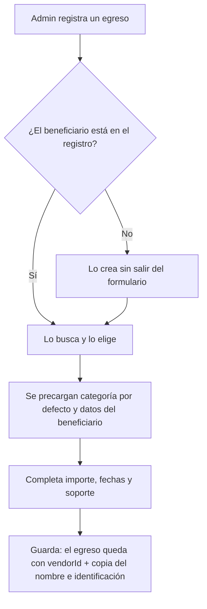

# PRD-V-FEAT-003 — Registro de proveedores y beneficiarios

| | |
|---|---|
| **ID** | `PRD-V-FEAT-003` (tentativo hasta registrarlo en `docs/prd/README.md`) |
| **Tipo** | `FEAT` — entidad nueva dentro de un módulo que ya existe |
| **Portales** | **`ADMIN`** (alcance) · `SUPERADMIN` (afectado) · `RESIDENTE` (afectado solo si el conjunto publica el estado de cuenta de proveedores) · `PORTERIA` (no afectado) |
| **Módulo** | Finanzas · Egresos |
| **Usuario principal** | `tenant_admin` / `admin_tenant` |
| **Usuarios secundarios** | `committee` |
| **Responsable** | David |
| **Estado** | 🟡 **CONSTRUIDA, DESPLEGADA Y ENCENDIDA — PERO SOBRE UNA TABLA VACÍA.** Verificado el 3 de septiembre: `src/features/finanzas/use-vendors.ts` escribe en `vendors`, la bandera `producto-registro-proveedores` está **encendida** en `hogaru-1`, y **`vendors` no aparece entre las 52 colecciones raíz de producción: cero proveedores registrados.** Esto no lo arregla una decisión, lo llena un cliente. D1 cerrada por David el 21 de agosto de 2026. **Criterios SIN repasar contra producción** (3 sep 2026). |
| **Dependencias** | Ninguna |
| **Riesgo** | **Bajo.** Entidad nueva; el egreso conserva su copia de los datos |
| **Reversibilidad** | **Total.** Sin `vendorId`, el egreso funciona como hoy |
| **Fase comercial** | Egresos está en `preview` durante la prueba. Ver §7.4 |

---

## 1. Resumen ejecutivo

En Vivaru **el proveedor no existe como entidad**: su nombre y su identificación se escriben a
mano en cada egreso (`Expense.vendorName`, `Expense.vendorTaxId`). El mismo electricista se
teclea otra vez cada mes, con la ortografía que salga, y **no hay forma de saber cuánto se le
debe ni cuánto se le pagó**.

Esta PRD crea el **registro de proveedores y beneficiarios**, le añade **datos bancarios** —el
registro sabe dónde pagarle— y **una categoría por defecto**, y produce el **estado de cuenta
por proveedor**.

## 2. Problema y baseline

### Lo que existe hoy, verificado

| Qué | Dónde | Estado |
|---|---|---|
| Egreso | `Expense` en `src/types/domain.ts:385` | `vendorName?`, `vendorTaxId?` **como texto libre** |
| Colección de proveedores | — | **No existe.** Verificado por búsqueda en `src/` y `functions/src/` |
| Datos bancarios del beneficiario | — | **No existen en ningún sitio** |
| Escritura de egresos | `src/features/finanzas/use-expenses.ts:88` | **Directa desde el cliente**, incluido el asiento de libro |

### El baseline

| Indicador | Hoy |
|---|---|
| Proveedores como entidad | **0. El concepto no existe** |
| Veces que se teclea el mismo proveedor al año | **Una por egreso** |
| Estado de cuenta por proveedor | **Imposible**: no hay clave que agrupe |
| Egresos agrupables por proveedor sin error de tecleo | **Ninguno garantizado** |

**Métrica de éxito:** que el 100% de los egresos nuevos de un conjunto apunten a un proveedor
del registro, y que exista su estado de cuenta sin cruzar nombres a mano.

## 3. Usuarios, roles y permisos

| Rol | Ve | Puede | **NO puede** |
|---|---|---|---|
| `tenant_admin` | Los proveedores de **su** conjunto y su estado de cuenta | Crear, editar, desactivar; elegirlos al registrar un egreso | **Borrar** un proveedor con egresos (§8, R5). Ver proveedores de otro conjunto. Operar si el conjunto está `suspended` o `expired` |
| `committee` | El registro y el estado de cuenta por proveedor | Consultar y exportar | Crear ni editar |
| `resident` | **Nada por defecto.** Solo si el conjunto habilita el estado de cuenta de proveedores | Consultarlo si está habilitado | Ver datos bancarios **nunca** (§8, R7) |
| `security_guard` | Nada | — | Acceder |
| `superadmin` | Todo | Todo | — |

> **Nota de portafolio — 21 ago 2026.** Lo que esta PRD asigna al rol `committee` **hoy no es
> alcanzable**: `canAccessPath` (`src/lib/auth/routing.ts:28`) lo deja **solo en
> `/admin/documents`**. A nivel de reglas **sí puede leer** —es miembro del conjunto— así que
> **el bloqueo es de navegación, no de permisos**. Ampliar su alcance merece **PRD propia**:
> decidir qué pantallas ve y comprobar que las reglas no le abran datos personales por el
> camino. **Hasta entonces, las filas de `committee` de esta tabla son intención declarada, no
> capacidad disponible.**

**R7 no es un detalle:** el número de cuenta de un proveedor es dato bancario de un tercero. Que
el conjunto pueda publicar su estado de cuenta **no puede** implicar publicar dónde cobra.

## 4. Objetivo, alcance y exclusiones

**Objetivo.** Que el beneficiario de un pago sea un registro y no un texto, y que se pueda
responder «¿cuánto le debemos?» sin cruzar nombres.

### Entra

1. Registro de **proveedores y beneficiarios** por conjunto.
2. Distinción **proveedor / empleado** en el mismo registro.
3. **Datos bancarios**: entidad, número y tipo de cuenta.
4. **Categoría de gasto por defecto**, que preclasifica el egreso.
5. El egreso apunta al proveedor, **conservando copia** del nombre y la identificación.
6. **Estado de cuenta por proveedor**: egresos, pagos y saldo.
7. Vincular egresos existentes a un proveedor del registro.
8. Descarga en lote de los soportes de un proveedor y período.

### No entra, y por qué

| Excluido | Por qué |
|---|---|
| **Nómina** — cálculo de salarios, prestaciones o retenciones | Vivaru **no hace nómina**. El registro guarda al beneficiario del pago, no su liquidación |
| **Retenciones e impuestos sobre el pago** | Es lo fiscal, **fuera del producto** por decisión del 20 de agosto de 2026 |
| **Emisión de cheques** | Backlog. El registro aporta el «páguese a la orden de»; girar el cheque es otra PRD |
| **Portal del proveedor** | Nadie lo ha pedido |
| **Carga masiva por archivo** | Se resuelve **extendiendo el catálogo de `PRD-V-FEAT-002`**, no con un importador nuevo |

## 5. Flujo funcional

### 5.1 Camino feliz

### 5.2 Casos límite

| Caso | Comportamiento |
|---|---|
| Dos proveedores con la misma identificación | **Rechazado**: la identificación es única por conjunto (R4) |
| Proveedor sin identificación | Permitido: hay beneficiarios ocasionales sin documento. Se marca como incompleto |
| Se desactiva un proveedor con egresos pendientes | Permitido; **deja de ofrecerse** en egresos nuevos y sus pendientes siguen visibles |
| Se intenta borrar un proveedor con egresos | **Bloqueado** (R5). Se desactiva |
| Egreso antiguo con nombre a mano | Sigue funcionando. Ofrece «vincular a un proveedor» |
| Conjunto `suspended` / `expired` | Solo lectura |

## 6. Estados y transiciones

| Estado | Qué significa | Quién transiciona | Salida |
|---|---|---|---|
| **`active`** | Se ofrece al registrar egresos | Administración | → `inactive` |
| **`inactive`** | No se ofrece; su historia se conserva | Administración | → `active` |

**No hay estado terminal, y es deliberado:** un proveedor no se borra, se desactiva. Borrarlo
rompería la explicación de un egreso pasado.

## 7. Contrato de datos y multi-tenancy

### 7.1 Colección nueva: `vendors`

| Campo | Tipo | Obligatorio | Nota |
|---|---|---|---|
| `tenantId` | `string` | **Sí** | |
| `type` | `"proveedor" \| "empleado"` | Sí | |
| `taxId` | `string` | No | Único por conjunto cuando existe |
| `legalName` | `string` | Sí | Razón social o nombre |
| `tradeName` | `string` | No | Nombre comercial |
| `email` / `phone` / `address` | `string` | No | |
| `representative` | `string` | No | |
| `bankName` / `accountNumber` / `accountType` | `string` | No | **Datos bancarios. Ver R7** |
| `defaultCategory` | `ExpenseCategory` | No | Preclasifica el egreso |
| `status` | `"active" \| "inactive"` | Sí | |
| `createdAt` / `updatedAt` / `createdBy` / `updatedBy` | — | Sí | |

### 7.2 Campos nuevos en `expenses`

| Campo | Tipo | Obligatorio | Nota |
|---|---|---|---|
| `vendorId` | `string` | **No** | Ausente = egreso antiguo con nombre a mano |

**`vendorName` y `vendorTaxId` se conservan y siguen escribiéndose**, ahora como **copia
congelada** de lo que decía el registro al momento del egreso. Si mañana el proveedor cambia de
razón social, **el egreso de hace un año sigue explicando a quién se le pagó entonces**.

### 7.3 Dato personal y retención

Un `vendor` de tipo `empleado` **es una persona**: su nombre, documento y cuenta bancaria son
datos personales y **entran en la política de retención de 12 meses** de
`docs/politica-retencion-datos.md`, con el mismo tratamiento de anonimización que ya aplica
`anonymizeExpiredVouchersDaily`.

Un `vendor` de tipo `proveedor` que sea **empresa** no lo es. **La distinción tiene que estar en
el dato**, y por eso `type` es obligatorio.

### 7.4 Multi-tenancy y ciclo de vida

- `vendors` lleva **`tenantId`**; toda consulta de lista lo filtra.
- **`suspended` / `expired`** → solo lectura, por `tenantOperable`.
- **`trial`** → Egresos está en `preview`: el registro **se ve con datos de ejemplo y no se
  opera**.

## 8. Reglas de negocio

| # | Regla |
|---|---|
| **R1** | Un egreso puede apuntar a **un** proveedor, o a ninguno |
| **R2** | Al elegir proveedor, el egreso **congela** su nombre e identificación |
| **R3** | Cambiar los datos del proveedor **no altera** egresos ya registrados |
| **R4** | `taxId`, cuando existe, es **único por conjunto** |
| **R5** | Un proveedor con al menos un egreso **no se puede borrar**; se desactiva |
| **R6** | Un proveedor `inactive` no se ofrece en egresos nuevos y sí aparece en su historia |
| **R7** | **Los datos bancarios nunca se muestran a `resident`**, ni siquiera con el estado de cuenta de proveedores habilitado |
| **R8** | El estado de cuenta del proveedor suma sus egresos `registrado` y `pagado`, y **excluye los `anulado`** |
| **R9** | `type` es obligatorio, porque gobierna si el registro contiene datos personales (§7.3) |

## 9. Notificaciones y correo

**Esta PRD no envía correo a nadie.** El registro de un proveedor es una operación interna de la
administración; notificar a un tercero de que ha sido dado de alta en un sistema al que no tiene
acceso no aporta nada y crea una obligación de datos que no queremos.

## 10. Criterios de aceptación

### Deben pasar

| # | Criterio |
|---|---|
| CA1 | Crear un proveedor y elegirlo al registrar un egreso precarga su categoría por defecto |
| CA2 | El egreso guarda `vendorId` **y** copia del nombre e identificación |
| CA3 | Cambiar la razón social del proveedor **no altera** el egreso anterior |
| CA4 | El estado de cuenta muestra sus egresos, sus pagos y su saldo |
| CA5 | Un egreso `anulado` **no** aparece en el saldo del proveedor |
| CA6 | Desactivar un proveedor lo retira del selector y conserva su historia |
| CA7 | Un egreso antiguo sin `vendorId` sigue funcionando y se puede vincular |
| CA8 | El consejo ve el registro y el estado de cuenta |
| CA9 | La descarga en lote entrega los soportes del proveedor y período elegidos |

### Deben fallar

| # | Criterio |
|---|---|
| CF1 | Dos proveedores con la misma identificación en el mismo conjunto → **rechazado** |
| CF2 | Borrar un proveedor con egresos → **bloqueado** |
| CF3 | Un residente ve datos bancarios de un proveedor → **nunca**, con el estado de cuenta habilitado o sin él |
| CF4 | Un `tenant_admin` ve proveedores de otro conjunto → **denegado por reglas** |
| CF5 | Crear un proveedor en un conjunto `suspended` → **denegado** |
| CF6 | Operar el registro en `trial` → **bloqueado por la matriz de prueba** |
| CF7 | Consulta de `vendors` sin `where("tenantId")` → **denegada entera** |
| CF8 | Crear un proveedor sin `type` → **rechazado** |

## 11. Arquitectura y dependencias

### 11.1 La decisión obligatoria: cliente directo o callable

**Escritura directa desde el cliente**, y hay una razón concreta para no cambiar de criterio:
**los egresos ya se escriben así** (`use-expenses.ts:88`, con `addDoc` y `updateDoc`), incluido
su asiento de libro. Meter el registro de proveedores en una callable crearía una asimetría sin
beneficio: el proveedor es un CRUD que las reglas protegen por completo con
`tenantAdminOrSuper` + `tenantOperable`.

> **Observación, no propuesta:** el ingreso pasa por callable (`aplicarPago`) y el egreso se
> escribe desde el cliente. Es una asimetría real del producto. **Cambiarla no es alcance de
> esta PRD**, pero conviene que esté escrita.

La **descarga en lote de soportes** sí es **callable**: lee varios ficheros de Storage y arma un
paquete; no puede depender de que el cliente tenga permiso sobre cada ruta.

### 11.2 Reglas de Firestore

Bloque nuevo para `vendors`, con el patrón que ya usan `units` y `people`
(`firestore.rules:205-215`): lectura para miembros del conjunto, escritura para
`tenantAdminOrSuper` con `tenantOperable`.

**No puede caer en `relaxedTenantCollection`.** Y **el bloque debe impedir que un `resident` lea
los campos bancarios** — si la regla no puede filtrar campos, **la lectura de `vendors` se
restringe a administración y consejo**, y el estado de cuenta que ve el residente se sirve
**sin** esos campos desde una vista aparte.

### 11.3 Índices, jobs y banderas

- **Índices:** `vendors` por `tenantId` + `status`; `expenses` por `tenantId` + `vendorId`.
- **Jobs:** ninguno propio. Los `vendor` de tipo `empleado` entran en el job de anonimización
  que ya existe.
- **Bandera:** `vendor-registry`.

## 12. Riesgos y mitigaciones

| Riesgo | Señal | Mitigación |
|---|---|---|
| **Fuga de datos bancarios de terceros** | Un residente ve una cuenta | R7, CF3 y §11.2: si la regla no filtra campos, se restringe la colección entera |
| Se crean proveedores duplicados con distinta ortografía | Dos registros, mismo negocio | R4 sobre la identificación; búsqueda por nombre al crear |
| Historia que deja de explicarse al editar un proveedor | Un egreso viejo nombra a otro | R2 y R3: copia congelada |
| Datos de empleados sin tratamiento de retención | Hallazgo en una auditoría | R9 y §7.3: `type` obligatorio |
| Nadie usa el registro y se sigue tecleando | Egresos sin `vendorId` | Indicador: % de egresos nuevos con proveedor |
| Coste | — | **Nulo** |

## 13. Despliegue, rollback y Story Map

**Orden:** reglas → functions (descarga en lote) → front, con `vendor-registry` apagada.

**Rollback: total.** Sin `vendorId`, el egreso vuelve a comportarse como hoy — el campo de
nombre a mano nunca se retira.

**Validación:** staging cubre el 100%. Producción no aporta nada con cero clientes reales.

### Story Map

**MVP** — registro con datos fiscales y bancarios · selección en el egreso con copia congelada ·
categoría por defecto · estado de cuenta.

**Fase 2** — vincular egresos antiguos · descarga en lote de soportes · extensión del catálogo
de `PRD-V-FEAT-002`.

## 14. Decisiones abiertas

### D1 · ¿Empleados en el mismo registro que los proveedores?

Habitanto los junta. La ventaja es real —al empleado también se le paga a una cuenta— pero
**mete datos personales en una colección que si no, no los tendría**.

**Recomendación: sí, un solo registro con `type` obligatorio.** Separarlos duplicaría el
formulario, el estado de cuenta y el selector para ganar solo una frontera que un campo ya
marca. **La condición es §7.3**: los de tipo `empleado` entran en la política de retención.

> **CERRADA el 21 ago 2026 — aceptada.** Un solo registro con `type` obligatorio. Los de tipo
> `empleado` **entran en la política de retención**; los de empresa, no (§7.3).

**Ninguna decisión abierta.**

## 15. Puertas

| Puerta | Estado |
|---|---|
| **G0 Necesidad** | ✅ Verificado: no existe colección de proveedores; el nombre es texto libre en cada egreso |
| **G1 Valor** | ✅ Baseline y métrica en §2 |
| **G2 Datos y permisos** | ✅ Definidos, **incluido el tratamiento de datos personales del empleado** |
| **G3 Riesgo** | ✅ Bandera, rollback total y la restricción de §11.2 sobre datos bancarios |
| **G4 Aceptación** | ✅ 9 que pasan, 8 que deben fallar |
| **G5 Operación** | ✅ Lo mantiene el administrador del conjunto al registrar cada egreso. **No requiere trabajo aparte** |
| **G6 Escala** | ✅ Decenas de proveedores por conjunto |

**Lista para desarrollo.** Las siete puertas superadas y la única decisión, cerrada.
