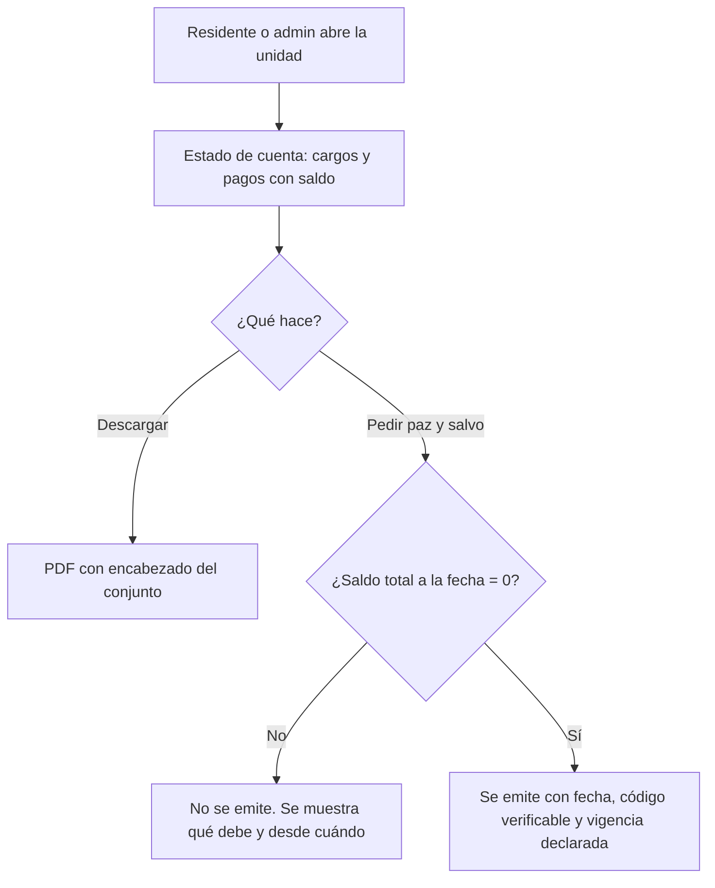

# PRD-V-FEAT-004 — Estado de cuenta de la unidad y certificado de paz y salvo

| | |
|---|---|
| **ID** | `PRD-V-FEAT-004` (tentativo) |
| **Tipo** | `FEAT` — documento nuevo dentro de Cartera, que ya existe |
| **Portales** | **`ADMIN`** (alcance) · **`RESIDENTE`** (alcance) · `COMMITTEE` (afectado) · `PORTERIA` (no afectado) |
| **Módulo** | Cartera |
| **Usuario principal** | `tenant_admin` · `resident` |
| **Responsable** | David |
| **Estado** | **MVP CONSTRUIDO Y EN STAGING** — versión 1.1 (25 de agosto de 2026, `453619a`…`5244e3e`). Estado de cuenta con su PDF, certificado con emisión y anulación, portal del residente y cartera del administrador, y el lote. **Pendiente de validar por navegador.** **NO está en producción** |
| **Dependencias** | Ninguna bloqueante. **Habilita `PRD-V-FLOW-003`**, que adjunta este documento al correo de cobranza |
| **Riesgo** | **Medio.** El paz y salvo es un documento que se usa ante terceros |
| **Reversibilidad** | **Total** por bandera |
| **Fase comercial** | Cartera está en `preview` durante la prueba |

---

## 1. Resumen ejecutivo

Vivaru sabe cuánto debe cada unidad, pero **no sabe contarlo**. Existe el PDF del recibo
(`src/features/finanzas/comprobante/recibo-pdf.ts`) y **no existe ninguno del estado de
cuenta**. Un residente que quiere ver su historia no tiene dónde, y un propietario que va a
vender **no tiene cómo demostrar que está al día**.

Esta PRD añade dos documentos: el **estado de cuenta de la unidad** —libro corrido de cargos y
pagos con saldo acumulado— y el **certificado de paz y salvo**, que acredita a una fecha que la
unidad no debe nada.

## 2. Problema y baseline

| Qué | Dónde | Estado |
|---|---|---|
| PDF de recibo de pago | `src/features/finanzas/comprobante/recibo-pdf.ts` | **Existe** |
| PDF de estado de cuenta | — | **No existe** |
| Certificado de paz y salvo | — | **No existe.** «Certificado» solo aparece en `src/content/legal/`, referido al borrado de datos |
| Datos para construirlo | `billingStatements` + `ledgerEntries` | **Existen los dos** |

**El baseline:** cero documentos emitidos, porque no se pueden emitir. Un administrador que hoy
necesita un paz y salvo lo escribe en Word.

**Métrica de éxito:** que un propietario pueda descargar su paz y salvo **sin pedírselo al
administrador**, y que el administrador no tenga que redactar ninguno a mano.

## 3. Usuarios, roles y permisos

| Rol | Ve | Puede | **NO puede** |
|---|---|---|---|
| `tenant_admin` | Estado de cuenta y paz y salvo de **cualquier** unidad de su conjunto | Consultarlos, descargarlos y emitirlos en lote | Emitir un paz y salvo de una unidad **con saldo** (§8, R3). Operar si el conjunto está `suspended` o `expired` |
| `resident` | **Los de su unidad** | Consultar y descargar | Ver los de otra unidad. **Emitir un paz y salvo si su unidad debe** — el documento simplemente no se genera |
| `committee` | Estado de cuenta de todas las unidades | Consultar y exportar | Emitir paz y salvo |
| `security_guard` | Nada | — | Acceder |
| `superadmin` | Todo | Todo | — |

> **Nota de portafolio — 21 ago 2026.** Lo que esta PRD asigna al rol `committee` **hoy no es
> alcanzable**: `canAccessPath` (`src/lib/auth/routing.ts:28`) lo deja **solo en
> `/admin/documents`**. A nivel de reglas **sí puede leer** —es miembro del conjunto— así que
> **el bloqueo es de navegación, no de permisos**. Ampliar su alcance merece **PRD propia**:
> decidir qué pantallas ve y comprobar que las reglas no le abran datos personales por el
> camino. **Hasta entonces, las filas de `committee` de esta tabla son intención declarada, no
> capacidad disponible.**

**El residente puede emitir su propio paz y salvo**, y es deliberado: si está al día, el
documento es una consecuencia aritmética, no una concesión del administrador. Que dependa de
que alguien lo redacte es exactamente la fricción que esto elimina.

## 4. Objetivo, alcance y exclusiones

### Entra

1. **Estado de cuenta de la unidad**: cargos y pagos en orden, con saldo acumulado.
2. Filtro por rango de fechas y opción de **historia completa**.
3. Exportación a **PDF** y a hoja de cálculo.
4. **Certificado de paz y salvo** a una fecha, con código verificable.
5. Emisión **en lote** de estados de cuenta para todas las unidades.
6. Acceso del residente a los suyos, sin intermediario.

### No entra, y por qué

| Excluido | Por qué |
|---|---|
| **Verificación pública del certificado por un tercero** | Exige una página sin sesión y decidir qué se expone de la unidad. **Fase 2**; el código verificable ya se emite en el MVP para no cerrar la puerta |
| **Bodegas, terrazas y parqueaderos en el certificado** | Backlog `A7`. Se añaden cuando esas entidades existan |
| **Firma electrónica del certificado** | Ningún país de los tres la exige para este documento |
| **Adjuntarlo al correo de cobranza** | Es `PRD-V-FLOW-003`. **Esta PRD produce el documento; aquella lo envía** |

## 5. Flujo funcional

### Casos límite

| Caso | Comportamiento |
|---|---|
| Unidad sin ningún movimiento | Estado de cuenta vacío, con mensaje. **Sí se puede emitir paz y salvo**: no deber nada es no deber nada |
| Saldo a favor (anticipo de `FLOW-002`) | Se emite el paz y salvo, y el documento **nombra el saldo a favor** |
| Cargo vencido de importe cero | No bloquea |
| Se emite y al día siguiente aparece un cargo | El certificado **dice la fecha a la que aplica**. No se invalida solo |
| Unidad `inactive` | Se puede consultar su historia; **no** se emiten certificados nuevos |
| Conjunto `suspended` / `expired` | Solo lectura: se consulta, no se emite |

## 6. Estados y transiciones

El **estado de cuenta no tiene ciclo de vida**: es una vista calculada.

El **certificado sí**, porque es un documento que sale del sistema:

| Estado | Qué significa | Quién transiciona | Salida |
|---|---|---|---|
| **`emitido`** | Existe y es descargable | — | → `anulado` |
| **`anulado`** | Se emitió con datos incorrectos | Administración · Superadmin, **con motivo** | **Terminal** |

**Un certificado no «caduca» solo.** Declara la fecha a la que aplica; quien lo recibe decide si
le sirve. Poner una caducidad automática sería inventar una regla que ningún país nos impone.

## 7. Contrato de datos y multi-tenancy

### 7.1 Colección nueva: `clearanceCertificates`

| Campo | Tipo | Obligatorio | Nota |
|---|---|---|---|
| `tenantId` | `string` | **Sí** | |
| `unitId` / `unitLabel` | `string` | Sí | |
| `issuedAt` | `string` | Sí | Fecha de emisión |
| `asOfDate` | `string` | Sí | **Fecha a la que acredita**. Puede no ser hoy |
| `code` | `string` | Sí | Verificable, derivado del id — **no correlativo**, misma decisión que `PaymentVoucher` |
| `requestedBy` | `string` | Sí | Quién lo pidió: puede ser el residente |
| `balanceAtIssue` | `number` | Sí | **Cero por definición**, guardado para auditoría |
| `creditBalance` | `number` | No | Saldo a favor, si lo había |
| `status` | `"emitido" \| "anulado"` | Sí | |
| `pdfUrl` / `pdfStoragePath` | `string` | No | |
| `anuladoEn` / `anuladoPor` / `anuladoMotivo` | — | Solo si `anulado` | Motivo **obligatorio** |

**El estado de cuenta no se persiste.** Se calcula al pedirlo, desde `billingStatements` y
`ledgerEntries`. Guardarlo crearía una segunda verdad que puede discrepar de la primera.

### 7.2 Multi-tenancy, ciclo de vida y retención

- `clearanceCertificates` lleva **`tenantId`**; toda consulta lo filtra.
- **`suspended` / `expired`** → solo consulta, sin emisión.
- **`trial`** → Cartera en `preview`: se ve con datos de ejemplo, no se emite.
- **Retención:** el certificado nombra una unidad, no una persona. Se conserva como registro del
  conjunto. El PDF en Storage sigue la misma política que el recibo.

## 8. Reglas de negocio

| # | Regla |
|---|---|
| **R1** | El estado de cuenta ordena por fecha y muestra **saldo acumulado** tras cada movimiento |
| **R2** | El saldo final del estado de cuenta **coincide siempre** con la suma de `balance` de los cargos vigentes de la unidad |
| **R3** | Un paz y salvo **solo se emite si el saldo total a `asOfDate` es cero** |
| **R4** | Un saldo **a favor** no impide emitirlo; el documento lo nombra |
| **R5** | Un cargo **anulado** no cuenta ni en el estado de cuenta ni en el saldo |
| **R6** | El certificado declara **la fecha a la que acredita**. **La segunda mitad —que pueda ser anterior a hoy— NO se implementa**: exige saber qué se debía ese día, y los cargos tienen fecha pero **los pagos no** (de 90 cargos con pago en producción solo 50 traen `lastPaymentAt`; `ledgerEntries` no tiene `unitId`). Un certificado retroactivo contaría como cobrados pagos posteriores a la fecha y certificaría al día a quien no lo estaba — en un papel que se entrega a un tercero. Entra cuando los pagos tengan fecha |
| **R7** | El código del certificado es **derivado del id, no correlativo** — misma decisión que el recibo tras el 20 ago 2026 |
| **R8** | Anular un certificado exige motivo y queda con autor y fecha |
| **R9** | El residente solo accede a los de **su** unidad |

**R2 es la que hace confiable el documento:** si el estado de cuenta y la cartera pueden dar
cifras distintas, ninguno de los dos sirve.

## 9. Notificaciones y correo

**El certificado no se envía por correo en el MVP.** Se descarga. Enviarlo obligaría a decidir a
qué dirección —la del solicitante, la del propietario, la de un tercero— y ninguna es obvia.

**No se promete ningún plazo de emisión**: la emisión es automática o no ocurre.

## 10. Criterios de aceptación

### Deben pasar

| # | Criterio |
|---|---|
| CA1 | El estado de cuenta muestra cargos y pagos en orden con saldo acumulado |
| CA2 | **El saldo final coincide con la suma de `balance` de los cargos vigentes** |
| CA3 | El PDF sale con el nombre y la marca del conjunto |
| CA4 | Una unidad al día emite su paz y salvo con fecha y código |
| CA5 | Una unidad con saldo a favor lo emite, y el documento **nombra el saldo a favor** |
| CA6 | Una unidad sin movimientos lo emite |
| CA7 | El residente descarga los suyos **sin intervención del administrador** |
| CA8 | La emisión en lote entrega un estado de cuenta por unidad |
| CA9 | Un cargo anulado no aparece ni suma |
| CA10 | Anular un certificado lo marca y conserva el motivo |

### Deben fallar

| # | Criterio |
|---|---|
| CF1 | Emitir paz y salvo con saldo pendiente → **no se emite**, y se dice qué se debe |
| CF2 | Un residente pide el estado de cuenta de otra unidad → **denegado** |
| CF3 | Un guarda accede → **denegado** |
| CF4 | Anular sin motivo → **rechazado** |
| CF5 | Emitir en un conjunto `suspended` → **denegado** |
| CF6 | Emitir en `trial` → **bloqueado por la matriz de prueba** |
| CF7 | Consulta de `clearanceCertificates` sin `where("tenantId")` → **denegada entera** |

## 11. Arquitectura y dependencias

### 11.1 Cliente directo o callable

| Operación | Decisión | Por qué |
|---|---|---|
| **Ver el estado de cuenta** | **Cliente directo** | Lectura de dos colecciones con `tenantId`; las reglas la protegen. El cálculo del saldo acumulado es presentación |
| **Emitir el paz y salvo** | **Callable** | **La condición «saldo cero» no puede evaluarla el cliente**: es el único requisito del documento y un cliente manipulado emitiría uno falso. El servidor lee, comprueba y emite |
| **Anular un certificado** | **Callable** | Escritura con motivo y auditoría |
| **Emisión en lote** | ~~Callable~~ → **navegador, un archivo** | **Corregido al construir: esta fila y §11.3 se contradecían.** §11.3 prohíbe una segunda forma de hacer PDF, y el generador es `jspdf` **en el navegador**: no puede correr en una callable. Y guardarlos en Storage contradiría §7.1, que decide que el estado de cuenta **no se persiste** «porque crearía una segunda verdad». Se entrega **un PDF con una unidad por página** |

**La emisión del certificado es el ejemplo de libro de por qué existe esta decisión.**

### 11.2 Reglas de Firestore

Bloque nuevo para `clearanceCertificates`: lectura para administración, consejo y **el residente
de su unidad** (`residentOwnUnit`, `firestore.rules:27`); **escritura solo desde el servidor**.

### 11.3 Índices y banderas

- **Índices:** `clearanceCertificates` por `tenantId` + `unitId`. **El segundo que pedía esta
  sección —`billingStatements` por `tenantId` + `unitId` + `dueDate`— NO se creó, y no es un
  olvido.** `dueDate` es opcional y **falta en el 27% de los cargos de producción** (60 de 221);
  un `orderBy` descarta los documentos que no traen el campo, así que ordenar por ahí perdería uno
  de cada cuatro movimientos **y rompería R2 en silencio** — el saldo dejaría de coincidir con la
  cartera. No daría error: daría un número más pequeño. Se ordena por `period`, que está en el
  100%, y en memoria. Es el mismo defecto que el 24 de agosto dejó a un residente viendo «Sin
  documentos» teniendo ocho.
- **Bandera:** `account-statement`.
- **Reutiliza** el generador de PDF del recibo. No se introduce una segunda forma de hacer PDF.

## 12. Riesgos y mitigaciones

| Riesgo | Señal | Mitigación |
|---|---|---|
| **Se emite un paz y salvo a quien debe** | Reclamo del conjunto ante una venta | La condición se evalúa **en el servidor** (§11.1); R3 y CF1 |
| El estado de cuenta y la cartera dan cifras distintas | Desconfianza en los dos | R2 y CA2 |
| Un certificado emitido con datos malos circula | — | Anulación con motivo (R8) y código verificable para la Fase 2 |
| El residente lo usa ante un tercero que no puede validarlo | Llamada al administrador | El código verificable se emite desde el MVP; la página de verificación es Fase 2 |
| Coste | — | **Bajo.** PDF generado bajo demanda |

## 13. Despliegue, rollback y Story Map

**Orden:** reglas → functions (emisión y lote) → front, con `account-statement` apagada.

**Rollback:** total por bandera. **Los certificados ya emitidos no se borran** — se anulan con
motivo, que es parte del MVP.

**Validación:** staging cubre todo. En producción, comprobar el PDF **mirándolo**: en este
proyecto tres defectos seguidos salieron de mirar la salida, no de las pruebas.

### Story Map

**MVP** — estado de cuenta en pantalla y PDF · paz y salvo con condición en servidor · acceso del
residente · anulación con motivo.

**Fase 2** — página pública de verificación por código · emisión en lote · exportación a hoja de
cálculo.

**Fase 3** — bodegas, terrazas y parqueaderos en el certificado, cuando existan.

## 14. Decisiones abiertas

### D1 · ¿Puede el residente emitir su propio paz y salvo?

**Recomendación: sí.** Si el saldo es cero, el documento es aritmética. Que dependa de que el
administrador lo redacte es la fricción que esta PRD existe para quitar, y el riesgo es nulo
porque **la condición se evalúa en el servidor**.

**Contraargumento que hay que conocer:** algunos administradores lo consideran un trámite suyo,
a veces porque lo cobran. Si eso se quiere permitir, la puerta natural es un interruptor por
conjunto — **no está en el MVP y se anota**.

> **CERRADA el 21 ago 2026 — aceptada.** El residente emite su propio paz y salvo. El
> interruptor por conjunto para restringirlo queda **anotado y fuera del MVP**.

**Ninguna decisión abierta.**

## 15. Puertas

| Puerta | Estado |
|---|---|
| **G0 Necesidad** | ✅ Verificado: existe PDF de recibo y no de estado de cuenta; «certificado» solo aparece en textos legales |
| **G1 Valor** | ✅ Baseline y métrica en §2 |
| **G2 Datos y permisos** | ✅ Definidos; escritura solo desde servidor |
| **G3 Riesgo** | ✅ Condición en servidor, anulación con motivo, bandera |
| **G4 Aceptación** | ✅ 10 que pasan, 7 que deben fallar |
| **G5 Operación** | ✅ **No requiere operación diaria.** Es el diseño: el residente se sirve solo |
| **G6 Escala** | ✅ Documento por unidad, bajo demanda |

**Lista para desarrollo.** Las siete puertas superadas y la única decisión, cerrada.
