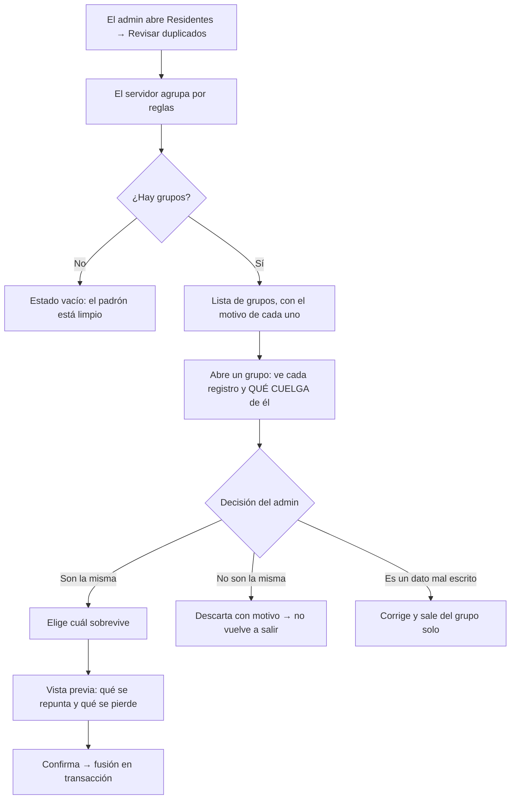

# PRD-V-FEAT-005 — Un padrón sin duplicados

| | |
|---|---|
| **ID** | `PRD-V-FEAT-005` (tentativo hasta registrarlo en `docs/prd/README.md`) |
| **Tipo** | `FEAT` — funcionalidad nueva dentro de un módulo existente (Residentes) |
| **Portales** | **`ADMIN`** (alcance) · `RESIDENTE`, `PORTERIA`, `SUPERADMIN` (no tocados) |
| **Módulo** | Residentes · Padrón de personas |
| **Usuario principal** | `tenant_admin` — es quien mira el padrón y quien decide qué es un duplicado |
| **Usuarios secundarios** | `superadmin` (opera la auditoría de varios conjuntos) |
| **Responsable** | David |
| **Estado** | Lista para desarrollo |
| **Dependencias** | Ninguna. **No depende de `AI-ONB-001` ni de ningún corpus** — esa independencia es la mitad del valor de esta ficha |
| **Riesgo** | **Alto en la fusión, nulo en la auditoría.** Detectar no toca nada; fusionar reescribe referencias y puede borrar a una persona. Ver §12 y el precedente de `mergeUnits` |
| **Reversibilidad** | **Parcial, y va en primera línea.** La detección es reversible por definición. **La fusión solo lo es si se guarda lo que se pisó**, y esta ficha lo exige (§7) |
| **Fase comercial** | Todos los planes |

---

## 1. Resumen ejecutivo

El padrón de producción tiene **11 registros duplicados de 68** —el 16%—, y el producto no tiene forma de verlos ni de resolverlos. Hoy solo se evita crear duplicados **en el momento del alta**; nadie mira hacia atrás.

Esta ficha da al administrador **la lista de sospechosos y la forma de resolverlos**: fusionar en uno, corregir el dato, o marcar que no son la misma persona.

**No lleva IA**, y decirlo es parte del trabajo: la detección de los once se hizo con una regla determinística en treinta líneas. La IA tiene sitio después, en la cola larga que esa regla no ve — y con esta ficha construida, se podrá **medir si aporta algo**, que hoy no se puede.

## 2. Problema y baseline

### 2.1 Medido en `hogaru-1` el 30 de agosto de 2026

| Qué | Valor |
|---|---|
| Personas en producción | **68** |
| **Duplicadas** (mismo nombre normalizado, mismo conjunto) | **11**, en 3 grupos — todas en `tenant-santa-maria` |
| Sin número de documento | **21 de 68 (31%)** — y es uno de los dos campos con los que se deduplica |
| Grupos por documento repetido | 3 |
| Grupos por correo repetido | 2 |

**El caso que lo retrata:** «David Carmona» aparece **siete veces**, repartido en **dos unidades distintas**, con **dos números de documento diferentes** y **el mismo correo en los siete**.

### 2.2 Por qué existen, que es lo que decide el alcance

**No entraron por el importador.** La carga masiva sí descarta duplicados por correo o documento, y el alta manual también desde una corrección posterior. Entraron por otros caminos —semillas, migraciones, altas anteriores a esa corrección— y **ninguna de las dos puertas mira hacia atrás**.

De ahí la conclusión que separa esta ficha de un simple endurecimiento del alta: **blindar la puerta no limpia la casa**.

### 2.3 Honestidad sobre estos datos

Santa María es un conjunto de pruebas, así que **esta suciedad es nuestra, no de un cliente**. El valor de la ficha no es limpiar esos once: es que **el mecanismo exista antes de que el padrón sea de alguien** — cuando un conjunto real cargue 200 personas desde su propia hoja, los duplicados llegarán y hoy no habría con qué verlos.

## 3. Usuarios, roles y permisos

| Rol | Ve | Puede | **NO puede** |
|---|---|---|---|
| `tenant_admin` | Los grupos de sospechosos de **su** conjunto | Revisar, **fusionar**, corregir el dato, o **marcar «no son la misma persona»** | Fusionar personas de **otro** conjunto · fusionar **sin elegir** cuál sobrevive · fusionar dos personas **con cuenta de acceso activa cada una** (§8 R5) |
| `superadmin` | Los de cualquier conjunto | Lo mismo | Igual |
| `resident` | Nada de esto | — | Alcanzar `/admin/*` |
| `security_guard` | Nada | — | Igual |
| Consejo | Nada | — | `canAccessPath` lo deja solo en `/admin/documents` |

## 4. Objetivo, alcance y exclusiones

**Objetivo:** que el administrador vea los duplicados que ya tiene y pueda resolverlos sin romper nada de lo que colgaba de ellos.

**Entra:**
1. **Detección determinística** de grupos sospechosos, con su motivo.
2. **Revisión**: ver el grupo con lo que cuelga de cada registro.
3. **Fusión** en un superviviente elegido por el administrador, repuntando todas las referencias.
4. **Descartar**: marcar un grupo como «no son la misma persona» **con motivo**, para que no vuelva a aparecer.
5. Auditoría de cada fusión y cada descarte.

**No entra, y por qué:**
- **IA.** La regla determinística encuentra los once. Cuando exista esta ficha se podrá medir si un modelo añade algo — y esa medición es la que justificaría `AI-ONB-001`, no al revés.
- **Fusión automática.** Ninguna. **La decide una persona, siempre.** Un padrón mal fusionado es peor que uno duplicado: el duplicado se ve, la fusión mala no.
- **Duplicados de unidades.** Ya existe `mergeUnits`.
- **Deduplicar en la importación.** Ya funciona.
- **Rellenar los documentos que faltan.** Es captura de dato, no producto.

## 5. Flujo funcional

**El paso que no se puede saltar es la vista previa.** El administrador tiene que ver **antes de confirmar** qué se va a repuntar y qué se va a perder — porque lo que se pierde no se recupera solo.

## 6. Estados y transiciones

Un **grupo de sospechosos** no es un documento que nazca y muera: se calcula. Lo que sí se persiste es la decisión:

| Estado del grupo | Qué significa | Quién lo provoca | Salida |
|---|---|---|---|
| *Sospechoso* | Lo calcula la regla al abrir la pantalla | El sistema | Fusionado · Descartado · Deja de existir si el dato cambia |
| *Descartado* | Alguien dijo «no son la misma persona», **con motivo** | `tenant_admin` | **Vuelve a sospechoso si entra un registro nuevo al grupo** |
| *Fusionado* | Queda un superviviente y los demás archivados | `tenant_admin` | **Terminal** |

> **Un descarte no es para siempre, y esa es la parte que se olvida.** Si mañana entra un cuarto «David Carmona», el grupo cambió y la decisión anterior ya no lo cubre. Un descarte que silencia para siempre convierte esta pantalla en un sitio donde los problemas se esconden.

## 7. Contrato de datos y multi-tenancy

**Colección nueva: `personMergeDecisions`**

| Campo | Tipo | Obligatorio | Quién escribe |
|---|---|---|---|
| `tenantId` | texto | Sí | Servidor |
| `tipo` | `"fusion" \| "descarte"` | Sí | Servidor |
| `claveDelGrupo` | texto (huella de los ids implicados) | Sí | Servidor |
| `survivorId` / `mergedIds` | texto / lista | En fusión | Servidor |
| `motivo` | texto | **Sí, también en la fusión** | Servidor |
| `snapshot` | objeto | **Sí en fusión** — copia de los documentos pisados | Servidor |
| `decidedBy`, `decidedAt` | uid, timestamp | Sí | Servidor |

**`snapshot` es lo que hace reversible la fusión**, y por eso es obligatorio. Sin él, «fusionar» es «borrar con un nombre amable». Es la misma lección que dejó `FIX-002`: la migración solo era reversible mientras se guardó el valor anterior — y cuando se retiraron las marcas, `--revertir` dejó de poder deshacer nada.

**Sobre las personas fusionadas: se archivan, no se borran.** Se les escribe la decisión encima —quién, cuándo, hacia qué superviviente y por qué—, siguiendo el patrón que ya usa el archivador de huérfanos: *archivar es registrar una decisión, no esconder un documento*.

### El inventario de referencias, y la trampa en la que caí

**Fusionar exige repuntar todo lo que apunta a la persona que desaparece.** El precedente está escrito en el código: `mergeUnits` prometía «TODAS las referencias» con **una lista de nueve escrita a mano, y eran dieciocho** — y como la fusión borraba la unidad, todo lo que no repuntaba quedó apuntando a algo que ya no existía. **Eso explica los huérfanos de Santa María.**

**Y volvió a pasar escribiendo esta ficha.** Mi primera medición buscó campos escalares y concluyó que **ninguno** de los siete «David Carmona» estaba referenciado. Era falso: **dos lo están**, desde `units.ownerIds` y `units.residentIds`, que son **arrays** y por eso no aparecieron.

Lo medido hoy en producción:

| Dónde | Campo | Volumen |
|---|---|---|
| `packages` | `residentId` | 54 documentos |
| `tickets` | `residentId` | 20 documentos |
| `units` | `ownerIds`, `residentIds` (**arrays**) | 15 unidades pobladas de 93 |
| `tenantUsers` | `personId` | 0 apuntando a los duplicados actuales |

> **R-INV — la regla que sale de esto: el inventario se DERIVA, no se escribe.** Como `UNIT_REF_FIELDS` sale de `COLECCIONES_CON_CLAVE_DE_UNIDAD` y no de una lista a mano, aquí tiene que haber un inventario único de referencias a persona **con un guardián que enrojezca cuando alguien añada un campo nuevo sin registrarlo**. Y **tiene que cubrir arrays**, no solo campos escalares.

**Multi-tenancy:** todo lleva `tenantId` y toda consulta lo filtra. **Una fusión no puede cruzar conjuntos**, ni siquiera para el superadmin.

**Suspendido y vencido:** solo lectura. La auditoría se puede **ver**; fusionar y descartar se **deniegan** — y se comprueba en el servidor, no solo en reglas.

**En prueba:** funciona igual; no manda correo a nadie.

**Retención:** `personMergeDecisions` **no caduca**. Es el registro de por qué el padrón es como es.

## 8. Reglas de negocio

- **R1** — La detección **no modifica nada**. Es lectura pura.
- **R2** — Dos personas de **conjuntos distintos** nunca son el mismo grupo.
- **R3** — La fusión **la confirma una persona**, siempre, y **eligiendo el superviviente**. No hay «fusionar todo».
- **R4** — Al fusionar se repunta **todo** lo del inventario derivado. Si aparece una referencia que el inventario no conoce, **la fusión se aborta** en vez de dejar huérfanos.
- **R5** — **Dos personas con cuenta de acceso activa no se fusionan sin resolver antes las cuentas.** Detrás de cada una hay alguien que entra al portal; fusionar a ciegas deja a una persona sin acceso a lo suyo — la misma razón por la que el archivador de huérfanos se niega a tocar `tenantUsers`.
- **R6** — Un descarte exige **motivo escrito**, y **vuelve a sospechoso** si el grupo cambia.
- **R7** — La fusión guarda `snapshot`. **Sin snapshot no hay fusión.**
- **R8** — Los criterios de agrupación son **explícitos y se muestran**: el administrador ve *por qué* el sistema cree que son la misma persona.

### Criterios de agrupación del MVP

| Regla | Qué agrupa | Por qué |
|---|---|---|
| Documento idéntico | Mismo `documentNumber` normalizado | El más fuerte: 3 grupos en producción |
| Correo idéntico | Mismo `email` normalizado | Cazó los 7 «David Carmona» |
| Nombre idéntico normalizado | Sin tildes, sin dobles espacios, sin mayúsculas | 3 grupos |

**No entra en el MVP la similitud aproximada** («Ma. José» contra «María José», apellidos invertidos, un dígito bailado). **Es exactamente el hueco donde la IA tendría que demostrar que aporta** — y con esta ficha construida, se puede medir contra un suelo real.

## 9. Notificaciones y correo

**Ninguna.** Es una herramienta interna del administrador. Al residente **no se le avisa** de que su registro se fusionó: no cambia nada de lo que ve, y avisarlo abriría una conversación sobre datos que él no gestiona.

## 10. Criterios de aceptación

**CA1** — En Santa María, la pantalla lista **3 grupos** con **11 registros**, y cada grupo dice por qué regla se agrupó.
**CA2** — El grupo de «David Carmona» muestra los **7** registros, sus **dos** unidades, sus **dos** documentos y el correo común.
**CA3** — Al abrir un grupo, cada registro muestra **qué cuelga de él** (paquetes, tickets, unidades, membresía). Los dos que están en arrays de unidad **deben aparecer con esa referencia**.
**CA4** — La vista previa dice, **antes de confirmar**, cuántas referencias se repuntan y qué campos del superviviente se conservan.
**CA5** — Tras fusionar, **cero referencias** apuntan a los archivados, y el superviviente las tiene todas.
**CA6** — La fusión deja un `personMergeDecisions` con `snapshot`, motivo, autor y fecha.
**CA7** — Un descarte con motivo saca al grupo de la lista, y **vuelve a aparecer** si se añade un registro nuevo al grupo.
**CA8** — Un conjunto sin duplicados muestra un estado vacío que dice que el padrón está limpio — **no una tabla vacía**.
**CA9** — La detección **no escribe nada**: correrla dos veces deja la base idéntica.

### Casos que DEBEN fallar

**CF1** — Fusionar personas de **dos conjuntos distintos** → denegado, también para el superadmin.
**CF2** — Fusionar **sin elegir superviviente** → rechazado.
**CF3** — Fusionar cuando existe una referencia **fuera del inventario** → **la fusión se aborta entera** y no deja nada a medias.
**CF4** — Fusionar dos personas **con cuenta activa cada una** → rechazado, nombrando las dos cuentas.
**CF5** — Descartar **sin motivo** → rechazado.
**CF6** — Un `tenant_admin` de otro conjunto invoca la callable con un `tenantId` ajeno → denegado.
**CF7** — Conjunto **suspendido** → fusionar se deniega **en el servidor**; la lista se puede ver.
**CF8** — **Quitar un campo del inventario derivado** y comprobar que **el guardián enrojece**. Si no, el inventario no está vigilado y volveremos a los nueve de dieciocho.

> Cada falsación se revierte **por edición**, nunca con `git checkout` sobre ficheros sin commitear.

## 11. Arquitectura y dependencias

### Decisión cliente contra callable — **CALLABLE para escribir, lectura directa para detectar**

- **Detectar**: el cliente ya lee `people` de su conjunto con las reglas de hoy. **La agrupación es una función pura** sobre esos datos, así que vive en un módulo compartido y se prueba entera en milisegundos sin emulador — el mismo patrón que `resolve.ts` de las banderas.
- **Fusionar y descartar**: **callable, sin discusión.** Escribe en varias colecciones, toca `tenantUsers` (restringida en reglas), debe ser **atómica** y **el cliente no debe poder falsificar** quién decidió ni qué se pisó.

**Callables nuevas:** `fusionarPersonas` · `descartarGrupoDeDuplicados`.
**Módulo nuevo:** el inventario derivado de referencias a persona, hermano de `COLECCIONES_CON_CLAVE_DE_UNIDAD`, **con su guardián** (CF8).
**Se reutiliza:** el patrón de `mergeUnits` (repuntar y archivar), `revokeResidentAccess` para el caso de las cuentas, y el patrón de archivado con motivo.
**Bandera:** `producto-padron-sin-duplicados`. **El catálogo vive en CINCO sitios**, y uno es el que permite encender **por conjunto** — la vía del canario.

## 12. Riesgos y mitigaciones

| Riesgo | Señal que lo detecta | Mitigación |
|---|---|---|
| **Una referencia fuera del inventario queda huérfana.** Ya pasó con unidades, y son los huérfanos de Santa María | CF3 y CF8 | El inventario se **deriva**; si aparece algo desconocido, **la fusión aborta** en vez de continuar |
| **Fusionar a dos personas distintas** que se llaman igual | Irreversible sin `snapshot` | Confirmación humana obligatoria + vista previa + `snapshot` que permite deshacer |
| Dejar a alguien **sin acceso a lo suyo** | R5, CF4 | No se fusionan dos cuentas activas sin resolverlas antes |
| El administrador **descarta todo** para quitarse la pantalla de encima | Los descartes quedan con autor y motivo | El descarte **caduca** si el grupo cambia |
| La regla de nombre **agrupa de más** en conjuntos grandes | Grupos enormes y absurdos | El nombre es la regla **más débil**: se muestra siempre con su motivo, y descartar es barato |

## 13. Despliegue, rollback y Story Map

**Orden: reglas → functions → front.** Las reglas solo añaden `personMergeDecisions` (lectura de administrador, escritura solo de servidor): amplían, no restringen.

**Producción no se despliega con push a `master`**: rollout manual, esperando **por nombre**.

**Rollback:** apagar la bandera oculta la pantalla. **Las fusiones ya hechas no se deshacen solas** — se deshacen con su `snapshot`, y eso es una operación, no un rollback. **Se dice en primera línea de la ficha a propósito.**

**Canario:** `tenant-santa-maria`, que es donde están los once y donde nada es de un cliente.

**Validación que no sustituye ninguna suite:** correr la detección contra producción y comprobar que da **exactamente** los 3 grupos y 11 registros medidos el 30 de agosto. Si da otra cosa, la regla está mal antes de que nadie fusione nada.

**MVP:** detección con las tres reglas, revisión, fusión con vista previa y snapshot, descarte con motivo, auditoría. CA1–CA9.
**Fase 2:** similitud aproximada (el hueco de la IA) · deshacer una fusión desde su `snapshot` en la interfaz · detección al terminar una importación.

---

## Puertas

| Puerta | Estado | Nota |
|---|---|---|
| `G0 Necesidad` | ✅ | 11 de 68 personas duplicadas en producción, medido. Y el mecanismo que lo evita solo mira hacia adelante |
| `G1 Valor` | ✅ | Baseline: 11 duplicados, 3 grupos, 21 sin documento. La métrica es directa: cuántos grupos quedan sin resolver |
| `G2 Datos y permisos` | ✅ | §7, con el inventario **derivado** y su guardián |
| `G3 Riesgo` | ✅ **con reserva declarada** | La detección es inocua; **la fusión no es reversible sin `snapshot`**, y por eso el snapshot es obligatorio |
| `G4 Aceptación` | ✅ | CA1–CA9 con ocho casos que deben fallar, uno de ellos sobre el propio guardián |
| `G5 Operación` | ✅ | Lo opera el administrador cuando revisa su padrón, típicamente tras una importación. No añade trabajo diario |
| `G6 Escala` | ✅ | La agrupación es en memoria sobre las personas de **un** conjunto. Con 200–500 por conjunto es trivial; por encima de unos miles habría que paginar, y se dice aquí en vez de descubrirlo |

## Preguntas abiertas

Ninguna que bloquee el MVP. Una para Fase 2: **si deshacer una fusión debe ser un botón o una operación de consola.** Hoy el `snapshot` lo hace posible; convertirlo en botón es otra decisión.
