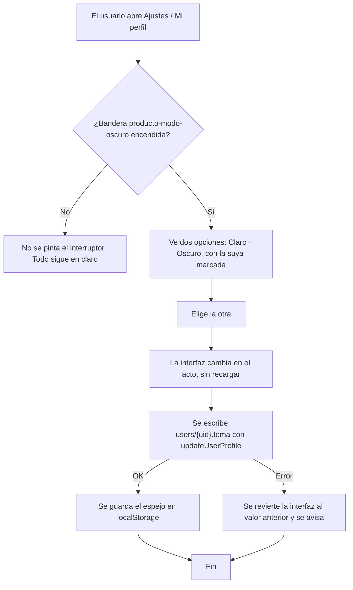
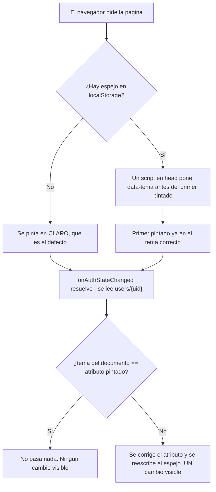

# PRD-V-FEAT-007 — Modo oscuro elegible por el usuario

| Campo | Valor |
|---|---|
| **ID** | `PRD-V-FEAT-007` · épica `UX-006` del roadmap (frente **Experiencia y diseño**) |
| **Tipo** | `FEAT` — añade una preferencia a un documento que el usuario ya posee. **No es `PLAT`**: no toca roles, permisos de negocio ni ciclo de vida del conjunto |
| **Portales — alcance** | `ADMIN` · `RESIDENTE` (decisión de David, 3 sep 2026) |
| **Portales — afectados sin ser alcance** | `PORTERIA`, `SUPERADMIN` y el landing: heredan el mecanismo y **no** la paleta. Ver §4 y `RN-09` |
| **Módulo** | Transversal a la interfaz. Sin módulo de negocio propio, sin entrada en la navegación |
| **Usuario principal** | `resident` (móvil, uso nocturno) · **secundario** `tenant_admin` |
| **Responsable** | David |
| **Estado** | **En desarrollo — entrega 1 construida** (3 sep 2026). Ver §Bitácora. Antes: **Lista para PRD** (3 sep 2026) — escrita tras medir el terreno. **`G1` no se supera y David aceptó su ausencia explícitamente el mismo día**: se construye sin poder medir adopción, porque el valor es de accesibilidad y no de conversión. Ver §Puertas |
| **Dependencias** | Ninguna bloqueante. **Resuelve la decisión abierta de `UX-005`** (preferencia por usuario), que queda desbloqueada por esta ficha |
| **Riesgo** | **Medio.** Cero riesgo de dinero, de datos personales y de permisos. El riesgo es de **regresión visual en 145 ficheros** y de **contraste ilegible** |
| **Reversibilidad** | **Total y en un solo interruptor.** La bandera `producto-modo-oscuro` apagada deja el producto exactamente como está hoy. La migración de color a tokens es inerte en claro por construcción — ver `RN-01` |
| **Plan comercial** | Todos. No es una capacidad vendible ni segmentable por plan |

---

## 1 · Resumen ejecutivo

Un residente que abre Vivaru de noche recibe una pantalla clara a pleno brillo, y hoy no tiene forma
de cambiarla: el producto **no tiene interruptor de tema y no responde al del sistema operativo**.
Esta ficha añade una preferencia personal de dos valores —claro u oscuro— guardada en el documento
del propio usuario, y la paleta oscura para los portales de residente y de administración.

**El trabajo no es el interruptor.** Los tokens de color existen, pero **1.048 usos de color literal
en 145 ficheros se los saltan**: mientras un componente diga `bg-white`, el tema no lo alcanza cambie
lo que cambie el token. El grueso de esta ficha es esa migración, y el interruptor es lo último.

El valor esperado es de experiencia, no de negocio medible hoy: **producción no tiene clientes**, así
que la adopción no se puede medir todavía. La métrica que sí se puede medir desde el primer día es la
de terreno — usos de color literal en el alcance, y contraste — y es la que gobierna la aceptación.

---

## 2 · Problema y baseline

### Cómo se resuelve hoy: no se resuelve

| Qué | Medido el 3 de septiembre de 2026 | Cómo |
|---|---|---|
| Interruptor de tema en la interfaz | **0** | Barrido de `src/` |
| Preferencia de tema guardada | **0 campos** en `users/{uid}` | `firestore.rules` §`users` y `src/features/users/profile-service.ts` |
| Librería de temas (`next-themes` u otra) | **No está en dependencias** | `package.json` |
| `@custom-variant dark` o selector `.dark` | **0** en todo el CSS | `src/app/globals.css`, 1.248 líneas |

### El terreno, que es lo que decide la forma de la ficha

**a) Los tokens existen, pero no son una palanca uniforme.** `globals.css` declara 127 propiedades
personalizadas. Repartidas:

| Bloque | Cuántas | Qué son | ¿Sirven de palanca del tema? |
|---|---|---|---|
| `:root` (l. 23–152) | **68** | **Solo 4 son semánticas** — `--background`, `--foreground`, `--surface-strong`, `--surface-soft`. Las otras 64 son escalas con **nombre de color**: `--slate-*` (10), `--brand-*` (10), `--danger-*` (7), `--amber-*` (6), `--warning-*` (2) y **24 pares `--icon-<color>-<estado>-<bg\|fg>`** | Las 4 semánticas, **sí**. Las 64 restantes, **no** |
| `@theme inline` (l. 153–175) | **21** | El puente semántico de shadcn: `--color-background`, `--color-card`, `--color-muted`, `--color-border`… mapeados a las variables de `:root` | **Sí. Es la palanca principal** |
| `@theme` (l. 860–996) | **52** | Marca del landing, espaciados, sombras, `z-index`, duraciones y curvas | No (y el landing está fuera de alcance) |
| `.marketing-theme` (l. 821) | 19 + radios | Los semánticos de shadcn **clavados en claro** para el landing | No. Es lo que aísla al landing |

> **El hallazgo:** la palanca real del tema son **~25 nombres**, no 127. Un token que se llama
> `--slate-200` **no se puede invertir**: su nombre dice qué color es, no qué papel cumple. Cambiarlo
> a un gris oscuro deja el nombre mintiendo, y rompe a cualquiera que lo use como texto en vez de
> como superficie. Las escalas **se re-mapean**; solo los semánticos **se invierten**.

**b) 1.048 usos de color literal, fuera de marketing, en 145 ficheros.** Reparto medido:

| Zona | Ficheros | Nota |
|---|---|---|
| `src/components/features` | 39 | Compartida por todos los portales — **entra al alcance aunque solo entrara un portal** |
| `src/components/shared` | 26 | Igual: transversal |
| `src/app/(admin)` | 18 | Alcance |
| `src/app/(resident)` | 13 | Alcance |
| `src/app/(superadmin)` | 10 | Fuera de alcance |
| `src/components/diagnostico` | 10 | Fuera de alcance |
| `src/components/ui` | **9** | **La base del sistema de diseño está casi limpia** — es la buena noticia del reparto |
| `src/components/securityGuard` | 4 | Fuera de alcance, pero **el peor fichero del repositorio está aquí**: `GuardVisitors.tsx`, 59 usos |
| `src/app/(auth)` | 6 | Alcance (la puerta de entrada a los dos portales) |
| `src/app/(guard)` | 1 | Fuera de alcance |

Los diez ficheros peores concentran **~350 usos**, un tercio del total. En cabeza:
`GuardVisitors.tsx` (59) · `(resident)/communications` (52) · `(admin)/billing` (42) ·
`UnitBulkImportWizard` (40) · `ResidentBulkImportWizard` (39) · `(admin)/pqrs` (32) ·
`(admin)/reports` (30).

**c) Hay un tercer bloque que ninguna medición anterior contó.** Los componentes tienen **0
hexadecimales**, cierto — pero **35 reglas del propio `globals.css` pintan color literal**:
`.soft-panel` con `linear-gradient(180deg, #ffffff, #f8fbff)`, los tooltips con `#E6F1FB` y
`#185FA5`, y seis sombras `rgba(...)`. Esas reglas **no las alcanza ningún token**.

**d) Vivaru ya responde al modo oscuro del sistema en producción, y nadie lo decidió.** Al no existir
`@custom-variant dark`, la variante `dark:` de Tailwind 4 es una media query pura. Verificado **en
`grupovivaru.com`, no deducido**: el CSS servido contiene **21 reglas dentro de
`@media (prefers-color-scheme: dark)`**, y con el sistema operativo en oscuro un botón `outline` del
landing se pinta **ahora mismo** con un fondo `oklab(0.9287… / 0.3)` mientras su texto sigue en
`rgb(15,28,43)` y la sección sigue blanca. Vienen de **tres** ficheros —
`src/components/marketing/ui/{tabs,input,button}.tsx` — y no de cuatro: **el cuarto era un falso
positivo**, el propio `globals.css`, donde `dark:` aparece dentro de dos nombres de token
(`--color-navy-dark`, `--color-brand-plum-dark`) y no como clase.

### Volumen y baseline de negocio

**No hay baseline de adopción y hay que decirlo.** Producción tiene **nueve conjuntos, todos
`isExample`, y cero clientes**. Ninguna métrica de uso —cuántos eligen oscuro, a qué hora, en qué
portal— se puede medir hoy contra tráfico real. Esto **hace que `G1` no se supere** (§Puertas), igual
que le pasa a `PRD-V-FEAT-006` con `importRuns` vacío. La métrica que sustituye a la de adopción
mientras tanto es de terreno y se mide con un guardián en la suite; ver §10, `CA12`–`CA14`.

---

## 3 · Usuarios, roles y permisos

El tema es una preferencia de **presentación personal**. Nadie decide el tema de nadie.

| Rol | Ve | Puede | **NO puede** |
|---|---|---|---|
| `resident` | El interruptor en `/resident/profile` | Cambiar **su** tema; que se recuerde entre sesiones y dispositivos | Cambiar el tema de otro residente · Cambiar el del administrador · Imponer un tema al conjunto · Cambiar el tema del informe impreso |
| `tenant_admin` | El interruptor en `/admin/settings` | Cambiar **su** tema | Cambiar el de ningún residente ni el de otro administrador · Fijar un tema para el conjunto · Desactivar el interruptor de nadie |
| `committee` | El interruptor, con el shell del admin | Cambiar **su** tema | Lo mismo que `tenant_admin`. **Y su informe se imprime siempre en claro** — ver `RN-07` |
| `security_guard` / `security` | **Nada.** Fuera de alcance del MVP | — | Elegir tema (Fase 2) |
| `superadmin` | **Nada.** Fuera de alcance del MVP | — | Elegir tema · **Ni ver ni cambiar el tema de un usuario** — no es dato de soporte y no se expone en la consola |

> **Lo prohibido que más importa:** ningún rol, `superadmin` incluido, puede **leer** la preferencia
> de tema de otro usuario para actuar sobre ella. La regla vigente de `users/{uid}` ya permite que un
> `tenant_admin` **lea** el documento de un usuario de su conjunto, así que el campo será visible
> para él; lo que esta ficha prohíbe es **escribirlo** y **construir cualquier pantalla que lo
> muestre**. Ver `RN-04`.

---

## 4 · Objetivo, alcance y exclusiones

### Objetivo

Que un residente y un administrador puedan elegir entre **claro** y **oscuro**, que la elección
sobreviva al cierre de sesión y viaje a sus otros dispositivos, y que el producto en oscuro sea
**legible** — no solo oscuro.

### Entra en el MVP

1. Campo `tema` en `users/{uid}`, con valores `claro` y `oscuro`.
2. Interruptor en **`/admin/settings`** y en **`/resident/profile`**.
3. Paleta oscura: inversión de los **~25 tokens semánticos** y re-mapeo de las escalas.
4. **Migración de color literal a token** en las superficies del alcance:
   `src/app/(admin)` · `src/app/(resident)` · `src/app/(auth)` · `src/components/shared` ·
   `src/components/features` · `src/components/ui` · **`src/features`** (excepto sus carpetas
   `security-guard/` y `superadmin/`, que son portales de fase 2).

   > **Corrección del 3 sep, hecha construyendo:** esta lista decía solo
   > `src/components/features` y **`src/features` es OTRO árbol**, con siete ficheros de admin,
   > PQRS y comunicaciones. El hueco no lo vio ninguna lectura: lo destapó **verificar el bundle**
   > —`text-indigo-700` seguía emitiéndose sin un solo consumidor en el alcance que yo creía
   > completo—. Son **150 ficheros**, no 111.
5. Las **35 reglas de color literal de `globals.css`** que aplican a esas superficies.
6. `@custom-variant dark` declarada por **atributo**, y el mecanismo de pintado sin destello.
7. El **informe del consejo se imprime siempre en claro** (`RN-07`).
8. Bandera `producto-modo-oscuro`, por conjunto y global.

### NO entra, y por qué

| Excluido | Por qué |
|---|---|
| **Portal de portería** (`(guard)`, `components/securityGuard`) | Decisión de David. Es un puesto fijo con pantalla propia y horario de turno; el caso de uso nocturno lo cubre el brillo del monitor. **Aviso: concentra el peor fichero del repositorio (`GuardVisitors.tsx`, 59 usos)** y su migración es cara |
| **Portal de superadmin** (`(superadmin)`, `components/diagnostico`) | 20 ficheros para un puñado de personas del equipo |
| **El landing** (`(marketing)`, `.marketing-theme`, `@theme`) | Tiene **marca propia y su propio bloque de 52 tokens**: es un segundo tema que diseñar, no una extensión del primero |
| **«Seguir al sistema operativo»** | Decisión de David: el tema es **explícito**. Consecuencia obligatoria en `RN-09` |
| **Tema por conjunto** | Decisión de David: la preferencia es **por usuario**. Cierra también la decisión abierta de `UX-005` |
| **Tema en los PDF y en el correo** | **No pueden heredarlo por construcción** — ver §7 y `RN-08`. Se dice aquí para que nadie lo herede sin querer |
| **Temas de marca por conjunto** (que cada conjunto tenga su color) | Es otra ficha y otro problema. `tenant-branding-card.tsx` ya existe y no se toca |

---

## 5 · Flujo funcional

### Camino feliz — elegir el tema

### Camino de carga — qué ve el usuario al abrir la aplicación

Este es el camino delicado, y **su comportamiento no es igual la primera vez que las siguientes**:

> **El caso que hay que escribir en la ficha o se convierte en un defecto reportado:** en el
> **primer** acceso desde un dispositivo nuevo, el espejo está vacío y Firestore aún no ha
> contestado. La página **tiene que** pintarse en claro y corregirse después. **Un criterio que
> pidiera «nunca hay destello» sería imposible por construcción** — es la trampa de `CA9` de
> `PLAT-006`. El criterio correcto está en `CA5` y `CA6`, y separa las dos cargas.

### Errores y casos límite

| Caso | Comportamiento |
|---|---|
| La escritura en Firestore falla (sin red, permiso denegado) | La interfaz **vuelve al tema anterior** y avisa con un `toast`. **No se guarda el espejo**: un espejo que no corresponde al documento es peor que no tener espejo |
| El documento tiene `tema` con un valor desconocido | Se trata como **claro**. No se corrige el documento desde el cliente — ver `RN-03` |
| El documento no tiene el campo (todos los usuarios de hoy) | **Claro.** El campo es opcional; ausente no es un estado de error |
| `localStorage` no está disponible (modo privado, navegador que lo bloquea) | El tema **sigue funcionando**: se pierde solo la ausencia de destello. Toda lectura y escritura del espejo va dentro de `try/catch` |
| El usuario cambia el tema en dos pestañas a la vez | Gana la última escritura. No hay bloqueo ni conflicto que resolver: es una preferencia de presentación |
| El conjunto está `suspended` o `expired` | **El interruptor sigue funcionando** — ver `RN-05` |
| El usuario cierra sesión | El atributo vuelve al defecto claro y **el espejo se borra**: la pantalla de acceso no puede delatar el tema del último usuario del dispositivo |

### Quién es notificado

**Nadie.** Cambiar de tema no genera correo, notificación ni entrada de auditoría. Ver §9.

---

## 6 · Estados y transiciones

La preferencia tiene **tres estados y ningún estado terminal**.

| Estado | Qué significa | Quién lo provoca | Salida |
|---|---|---|---|
| **Ausente** | El campo no existe. Es el estado de **todos los usuarios de hoy** | El sistema, al crear el usuario | El dueño elige uno. **Nunca se escribe al migrar**: no hay backfill |
| **`claro`** | Elección explícita del dueño | Solo el dueño | El dueño elige `oscuro` |
| **`oscuro`** | Elección explícita del dueño | Solo el dueño | El dueño elige `claro` |

- **Ausente y `claro` se ven igual y no son lo mismo.** Se distinguen porque el día que se añada
  «seguir al sistema» (Fase 2), ausente podrá significar «sistema» sin pisar a quien eligió claro a
  propósito. **Por eso no hay backfill**: escribir `claro` en 68 documentos destruiría esa
  distinción antes de poder usarla.
- **Ningún estado se queda atascado**: no hay transición que dependa de un tercero, de un plazo ni
  de un trabajo programado. El dueño siempre puede salir de donde esté.
- **Nadie hereda el estado de nadie.** No hay valor por conjunto que pisar ni precedencia que
  resolver.

---

## 7 · Contrato de datos y multi-tenancy

### El campo

| Colección | Campo | Tipo | Obligatorio | Quién escribe | Quién lee |
|---|---|---|---|---|---|
| `users/{uid}` | `tema` | `string`, exactamente `"claro"` o `"oscuro"` | **No.** Ausente es válido | **Solo el dueño**, por escritura directa | El dueño. Y `superadmin` y el `tenant_admin` del conjunto, **porque la regla vigente ya se lo permite para todo el documento** — no porque esta ficha lo abra |

- **`tenantId`:** el documento `users/{uid}` **ya lo lleva**, y la regla vigente lo declara inmutable
  en cualquier actualización del propio usuario. Esta ficha **no añade ninguna consulta de lista**,
  así que no introduce ninguna que deba filtrar por `tenantId`. Es la razón por la que no toca el
  aislamiento entre conjuntos: se lee **un** documento, por su id, que es el `uid` de quien pregunta.
- **Retención y borrado:** el campo vive y muere con el documento del usuario. **No entra en ninguna
  de las tres ventanas de 12 meses** que ya corren cada noche, porque no es un evento con fecha.
- **El espejo de `localStorage`** guarda una clave, `vivaru.tema`, con el mismo valor. **Es una
  caché de pintado, no una fuente de verdad**: si discrepa del documento, gana el documento. Se borra
  al cerrar sesión. **No contiene ningún dato personal** — ni el `uid`, ni el conjunto, ni el rol.

### Comportamiento en los estados del conjunto

| Estado del conjunto | Comportamiento | Por qué |
|---|---|---|
| Activo | Normal | — |
| **`suspended` / `expired`** | **El interruptor SIGUE funcionando.** Es una excepción declarada a `tenantOperable` | Hay **precedente escrito en `firestore.rules`**: `pushTokens` tampoco pasa por `tenantOperable`, porque registrar avisos «es lectura de avisos, no operación del conjunto». Elegir cómo se ve la pantalla es lo mismo, y más aún: a un usuario cuyo conjunto está suspendido **solo** le queda mirar |
| **En prueba (trial)** | Normal. **No es un módulo en vista previa** | No es una capacidad de negocio que se pueda comprar ni recortar: es accesibilidad de la interfaz |

---

## 8 · Reglas de negocio y validaciones

| # | Regla | Verificable en |
|---|---|---|
| `RN-01` | **ENMENDADA el 3 sep, midiendo.** La versión original —«no cambia un solo pixel»— **no era satisfacible**: de los 63 colores distintos del alcance, **solo `white` tenía un token con el mismo valor**. La regla queda partida en tres: **(a)** `white`/`black` y las familias sin token —emerald, rose, sky, blue, orange, indigo, violet, teal, cyan— se migran con **cero cambio de pixel**, porque los tokens nuevos se crearon con el valor exacto que Tailwind 4 pinta hoy (626 usos); **(b)** `slate-*`, `amber-*` y `red-*` **cambian de forma visible y a propósito** —189 usos— al unificarse en la paleta de Vivaru, que es la deliberada: `--danger-500` está a **ΔE 29** de `red-500` y `--amber-300` a **52**. Decisión de David. **(c)** El `text-destructive` del perfil del residente **pasa de no pintarse a pintarse** — era un defecto, no un color | `CA12`, y comparación visual |
| `RN-02` | El tema se aplica por **un atributo en `<html>`**, nunca por una clase en un shell de portal. `.admin-shell` gobierna tipografía y **no** puede gobernar tema | `CA10` |
| `RN-03` | Un valor de `tema` distinto de `claro` u `oscuro` **se pinta como claro** y **no se corrige desde el cliente**. La corrección silenciosa esconde el defecto que la causó | `CA9` |
| `RN-04` | **Ninguna pantalla muestra el tema de otro usuario**, y ninguna operación lo escribe en nombre de otro. Ni la consola de superadmin ni la pantalla de usuarios del admin | `CA4` |
| `RN-05` | El interruptor funciona con el conjunto `suspended` o `expired`. **Excepción declarada a `tenantOperable`**, con el precedente de `pushTokens` | `CA8` |
| `RN-06` | **En oscuro, todo texto cumple contraste WCAG AA** (4,5:1 normal, 3:1 grande) y todo borde de control cumple 3:1 contra su fondo | `CA13` |
| `RN-07` | **El informe del consejo se imprime SIEMPRE en claro**, elija el usuario lo que elija. Su `@media print` reimpone la paleta clara además de ocultar lo que sobra | `CA11` |
| `RN-08` | **Ningún documento exportado hereda el tema.** Los PDF se dibujan desde datos y el correo tiene su propia plantilla. Se declara aunque sea cierto por construcción hoy, para que un cambio futuro de mecanismo tenga que enfrentarse a esta regla | `CA11`, `CA15` |
| `RN-09` | **El tema no sigue al sistema operativo.** La variante `dark` se declara **solo** por atributo. Consecuencia obligatoria: las **21 reglas de `prefers-color-scheme` vivas hoy en el landing dejan de dispararse**, y eso hay que verificarlo en producción | `CA16` |
| `RN-10` | **No hay backfill.** Ninguna migración escribe `tema` en un documento existente | `CA7` |
| `RN-11` | Con la bandera apagada **no se pinta el interruptor y no se lee el campo**. Un usuario que ya tuviera `tema: "oscuro"` guardado **ve claro** | `CA2` |

---

## 9 · Notificaciones y correo

**No hay.** Cambiar de tema no manda correo, no genera notificación push, no escribe auditoría y no
aparece en ninguna bitácora. Es una preferencia de presentación del propio usuario sobre su propia
pantalla.

**Y el correo transaccional no cambia.** Las plantillas de `functions/src/email.ts` traen sus propios
colores y se renderizan en el cliente de correo del destinatario, que no conoce ni el atributo ni el
espejo. **Ningún correo de Vivaru sale en oscuro por esta ficha.**

---

## 10 · Criterios de aceptación

Cada uno dice **cuándo** se mide, porque un criterio medido en el instante equivocado pasa en verde
con el producto roto.

### El interruptor y el dato

| # | Criterio | Cuándo se mide |
|---|---|---|
| `CA1` | Con la bandera encendida, un `resident` entra a `/resident/profile`, elige **Oscuro**, y **la interfaz cambia sin recargar la página** | Inmediatamente después del clic, antes de que Firestore confirme |
| `CA2` | **Con la bandera APAGADA**, el interruptor **no existe** en `/resident/profile` ni en `/admin/settings`, y un usuario cuyo documento ya tenga `tema: "oscuro"` **ve la interfaz en claro** | Con la bandera apagada y el campo ya escrito. **Este es el criterio que prueba que la bandera gobierna algo** |
| `CA3` | Cierra sesión, entra desde **otro dispositivo** y el portal aparece en oscuro | Tras el primer pintado del segundo dispositivo, y **después** de que `onAuthStateChanged` resuelva |
| `CA4` | **DEBE FALLAR:** un `tenant_admin` intenta escribir `tema` en el documento de un residente de su conjunto → **la regla lo rechaza** | Prueba de reglas, escritura directa |
| `CA7` | **DEBE FALLAR:** tras desplegar, **cero documentos de `users` han ganado el campo `tema`** sin que su dueño lo eligiera | Conteo en producción antes y después. `RN-10` |
| `CA8` | Un usuario de un conjunto **`suspended`** cambia su tema **y la escritura se acepta** | Prueba de reglas con el conjunto suspendido |
| `CA9` | Un documento con `tema: "sistema"` (valor inventado) **se pinta en claro**, y el documento **sigue teniendo `"sistema"`** después | Tras cargar la página y esperar a que resuelva la sesión. `RN-03` |
| `CA17` | **DEBE FALLAR:** escribir `tema: "banana"` → **la regla lo rechaza**. **Y una edición de perfil corriente (nombre, teléfono) sigue pasando** | Prueba de reglas. **Las dos mitades**: la restricción nueva no puede romper el camino que ya existe |

### El pintado

| # | Criterio | Cuándo se mide |
|---|---|---|
| `CA5` | **Primera carga en un dispositivo nuevo**, con el usuario en oscuro: la página se pinta en **claro** y cambia a oscuro **una sola vez** cuando resuelve la sesión. **Un solo cambio, no dos** | Grabando el primer segundo de la carga con el almacenamiento del navegador vacío |
| `CA6` | **Segunda carga en ese mismo dispositivo**: el **primer pintado ya es oscuro**. Cero cambios visibles | Recarga con el espejo ya escrito. **`CA5` y `CA6` son criterios distintos a propósito**: pedir «nunca hay destello» sería imposible por construcción |
| `CA10` | El atributo del tema vive en `<html>`. **Ninguna regla de `.admin-shell` lo gobierna**, y la tipografía Playfair de `h1,h2,h3` **se ve igual en los dos temas** | Inspección del DOM y comparación visual en los dos temas |
| `CA18` | **Con `localStorage` bloqueado**, el tema sigue funcionando y **la página no lanza ningún error a consola** | Navegador en modo privado con almacenamiento denegado |

### Lo que se exporta y lo que se imprime

| # | Criterio | Cuándo se mide |
|---|---|---|
| `CA11` | Un miembro del **consejo con el tema en oscuro** entra a `/admin/reports` y pulsa Imprimir: **la vista previa de impresión sale en claro** — fondo blanco, texto oscuro, gráficas legibles | En el diálogo de impresión del navegador, **con el tema oscuro activo en pantalla**. `RN-07` |
| `CA15` | Con el tema en oscuro se descargan **paz y salvo**, **estado de cuenta** y **recibo**, y los tres PDF salen idénticos a los de hoy | Comparación byte a byte o visual contra el PDF generado en claro. `RN-08` |
| `CA19` | Con el tema en oscuro, imprimir el **QR de un visitante** (`/admin/visitors`) y el **aviso de mora** (`/admin/billing`) sale en claro | Vista previa de impresión de las dos ventanas emergentes |

### El terreno — los criterios que sustituyen a la métrica de adopción

| # | Criterio | Cuándo se mide |
|---|---|---|
| `CA12` | **Un guardián en la suite cuenta los usos de color literal en las superficies del alcance y falla si son más de cero.** Y **su falsación enrojece**: al reponer un `bg-white` en cualquiera de los ficheros del alcance, la prueba se pone roja | En cada `npm test`. **La falsación es obligatoria**: un guardián que no distingue el código bueno del roto vigila un conjunto vacío |
| `CA13` | **Todo par texto/fondo del alcance en oscuro cumple WCAG AA.** Medido pantalla por pantalla, no token por token: un token puede cumplir y su uso concreto no. **No se escribe de cero: `tests/contraste-del-fondo.test.ts` ya calcula contraste real leyendo `globals.css`** — se extiende a los pares del tema oscuro | Sobre el producto pintado en oscuro, en las pantallas del alcance |
| `CA14` | Las **35 reglas de color literal de `globals.css`** que aplican al alcance están migradas a token, `.soft-panel` incluida | Barrido del fichero |
| `CA16` | **En producción, con el sistema operativo en oscuro, el landing NO cambia**: el botón `outline` que hoy se pinta con un fondo translúcido vuelve a pintarse como en claro | Tras el despliegue, en `grupovivaru.com`, con el esquema de color del navegador emulado en oscuro. **Es el control de `RN-09`, y su valor de partida está medido: hoy sí cambia** |

---

## 11 · Arquitectura y dependencias

### La decisión obligatoria: escritura directa, no callable

**Escritura directa desde el cliente.** Justificación:

- No hay lógica de negocio, ni permisos cruzados, ni correo, ni escritura en varias colecciones.
- Es un CRUD de **un campo** sobre **el propio documento**, y las reglas lo pueden proteger por
  completo: la regla vigente de `users/{uid}` ya exige `uid == request.auth.uid` y ya declara
  inmutables `uid`, `role`, `tenantId` y los cinco campos de contraseña.
- **El camino ya existe y es el gemelo que lo hace bien:** `updateUserProfile(uid, patch)` en
  `src/features/users/profile-service.ts` usa `updateDoc` y pasa por `sanitizeUserProfilePatch`. El
  trabajo es **añadir el campo al sanitizador**, no escribir un camino nuevo.
- **Nada que el cliente pueda falsificar tiene consecuencia.** El peor caso de un cliente malicioso
  es que su propia pantalla se vea de otro color.

**Cambio en `firestore.rules`, y una advertencia honesta sobre lo que consigue:** se añade a
`match /users/{uid}` la validación de que `tema`, **si está presente**, es uno de los dos valores.
**Esa regla no cierra ningún agujero de seguridad**: la regla vigente **no lista los campos
permitidos**, así que el dueño ya puede escribir hoy cualquier campo en su propio documento. La
validación sirve para que **el dato no se ensucie**, no para proteger nada. La holgura de fondo es
**anterior a esta ficha y no entra en su alcance**.

### El mecanismo del tema

| Pieza | Decisión | Por qué |
|---|---|---|
| **Selector** | `@custom-variant dark` declarada **solo** por atributo en `<html>` — `data-tema="oscuro"` | Un **atributo** y no una clase: no colisiona con ninguna utilidad de Tailwind, no puede ser pisado por un `className` y no compite con `.admin-shell` ni con `.marketing-theme`, que ya juegan a la especificidad |
| **Palanca** | Se redefinen **los ~25 tokens semánticos** bajo el atributo: los 4 de `:root` y los 21 de `@theme inline` | Es la única superficie pequeña que existe. Las 64 escalas con nombre de color **se re-mapean**, no se invierten |
| **Escalas** | `--slate-*`, `--brand-*`, `--danger-*`, `--amber-*`, `--warning-*` y los 24 pares `--icon-*` reciben valores nuevos bajo el atributo, **conservando su nombre y su papel** (`bg` sigue siendo superficie, `fg` sigue siendo texto) | Renombrarlas sería otra ficha, mucho más cara, y **la ficha no la necesita**: lo que importa es que el papel se conserve |
| **Sin destello** | Un script **bloqueante** en `<head>` lee `vivaru.tema` de `localStorage` y pone el atributo antes del primer pintado. `<html>` necesita `suppressHydrationWarning` | El tema canónico vive en Firestore y **no puede estar disponible antes de que resuelva `onAuthStateChanged`**. Sin espejo, cada carga destella |
| **Fuente de verdad** | **Firestore.** El espejo es caché | Si discrepan, gana el documento y el espejo se reescribe |
| **Dónde se lee** | En `AuthProvider` (`src/features/auth/auth-context.tsx`), que **ya lee `users/{uid}`** | No se añade ni una lectura: el documento ya se pide |
| **Bandera** | `producto-modo-oscuro`, **por conjunto y global**, en los **cinco** sitios del catálogo | Es la vía del canario. Registrarla en cuatro de los cinco ya falló el 25 de agosto |

### Componentes compartidos y lo que se toca

- `src/app/layout.tsx` — el atributo y el script del `<head>`.
- `src/app/globals.css` — el bloque del tema oscuro y las 35 reglas de color literal.
  **Fichero delicado**: contiene la regla de tipografía de marca y la de cifras de ancho fijo, ya
  vigiladas por `tests/cifras-de-ancho-fijo.test.ts`. **Ninguna de las dos se toca.**
- `src/features/users/profile-service.ts` — el campo en el sanitizador.
- `src/features/auth/auth-context.tsx` — exponer el tema en la sesión.
- Un componente nuevo de interruptor, en `src/components/shared`, consumido por las dos pantallas.
- `tests/contraste-del-fondo.test.ts` — **se extiende, no se duplica**: ya lee `globals.css` y calcula
  contraste real, y es el guardián que `CA13` necesita para los pares del tema oscuro.
- **~111 ficheros de migración de color.**

### Lo que NO hace falta

- **Ninguna Cloud Function.** Ningún índice nuevo. Ningún trabajo programado.
- **`next-themes` no se instala.** El estado del tema es un campo que `AuthProvider` ya trae y un
  atributo en la raíz: una dependencia añadiría su propio almacenamiento y su propia idea de
  «sistema», que esta ficha **descarta por decisión**.
- **`@source not "../../docs"` ya está en `globals.css` (l. 20)**, así que esta ficha puede nombrar
  clases de Tailwind en prosa **sin resucitarlas en el bundle**. Verificado, no supuesto.

---

## 12 · Riesgos y mitigaciones

| # | Riesgo | Señal que lo detecta | Mitigación |
|---|---|---|---|
| `R1` | **Regresión visual en claro.** Tocar 111 ficheros para sustituir color puede cambiar el aspecto actual sin querer | `CA12` no lo detecta —cuenta literales, no compara pixeles—. Lo detecta la **suite visual de Playwright que ya existe** (`test:visual`) y la revisión con ojos | `RN-01`: cada sustitución usa un token cuyo valor en claro es idéntico. **Migrar por lotes**, no de una vez |
| `R2` | **Contraste ilegible en oscuro.** Un gris que funciona sobre blanco es invisible sobre carbón | `CA13`, pantalla por pantalla | **El gemelo que ya lo hace bien es `tests/contraste-del-fondo.test.ts`**, que paró un cambio de fondo al medir que `--slate-500` —el gris del texto secundario, **usado 526 veces**— caía a 4,27:1. Se extiende al tema oscuro. Diseñar la paleta contra AA desde el principio, no ajustarla al final |
| `R3` | **El informe del consejo sale en oscuro.** Es el único documento que hereda el DOM, y es el que se firma | `CA11`. **Hoy no falla porque no hay tema**; empezaría a fallar el día del despliegue | `RN-07`: el `@media print` reimpone la paleta clara **además** de ocultar |
| `R4` | **El landing cambia de aspecto sin que nadie lo pida.** `RN-09` deja inertes 21 reglas que hoy están vivas en producción | `CA16`, contra el valor de partida ya medido | Está **medido antes** y es un cambio querido: hoy pinta estilos de oscuro sobre una página clara. Se verifica en producción tras desplegar |
| `R5` | **Un guardián que no vigila nada.** `CA12` puede pasar en verde con una expresión que no cace la forma real, como ya pasó con `tests/facturado-una-sola-formula.test.ts` | Solo lo detecta **falsar**: reponer un color literal y comprobar que enrojece | La falsación es **parte del criterio**, no un paso posterior. Y si no enrojece, **sospechar primero de la falsación** |
| `R6` | **La regla nueva rompe la edición de perfil.** Añadir validación a `users` puede rechazar actualizaciones que hoy funcionan | La mitad positiva de `CA17` | La regla condiciona **solo** el campo `tema` y solo si está presente. Se prueba **contra el camino que ya existe**, no solo contra el nuevo |
| `R7` | **Adopción no medible.** Cero clientes en producción: no se sabrá si alguien lo usa | — | Se declara. **`G1` no se supera**, y `CA12`–`CA14` sustituyen la métrica mientras tanto |
| `R8` | **El alcance crece por el camino.** Los portales excluidos comparten `shared` y `features`, así que **quedarán medio migrados**: sus componentes compartidos en token y sus pantallas propias en literal | Se ve al contar literales por portal | Es **aceptado y no es un defecto**: en claro se ven idénticos (`RN-01`), y sin el atributo nunca entran en oscuro. Su migración es Fase 2 |
| `R9` | **Coste de operación: cero.** No hay lecturas nuevas, ni escrituras periódicas, ni almacenamiento que crezca | — | Un campo de siete caracteres en un documento que ya se lee en cada sesión |

---

## 13 · Despliegue, rollback y Story Map

### Orden de despliegue

**`reglas → front`.** No hay functions.

La regla **restringe** (rechaza valores de `tema` fuera del enum), pero **desplegarla primero es
seguro y es el orden correcto**: ningún cliente desplegado escribe hoy el campo, así que la
restricción no puede romper nada que esté funcionando. El orden inverso —front primero— dejaría una
ventana en la que se pueden escribir valores que luego la regla rechazaría.

**Y las reglas se verifican leyendo las desplegadas por la API de Rules y diferenciándolas contra el
repositorio**, no dando por hecho que `master` es producción: eso vale para el front y **no** para
reglas.

### Rollback

| Nivel | Cómo | Qué deja |
|---|---|---|
| **1 · Bandera** | Apagar `producto-modo-oscuro`, por conjunto o global | Producto en claro, interruptor invisible, campo intacto. **Segundos** |
| **2 · Front** | Revertir el commit del front | Igual, y sin el código |
| **3 · Reglas** | Revertir la regla | Vuelve a admitir cualquier valor. **No borra datos** |
| **Dato** | **No hace falta revertir nada.** Ningún documento se escribió sin que su dueño lo eligiera (`RN-10`) | — |

**Nada de esto es irreversible.**

### Qué se valida en staging y qué solo en producción

| Dónde | Qué |
|---|---|
| **Staging** | `CA1`–`CA10`, `CA15`, `CA17`–`CA19`. Todo el comportamiento del interruptor, del pintado, de las reglas y de los PDF |
| **Solo producción** | **`CA16`** — el valor de partida (21 reglas de `prefers-color-scheme` activas) está **medido en `grupovivaru.com`**, y solo ahí se puede comprobar que dejaron de dispararse |
| **Con ojos, sin sustituto** | `CA11` (el diálogo de impresión) y `CA13` (contraste). Ninguna suite los ve |

### Story Map

**MVP · Entrega 1 — el terreno (sin ningún cambio visible)**
1. Guardián de color literal en el alcance, **falsado**.
2. Migración por lotes, empezando por los diez peores ficheros del alcance (~290 usos).
3. Las 35 reglas de `globals.css`.
4. **Al terminar: el producto se ve exactamente igual.** `CA12`, `CA14`, suite visual.

**MVP · Entrega 2 — el mecanismo**
5. `@custom-variant dark` por atributo · la paleta oscura de los ~25 semánticos y las escalas.
6. Script del `<head>`, espejo y borrado al cerrar sesión.
7. `RN-07`: el informe del consejo en claro.
8. `CA5`, `CA6`, `CA10`, `CA11`, `CA13`, `CA18`, `CA19`.

**MVP · Entrega 3 — el interruptor**
9. Regla, campo en el sanitizador, tema en la sesión, interruptor en las dos pantallas, bandera.
10. `CA1`–`CA4`, `CA7`–`CA9`, `CA17`. Canario en un conjunto. **`CA16` tras el despliegue.**

**Fase 2 — declarada, no aplazada en silencio**
- Portería y superadmin (**empezando por `GuardVisitors.tsx`, 59 usos**).
- **«Seguir al sistema»** como tercer valor. El diseño lo admite sin migración: **ausente** sigue
  libre de significado, que es exactamente por lo que `RN-10` prohíbe el backfill.
- El landing, con su propia paleta de marca.
- `UX-005` sobre este mismo modelo de preferencia por usuario.

---

## Puertas

| Puerta | Estado | Evidencia |
|---|---|---|
| **`G0` Necesidad** | ✅ | El problema existe y **está medido**: 0 interruptores, 0 preferencias guardadas, 1.048 usos de color literal, y un producto que ya responde al sistema operativo de forma incoherente en producción |
| **`G1` Valor** | ⚠️ **NO SE SUPERA — AUSENCIA ACEPTADA POR DAVID** (3 sep 2026) | **Producción tiene cero clientes.** No hay baseline de adopción ni forma de medirla, y `CA12`–`CA14` son métrica de **terreno**, que **no es lo mismo**. La ficha avanza igual por decisión explícita: el valor es de accesibilidad, no de conversión, así que esperar a tener tráfico que medir sería esperar por una cifra que no cambiaría la decisión. **Lo que esto compra y lo que cuesta:** se construye sabiendo que **nadie podrá decir si se usa** hasta que haya clientes. Si al llegar el primero nadie lo enciende, esta puerta es donde estaba escrito que no lo íbamos a saber |
| **`G2` Datos y permisos** | ✅ | Un campo opcional en un documento que el dueño ya puede actualizar; la inmutabilidad de `uid`, `role` y `tenantId` ya está en la regla vigente; el precedente de `tenantOperable` está escrito |
| **`G3` Riesgo** | ✅ | Bandera en cinco sitios, rollback en tres niveles, sin migración de datos, sin irreversibilidad |
| **`G4` Aceptación** | ✅ | 19 criterios, **cinco de ellos deben fallar** (`CA4`, `CA7`, `CA17`, y las dos mitades de `CA2` y `CA16`), y cada uno declara **cuándo** se mide |
| **`G5` Operación** | ✅ | **No la opera nadie, y esa es la respuesta correcta.** No hay bandeja, ni cola, ni estado que alguien deba atender. Lo único operable es la bandera, y la enciende quien hace el despliegue |
| **`G6` Escala** | ✅ | Cero lecturas nuevas, cero escrituras periódicas, cero almacenamiento que crezca |

> **`G1` se cerró como se tenía que cerrar: decidiendo, no midiendo.** David aceptó su ausencia el 3 de
> septiembre de 2026 y la ficha pasó a **Lista para PRD** el mismo día. `G0` y `G2`–`G6` estaban
> superadas; `G4` y `G5` gobiernan la aceptación de lo construido, y son los que deciden si esto llega
> a productiva.
>
> **Y queda dicho para quien lo lea dentro de un año:** que `G1` se aceptara vacía **no la vuelve
> superada**. El día que haya clientes, la primera medición de adopción de esta funcionalidad es una
> deuda de esta ficha, no un extra.

---

## Verificación del portafolio

| Comprobación | Resultado |
|---|---|
| **Colisión de identificador** | Ninguna. `funcionales/` tiene `FEAT-001` a `FEAT-006`. **`FEAT-007` libre** |
| **Dependencias previas** | Ninguna bloqueante |
| **Solapamiento** | **`UX-005`** compartía la decisión «por usuario o por conjunto». **Esta ficha la cierra**: por usuario, y `UX-005` hereda el modelo. **Ninguna otra PRD** del portafolio toca color, tema ni preferencias de presentación |
| **Componentes compartidos** | `AuthProvider`, `updateUserProfile`, `AppShell`, `.admin-shell`, `globals.css`. Los cinco se tocan y ninguno cambia de contrato |
| **Coherencia con roles reales** | Los ocho de `src/lib/constants/roles.ts`. `committee` usa el shell del admin y por eso hereda el interruptor — y por eso `RN-07` existe |
| **Supuestos afinados** | Dos. **(a)** El cuarto fichero con `dark:` es `globals.css` —el changelog `0.9.53` ya lo decía bien; la cabecera de `pendientes.md` lo comprimió a «tres son de marketing» y se leía como si el cuarto fuera del producto—. **No lo es, y además ahí `dark:` no es una clase**: aparece dentro de dos nombres de token (`--color-navy-dark`, `--color-brand-plum-dark`) y no emite nada. **(b)** Los PDF no «no deben» heredar el tema: **no pueden**, porque se dibujan desde datos con `jspdf` y `pdfkit`. La que sí hereda es la impresión del informe del consejo, que la medición no había separado del resto |

---

## Bitácora · Entrega 1 — el terreno (3 de septiembre de 2026)

**Construida. 120 ficheros, `npm test` 1584 en verde, cero cambio funcional.**

### Qué quedó hecho

| | Resultado |
|---|---|
| Literales de paleta con nombre en el alcance | **832 → 0** |
| Usos que ahora pasan por token en el alcance | **3.786** |
| Reglas de `globals.css` con color literal | **12 → 0** (`.soft-panel`, dos tooltips del selector de fechas, el velo del visor, cuatro sombras) |
| Tokens nuevos | **48**: `--success-*` (8) · `--info-*` (5) · `--categoria-*` (18) · `--on-fill` · `--overlay` · `--surface-tint` · cuatro sombras · dos del selector de rango · y los pasos que faltaban en las rampas propias (`--amber-200/400/500/600`, `--danger-400/800`, `--slate-950`) |
| Guardián | `tests/color-por-token.test.ts`, **15 casos**, falsado seis veces |

### Lo que construir corrigió de esta ficha

1. **La medición del terreno contaba la cosa equivocada.** «174 tokens» era cierto e inútil: `@theme`
   **no redefine la paleta de Tailwind**, así que convivían **dos paletas paralelas** —`text-slate-700`
   pintaba el `#314158` de Tailwind y `var(--slate-700)` el `#33485f` de Vivaru— y el idioma de token
   **ya era mayoría** con **3.474 usos en 161 ficheros**. El trabajo no era inventar una vía: era
   terminar de aplicar la que ya existía.
2. **`RN-01` no era satisfacible.** Ver la regla enmendada.
3. **El alcance nombraba un árbol y había dos.** `src/features` ≠ `src/components/features`.
4. **`text-white` y `bg-white` son papeles OPUESTOS.** Los 53 `text-white` del alcance van todos sobre
   un relleno saturado; ni uno es superficie. Con un solo token, en oscuro el texto de cada botón
   habría desaparecido. Por eso `--on-fill` existe y no es `--surface-strong`.
5. **Un defecto vivo, medido en producción.** `text-destructive` en `/resident/profile` resolvía a
   **nada** fuera de `.marketing-theme` —`--destructive` solo se declara ahí—, así que el mensaje
   `Error:` se pintaba en el color de texto heredado. Comprobado en `grupovivaru.com`: dentro del
   envoltorio da `rgb(220,38,38)`, fuera da `rgb(15,28,43)`, idéntico al del `body`. Arreglado.

### Lo que NO se hizo, medido y con nombre

> **Segunda forma de literal, que ninguna medición había contado: el hexadecimal dentro de una clase
> arbitraria.** El 3 de septiembre se midió «0 hexadecimales dentro de componentes» y era cierto para
> el hex suelto — pero no veía `bg-[#fff6f4]`, al que el tema **tampoco alcanza**.
>
> **140 usos · 81 colores distintos · 20 ficheros**, y el 70% en seis: las tarjetas del panel
> (`executive-kpi-card`, 25), `/admin` (17), `RecordPaymentModal` (16), `AdvancesPanel` (14),
> `/admin/finanzas` (14) y `status-pill` (12).
>
> **No se migran aquí, y la razón no es el tamaño:** son mapas de tono a medida —`tono → {degradado,
> punto, texto}`, `estado → {fondo, texto, borde}`— **con casi-duplicados entre ficheros**.
> Unificarlos es diseñar un sistema de tonos, **se ve**, y es la misma clase de decisión que el grupo
> B. **Queda vigilado, no anotado:** el guardián fija el techo en 140 y enrojece si sube.

### Una regresión de contraste, cazada en staging

**Unificar la paleta bajó una insignia por debajo de AA, y ninguna prueba lo vio.** La pastilla de
plazo de PQRS pasó de **4,52:1** (`amber-700` de Tailwind sobre su `amber-100`) a **4,33:1**
(`--amber-700` sobre `--amber-100`). Lo cazó **calcular el contraste del par antes y después**, no
mirar la pantalla: a ojo las dos se leen.

**El arreglo no fue inventar un color: fue leer el alias que ya estaba escrito.** `globals.css`
declara `--warning-100: var(--amber-100)` y `--warning-800: var(--amber-800)` — el sistema ya decía
que el par de aviso es **100 con 800**, no con 700. Con el 800 da **6,61:1**. Corregidos **11 pares
en 9 ficheros**; los `amber-700` sobre `amber-50` se quedan (4,65:1, cumplen).

De los **17 pares de insignia** que crea esta entrega, ese era **el único** por debajo. Ahora hay
guardián: `tests/color-por-token.test.ts` lee los valores de `globals.css` y calcula, así que mover
un token enrojece con el número delante.

### Cómo se verificó, y por qué no basta con el verde

- **El bundle construido, no la suite.** Una utilidad de Tailwind desaparece del CSS cuando pierde su
  último consumidor: los ocho colores sin uso fuera del alcance **ya no se emiten**, y los que siguen
  usándose en portería o superadmin **sí**. Correlación 8 de 8. Eso prueba que la migración **surtió
  efecto**; ninguna prueba en verde lo prueba.
- **Comparación de color computado contra producción**, que sirve la versión anterior: en `/login`,
  `body`, botón, formulario, input y **los ocho colores de texto** coinciden exactamente. La única
  diferencia es el banner de «Ambiente de pruebas», que en producción no existe.
- **Cuatro falsaciones**, y cada una enrojeció **su** caso: reponer un literal (nombra el fichero
  culpable), vaciar el alcance (el control se cae **y el caso principal pasa en verde sobre un
  conjunto vacío**, que es justo lo que ese control existe para cazar), reponer el literal en el árbol
  `src/features` recién añadido, y añadir un hexadecimal nuevo.
- **Visto en staging con sesión real** (`build-2026-09-03-006` ← `2266be8`): panel de control, PQRS
  y `/login` en admin, comparados contra la misma pantalla en producción, que sirve la paleta
  anterior. La insignia «Vencido» pasó del rosa saturado de Tailwind —`rose-100`/`rose-700`— al rojo
  teja de Vivaru —`#f6e5e3`/`#8e1c13`—, que es exactamente lo decidido. Y ahí salió la regresión de
  contraste de más arriba. **`npm run dev` no arranca en este repositorio y es
  anterior a esta entrega** —Turbopack rechaza los selectores `.2xl\:max-w-*` de `globals.css`, que
  empiezan por dígito; el build de producción sí los tolera—, así que la verificación se hizo con
  `next start` sobre el build.

---

*Escrita el 3 de septiembre de 2026 con la skill `crear-prd-vivaru`. Todas las cifras de esta ficha
están medidas contra `776f9c9` y contra `grupovivaru.com` en producción, no citadas.*
