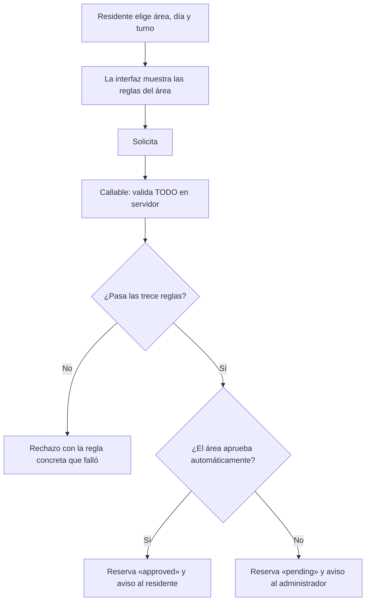

# PRD-V-FIX-001 — Las reglas de reserva se cumplen en el servidor, y la política baja al área

| | |
|---|---|
| **ID** | `PRD-V-FIX-001` (tentativo) |
| **Tipo** | `FIX` — corrección estructural: hoy las reglas de negocio de la reserva **solo se comprueban en el cliente** |
| **Portales** | **`ADMIN`** (alcance) · **`RESIDENTE`** (alcance) · `PORTERIA` (afectado: ve las reservas) · `SUPERADMIN` (no afectado) |
| **Módulo** | Reservas |
| **Usuario principal** | `resident` · `tenant_admin` |
| **Responsable** | David |
| **Estado** | ✅ **ENTREGA 1.1 EN PRODUCCIÓN** desde el 12 sep 2026 (05:33–05:40 UTC: functions, front `build-2026-09-12-005` desde `a7353ec`, reglas `5da48636`), después de verificarla en staging con las cuatro pruebas de §16, en pantalla y en los datos: arregla cuatro defectos de la entrega 1. 🟡 **La entrega 2, EN STAGING** desde el 12 sep (functions 06:02Z, front `build-2026-09-12-013` desde `5d38ed0`, reglas `047a0164`) y verificada en vivo (§17); a producción cuando David mire el formulario del administrador. **La entrega 1:** 🟢 **CONSTRUIDA Y EN PRODUCCIÓN**, con la bandera `producto-reservas-servidor` **encendida** en `hogaru-1` (leída el 3 de septiembre de 2026). D1 la cerró David el 21 de agosto de 2026: la corrección se desplegó sola, antes que la política por área. **Criterios repasados el 12 sep contra código y datos: `CA11` no se cumplía** (§16). |
| **Dependencias** | Ninguna |
| **Riesgo** | **Medio.** Cambia por dónde se crea una reserva, que hoy funciona |
| **Reversibilidad** | **Parcial.** La escritura directa desde el cliente se cierra en las reglas y eso **no se revierte con una bandera** (§13) |
| **Fase comercial** | Reservas es `libre` durante la prueba |

---

## 1. Resumen ejecutivo

Vivaru **ya tiene** compuerta de morosos en reservas —y más fina que la de la competencia,
porque admite **exención por unidad**—. El problema es dónde vive: `checkReservationEligibility`
(`src/features/reservations/eligibility.ts`) **se ejecuta en el navegador**, la reserva se
escribe **directo desde el cliente**, y `firestore.rules:558` **no comprueba la mora ni ninguno
de los límites del área**.

Un residente en mora, o que ya agotó su cupo del mes, **puede crear la reserva saltándose la
interfaz**.

Esta PRD mueve el cumplimiento al servidor y, ya que hay que tocarlo, **baja la política al
nivel del área**: no es lo mismo el salón social que el gimnasio.

## 2. Problema y baseline

### Lo que existe, verificado

| Qué | Dónde | Estado |
|---|---|---|
| Compuerta de morosos | `src/features/reservations/eligibility.ts` | **Existe.** Política por conjunto (`reservationPolicy.blockOnDebt`) + **exención por unidad** (`reservationExempt`) + saldo vencido |
| Configuración del área | `AmenityItem` en `src/features/admin/services.ts:174` | Horario, duración de turno, días disponibles, aforo por turno, duración máxima, **cupo por unidad al mes**, reglas de uso |
| Dónde se llama la compuerta | `use-reservations.ts:150` y `resident/reservations/page.tsx:194` | **En el cliente** |
| Cómo se crea la reserva | Escritura directa a `reservations` | **Desde el cliente** |
| Qué valida la regla | `firestore.rules:558-568` | Conjunto operable · residente de **su** unidad · `createdBy` coincide · el área es reservable y del conjunto · el nombre del área coincide · `startAt` con **30 minutos** de margen |

### El hueco, dicho con precisión

**La regla valida quién y dónde. No valida cuánto, cuándo ni si debe.**

Quedan **solo en el cliente**: la compuerta de morosos, el cupo mensual por unidad, el aforo por
turno, los días disponibles, el horario de operación, la duración máxima y el solapamiento con
otra reserva.

**Lo que el hueco NO permite**, porque las reglas sí lo cubren: reservar para otra unidad,
reservar en otro conjunto, reservar un área inactiva, o reservar dentro de los próximos 30
minutos. **La gravedad es de regla de negocio, no de exposición de datos** — y aun así, un
moroso que reserva el salón social es exactamente el problema que la funcionalidad existía para
evitar.

### Por qué no se puede arreglar solo en las reglas

Las reglas de Firestore **no pueden contar documentos**. El cupo mensual por unidad, el aforo por
turno y el solapamiento **requieren consultar las reservas existentes**, y eso una regla no lo
hace. **La corrección obliga a mover la creación a una callable.**

### Baseline

| Indicador | Hoy |
|---|---|
| Reglas de reserva verificadas en servidor | **6 de 13** |
| Áreas con política propia de morosidad | **0** — la política es del conjunto entero |
| Margen de anticipación configurable | **No.** 30 minutos fijos en la regla |

**Métrica de éxito:** que **ninguna** regla de reserva pueda saltarse desde fuera de la
interfaz, verificado con una escritura directa contra la base.

## 3. Usuarios, roles y permisos

| Rol | Ve | Puede | **NO puede** |
|---|---|---|---|
| `resident` | Las áreas reservables y sus reglas; sus reservas | Crear y cancelar **las suyas** | Crear si está en mora y el área lo bloquea. Superar su cupo, el aforo, el horario o los días. Solapar. **Saltarse nada de esto escribiendo directo** |
| `tenant_admin` | Todas las reservas del conjunto y la configuración de cada área | Crear a nombre de cualquier unidad; aprobar y rechazar; configurar la política por área; **exceptuar una unidad** | Configurar un área de otro conjunto. Operar si está `suspended` o `expired` |
| `security_guard` | Las reservas del día | Consultarlas | Crear, aprobar ni cancelar |
| `committee` | Las reservas y la configuración | Consultar | Configurar |
| `superadmin` | Todo | Todo | — |

> **Nota de portafolio — 21 ago 2026.** Lo que esta PRD asigna al rol `committee` **hoy no es
> alcanzable**: `canAccessPath` (`src/lib/auth/routing.ts:28`) lo deja **solo en
> `/admin/documents`**. A nivel de reglas **sí puede leer** —es miembro del conjunto— así que
> **el bloqueo es de navegación, no de permisos**. Ampliar su alcance merece **PRD propia**:
> decidir qué pantallas ve y comprobar que las reglas no le abran datos personales por el
> camino. **Hasta entonces, las filas de `committee` de esta tabla son intención declarada, no
> capacidad disponible.**

**El administrador puede crear saltándose la mora**, y es correcto: hay excepciones legítimas y
él responde de ellas. **Queda registrado quién la creó.**

## 4. Objetivo, alcance y exclusiones

### Entra

1. **Creación de reservas por callable**, con todas las reglas verificadas en servidor.
2. **Cierre de la escritura directa** de `reservations` desde el cliente para el residente.
3. **Política de morosidad por área**, además de la del conjunto.
4. **Margen de anticipación configurable por área**, sustituyendo los 30 minutos fijos.
5. **Aprobación automática por área**: qué áreas necesitan visto bueno y cuáles no.
6. Mensajes de rechazo que **dicen cuál regla se incumplió**.
7. Verificación de **solapamiento** en servidor.

### No entra, y por qué

| Excluido | Por qué |
|---|---|
| **Valor por reserva** | **Vivaru no tiene pasarela de pago.** Cobrar por reservar sin gateway es prometer lo que no existe |
| **Garantía o depósito general** | Existe **solo para mudanzas** (`Reservation.mudanza.depositAmount`) y ahí funciona. Generalizarlo depende del punto anterior |
| **Compuerta de no residentes** | En Vivaru **solo reservan residentes**: la regla ya exige `residentOwnUnit`. **No es un hueco, es un caso que no existe** |
| **Reglas del área como PDF firmable** | Hoy son texto (`usageRules`) y basta. Backlog |
| **Cambiar el flujo de aprobación** | Los estados `pending → approved / rejected / cancelled` funcionan. Solo se añade **quién puede saltarse la aprobación** |

## 5. Flujo funcional

### Las trece reglas, y dónde se verifican hoy

| # | Regla | Hoy | Después |
|---|---|---|---|
| 1 | El área existe y es del conjunto | Regla | Servidor |
| 2 | El área está activa y es reservable | Regla | Servidor |
| 3 | El residente pertenece a la unidad | Regla | Servidor |
| 4 | `createdBy` es quien llama | Regla | Servidor |
| 5 | El nombre del área coincide | Regla | Servidor |
| 6 | Margen mínimo de anticipación | Regla (**30 min fijos**) | Servidor (**por área**) |
| 7 | El conjunto está operable | Regla | Servidor |
| 8 | **La unidad no está en mora** | **Cliente** | **Servidor** |
| 9 | **Cupo mensual de la unidad** | **Cliente** | **Servidor** |
| 10 | **Aforo del turno** | **Cliente** | **Servidor** |
| 11 | **Día disponible** | **Cliente** | **Servidor** |
| 12 | **Dentro del horario y la duración máxima** | **Cliente** | **Servidor** |
| 13 | **No solapa con otra reserva** | **Cliente** | **Servidor** |

### Casos límite

| Caso | Comportamiento |
|---|---|
| Unidad exenta (`reservationExempt`) | Se salta la 8, como hoy. **La exención se conserva tal cual** |
| Área con morosidad permitida y conjunto que la bloquea | **Manda el área**: es la regla más específica. Se declara en R3 |
| Área sin política propia | Hereda la del conjunto |
| Dos residentes piden el mismo turno a la vez | **Gana el primero en la transacción**; el segundo recibe rechazo por aforo |
| El administrador crea para una unidad en mora | Permitido, **registrado**, y el residente recibe su aviso normal |
| Conjunto `suspended` / `expired` | No se crean reservas. Las existentes se consultan |
| Reserva de tipo `mudanza` | Sigue su camino actual, con su depósito. **No se toca** |

## 6. Estados y transiciones

**Sin cambios.** `pending → approved | rejected | cancelled`, con `cancelledAt` y
`cancellationReason` que ya existen en `Reservation`.

Lo único nuevo: **una reserva puede nacer en `approved`** si el área aprueba automáticamente. El
estado `pending` deja de ser obligatorio en el camino.

## 7. Contrato de datos y multi-tenancy

### 7.1 Campos nuevos en `amenities`

| Campo | Tipo | Nota |
|---|---|---|
| `blockOnDebt` | `boolean \| null` | `null` = hereda la política del conjunto |
| `minAdvanceMinutes` | `number` | Sustituye los 30 fijos. **Por defecto 30**, para no cambiar el comportamiento actual |
| `autoApprove` | `boolean` | Por defecto `false` = comportamiento de hoy |

**Los tres tienen valores por defecto iguales al comportamiento actual.** Ningún conjunto nota
nada hasta que alguien los cambie.

### 7.2 Lo que no cambia

`Reservation`, `AmenityItem` en el resto de sus campos, `reservationExempt` de la unidad y
`tenantSettings.reservationPolicy.blockOnDebt` **se conservan**. Esta PRD **no migra nada**.

### 7.3 Multi-tenancy, ciclo de vida y retención

- `reservations` y `amenities` llevan **`tenantId`**; toda consulta lo filtra.
- **`suspended` / `expired`** → solo lectura, por `tenantOperable`, ahora comprobado también en
  la callable.
- **`trial`** → Reservas es `libre`. **Sin cambios.**
- **Retención:** sin datos nuevos. Una reserva nombra unidad y residente, y sigue la política
  vigente.

## 8. Reglas de negocio

| # | Regla |
|---|---|
| **R1** | **Toda** regla de reserva se verifica en el servidor. Ninguna queda solo en el cliente |
| **R2** | El cliente **no puede escribir** en `reservations` como residente. Solo la callable |
| **R3** | Si el área define `blockOnDebt`, **manda el área**; si es `null`, hereda del conjunto |
| **R4** | `reservationExempt` de la unidad **sigue saltándose** la comprobación de mora, venga de donde venga |
| **R5** | El margen de anticipación es el del área; por defecto **30 minutos**, que es el de hoy |
| **R6** | Un área con `autoApprove` crea la reserva ya aprobada; el resto nacen `pending` |
| **R7** | El rechazo **nombra la regla incumplida**. «No se puede reservar» sin motivo no es aceptable |
| **R8** | El administrador puede crear saltándose 8, 9 y 10; **queda registrado quién lo hizo** |
| **R9** | La verificación de aforo y solapamiento ocurre **dentro de la transacción** que crea la reserva |

**R9 es la que evita la doble reserva.** Comprobar antes de escribir, fuera de la transacción,
deja una ventana que dos peticiones simultáneas atraviesan.

## 9. Notificaciones y correo

**No se crean claves nuevas.** Se reutiliza `reservation_rejected`, que ya está en el catálogo.

**Un cambio de contenido:** el rechazo automático dice **qué regla se incumplió** (R7). Hoy, un
residente rechazado por cupo no sabe que tiene cupo.

## 10. Criterios de aceptación

### Deben pasar

| # | Criterio |
|---|---|
| CA1 | Un residente al día reserva con normalidad |
| CA2 | Un residente en mora es rechazado **con el importe que debe** |
| CA3 | Una unidad exenta reserva aunque deba |
| CA4 | Un área con `blockOnDebt: false` **permite reservar a un moroso** aunque el conjunto lo bloquee |
| CA5 | Un área con `autoApprove` crea la reserva ya aprobada |
| CA6 | Superar el cupo mensual es rechazado **nombrando el cupo** |
| CA7 | Reservar fuera del horario del área es rechazado nombrando el horario |
| CA8 | Dos peticiones simultáneas al mismo turno: **una entra, la otra es rechazada por aforo** |
| CA9 | El administrador crea para una unidad en mora y queda registrado |
| CA10 | Un área sin configurar se comporta **exactamente como hoy**: 30 minutos, sin autoaprobación, hereda la política del conjunto |
| CA11 | La mudanza sigue funcionando igual |

### Deben fallar

| # | Criterio |
|---|---|
| CF1 | **Escribir una reserva directamente en la base como residente → denegado por reglas.** Es el criterio central de esta PRD |
| CF2 | Llamar a la callable con la unidad de otro residente → **denegado** |
| CF3 | Llamar con un área de otro conjunto → **denegado** |
| CF4 | Reservar dentro del margen mínimo → **rechazado** |
| CF5 | Reservar en un día no disponible → **rechazado** |
| CF6 | Solapar con una reserva propia existente → **rechazado** |
| CF7 | Un guarda crea una reserva → **denegado** |
| CF8 | Crear en un conjunto `suspended` → **denegado** |
| CF9 | Configurar un área de otro conjunto → **denegado** |

**CF1 es el que prueba que el defecto está cerrado.** Se ejecuta con el SDK contra la base, no
desde la interfaz.

## 11. Arquitectura y dependencias

### 11.1 Cliente directo o callable

| Operación | Decisión | Por qué |
|---|---|---|
| **Crear una reserva** | **Callable.** Cambia respecto de hoy | Seis de las trece reglas **exigen contar reservas existentes**, y una regla de Firestore no puede contar. Además, aforo y solapamiento deben verificarse **dentro de la transacción** (R9) |
| **Cancelar la propia** | **Cliente directo** | Las reglas pueden protegerlo por completo: es el propio residente sobre su propia reserva |
| **Aprobar y rechazar** | **Cliente directo** | Ya lo es, y `tenantAdminOrSuper` lo cubre |
| **Configurar el área** | **Cliente directo** | CRUD sobre `amenities`, protegido por las reglas |

**Es exactamente la frontera que la guía describe:** escritura directa cuando las reglas pueden
proteger del todo; callable cuando hay lógica que el cliente no debe poder falsificar. **Aquí
estaba mal puesta.**

### 11.2 Reglas de Firestore

El cambio principal: **retirar del bloque `create` de `reservations` la rama del residente**
(`firestore.rules:560-567`). Tras el cambio, un residente **no puede crear** desde el cliente; el
administrador sí conserva su rama.

Las validaciones que hoy hace la regla **no se borran**: se replican en la callable, porque
seguirán siendo ciertas y son baratas de comprobar.

### 11.3 Índices, jobs y banderas

- **Índices:** `reservations` por `tenantId` + `amenityId` + `startAt` (aforo y solapamiento) y
  por `tenantId` + `unitId` + `startAt` (cupo mensual).
- **Jobs:** ninguno.
- **Bandera:** `reservations-server-side`, que gobierna **si la interfaz usa la callable**. **No
  gobierna el cierre de la regla**, que va después y sin vuelta atrás (§13).

## 12. Riesgos y mitigaciones

| Riesgo | Señal | Mitigación |
|---|---|---|
| **Se cierra la regla antes de que la interfaz use la callable y nadie puede reservar** | Reservas a cero | **Orden de despliegue de §13**: la callable primero, la regla al final, con verificación entre medias |
| Doble reserva del mismo turno | Dos aprobadas solapadas | R9: aforo dentro de la transacción; CA8 |
| Un conjunto nota un cambio que no pidió | Consulta | §7.1: los tres campos nuevos tienen por defecto el comportamiento actual; CA10 |
| Mensajes de rechazo que filtran información de otras unidades | Privacidad | El rechazo nombra **la regla**, nunca quién ocupa el turno |
| Se duplica la lógica entre cliente y servidor y divergen | Rechazos incoherentes | La interfaz **muestra** las reglas; **solo el servidor decide**. Si discrepan, manda el servidor |
| Coste | — | **Nulo** |

## 13. Despliegue, rollback y Story Map

### El orden importa más que en ninguna otra PRD de este lote

1. **Functions** — la callable, con todas las reglas. **Nadie la usa todavía.**
2. **Front** — la interfaz pasa a usarla, detrás de `reservations-server-side`. La escritura
   directa **sigue permitida**: nada se rompe.
3. **Verificación** — con la bandera encendida en todos los conjuntos, comprobar que **ninguna
   reserva se crea ya por escritura directa**.
4. **Reglas** — **solo entonces** se retira la rama del residente.

**Invertir 4 y 2 deja a todos los residentes sin poder reservar.** Por eso el paso 3 es una
puerta, no un trámite.

### Rollback

| Parte | Reversible |
|---|---|
| La callable | Sí: apagar la bandera devuelve a la escritura directa |
| Los tres campos del área | Sí: sus valores por defecto son el comportamiento de hoy |
| **El cierre de la regla** | **No con bandera.** Requiere volver a desplegar las reglas anteriores |

### Validación

| Dónde | Qué |
|---|---|
| **Staging** | Las trece reglas, una a una, **y CF1 ejecutado con el SDK contra la base** |
| **Producción** | El paso 3: que no queden reservas creadas por escritura directa antes de cerrar la regla |

### Story Map

**MVP** — callable con las trece reglas · mensajes de rechazo con motivo · cierre de la regla ·
`minAdvanceMinutes` por área.

**Fase 2** — `blockOnDebt` y `autoApprove` por área · panel de configuración por área.

**Fase 3** — valor y garantía por reserva, **cuando exista pasarela de pago**.

## 14. Decisiones abiertas

### D1 · ¿Se corrige el defecto sin esperar al resto?

El cierre del hueco (pasos 1 a 4) **no necesita** la política por área ni la autoaprobación.

**Recomendación: sí, partirlo.** Desplegar primero el cumplimiento en servidor, con el
comportamiento **idéntico** al de hoy, y dejar la política por área para una segunda entrega.
**Corregir un agujero y añadir funcionalidad en el mismo despliegue hace imposible saber cuál de
los dos rompió algo.**

> **CERRADA el 21 ago 2026 — aceptada.** **Entrega 1:** cumplimiento en servidor con
> comportamiento idéntico al de hoy. **Entrega 2:** `blockOnDebt` y `autoApprove` por área.
> Nunca en el mismo despliegue.

**Ninguna decisión abierta.**

## 15. Puertas

| Puerta | Estado |
|---|---|
| **G0 Necesidad** | ✅ Verificado con archivo y línea: la compuerta vive en el cliente y la regla no la comprueba |
| **G1 Valor** | ✅ Baseline en §2: 6 de 13 reglas verificadas en servidor |
| **G2 Datos y permisos** | ✅ Definidos. **El cambio de permisos es el objetivo de la PRD** |
| **G3 Riesgo** | ✅ Orden de despliegue con puerta de verificación, y campos con valores por defecto iguales a hoy |
| **G4 Aceptación** | ✅ 11 que pasan, 9 que deben fallar, **con CF1 ejecutado contra la base** |
| **G5 Operación** | ✅ Lo opera quien ya opera las reservas. **No añade trabajo diario** |
| **G6 Escala** | ✅ Dos consultas acotadas por reserva creada |

**Lista para desarrollo**, partida en dos entregas por D1. **La primera es una corrección de
seguridad de regla de negocio y no cambia nada de lo que el usuario ve.**

## 16. Entrega 1.1 — lo que la entrega 1 dejó roto (12 sep 2026)

Al empezar la entrega 2 se midió la 1 contra el código y los datos de los dos ambientes, y tenía
**cuatro defectos**. **Decisiones de David (12 sep):** primero el arreglo, **desplegado solo** —es
D1: nunca arreglo y novedad en el mismo despliegue—; y la zona horaria **sale del país del conjunto,
solo en reservas**. El «vencido» de la cartera sigue en UTC hasta que él decida.

| # | Defecto | Evidencia | Arreglo |
|---|---|---|---|
| 1 | La hora elegida se leía en la zona del servidor, **UTC** | En producción, Santa María reservó el 21 sep a las 08:30 y se guardó `startAt = 08:30Z`: las 08:30 de Bogotá son las 13:30Z. La antelación rechazaba reservas del mismo día a menos de ~5,5 h (Colombia) o ~6,5 h (México). Nunca dejaba pasar de más | `instanteEnZona` con `zonaDelConjunto(country)` (`functions/src/zona-del-conjunto.ts`). El día de la semana sale de la FECHA: las 20:00 de un sábado en México ya son domingo en UTC |
| 2 | **`CA11` no se cumplía**: la mudanza del residente se creaba con `addDoc`, y el paso 4 le cerró la puerta el 24 ago | El `create` de `reservations` solo admite al administrador y no tiene rama de mudanza. **Cero mudanzas en la historia de los dos ambientes**: nadie lo vio | Callable `createMudanzaRequest`, con el mismo documento de siempre (`construirMudanza`). Comparte `autorizarReserva` con `createReservationRequest` |
| 3 | Las reservas del administrador **no llevaban `amenityId`**: el servidor cuenta aforo y cupo por ese campo y no las veía, así que un residente podía reservar encima | `createReservation` escribía el formulario, que va por `amenityName` | La página lo resuelve (`amenityIdPorNombre`; medido: ningún conjunto repite nombre de área) y **la regla lo exige** |
| 4 | Mover una reserva de fecha u hora **nunca funcionó** | Los helpers de fecha de las reglas (`pad2`, `timestampDateKey`, `timestampTimeKey`) suman texto y número, y la evaluación fallaba SIEMPRE: el emulador lo dice, `string + int`. Además comparaban en UTC | `reservaConAntelacion`, con helpers propios que usan `string()` y el desfase fijo del país (Colombia y Ecuador −5, México −6, sin país México) |

Y dos **espejos del cliente** que no casaban con el servidor: la exención se buscaba por el campo
`unitId` —ahora por el doc id, con caída al campo— y el contador del cupo mensual consultaba una
subcolección que no existe —ahora cuenta en `reservations`, con el mes de la fecha elegida—.

**Pruebas:** 23 del servidor, 11 del cliente y 4 de reglas, **falsadas con 10 mutaciones** (6 del
servidor y 4 de reglas), cada una enrojeciendo exactamente la suya. Bancos: app **2050** · functions
**992** · reglas **490** (`storage.rules.test.ts` aparte, por entorno).

**Queda fuera, y es de David:**

- **Las visitas.** Los mismos helpers rotos gobiernan `visitorAuthorizations`: el administrador no
  puede cambiar la fecha u hora de una autorización, y la rama del residente —que el cliente no
  usa— tampoco llegaría a evaluar. Arreglarlo es corregir esos tres helpers; no se hizo porque la
  decisión fue «solo reservas».
- **Cuatro conjuntos de producción sin `country`** (Santa María, Bromelias, Privada Las Playas y
  Tenant E2E) y uno en staging (Santa María) caen en la zona de México. **Santa María es
  colombiana**: una hora de diferencia hasta que tenga su país. Ponérselo es escribir en
  producción: con permiso, uno a uno.
- **`minAdvanceMinutes` por área** figuraba en el MVP y no se construyó: va con la entrega 2.
- **En el historial del residente, las reservas creadas por el administrador salen sin nombre de área**: guardan
  `amenityName` pero no `amenity`. Ya pasaba con las antiguas; no es de esta entrega.

**Verificación (12 sep 2026).** En staging —functions 04:36Z, front `build-2026-09-12-010`, reglas
`6aa1d3ba`— las cuatro pruebas las ejecutó Claude en el Chrome de David, con sus sesiones, y se comprobaron
en los datos. **La primera revisión no dejó ningún rastro en la base**: ni reservas nuevas ni llamadas a las
callables; se detectó antes de subir, y por eso se repitió así.

| Prueba | Resultado | Documento |
|---|---|---|
| El administrador crea una reserva | Nace con `amenityId = amenity-playas-gym` | `4Mk1AvAePP9bqGZafbH2` |
| El administrador la mueve a las 00:30 | Se guarda. Con las reglas de antes se denegaba siempre, y en UTC también | el mismo |
| El residente pide una mudanza con 1 h 7 min de antelación | Entra por la callable con el documento de siempre y `startAt = 06:30Z` | `HX1NBG192dnsBtUcAiev` |
| El residente reserva el Gimnasio con 6 h 28 min de antelación | Entra con `startAt = 12:00Z`; el código de antes la rechazaba por «anticipación» | `cgu0ugGzpPWR0aRjgRGa` |

La mudanza y el Gimnasio de prueba se cancelaron; la reserva del administrador queda pendiente en staging,
marcada «Prueba FIX-001 1.1 (Claude)». **Producción, en orden functions → front → reglas:** functions 05:33Z
(`createMudanzaRequest` invocable por `allUsers`), front `build-2026-09-12-005` desde `a7353ec` por su
rollout automático, esperado por nombre, y reglas `5da48636` a las 05:39Z, idénticas al repo. En producción
no se creó ningún dato de prueba.

## 17. Entrega 2 — la política baja al área (12 sep 2026)

Tres campos en `amenities`, **con valores por defecto iguales a lo de hoy**: un área sin configurar no
cambia nada (`CA10`).

| Campo | Qué hace | Sin él |
|---|---|---|
| `blockOnDebt` | `true` bloquea a las unidades en mora en ESA área; `false` las deja reservar aunque el conjunto las bloquee (`CA4`). La exención de la unidad sigue mandando (R4) | Hereda `tenantSettings.reservationPolicy.blockOnDebt` (R3) |
| `minAdvanceMinutes` | Margen mínimo del área: un entero de 0 a 10 080 (una semana). El rechazo nombra los minutos (R7) | 30, los de hoy (R5) |
| `autoApprove` | La reserva nace `approved` y el residente recibe «Reserva aprobada» (R6, `CA5`) | Nace `pending`, como hoy |

**Dónde se ve.**
- **El administrador** los configura al crear y al editar cada área, en «Aprobación y morosos».
- **El residente** ve en la ficha del área la anticipación y si se aprueba al instante. El aviso de
  mora sigue la política del área elegida, y la antelación del formulario es la del área.
- **Decide el servidor** (`crearReserva`); la interfaz solo la muestra (§12).

**El aviso.** Una reserva que NACE aprobada no pasa por `onReservationUpdated`, que solo avisa cuando
cambia el estado, así que `onReservationCreated` le añade al residente el «Reserva aprobada» cuando la
reserva lleva `autoApproved`. Si el administrador crea una reserva ya aprobada, no hay aviso, como hoy.

**`CF9` no se cumplía, y se cerró aquí.** La regla de `update` de `amenities` solo miraba el `tenantId`
nuevo, así que un administrador podía quedarse el área de otro conjunto reescribiéndolo. Se reprodujo
en el emulador: la prueba de `CF9` salió en rojo, y el cambio llegó a contaminar la prueba del guarda
que venía después. Ahora el `update` usa el conjunto de antes y no deja cambiarlo. **El mismo patrón
aparece en otros 19 bloques de las reglas**: queda fuera de esta ficha y está propuesto como tarea
aparte.

**Las reglas validan los tipos** de los tres campos: `blockOnDebt` booleano o null, `autoApprove`
booleano y `minAdvanceMinutes` entero de 0 a 10 080. Los escribe el cliente (§11.1) y el servidor los
lee para decidir.

**Pruebas:** 19 del servidor, 16 del cliente y 4 de reglas, **falsadas con 13 mutaciones** (6 del
servidor, 4 del cliente y 3 de reglas). Una de ellas destapó que la prueba T9 de elegibilidad pasaba
en verde por el motivo equivocado: usaba el `getDoc` que T8 había dejado sin consumir. Se corrigió la
limpieza entre pruebas.

**Verificación en staging (12 sep 2026).**
- **Despliegue:** functions a las 06:02Z, front `build-2026-09-12-013` desde `5d38ed0`, y reglas `047a0164`,
  idénticas al repo.
- **Qué se probó:** el Gimnasio de Las Playas, configurado con 120 minutos de antelación y aprobación al
  instante.
- **Qué se vio:**
  - la ficha del residente mostró «Anticipación mínima: 120 min» y «Se aprueba al instante»;
  - la reserva del día siguiente a las 06:00 salió con el aviso «Reserva aprobada.»;
  - en los datos nació `approved` con `autoApproved` (`mMZQbbCFaKNySTxEwWUY`, `startAt` 12:00Z);
  - el residente recibió del disparador el aviso «Reserva aprobada».
- **Limpieza:** la reserva de prueba se canceló y el Gimnasio volvió a su configuración.

**Falta que David mire el formulario del administrador** («Aprobación y morosos»), porque pide su sesión.
La mora por área no se probó en vivo: en staging no hay ninguna unidad con cargos vencidos, y no se
fabricaron. La cubren las pruebas del servidor y del cliente.
