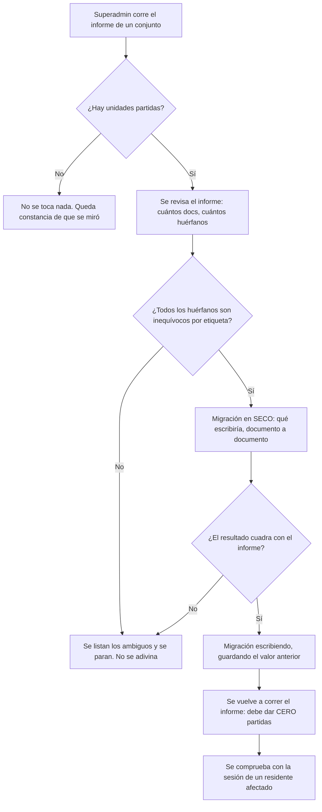

# PRD-V-FIX-002 — Una sola clave de unidad

| | |
|---|---|
| **ID** | `PRD-V-FIX-002` (tentativo hasta registrarlo en `docs/prd/README.md`) |
| **Tipo** | `FIX` — corrección estructural: el dato que ata a una persona con su unidad está partido en dos convenciones |
| **Portales** | **`ADMIN`** (alcance) · **`RESIDENTE`** (alcance) · **`PORTERIA`** (alcance: paquetes y visitantes) · `SUPERADMIN` (opera la migración) |
| **Módulo** | Plataforma · Identidad de la unidad. Atraviesa Cartera, Finanzas, Reservas, Paquetería, Visitantes, Comité y Notificaciones |
| **Usuario principal** | `resident` — es quien deja de ver lo suyo |
| **Usuarios secundarios** | `tenant_admin` · `security_guard` · `superadmin` |
| **Responsable** | David |
| **Estado** | **MVP CERRADO EN LOS DOS AMBIENTES** (26 ago 2026): cero fuera de convención en los diecinueve conjuntos, 250 documentos migrados. Quedan los huérfanos de `tenant-santa-maria` (decisión, §17) y **desplegar la semilla corregida a producción**, que va en el lote de `FLOW-001`/`FEAT-004`. Ver §16 y §17 |
| **Dependencias** | Ninguna bloqueante. **Bloquea** cualquier funcionalidad nueva que resuelva persona↔unidad, y ya condicionó a `PRD-V-FEAT-004` |
| **Riesgo** | **Alto.** Toca la raíz de los permisos del residente y reescribe el campo del que cuelgan quince colecciones |
| **Reversibilidad** | **Parcial, y hay que decirlo en primera línea.** La migración es reversible **solo si se guarda el valor anterior en cada documento tocado**; sin eso, no hay vuelta atrás. Ver §13 |
| **Fase comercial** | Aplica a todos los planes. **Los conjuntos nacidos del trial son los más afectados**: su semilla es la que escribe la convención minoritaria |

---

## 1. Resumen ejecutivo

El campo que ata una persona con su unidad —`unitId`— **está escrito de dos formas distintas**
en los mismos conjuntos: el id del documento de la unidad y el campo `unitId` de ese documento,
que es un slug. La regla `residentOwnUnit` compara una sola de las dos, así que **todo documento
escrito con la otra queda fuera del alcance de su propio dueño**, sin error: como una lista vacía.

No es una deriva accidental. **Fueron dos migraciones en direcciones opuestas y ninguna
terminó**: `IMP-01` movió la cartera al slug, `scripts/migrate-people-unit-ids.ts` movió personas
y usuarios al slug, y el código más reciente —la corrida por coeficiente, el prorrateo— escribe el
id del documento.

Esta PRD elige una convención, migra el dato que quedó del otro lado, y pone la guarda que impide
que vuelva a partirse.

## 2. Problema y baseline

### Lo que existe hoy, medido el 25 de agosto de 2026

**No es un supuesto: son cuentas sobre las dos bases reales.**

| Medida | Producción (`hogaru-1`) | Staging (`vivaru-staging-02`) |
|---|---|---|
| Unidades | 88, de las cuales **34 tienen el id distinto del campo `unitId`** | — |
| `billingStatements` | 221 — **197** por id, **19** por campo, **5 huérfanos** | 171 — 138 / 32 / 1 |
| Conjuntos con **las dos** convenciones a la vez | **3**: `tenant-santa-maria` (96/3), `queretarock-229-fc4c57` (16/8), `residencial-qintilab-mx-9c1293` (16/8) | 4 |
| `people` | 58 por id, **10 por campo** | — |
| `packages` | 42 por id, **12 huérfanos** | — |
| `visitorPasses` | 83 por id, **3 huérfanos** | — |
| `tenantUsers` con `unitId` | 20 — 18 por id, **1 por campo, 1 huérfano** | — |

**El caso que mejor lo explica.** En `tenant-santa-maria`, la unidad `u-t1-101` tiene su cartera
partida en dos claves: `u-t1-101` (4 cargos, **3.360.000**) y `unit-t1-101` (5 cargos,
**3.580.000**), y esta última **no existe como unidad**. La deuda real de T1-101 es **6.940.000** y
cualquier consulta por clave enseña menos de la mitad.

### El costo, dicho sin adornos

| Indicador | Hoy |
|---|---|
| Residentes que ven su cartera completa | **No se puede afirmar.** En los tres conjuntos mixtos, no |
| Deuda invisible en producción | **3.580.000** solo en T1-101, bajo una clave que no casa con nada |
| Errores que el producto muestra al ocurrir esto | **Ninguno.** Se manifiesta como lista vacía o total corto |
| Sitios de código que asumen una sola convención | **35**, verificados uno a uno con refutación adversarial (25 ago 2026) |

**Métrica de éxito:** que para toda unidad de todo conjunto, el número de documentos que la
nombran sea el mismo mirando por cualquiera de sus claves — es decir, que solo quede una. Y que
la deuda total por conjunto medida por unidad coincida con la medida sin agrupar.

### Por qué no se ve

`residentOwnUnit` (`firestore.rules:27`) compara `membershipDoc(tenantId).data.unitId == unitId`.
Una consulta que no casa **no falla: devuelve vacío**. Las reglas rechazan, no filtran — así que el
residente ve cero cargos, cero paquetes o cero reservas y el producto no tiene nada que reportar.
Es el mismo patrón que el 24 de agosto de 2026 dejó a un residente viendo «Sin documentos»
teniendo ocho.

## 3. Usuarios, roles y permisos

| Rol | Ve | Puede | **NO puede** |
|---|---|---|---|
| `resident` | Lo suyo, y hoy **a veces solo una parte** | Nada nuevo: esta PRD le devuelve lo que ya debía ver | Cambiar su propia unidad. Ver la de otro — **ni siquiera durante la migración** |
| `tenant_admin` | Un informe de las unidades partidas de su conjunto | Consultarlo | **Ejecutar la migración.** Reescribir `unitId` a mano en ningún documento |
| `security_guard` | Paquetes y visitantes, hoy incompletos | Nada nuevo | Nada nuevo |
| `superadmin` | Todo | **Ejecutar la migración**, por conjunto y en seco antes de escribir | Ejecutarla sin haber guardado el valor anterior (§13) |

> **La migración NO es una funcionalidad del producto.** Es una operación de superadmin con
> script, y por eso no aparece en la barra de nadie. Ponerla en la consola del administrador
> daría a un tercero un botón que reescribe la identidad de sus unidades.

## 4. Objetivo, alcance y exclusiones

**Objetivo.** Que exista **una sola** forma de nombrar una unidad, que todo documento la use, y
que el producto no pueda volver a escribir la otra.

### Entra

1. **Decidir la convención ganadora** (§14 D1) y dejarla escrita en un solo sitio del código.
2. **Un informe, antes de tocar nada**: por conjunto y unidad, cuántos documentos hay de cada
   convención y cuántos huérfanos, en las **once colecciones** que llevan `unitId`.
3. **La migración**, por conjunto, en seco por defecto, **guardando el valor anterior**.
4. **La guarda**: un único resolvedor de clave de unidad que usen todas las escrituras nuevas.
5. **Los huérfanos**: reasignarlos por etiqueta cuando sea inequívoco, y **dejarlos listados
   cuando no lo sea**. No se adivinan.
6. Corregir los **35 sitios de lectura** identificados, o retirarlos si la migración los hace
   innecesarios.

### No entra, y por qué

| Excluido | Por qué |
|---|---|
| **Cambiar el id de documento de las unidades** | Es la identidad de la fila. Renombrarla arrastra todo lo que la referencia y no arregla nada que no arregle unificar el campo |
| **Unificar `unitLabel`** | Es texto que el administrador edita; no es clave y no debe serlo |
| **Retirar `residentOwnUnit`** | La regla es correcta: lo que está mal es el dato que compara. Cambiar la regla para aceptar dos claves **empeora**: convierte una pérdida silenciosa en `permission-denied` de la consulta entera |
| **Migrar Storage** | Los comprobantes cuelgan del uid de quien sube, no de la unidad. Verificado en `storage.rules` |
| **Arreglar los 35 sitios antes de migrar** | Al revés: con el dato unificado, la mayoría deja de ser un defecto. Arreglarlos primero es escribir código para un problema que se va a borrar |

## 5. Flujo funcional

### 5.1 El camino, que es de operación y no de pantalla

### 5.2 Casos límite

| Caso | Comportamiento |
|---|---|
| Documento con `unitId` que no casa con ninguna unidad, y **una sola** unidad con esa etiqueta | Se reasigna a esa unidad y queda registrado |
| Igual, pero **dos o más** unidades comparten etiqueta en el conjunto | **No se toca.** Se lista para decisión humana |
| Igual, y **ninguna** unidad tiene esa etiqueta | **No se toca.** Es un documento sin dueño y hay que decidir si se archiva |
| Unidad borrada cuyos documentos siguen vivos | Se listan; borrar sus cargos es una decisión de negocio, no de migración |
| Conjunto sin unidades | Se salta, y se dice |
| Conjunto `suspended` o `expired` | **Se migra igual.** El dato está mal esté el conjunto activo o no, y no migrarlo dejaría una bomba para cuando se reactive. Es una excepción explícita a `tenantOperable`, justificada porque no es una operación del cliente sino de la plataforma |
| Conjunto en `trial` | Se migra igual, **y además hay que arreglar su semilla** o volverá a nacer partido |

## 6. Estados y transiciones

**Ni la unidad ni el documento migrado tienen ciclo de vida nuevo.** Lo que sí tiene estado es
**la migración de cada conjunto**, y necesita dueño porque una a medias es peor que ninguna:

| Estado | Qué significa | Quién transiciona | Salida |
|---|---|---|---|
| **`sin revisar`** | Nadie ha corrido el informe | Superadmin | → `limpio` o `partido` |
| **`limpio`** | El informe dio cero unidades partidas y cero huérfanos | Sistema | **Terminal**, hasta que una escritura nueva lo ensucie |
| **`partido`** | Hay documentos de las dos convenciones | Superadmin | → `migrado` o `bloqueado` |
| **`bloqueado`** | Hay huérfanos ambiguos que nadie puede resolver sin decidir | Superadmin | → `migrado`, cuando se resuelvan a mano |
| **`migrado`** | Se escribió y el informe posterior da cero | Superadmin | **Terminal** |

**El estado vive en el informe, no en un documento del producto.** Persistirlo crearía una
segunda verdad que puede discrepar de la realidad — y la realidad se vuelve a medir corriendo el
informe, que es barato.

## 7. Contrato de datos y multi-tenancy

### 7.1 Las once colecciones con `unitId`

> **Corregido al construir (26 ago 2026): son DIECIOCHO, no once.** Este apartado decía «once» y
> enumeraba diecisiete, y le faltaba `clearanceCertificates`, que sí está en `firestore.rules`. La
> cuenta importa: migrar diecisiete deja la que falte fuera del alcance de su dueño. El inventario
> vive ahora en `COLECCIONES_CON_CLAVE_DE_UNIDAD` (`functions/src/clave-de-unidad.ts`) y una prueba
> lo cuenta.

Quince las gobierna `residentOwnUnit`: `billingStatements`, `advances`, `advanceApplications`,
`paymentReceipts`, `paymentVouchers` (como `payerUnitId`), `clearanceCertificates`, `reservations`,
`packages`, `visitorPasses`, `visitorAuthorizations`, `visitorInvitations`, `tickets`,
`survey_responses`, `regulation_signatures` y `committee_agreement_signatures`. Las otras tres son
las de identidad: `people`, `users` y **`tenantUsers`**, que es la que manda.

> **`tenantUsers.unitId` es la raíz.** Es el valor contra el que `residentOwnUnit` compara, así que
> **la migración anterior fue incompleta precisamente por no tocarla**: `scripts/migrate-people-unit-ids.ts`
> corrige `people` y `users` y deja fuera la única que el producto usa para decidir permisos.

### 7.2 Campos nuevos

| Campo | Dónde | Nota |
|---|---|---|
| `unitIdPrevio` | En cada documento migrado | **El valor anterior.** Es lo único que hace reversible la migración; sin él no hay vuelta atrás |
| `unitIdMigradoEn` | Igual | Cuándo. Permite distinguir lo migrado de lo que ya estaba bien |

Los dos son **temporales**: se retiran cuando la migración se dé por cerrada, y esa retirada es
una decisión aparte con su propia fecha.

### 7.3 Multi-tenancy, ciclo de vida y retención

- Todo se filtra por **`tenantId`**; la migración va conjunto a conjunto y nunca global.
- **`suspended` / `expired` / `trial`**: se migran igual. Ver §5.2 y su justificación.
- **Retención:** no crea datos personales nuevos. `unitIdPrevio` es un identificador técnico y
  muere con su documento.

## 8. Reglas de negocio y validaciones

| # | Regla |
|---|---|
| **R1** | Tras la migración, **todo documento de un conjunto nombra su unidad con la convención ganadora**. Cero excepciones |
| **R2** | Un documento cuyo `unitId` no casa con ninguna unidad **solo se reasigna si exactamente una unidad del conjunto tiene su etiqueta**. Con cero o con más de una, se lista y no se toca |
| **R3** | Toda escritura guarda `unitIdPrevio` **antes** de cambiar el valor. Un documento sin `unitIdPrevio` no se ha migrado |
| **R4** | La migración es **idempotente**: correrla dos veces sobre el mismo conjunto no cambia nada la segunda vez |
| **R5** | El informe posterior a migrar **debe dar cero** unidades partidas. Si no, la migración no terminó |
| **R6** | **Ninguna escritura nueva del producto puede fijar `unitId` sin pasar por el resolvedor único.** Es la guarda que impide que vuelva a partirse |
| **R7** | La migración **no crea, no borra y no mueve documentos**. Solo reescribe un campo |
| **R8** | `tenantUsers` se migra **en la misma pasada** que el resto. Migrarla aparte deja al residente sin acceso a lo ya migrado, o al revés |

**R8 es la que evita repetir el error anterior**, y R6 la que evita repetirlo dentro de un mes.

## 9. Notificaciones y correo

**No se notifica a nadie.** La migración corrige un identificador interno; el residente no tiene
que enterarse de que antes veía de menos, y decírselo abriría una conversación sobre datos que ya
estarán bien.

**Excepción a vigilar:** si un residente empieza a ver de golpe cuotas que no veía, **puede
reclamar**. Eso no es un correo del producto: es una nota para el administrador en el informe de
cierre, con las unidades cuya deuda visible aumenta y en cuánto.

## 10. Criterios de aceptación

### Deben pasar

| # | Criterio |
|---|---|
| CA1 | El informe de un conjunto lista, por unidad, cuántos documentos hay de cada convención y cuántos huérfanos, en las once colecciones |
| CA2 | Sobre `tenant-santa-maria`, el informe identifica la unidad `u-t1-101` con **9 cargos en dos claves** y **3.580.000 bajo la que no casa** |
| CA3 | En seco, la migración enseña qué escribiría documento a documento y **no escribe nada** |
| CA4 | Tras migrar, el informe del mismo conjunto da **cero** unidades partidas |
| CA5 | Todo documento migrado conserva `unitIdPrevio` con su valor anterior |
| CA6 | Correrla dos veces deja el mismo resultado y reporta cero cambios la segunda |
| CA7 | Un residente de una unidad afectada ve, tras la migración, **todos** sus cargos — y el total coincide con el de la cartera del administrador |
| CA8 | `tenantUsers` queda migrada en la misma pasada |
| CA9 | Un huérfano con **una sola** unidad de esa etiqueta se reasigna a ella |
| CA10 | La deuda total del conjunto medida por unidad coincide con la medida sin agrupar |

### Deben fallar

| # | Criterio |
|---|---|
| CF1 | Un huérfano con **dos** unidades de la misma etiqueta → **no se toca**, y se lista |
| CF2 | Un huérfano sin ninguna unidad de esa etiqueta → **no se toca**, y se lista |
| CF3 | Ejecutar contra producción sin la bandera explícita de producción → **rechazado** |
| CF4 | Ejecutar escribiendo sin haber corrido el informe → **rechazado** |
| CF5 | Un `tenant_admin` intenta ejecutar la migración → **no existe esa ruta** |
| CF6 | Una escritura nueva del producto fija `unitId` saltándose el resolvedor → **la prueba de guarda falla** |
| CF7 | La migración intenta borrar o crear un documento → **no existe esa ruta** |

## 11. Arquitectura y dependencias

### 11.1 La decisión obligatoria: cliente, callable o script

**Script de superadmin, y no es lo mismo que las otras dos.**

| Opción | Por qué no |
|---|---|
| Escritura directa desde el cliente | Reescribe la identidad de las unidades de un conjunto. Ninguna regla debería permitirlo, y de hecho ninguna lo permite |
| Callable | Una callable tiene tiempo limitado y esto recorre once colecciones de un conjunto entero. Y **no hay usuario que la dispare**: no es una operación del producto |
| **Script con Admin SDK** | Es una operación de plataforma, la corre una persona con las credenciales, en seco por defecto, conjunto a conjunto y con constancia de lo anterior |

Mismo patrón que `sembrar-plan-de-cuentas.mjs` y `preparar-conjunto-para-prorrateo.mjs`, que ya
existen y funcionan así.

### 11.2 La guarda: un resolvedor único

Hoy hay **al menos cuatro sitios** que fijan `unitId` al crear un cargo —`coefficient-billing.ts`,
`expense-distribution.ts`, el alta manual de la cartera y `trial-seed.ts`— y cada uno decide por su
cuenta. R6 exige que todos pasen por una función única, y que exista **una prueba que falle** si
alguien escribe el campo sin ella.

### 11.3 Reglas de Firestore

**Sin cambios, y es deliberado.** `residentOwnUnit` es correcta: compara un valor contra otro. Lo
que estaba mal es que los dos valores vinieran de convenciones distintas.

> **Y ampliar la regla para aceptar las dos sería peor.** Firestore evalúa la consulta contra la
> regla sin ejecutarla: una consulta con `where("unitId","in",[...])` contra una regla que compara
> un solo valor **se rechaza entera**. Se pasaría de ver la mitad a no ver nada.

### 11.4 Índices, jobs y banderas

- **Índices:** ninguno nuevo. La migración lee por `tenantId`.
- **Jobs:** ninguno. Se ejecuta a mano.
- **Bandera:** **ninguna**, y es a propósito. Una migración de datos no se enciende y se apaga: o
  se corrió o no. La bandera protegería código que aquí no existe.

## 12. Riesgos y mitigaciones

| Riesgo | Señal | Mitigación |
|---|---|---|
| **Migrar mal y dejar a un residente sin ver nada** | Reclamos, o el informe posterior no da cero | Seco obligatorio, `unitIdPrevio` en cada documento, y comprobación con una sesión real |
| **Migrar `tenantUsers` en otra pasada** | El residente pierde acceso a lo ya migrado | R8: va en la misma pasada. Es el error exacto de la migración anterior |
| **Reasignar un huérfano a la unidad equivocada** | Una unidad gana deuda que no es suya | R2: solo con etiqueta inequívoca. Con duda, se lista |
| **Que vuelva a partirse** | Un conjunto nuevo nace mixto | R6, el resolvedor único, y arreglar `trial-seed.ts` — que es la fábrica |
| **Un residente ve deuda que antes no veía y reclama** | Llamada al administrador | §9: el informe de cierre lista esas unidades y cuánto sube, para que el administrador lo sepa antes que él |
| **Coste** | — | **Nulo.** Lecturas y escrituras de campo sobre un conjunto |

## 13. Despliegue, rollback y Story Map

### Orden

**Aquí el orden habitual no aplica, porque no hay reglas ni front que desplegar en el MVP.** El
orden es de operación:

1. **El resolvedor único y su prueba de guarda** (R6), desplegado **antes** de migrar. Si se migra
   primero, el producto sigue escribiendo la convención vieja mientras se limpia.
2. **`trial-seed.ts` corregido**, por lo mismo: es la fábrica.
3. **El informe**, sobre los nueve conjuntos, sin escribir.
4. **La migración**, conjunto a conjunto, empezando por uno de staging.
5. Los **35 sitios de lectura**, revisados: con el dato unificado, la mayoría deja de ser defecto.

### Rollback

**Parcial, y hay que saberlo antes de empezar.** Con `unitIdPrevio` guardado, revertir es
reescribir el campo al revés y es una operación simétrica. **Sin `unitIdPrevio`, no hay rollback**:
la convención anterior no se puede reconstruir, porque el valor viejo y el nuevo son ambos
plausibles.

> Por eso R3 no es una comodidad: es la condición que hace ejecutable esta PRD.

### Validación

| Dónde | Qué |
|---|---|
| **Staging** | El informe, el seco, la migración y la idempotencia. Y el residente entrando a ver su cartera |
| **Producción** | **Aquí está el dato que importa** — los 3.580.000 invisibles de `tenant-santa-maria` y las dos membresías desviadas no existen en staging. La validación de producción no es opcional en esta ficha |

### Story Map

**MVP** — informe · migración en seco y escribiendo, con `unitIdPrevio` · `tenantUsers` en la
misma pasada · resolvedor único con su prueba · `trial-seed.ts` corregido.

**Fase 2** — corregir los 35 sitios de lectura que sigan siendo defecto · retirar `unitIdPrevio`
cuando la migración se cierre · decidir qué se hace con los huérfanos ambiguos.

**Fase 3** — un vigía que avise si un conjunto vuelve a partirse.

## 14. Decisiones abiertas

### D1 · ¿Cuál de las dos convenciones gana? — **CERRADA**

Era **la** decisión de esta PRD y todo lo demás colgaba de ella.

**Recomendación: el ID DEL DOCUMENTO de la unidad.** Cuatro razones, y las cuatro son medibles:

1. **Es la mayoría del dato**: 197 de 221 cargos en producción, y la práctica totalidad de
   paquetes, reservas y visitantes.
2. **Es lo que guarda `tenantUsers.unitId`** —18 de 20— que es contra lo que la regla compara. Ir
   al slug obligaría a migrar también la raíz de los permisos.
3. **Es lo que escribe el código más reciente**: la corrida por coeficiente y el prorrateo.
4. **No puede colisionar.** El slug se deriva de la etiqueta, y dos unidades pueden compartirla; el
   id de documento es único por construcción.

> **La decisión contraria ya se intentó y no terminó.** `IMP-01` movió la cartera al slug y
> `scripts/migrate-people-unit-ids.ts` movió personas y usuarios; ninguna de las dos tocó
> `tenantUsers`, y por eso quedó peor que antes: el dato apuntando a un lado y el permiso al otro.
> **Elegir el slug ahora significaría terminar aquella migración, no empezar una nueva** — y
> asumir el punto 4, que no tiene arreglo.

> **CERRADA el 25 de agosto de 2026 — aceptada la recomendación: gana el ID DEL DOCUMENTO.**
> La migración lleva todo lo escrito con el slug al id del documento, y `tenantUsers` va en la
> misma pasada (R8). **No hay que migrar la raíz de los permisos**, que es lo que se habría
> ganado eligiendo el slug, y se evita la colisión que el slug no tiene forma de evitar.

### D2 · ¿Qué se hace con los huérfanos que no se pueden resolver? — **CERRADA**

Hoy son pocos y conocidos: 5 cargos, 12 paquetes, 3 pases y 1 membresía en producción.

**Recomendación: dejarlos listados y no tocarlos en el MVP.** Un cargo sin dueño no cobra a nadie
y no hace daño donde está; adivinar sí. La decisión —archivar, reasignar a mano o borrar— es de
negocio y necesita mirar cada caso.

> **RESUELTA el 26 de agosto de 2026 — se ARCHIVAN.** Ver §19. Los 31 de `tenant-santa-maria`
> llevan su decisión escrita y producción queda con los nueve conjuntos en LIMPIO.
>
> **CERRADA el 25 de agosto de 2026 — aceptada.** Los huérfanos se listan y no se tocan en el MVP.
> **Con un matiz que no cabía en la recomendación:** los 5 cargos huérfanos de `tenant-santa-maria`
> **sí hacen daño donde están** —son 3.580.000 que ninguna pantalla suma y que el paz y salvo solo
> ve por la vía de la etiqueta—, así que R2 los reasignará por etiqueta si es inequívoca. Lo que
> queda fuera del MVP son los **ambiguos**: los que no tienen exactamente una unidad con su
> etiqueta.

## 15. Puertas

| Puerta | Estado |
|---|---|
| **G0 Necesidad** | ✅ **Medido en las dos bases**, no supuesto: 34 de 88 unidades con las claves distintas, 3 conjuntos mixtos, 3.580.000 invisibles |
| **G1 Valor** | ✅ Baseline en §2 y métrica en «Métrica de éxito» |
| **G2 Datos y permisos** | ✅ Las colecciones están inventariadas y la raíz identificada; **la regla no cambia** |
| **G3 Riesgo** | ✅ Seco obligatorio, `unitIdPrevio`, idempotencia y R2 para no adivinar |
| **G4 Aceptación** | ✅ 10 que pasan, 7 que deben fallar |
| **G5 Operación** | ✅ **La opera el superadmin, con script, conjunto a conjunto.** No es una funcionalidad del producto y no aparece en ninguna barra |
| **G6 Escala** | ✅ Once colecciones de un conjunto. El mayor tiene 25 unidades |

**LISTA PARA DESARROLLO.** Las siete puertas superadas y las dos decisiones cerradas: gana el id
del documento, y los huérfanos ambiguos quedan fuera del MVP.

> **Y una nota que no cabe en ninguna sección.** Esta PRD existe porque `PRD-V-FEAT-004` tuvo que
> aprender la deriva a golpes: el paz y salvo se arregló **tres veces** —las dos claves, el sentido
> inverso, y el huérfano— antes de quedar cierto. Mientras esta ficha no se ejecute, **toda
> funcionalidad nueva que resuelva persona↔unidad pagará ese peaje**.

---

## 16. Lo que pasó al ejecutarla (26 de agosto de 2026)

**MVP construido en dos commits, `ae45216` y `92be707`.** El orden de §13 se respetó: el resolvedor
y la semilla **antes** de migrar.

| Pieza | Dónde |
|---|---|
| El resolvedor único (R6) y su espejo del cliente | `functions/src/clave-de-unidad.ts` · `src/lib/units/clave-de-unidad.ts` |
| La guarda (CF6) | `tests/clave-de-unidad-guarda.test.ts` |
| La semilla corregida | `functions/src/trial-seed.ts` |
| El informe (CA1, CA2) — no escribe nunca | `functions/scripts/informe-claves-de-unidad.mjs` |
| La migración (CA3–CA6) y su vuelta atrás | `functions/scripts/migrar-claves-de-unidad.mjs` |

### Cuatro cosas que la ficha no podía saber

1. **Las colecciones son dieciocho** — ver §7.1.
2. **La clasificación NO puede ser por la forma del valor.** Conviven `unit-t1-101` (slug),
   `t1-101` y `1014` (slugs sin prefijo) y `u-t1-101` (**id de documento que parece un slug**). Las
   dos migraciones anteriores usaban una expresión regular, y por eso ninguna terminó. El resolvedor
   clasifica **mirando contra el catálogo del conjunto**.
3. **La semilla del trial se delató sola.** Los cuatro conjuntos de staging nacidos del trial
   tenían **exactamente 30 documentos fuera** cada uno —6 unidades × (1 persona + 4 cargos)— y su
   deuda visible era **cero**. En producción, `queretarock` y `qintilab` llevan la misma firma.
4. **El primer informe daba LIMPIO a un conjunto roto**: `tenant-nogal-bogota`, con dieciocho
   huérfanos y uno de ellos un `tenantUsers`. §6 exige cero huérfanos para decir limpio, y la
   primera versión solo miraba lo migrable.

### La reversibilidad está ejecutada, no prometida

Se migró un conjunto de staging, se **revirtió** —el documento volvió carácter a carácter a
`unit-t2-503`, sin las dos marcas— y se volvió a migrar. Y `--revertir` va en el **mismo** orden que
la ida: al revés pondría `tenantUsers` primero, y una corrida muerta a media pasada dejaría los
permisos en la clave vieja con el dato en la nueva.

### Estado por ambiente

| | |
|---|---|
| **Staging** | **CERRADO.** 122 documentos migrados en cinco conjuntos; los diez dan cero. `createTrialWorkspace` desplegada |
| **Producción** | **CERRADO.** 95 documentos migrados en cuatro conjuntos, todos `isExample: true`; los nueve dan cero. **Sin desplegar functions**: producción va por el 25 a las 13:40 y `emitclearancecertificate` no existe allí, así que un despliegue subiría el servidor de `FLOW-001` y `FEAT-004`, que están retenidos a propósito |

### CA10, medido después de migrar

| Conjunto | Sin agrupar | Por unidad | Sin dueño |
|---|---|---|---|
| `tenant-santa-maria` | 80.220.000 | **80.220.000** | 0 |
| `queretarock` · `qintilab` | 5.100.000 c/u | **5.100.000** c/u | 0 |
| `tenant-nogal-bogota` (nada migrable) | 1.560.000 | 430.000 | **1.130.000** |

**T1-101 lee ahora 6.940.000** — la deuda real que decía §2: los 3.360.000 que se veían más los
3.580.000 que no.

### La fábrica, probada arreglada

No basta con corregir `trial-seed.ts`: hay que verlo nacer limpio. Se desplegó
`createTrialWorkspace` en staging, se sembró un conjunto de usar y tirar y el informe lo dio
**LIMPIO** — 30 documentos en convención, cero migrables. Antes eran esos mismos 30 los que salían
fuera: los cuatro conjuntos de staging nacidos del trial tenían **exactamente 30** cada uno, y su
deuda visible era cero.

**Y la fábrica tenía un segundo sitio que la guarda no veía.** `trial-workspace.ts` fija la unidad
del residente de prueba por ASIGNACIÓN (`demoProfile.unitId = …`), no en un literal, y el barrido
solo buscaba `unitId:`. Estaba bien por casualidad —ya usaba el id— y esa casualidad explica el
defecto entero: la membresía apuntaba al id y la semilla escribía el slug.

### Lo que R2 dejó fuera, y con qué pista

**46 huérfanos en producción.** Los dos grupos que importan:

- `tenant-santa-maria` → **27 documentos bajo `G1bWNzZJuakw9KRoAx7p`**, una unidad que ya no
  existe. **Sus hermanos con etiqueta resuelven a `DFPjKffOOGZXRjzlScxk` (T1-403).** El informe da
  la pista; reasignarlos es decisión de negocio, no de migración.
- `tenant-nogal-bogota` → **15 bajo tres claves**, una de ellas en `tenantUsers`: **hay un residente
  que hoy no ve nada y esta migración no lo arregla.** Es lo primero de Fase 2.

---

## 17. El hallazgo que salió del último huérfano (26 de agosto de 2026)

Al ir a resolver el único conjunto que quedaba BLOQUEADO —`tenant-nogal-bogota`, con quince
huérfanos y **una membresía de residente entre ellos**— resultó que no era un problema de claves.

**`units` es una colección RAÍZ: el id de documento es global.** Se filtra por `tenantId`, pero el
id **no vive dentro del conjunto**. `seed-data-co.mjs` y `seed-data-playas.mjs` declaraban los
mismos cinco —`t1-101`, `t1-102`, `t2-201`, `t2-202`, `t2-204`—, así que no cabían las dos: la que
sembró última se quedó el documento con SU `tenantId` y **a El Nogal le desaparecieron cinco
unidades**. `juan.herrera@elnogal.co` abría su portal y no veía nada.

Desde `b2ddf68` (10 de mayo de 2026), **en los dos ambientes y con las mismas cinco**. No es un
accidente de una corrida: es determinista.

> **Lo encontró un error, no una búsqueda.** El script de reparación reventó con `ALREADY_EXISTS`
> sobre un documento que la consulta por `tenantId` no devolvía. Ese `ALREADY_EXISTS` era el dato.

### Qué se hizo

| | |
|---|---|
| **El dato** | Cinco unidades recreadas con id prefijado (`nogal-t1-101`…), y sus documentos migrados por el camino normal: 18 en staging, 15 en producción. **El Nogal queda LIMPIO** |
| **La semilla** | `seed-data-co.mjs` usa los ids prefijados. El campo `unitId` sigue siendo el slug: ahí no hay colisión posible, y confundir las dos cosas causó esto |
| **La guarda** | `functions/tests/semillas-ids-de-unidad.test.ts`: ninguna semilla puede declarar un id que ya declara otra |
| **La herramienta** | `functions/scripts/restaurar-unidades-de-la-semilla.mjs`. Crea **solo lo que una semilla DECLARA** y no existe —restaurar no es inventar—, nunca toca una unidad viva, y mide con el resolvedor cuántos huérfanos dejarían de serlo |

### Y su gemelo, en el mismo fichero

Con `asCustomer` no se siembra y no hay unidades, pero `trial-workspace.ts` le fijaba igualmente
`${tenantId}--t1-101` al residente de prueba: **una clave que no existiría nunca**. Dos conjuntos
de staging seguían así. Ahora solo se asigna si de verdad se va a sembrar — sin unidad se ve igual
de vacío, pero **se ve que falta asignarla**, y se puede. Es la diferencia entre un hueco y una
mentira.

### Lo que queda decidido a medias

`tenant-santa-maria` es el único BLOQUEADO, con 31 huérfanos en tres grupos. **Ninguno lleva dinero
ni deja a un residente sin ver lo suyo**: 27 invitaciones y firmas bajo `G1bWNzZJuakw9KRoAx7p` —una
unidad que ya no existe—, 3 invitaciones bajo `unit-t2-503` y 1 paquete bajo `unit-torre-1-403`.

Los tres tienen **hermanos con etiqueta que resuelven**, y el informe lo dice. Reasignarlos por esa
vía sería una extensión de R2 —el valor lo prueba un documento hermano, no el propio— y **está sin
decidir**: es exactamente el tipo de inferencia que D2 dejó fuera del MVP.

---

## 18. Fase 2 · el barrido de los sitios de lectura (26 de agosto de 2026)

**El barrido no confirma «35 sitios que hay que corregir». Confirma tres, y encuentra un cuarto que
la ficha no había visto.** Se recorrieron **91 ficheros** con **118 lecturas** de clave de unidad.

### Lo que había que tocar, y por qué ya no era lo mismo que en agosto

| Sitio | Qué hacía | Por qué dejó de estar bien |
|---|---|---|
| `functions/src/clearance-certificates.ts` | Buscaba por **tres vías**: id, campo y **etiqueta** | `where("unitLabel","==",…)` **no restringe a la unidad**. Dos unidades pueden llamarse igual —`DuplicateUnitsPanel` existe porque pasa— y una bloquearía el certificado de la otra. Y los cargos de una unidad BORRADA bloquearían a la nueva que reutilizara la etiqueta |
| `EstadoDeCuentaUnidadCard.tsx` | Agrupaba por **etiqueta** y elegía la clave **por su forma** (la que llevara `--`) | Agrupar por etiqueta fundiría dos unidades homónimas en una fila, **sumando su cartera en un papel que se entrega**. Y clasificar por el aspecto del identificador es lo que hizo fracasar las dos migraciones anteriores |
| `residents/page.tsx` ×4 · `DuplicateUnitsPanel` | `p.unitId === unit.id \|\| p.unitId === unit.unitId` | Vía por la que una unidad hereda el conteo de otra. En el panel de fusión ese número decide **cuál se propone conservar** |

**Lo que se conserva en el certificado es el slug PROPIO**, y la diferencia con la etiqueta es
toda: el slug pertenece a esa unidad y no puede traer deuda ajena — y solo se consulta si no es el
id de documento de otra, que es el único cruce posible. La decisión vive en `clavesDeConsulta()`,
que es pura y se prueba sin emulador. **Y si la unidad no se reconoce, ya no se emite**: antes las
consultas salían vacías, el saldo daba cero y el papel se firmaba igual.

### El cuarto, que no era un sitio de lectura: era quien fabricaba los huérfanos

**`mergeUnits` decía «re-apunta TODAS las referencias» y conocía NUEVE de dieciocho** — y después
**borra la unidad duplicada**. Faltaban `advances` y `advanceApplications` —dinero a favor de un
residente—, `packages`, `clearanceCertificates`, `visitorInvitations`, `survey_responses` y las dos
de firmas.

> **Eso explica los huérfanos que la migración no pudo resolver.** Los 27 de `tenant-santa-maria`
> bajo `G1bWNzZJuakw9KRoAx7p` están en **cuatro de las que faltaban**, y esa clave es una unidad que
> ya no existe. No eran un misterio: eran una fusión.

La lista sale ahora del inventario único y una guarda impide volver a escribirla a mano.

### Lo que NO se toca, y por qué

- **`src/utils/unitLabel.ts`** resuelve una referencia a un **nombre para enseñar**, y acepta id,
  slug y compuestos históricos. Ser tolerante ahí es correcto: enseñar «T1-403» en vez de un id
  crudo es mejor, y una etiqueta mal resuelta no mueve dinero.
- **Las consultas de dinero** —`payments.ts`, `reservations.ts`, `advances`, `eligibility.ts`, los
  visitantes, el aviso de mora— **ya eran correctas**: todas comparan una sola clave con `==`. Lo
  que estaba mal era el dato, y por eso la ficha dijo que arreglarlas antes de migrar era escribir
  código para un problema que se iba a borrar. **Ahí acertó.**

### Lo que queda de la fase

Retirar `unitIdPrevio` y `unitIdMigradoEn` cuando la migración se dé por cerrada, y decidir los 31
huérfanos de `tenant-santa-maria` — que ahora se sabe de dónde salieron.

---

## 19. D2 resuelta · los huérfanos se archivan (26 de agosto de 2026)

**Decisión de David.** Los 31 de `tenant-santa-maria` quedan archivados, y producción cierra con
**los nueve conjuntos en LIMPIO y cero huérfanos sin decidir**.

### Archivar es registrar la decisión, no esconder el documento

Se midió antes de tocar nada, y resultó que son **inertes**:

| | |
|---|---|
| El paquete | `status: "delivered"` desde marzo |
| Las 26 invitaciones | canceladas, y con la fecha de fin pasada |
| Las 2 respuestas de encuesta | el contador vive en el documento de la encuesta y ya las incluía |
| Las 2 firmas | **el resumen de cumplimiento cuenta UNIDADES que firmaron, no firmas** — una firma huérfana no suma a nadie |

Así que archivarlas **no cambia una sola pantalla**. Cambia que dejan de ser una pregunta abierta.

Se escribe `unitIdHuerfanoArchivadoEn` y `unitIdHuerfanoMotivo`, y **el motivo es obligatorio**:
una marca sin porqué obliga a reabrir la pregunta entera dentro de un año. **No se toca nada más** —
ni la clave, que es la única pista de a dónde apuntaban, ni el estado, ni se mueve ni se borra
nada—. `--desarchivar` es la operación simétrica, probada en staging.

### Las dos cosas que el archivador se niega a hacer

No son precaución: son significado.

| No archiva | Por qué |
|---|---|
| **`tenantUsers` y `users`** | Un huérfano ahí no es un documento viejo sin dueño: es **alguien que hoy no ve nada de lo suyo**. Archivarlo no cierra la pregunta, la tapa — y lo deja fuera para siempre con la decisión marcada como tomada. Lo que hay que hacer es asignarle una unidad |
| **Dinero vivo** (cargo con saldo, anticipo con remanente) | Es plata de alguien. Sin dueño hace daño donde está —lo dijo D2 de los cinco cargos de santa-maría— y una marca no la devuelve |

Las dos se probaron **contra datos reales**: rechaza las cuatro membresías huérfanas de staging
(`cliente-david`, `cliente-nuevo`) y deja pasar el cargo `u1`, cuyo saldo es cero. Y se falsaron en
pruebas: vaciar `NO_ARCHIVABLES` y anular la guarda del saldo enrojecen exactamente la suya.

### Lo que queda abierto de esto

**Las cuatro membresías huérfanas de staging.** El archivador se niega a tocarlas y hace bien: son
personas sin acceso a lo suyo. O se les asigna unidad, o se borran esos dos conjuntos de prueba —
que nacieron de un alta `asCustomer` cuya semilla nunca corrió, el defecto que §17 ya corrigió para
los que vengan.
