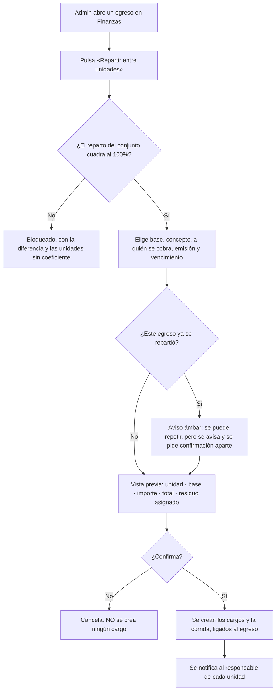
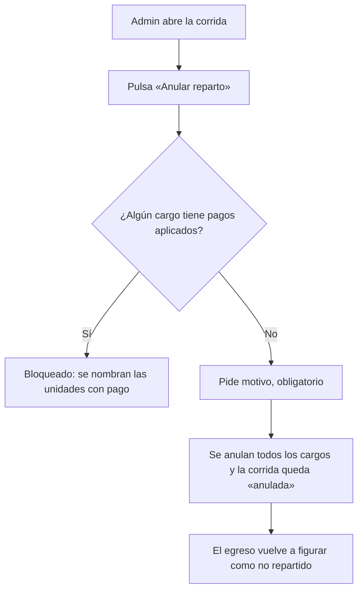

# PRD-V-FLOW-001 — Prorrateo de un gasto entre las unidades

| | |
|---|---|
| **ID** | `PRD-V-FLOW-001` (tentativo hasta registrarlo en `docs/prd/README.md`) |
| **Tipo** | `FLOW` — une dos procesos que hoy no se tocan: el egreso y la cartera |
| **Portales** | **`ADMIN`** (alcance) · **`RESIDENTE`** (afectado: recibe el cargo y ve de dónde sale) · `SUPERADMIN` (no afectado) · `PORTERIA` (no afectado) |
| **Módulo** | Finanzas · Cartera |
| **Usuario principal** | `tenant_admin` / `admin_tenant` |
| **Usuarios secundarios** | `resident` · `committee` |
| **Responsable** | David |
| **Estado** | **Lista para desarrollo** — versión 1.0. D1 y D2 cerradas por David el 21 de agosto de 2026. **No puede empezar antes que `PRD-V-PLAT-001`** |
| **Dependencias** | **`PRD-V-PLAT-001` — bloqueante.** Sin coeficiente por unidad no hay nada que prorratear |
| **Riesgo** | **Alto.** Crea decenas de cargos de dinero real en una sola operación |
| **Reversibilidad** | **Total**, y es un requisito del diseño: una corrida se anula entera (§5.3) |
| **Fase comercial** | Cartera está en `preview` durante la prueba. Ver §7.3 |

---

## 1. Resumen ejecutivo

Cuando el conjunto recibe la factura del ascensor, alguien tiene que repartirla entre las
unidades. Hoy en Vivaru **no hay forma de hacerlo**: el egreso vive en Finanzas, la cartera vive
en Cartera, y no se hablan.

Esta PRD conecta las dos: tomar un **egreso registrado**, repartirlo entre las unidades **según
su coeficiente**, y generar los cargos con trazabilidad **en los dos sentidos** — del cargo a
su factura y de la factura a sus cargos.

El valor es que es **el trabajo diario del administrador de propiedad horizontal**, y hoy lo
hace en una hoja de cálculo aparte y lo teclea a mano.

## 2. Problema y baseline

### Lo que existe hoy, verificado en el código

| Qué | Dónde | Estado |
|---|---|---|
| Egreso / cuenta por pagar | `Expense` en `src/types/domain.ts:385` | Tiene `category`, `amount`, `vendorName`, `dueDate`, `status`, `ledgerEntryId` |
| Cargo | `BillingStatement` en `src/types/domain.ts:268` | Tiene `campaignId` para ligar una corrida |
| Corrida de cobro | `BillingCampaign` en `src/types/domain.ts:294` | `unitAmount`, `unitCount`, `status: "vigente" \| "cerrada"` |
| **Puente egreso → cargo** | — | **No existe.** `Expense` no conoce cargos; `BillingStatement` no conoce egresos |
| **Anular una corrida entera** | — | **No existe.** `BillingCampaign.status` puede cerrarse, pero eso **no anula sus cargos** |

### El baseline, dicho sin adornos

| Indicador | Hoy |
|---|---|
| Gastos repartidos entre unidades desde el producto | **0. No se puede** |
| Trazabilidad de un cargo a la factura que lo originó | **Ninguna** |
| Forma de deshacer una corrida de N cargos | **Ninguna.** Se anulan uno a uno |

**Métrica de éxito:** que la suma de los cargos generados por un prorrateo sea **exactamente**
igual al importe repartido, y que desde el egreso se pueda ver la lista de cargos que produjo.

## 3. Usuarios, roles y permisos

| Rol | Ve | Puede | **NO puede** |
|---|---|---|---|
| `tenant_admin` | El egreso y sus cargos derivados, en ambos sentidos | Prorratear un egreso; anular una corrida entera con motivo | Prorratear si el reparto no cuadra al 100% (`PLAT-001` R2). Prorratear un egreso `anulado`. Anular una corrida con **algún cargo ya pagado** (§8, R7). Operar si el conjunto está `suspended` o `expired` |
| `resident` | Su cargo, con **el concepto y el origen** («Reparto: mantenimiento de ascensor, factura 1143») | Consultarlo y pagarlo | Ver el importe total del egreso ni los cargos de otras unidades |
| `committee` | El egreso, el reparto completo y los cargos de todas las unidades | Consultar y exportar | Prorratear ni anular |
| `security_guard` | Nada | — | Acceder |
| `superadmin` | Todo | Todo, y anular en cualquier estado | — |

> **Nota de portafolio — 21 ago 2026.** Lo que esta PRD asigna al rol `committee` **hoy no es
> alcanzable**: `canAccessPath` (`src/lib/auth/routing.ts:28`) lo deja **solo en
> `/admin/documents`**. A nivel de reglas **sí puede leer** —es miembro del conjunto— así que
> **el bloqueo es de navegación, no de permisos**. Ampliar su alcance merece **PRD propia**:
> decidir qué pantallas ve y comprobar que las reglas no le abran datos personales por el
> camino. **Hasta entonces, las filas de `committee` de esta tabla son intención declarada, no
> capacidad disponible.**

**Por qué el residente no ve el total del egreso:** verlo sin contexto invita a la aritmética
casera —«la factura son 5.000 y a mí me cobran 90»— sin el coeficiente delante. **El consejo sí
lo ve completo**, que es el órgano que debe fiscalizarlo.

## 4. Objetivo, alcance y exclusiones

**Objetivo.** Repartir un gasto entre las unidades con una regla explícita, sin salir del
producto y sin perder el rastro.

### Entra

1. Prorratear un **egreso ya registrado** entre las unidades activas.
2. Base de reparto: **coeficiente** o **área en m²**.
3. Elegir a quién se cobra: responsable, propietario o inquilino.
4. Vista previa obligatoria con unidad, base, importe y total.
5. Reparto del residuo por **resto mayor** (`PLAT-001` R6).
6. Trazabilidad **bidireccional** egreso ↔ cargos.
7. **Anular una corrida entera** con motivo.
8. Aviso al residente indicando el origen del cargo.

### No entra, y por qué

| Excluido | Por qué |
|---|---|
| **Prorratear un gasto que aún no está registrado** | Obligaría a crear egresos desde Cartera. El egreso se registra en Finanzas; aquí se reparte |
| **Prorratear entre un subconjunto de unidades** (por torre o tipo) | Caso real —el ascensor de la torre A— pero necesita decidir cómo se recalcula el 100% del subconjunto. **Fase 2**, y está en §14 D2 |
| **Plan de pagos sobre el cargo prorrateado** | Backlog `B8`, PRD aparte |
| **Presupuesto** | Backlog `E6`. Prorratear un gasto real no es presupuestar |
| **Que el prorrateo genere el egreso en el libro** | El egreso **ya tiene** su asiento (`Expense.ledgerEntryId`). Esta PRD **no toca el libro**: crea cuentas por cobrar |

## 5. Flujo funcional

### 5.1 Camino feliz

### 5.2 Un aviso que el producto debe dar

Si el egreso pertenece a una categoría **ordinaria** —nómina, servicios públicos,
mantenimiento— el producto **avisa** de que ese gasto normalmente ya está cubierto por la cuota
de administración, y de que repartirlo aparte puede **cobrarlo dos veces**.

**Avisa, no bloquea.** Hay conjuntos que cobran cuota base baja y reparten lo demás, y esa es
una decisión de su asamblea, no nuestra.

### 5.3 Anular una corrida

**Un cargo pagado no se anula en lote.** Deshacer un pago es `revertirPago`, que ya existe y
tiene su propia trazabilidad: mezclarlo aquí sería esconder una reversión de dinero dentro de
una corrección de cartera.

### 5.4 Casos límite

| Caso | Comportamiento |
|---|---|
| Unidad `inactive` | No recibe cargo; no cuenta para el reparto |
| Unidad exenta del concepto elegido | No recibe cargo; **su base sí cuenta** — su parte la absorbe el conjunto, y se dice en la vista previa |
| Egreso `anulado` | No se puede repartir |
| Egreso ya repartido | Se avisa y se permite con confirmación aparte |
| Importe tan pequeño que a alguna unidad le toca cero | Se genera igual con importe cero y se marca en la vista previa. **No se omite en silencio** |
| Conjunto `suspended` / `expired` | Solo lectura: se ve el reparto hecho, no se hace uno nuevo |

## 6. Estados y transiciones

### La corrida de reparto

| Estado | Qué significa | Quién transiciona | Salida |
|---|---|---|---|
| **`vigente`** | Los cargos existen y se cobran | Administración | → `anulada` |
| **`anulada`** | Todos sus cargos fueron anulados, con motivo y fecha | Administración · Superadmin | **Terminal** |
| **`cerrada`** | Todos sus cargos están pagados o archivados | Sistema | **Terminal** |

**`anulada` es nueva.** `BillingCampaign.status` hoy solo admite `vigente` y `cerrada`, y
cerrada no anula nada.

### El egreso

No cambia de estado. Gana un **atributo derivado**: repartido o no, según tenga corridas
`vigente`. **No se persiste como estado** para que no pueda quedar desincronizado.

## 7. Contrato de datos y multi-tenancy

### 7.1 Campos nuevos en `billingCampaigns`

| Campo | Tipo | Obligatorio | Nota |
|---|---|---|---|
| `sourceExpenseId` | `string` | No | El egreso repartido. Ausente = corrida normal |
| `distributionBasis` | `"coefficient" \| "area"` | No | Base usada |
| `totalDistributed` | `number` | No | Importe repartido. **Debe ser igual a la suma de los cargos** |
| `payerRelation` | `"responsible" \| "owner" \| "tenant"` | No | A quién se cobró |
| `status` | añade `"anulada"` | Sí | Ver §6 |
| `cancelledAt` / `cancelledBy` / `cancellationReason` | — | Solo si `anulada` | El motivo es **obligatorio** |

### 7.2 Campos nuevos en `billingStatements`

| Campo | Tipo | Obligatorio | Nota |
|---|---|---|---|
| `sourceExpenseId` | `string` | No | Trazabilidad directa al egreso |
| `distributionBasisValue` | `number` | No | El coeficiente o el área con que se calculó, **congelado**: si mañana cambia el coeficiente, el cargo sigue explicando por qué vale lo que vale |
| `roundingAdjustment` | `number` | No | La unidad monetaria de residuo que recibió, si la recibió |

**`distributionBasisValue` es la que hace auditable el cargo.** Sin ella, un cargo de hace un
año no se puede explicar si el coeficiente cambió.

### 7.3 Multi-tenancy y ciclo de vida

- Todo lleva **`tenantId`**; toda consulta de lista lo filtra. Las reglas rechazan, no filtran.
- **`suspended` / `expired`** → solo lectura, por `tenantOperable`. Sin excepción.
- **`trial`** → Cartera y Egresos están en `preview` (`src/lib/config/trial-modules.ts`). El
  prorrateo **se ve con datos de ejemplo y no se opera** hasta contratar. **Sin excepción**: es
  la operación que más dinero mueve del producto.

### 7.4 Retención y borrado

Los cargos y las corridas son registros contables del conjunto: **no caducan con la retención
de 12 meses**, que se aplica a datos personales. `sourceExpenseId` apunta a un egreso del mismo
conjunto y muere con él.

## 8. Reglas de negocio

| # | Regla |
|---|---|
| **R1** | Solo se reparte un egreso en estado `registrado` o `pagado`. Nunca uno `anulado` |
| **R2** | El reparto exige que la suma de la base de las unidades activas cuadre (coeficiente: 100% ± 0.000001; área: suma > 0) |
| **R3** | **La suma de los cargos generados es exactamente igual a `totalDistributed`.** El residuo se asigna por resto mayor |
| **R4** | Cada cargo guarda el valor de base con el que se calculó, congelado |
| **R5** | Un egreso puede repartirse más de una vez; el producto **avisa y exige confirmación aparte** |
| **R6** | Repartir **no crea ni modifica ningún asiento del libro**. El egreso ya tiene el suyo |
| **R7** | Una corrida con **algún** cargo con pagos aplicados **no se puede anular en lote** |
| **R8** | Anular exige motivo, y queda con autor y fecha |
| **R9** | Anular una corrida **no revierte pagos**: por R7 no puede haberlos |
| **R10** | El cargo prorrateado nombra su origen en el detalle que ve el residente |

**R6 es la que evita el error contable más caro:** repartir un gasto **no es** un ingreso. El
ingreso aparece cuando alguien paga.

## 9. Notificaciones y correo

Se reutiliza el aviso de cargo nuevo que ya existe, por `functions/src/email.ts` con el
remitente verificado. **Un solo cambio de contenido:** el aviso dice de dónde sale el cargo —
concepto, proveedor y número de factura— y con qué base se calculó.

**Anular una corrida también notifica**, al mismo destinatario. Un cargo que aparece y
desaparece sin aviso es una llamada al administrador.

**No se promete ningún plazo de respuesta.**

## 10. Criterios de aceptación

### Deben pasar

| # | Criterio |
|---|---|
| CA1 | Repartir un egreso de X entre N unidades genera N cargos cuya **suma es exactamente X** |
| CA2 | Un importe que no divide exacto asigna el residuo por resto mayor y la suma sigue siendo exacta |
| CA3 | Cada cargo guarda el coeficiente con el que se calculó |
| CA4 | Cambiar el coeficiente después **no altera** el importe del cargo ya emitido |
| CA5 | Desde el egreso se ve la lista de cargos que produjo; desde el cargo se llega al egreso |
| CA6 | La vista previa muestra unidad, base, importe y total **antes** de crear nada |
| CA7 | Cancelar en la vista previa **no crea ningún cargo** |
| CA8 | Anular una corrida sin pagos anula todos sus cargos y deja el egreso como no repartido |
| CA9 | Repartir por área produce importes proporcionales a los m² |
| CA10 | Un egreso de categoría ordinaria muestra el aviso de posible doble cobro **y permite continuar** |
| CA11 | Una unidad exenta no recibe cargo, y la vista previa dice que su parte la absorbe el conjunto |
| CA12 | El residente ve el origen del cargo en su detalle |

### Deben fallar

| # | Criterio |
|---|---|
| CF1 | Repartir con la suma de coeficientes en 99,8% → **bloqueado** |
| CF2 | Repartir un egreso `anulado` → **bloqueado** |
| CF3 | Anular una corrida con un cargo con pagos → **bloqueado**, nombrando las unidades |
| CF4 | Anular sin motivo → **rechazado** |
| CF5 | Un residente ve el importe total del egreso → **no aparece** |
| CF6 | Un residente ve el cargo de otra unidad → **denegado** |
| CF7 | Prorratear en un conjunto `suspended` → **denegado** |
| CF8 | Prorratear en un conjunto en `trial` → **bloqueado por la matriz de prueba** |
| CF9 | Llamar a la operación desde el cliente con importes ya calculados → **no existe esa ruta** (§11.1) |

## 11. Arquitectura y dependencias

### 11.1 La decisión obligatoria: cliente directo o callable

**Cloud Function callable, sin alternativa.** Y no por costumbre:

- Crea **decenas de documentos** que deben aparecer todos o ninguno.
- **La aritmética del reparto no puede vivir en el cliente.** Si el navegador calcula los
  importes y los envía, un cliente manipulado emite cargos con los importes que quiera. **El
  servidor recibe el egreso, la base y el concepto; calcula él.**
- Dispara correo.
- Necesita **idempotencia**: una doble pulsación no puede repartir dos veces. Se reutiliza el
  patrón `operationKey` que ya usa `aplicarPago` (`functions/src/payments.ts:60`).

Anular la corrida es **también callable**, por lo mismo: es una escritura en lote con motivo.

### 11.2 Reglas de Firestore

Sin cambios de estructura. `billingCampaigns` y `billingStatements` ya están cubiertas. Lo que
sí hay que hacer: **cerrar la escritura directa de `billingStatements` con `campaignId` de
reparto**, para que nadie pueda crear a mano un cargo que finja venir de un prorrateo.

### 11.3 Índices, jobs y banderas

- **Índice nuevo:** `billingStatements` por `tenantId` + `sourceExpenseId`.
- **Jobs:** ninguno.
- **Bandera:** `expense-distribution`, apagada por defecto.

### 11.4 Dependencia bloqueante

**`PRD-V-PLAT-001`.** Sin `coefficient` en la unidad no hay base, y sin R2 de aquella no hay
garantía de que el reparto cuadre. **Esta PRD no puede empezar antes.**

## 12. Riesgos y mitigaciones

| Riesgo | Señal | Mitigación |
|---|---|---|
| **Doble cobro**: se reparte un gasto ya cubierto por la cuota | Reclamos de residentes; cartera que sube sin explicación | §5.2 avisa; el consejo ve el reparto completo |
| Se reparte dos veces el mismo egreso | Dos corridas con el mismo `sourceExpenseId` | R5 avisa y exige confirmación aparte; la trazabilidad lo hace visible |
| Doble pulsación crea dos corridas | Cargos duplicados | Idempotencia por `operationKey` |
| El residuo se pierde o se duplica | Suma ≠ total | R3, CA1 y CA2 |
| Se anula una corrida con dinero cobrado dentro | Descuadre entre libro y cartera | R7 lo bloquea |
| Un cargo viejo deja de ser explicable | Nadie puede justificar un importe | R4: la base va congelada en el cargo |
| Coste | — | **Nulo.** Aritmética y escrituras en lote |

## 13. Despliegue, rollback y Story Map

### Orden

**Reglas → functions → front.** Aquí las reglas sí cambian (§11.2), así que van primero.

### Rollback

**Total mientras la bandera esté apagada.** Una vez usada en producción, revertir **no borra los
cargos creados**: se anulan con la propia funcionalidad (§5.3), que por eso es parte del MVP y
no de una fase posterior.

> **Una corrida ya cobrada no se deshace desde aquí.** Se revierte pago a pago con
> `revertirPago`. Está dicho en la primera línea de esta sección a propósito.

### Validación

| Dónde | Qué |
|---|---|
| **Staging** | Todo: reparto, residuo, exenciones, anulación, permisos, idempotencia |
| **Producción** | Nada exclusivo. Con cero clientes reales, staging cubre el 100% |

### Story Map

**MVP** — reparto por coeficiente · vista previa · trazabilidad bidireccional · anulación de
corrida · aviso de doble cobro.

**Fase 2** — reparto por área · reparto a un subconjunto de unidades (§14 D2) · exportar el
reparto para el acta del consejo.

**Fase 3** — repartir varios egresos en una sola corrida.

## 14. Decisiones abiertas

### D1 · ¿Qué concepto llevan los cargos generados?

`BillingConcept` tiene hoy siete valores (`src/types/domain.ts:259`), entre ellos
`extraordinaria` y `reparacion`.

**Recomendación: que el administrador lo elija de los existentes, con `extraordinaria` por
defecto.** No crear un concepto nuevo: el concepto describe qué se cobra, no cómo se calculó, y
el «cómo» ya va en `sourceExpenseId`.

> **CERRADA el 21 ago 2026 — aceptada.** El administrador elige de los siete conceptos
> existentes; `extraordinaria` por defecto. **No se añade ningún valor a `BillingConcept`.**

### D2 · ¿Repartir a un subconjunto de unidades?

El caso es real: el ascensor de la torre A no lo pagan las casas. Pero exige decidir si el 100%
se recalcula sobre el subconjunto o si se reparte solo la fracción correspondiente. **Son dos
resultados distintos y ambos son defendibles.**

**Recomendación: fuera del MVP**, y cuando entre, **recalcular el 100% sobre el subconjunto** —
es lo que espera un administrador que dice «esto lo pagan estas doce unidades».

> **CERRADA el 21 ago 2026 — aceptada.** Fuera del MVP; en Fase 2 se recalcula el 100% sobre
> el subconjunto elegido.

**Ninguna decisión abierta.**

## 15. Puertas

| Puerta | Estado |
|---|---|
| **G0 Necesidad** | ✅ Medido: no existe puente egreso→cargo en el código |
| **G1 Valor** | ✅ Baseline y métrica en §2 |
| **G2 Datos y permisos** | ✅ Campos, roles y prohibiciones definidos |
| **G3 Riesgo** | ✅ Idempotencia, vista previa, anulación en el MVP y bandera |
| **G4 Aceptación** | ✅ 12 que pasan, 9 que deben fallar |
| **G5 Operación** | ✅ Lo opera el administrador del conjunto al recibir cada factura repartible. El consejo lo fiscaliza |
| **G6 Escala** | ✅ Una corrida = una escritura en lote sobre las unidades de un conjunto |

**Lista para desarrollo.** Las siete puertas superadas y las dos decisiones cerradas.

**Única condición de secuencia: `PRD-V-PLAT-001` debe estar construida antes.** Sin coeficiente
por unidad no hay base que repartir.
