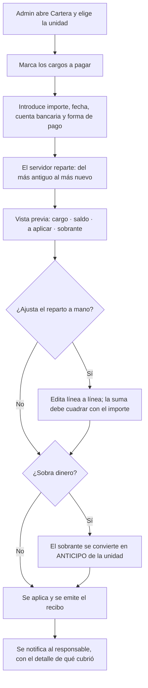
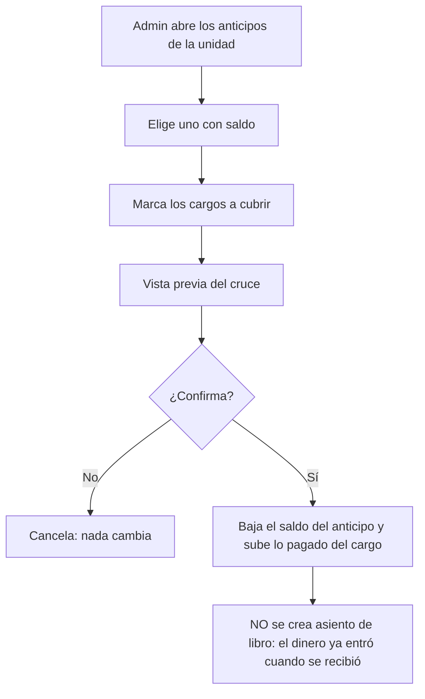

# PRD-V-FLOW-002 — Anticipos y aplicación del pago a varios cargos

| | |
|---|---|
| **ID** | `PRD-V-FLOW-002` (tentativo hasta registrarlo en `docs/prd/README.md`) |
| **Tipo** | `FLOW` — cambia el proceso de cobro de punta a punta, que ya existe y está en producción |
| **Portales** | **`ADMIN`** (alcance) · **`RESIDENTE`** (alcance: ve su saldo a favor e indica a qué cuenta pagó) · `SUPERADMIN` (afectado) · `PORTERIA` (no afectado) |
| **Módulo** | Finanzas · Cartera |
| **Usuario principal** | `tenant_admin` / `admin_tenant` |
| **Usuarios secundarios** | `resident` · `committee` |
| **Responsable** | David |
| **Estado** | **EN DESARROLLO — versión 1.4, 24 de agosto de 2026. SERVIDOR Y FRONT CONSTRUIDOS; PRODUCCIÓN SIN TOCAR** (`develop` = `a25b77d`, `master` sigue en `5d6df95`). El paso 3 del §13 está hecho: vista de anticipos con cruce, deshacer y anulación; reparto entre varios cargos con la propuesta de R7 editable; saldo a favor en el portal del residente; cuenta bancaria en el cobro y en el comprobante; y el «% de recaudo» de R16, que **mide liquidación y ya no ingreso**. Staging desplegado con las dos banderas encendidas. **Lo que hizo falta y la PRD no preveía:** `bankAccounts` era solo-administrador, así que **CA11 no se podía construir sin abrir esa lectura** — y como las reglas conceden el documento entero, primero hubo que sacar `openingBalance` a `bankAccountBalances` (decisión de David, 24 ago). **Lo que sigue abierto:** la vista previa del reparto la calcula el cliente y §11.3 recomienda pedírsela al servidor — la callable no existe y esta entrega no toca `functions/`. **Resueltas:** `computeBalanceStatus` se CABLEA (la usa `deudaDelCargo`), y CF12 ya se reescribió en la 1.3. Lo que sigue de la 1.3: **todo el servidor verificado contra la base**, los tres defectos cerrados, y dos correcciones nacidas de construir —**R8** miraba el remanente en vez de los cruces, y **CF12** se contradecía—. De la 1.2: la 1.1 marcó tres correcciones y las dejó abiertas; aquella las resolvió con R14–R16. **Las referencias de línea se han sustituido por nombres de símbolo**: en dos versiones seguidas los números caducaron en menos de un día. D1 y D2 siguen cerradas |
| **Dependencias** | **Secuencia obligatoria: `PRD-V-PLAT-003` va ANTES.** Las dos modifican `aplicarPago`, que está en producción — aquella cambia **qué valor** escribe en la categoría, esta cambia **su firma**. **No pueden estar en vuelo a la vez.** Si esta va primero, añade el valor `"anticipo"` a un enum que `PLAT-003` sustituye acto seguido |
| **Riesgo** | **Alto.** Modifica `aplicarPago`, que está **en producción y mueve dinero real** |
| **Reversibilidad** | **Parcial.** El anticipo y el reparto se apagan con bandera; el cambio de firma de `aplicarPago` no (§13) |
| **Fase comercial** | Cartera está en `preview` durante la prueba. Ver §7.5 |

---

## 1. Resumen ejecutivo

Hoy, si un residente paga más de lo que debe, **el excedente desaparece**: la cuota queda
pagada, el sobrante se contabiliza como ingreso del período y **no queda saldo a favor en
ninguna parte**. El mes siguiente empieza de cero. Y si paga cuatro meses de una vez —que en
este mercado es lo normal— el administrador tiene que registrar cuatro pagos a mano.

Esta PRD introduce el **anticipo** como saldo a favor de la unidad, permite **aplicar un pago a
varios cargos**, y hace que el pago registre **a qué cuenta bancaria entró**, que hoy no se
guarda.

## 2. Problema y baseline

### Lo que existe hoy, verificado en `functions/src/payments.ts`

| Qué | Dónde | Comportamiento |
|---|---|---|
| Aplicar un pago | `aplicarPago` | Recibe **un** `statementId` y **un** `amount` |
| Aritmética del saldo | `calcularSaldo` | `balance = max(0, cobrado − pagado)` |
| Idempotencia | `operationKey` | Un reintento no duplica el pago ni el recibo |
| Recibo | dentro de `aplicarPago` | **Se emite dentro de la misma transacción** (`FIN-001`, cerrada el 20 ago 2026) |
| Reversión | `revertirPago`, línea 459 | Asiento negativo + `paymentAmount` restaurado |
| Espejo en el cliente | `computeBalanceStatus` en `src/features/finanzas/use-payments.ts` | Duplicado a propósito; **manda el del servidor** |

### Los tres defectos, nombrados

**D-A · El sobrepago se evapora.** Con `pagadoDespues = pagadoAntes + monto` y
`balance = max(0, cobrado − pagado)`, pagar 200 sobre una cuota de 140 deja la cuota en `paid`,
`paymentAmount = 200`, `balance = 0` — y **los 60 sobrantes se contabilizan íntegros como
ingreso del período** con `category: "alicuota"`. No hay saldo a favor ni obligación pendiente.
**El dinero entró y el producto lo olvidó.**

**D-B · Un pago, un cargo.** No existe forma de repartir un pago entre varios cargos. Pagar
cuatro meses son cuatro operaciones manuales, cada una con su recibo.

**D-C · El pago no sabe a qué cuenta entró.** El asiento se escribe con `bankAccountId: null`
fijo. La conciliación tiene que adivinar por importe y fecha.

> **RESUELTO en la 1.2 — son DOS, y el reverso copia la del original.** Verificado el 23 de
> agosto: en todo `functions/src/payments.ts` hay **exactamente dos** `bankAccountId: null`, uno
> en `aplicarPago` y otro en `revertirPago`. La 1.0 nombraba solo el primero; la 1.1 nombró el
> segundo con un número de línea que **ya está desplazado otra vez**. Por eso esta versión no da
> números: se buscan por nombre de función.
>
> **La decisión.** El reverso **copia el `bankAccountId` del asiento que anula**, igual que ya
> copia `category` y `accountCode` y deriva `reversedSourceType` (R7, R13). No lo vuelve a
> resolver, por la misma razón que da R7 para la cuenta contable: hay que deshacer **el asiento
> que se escribió**, no el que se escribiría hoy. Si el reverso cayera en otra cuenta bancaria,
> la conciliación vería un positivo en una y un negativo en otra, y **las dos estarían mal**.
>
> No cuesta una lectura extra: `revertirPago` ya lee el asiento original para copiarle la
> cuenta contable. Cuando no hay asiento que leer —pagos anteriores a `FIN-001`— se queda en
> `null`: **no se inventa una cuenta bancaria que nunca se registró.**

### Baseline

| Indicador | Hoy |
|---|---|
| Saldos a favor registrados | **0. El concepto no existe** |
| Operaciones para cobrar cuatro meses | **4** |
| Pagos con cuenta bancaria identificada | **0 de 0** — el campo se escribe siempre nulo |

**Métrica de éxito:** que un pago superior a lo adeudado deje **saldo a favor visible para el
residente**, y que la suma de lo aplicado más el anticipo generado sea **exactamente** igual a
lo pagado.

## 3. Usuarios, roles y permisos

| Rol | Ve | Puede | **NO puede** |
|---|---|---|---|
| `tenant_admin` | Anticipos abiertos de su conjunto y el saldo de cada unidad | Registrar un pago repartiéndolo entre varios cargos; cruzar un anticipo contra un cargo; anular un anticipo con motivo | Cruzar un anticipo de una unidad contra el cargo de **otra** (§8, R6). Revertir un pago cuyo anticipo ya fue cruzado (R8). Operar si el conjunto está `suspended` o `expired` |
| `resident` | **Su** saldo a favor y de qué pago viene | Consultarlo. **Indicar a qué cuenta bancaria pagó** al subir su comprobante | Cruzar ni anular nada. Ver el anticipo de otra unidad |
| `committee` | Total de anticipos del conjunto | Consultar y exportar | Operar |
| `security_guard` | Nada | — | Acceder |
| `superadmin` | Todo | Todo, incluida la corrección de un anticipo mal creado | — |

> **Nota de portafolio — 21 ago 2026.** Lo que esta PRD asigna al rol `committee` **hoy no es
> alcanzable**: `canAccessPath` (`src/lib/auth/routing.ts:28`) lo deja **solo en
> `/admin/documents`**. A nivel de reglas **sí puede leer** —es miembro del conjunto— así que
> **el bloqueo es de navegación, no de permisos**. Ampliar su alcance merece **PRD propia**:
> decidir qué pantallas ve y comprobar que las reglas no le abran datos personales por el
> camino. **Hasta entonces, las filas de `committee` de esta tabla son intención declarada, no
> capacidad disponible.**

**Por qué el residente no cruza su propio anticipo:** cruzar mueve dinero entre obligaciones.
Que lo haga quien responde de la contabilidad del conjunto, no quien la paga.

## 4. Objetivo, alcance y exclusiones

**Objetivo.** Que el dinero que entra tenga siempre dónde quedarse, y que aplicarlo no dependa
de repetir la operación una vez por cuota.

### Entra

1. **Anticipo** como saldo a favor de la unidad, con historia y trazabilidad.
2. **Anticipo automático** cuando el pago supera lo adeudado.
3. **Anticipo manual**: registrar un pago sin cargo al que aplicarlo.
4. **Cruce** de un anticipo contra uno o varios cargos.
5. **Aplicar un pago a varios cargos** en una sola operación, con reparto sugerido.
6. **Cuenta bancaria en el pago**, y en el comprobante que sube el residente.
7. Visibilidad del saldo a favor para residente y consejo.
8. Anulación de un anticipo con motivo.
9. Reversión coherente: qué pasa al revertir un pago que generó anticipo.

### No entra, y por qué

| Excluido | Por qué |
|---|---|
| **Devolver el dinero de un anticipo** | Es un egreso, no un movimiento de cartera. PRD del lado del gasto |
| **Bandeja de ingresos no identificados** | Backlog `D5`. Un anticipo tiene dueño; un ingreso no identificado, no. **Son problemas distintos y mezclarlos confunde los dos** |
| **Intereses sobre el saldo a favor** | Nadie los paga en este mercado |
| **Caducidad del anticipo** | Requiere decisión legal por país. Anotado, fuera del MVP |
| **Cierre de conciliación** | Backlog `D1–D4`, PRD aparte. Esta solo aporta el `bankAccountId` que aquella necesitará |
| **Cambiar cómo se emite el recibo** | `FIN-001` está cerrada y funciona. **No se toca** |

## 5. Flujo funcional

### 5.1 Registrar un pago que cubre varios cargos

**El reparto del más antiguo al más nuevo es la regla por defecto**, no una imposición: reduce
la mora y es lo que espera cualquier contador. El administrador puede cambiarlo.

### 5.2 Cruzar un anticipo

**«No se crea asiento» es la regla contable de esta PRD**, y está en §8 R4. El ingreso ocurrió
al recibir el anticipo. Contarlo otra vez al cruzarlo duplicaría los ingresos del conjunto.

### 5.3 Casos límite

| Caso | Comportamiento |
|---|---|
| Pago exactamente igual al saldo | Se aplica entero; **no se crea anticipo de cero** |
| Pago menor que el saldo | Pago parcial; el cargo queda `pending` u `overdue` |
| Pago sin ningún cargo pendiente | **Todo** se convierte en anticipo |
| Cruce mayor que el saldo del cargo | Se limita al saldo; el resto sigue en el anticipo |
| Anticipo de una unidad, cargo de otra | **Bloqueado** (R6) |
| Revertir un pago cuyo anticipo ya se cruzó | **Bloqueado**: primero se deshace el cruce (R8) |
| Reintento con la misma `operationKey` | Devuelve el mismo resultado y el mismo recibo. **Sin cambios** |
| Conjunto `suspended` / `expired` | Solo lectura: se ven los anticipos, no se opera |

## 6. Estados y transiciones

### El anticipo

| Estado | Qué significa | Quién transiciona | Salida |
|---|---|---|---|
| **`open`** | Tiene saldo por aplicar | Administración, al cruzar | → `applied` o `cancelled` |
| **`applied`** | Saldo agotado | Sistema, cuando el remanente llega a cero | → `open`, si se deshace un cruce |
| **`cancelled`** | Anulado con motivo | Administración · Superadmin | **Terminal** |

**Todo anticipo tiene salida y dueño.** Un anticipo `open` que nadie cruza es dinero del
residente parado: la vista de anticipos es la herramienta de §15 G5.

### El cargo

**No cambia.** Sigue con `pending → paid` / `overdue`, calculado por `calcularSaldo`, que **no
se modifica**.

## 7. Contrato de datos y multi-tenancy

### 7.1 Colección nueva: `advances`

| Campo | Tipo | Obligatorio | Quién escribe |
|---|---|---|---|
| `tenantId` | `string` | **Sí** | Servidor |
| `unitId` / `unitLabel` | `string` | Sí | Servidor |
| `personId` | `string` | No | Servidor — quién pagó |
| `amount` | `number` | Sí | Servidor — importe original |
| `remaining` | `number` | Sí | Servidor — saldo por aplicar |
| `origin` | `"overpayment" \| "manual"` | Sí | Servidor |
| `sourceOperationKey` | `string` | Sí | Servidor — puente al pago que lo creó |
| `ledgerEntryId` | `string` | Sí | Servidor — el asiento de su entrada de dinero |
| `date` | `string` | Sí | Servidor |
| `status` | `"open" \| "applied" \| "cancelled"` | Sí | Servidor |
| `cancelledAt` / `cancelledBy` / `cancellationReason` | — | Solo si `cancelled` | El motivo es **obligatorio** |

### 7.2 Colección nueva: `advanceApplications`

Un documento por cruce: `tenantId`, `advanceId`, `statementId`, `amount`, `date`,
`operationKey`, `createdBy`, y `reversedAt` cuando se deshace.

**Existe para que un cruce se pueda deshacer sin adivinar cuánto se aplicó a qué.**

### 7.3 Cambios en lo que ya existe

| Dónde | Cambio | Nota |
|---|---|---|
| `AplicarPagoInput` | `statementId` → **`allocations: { statementId, amount }[]`** | **Cambio de firma.** Ver §13 |
| `AplicarPagoInput` | `+ bankAccountId?: string` | Corrige D-C |
| Asiento del pago | `bankAccountId: null` → **el recibido** | En `aplicarPago` |
| Asiento del reverso | `bankAccountId: null` → **el del asiento que anula** | En `revertirPago`. **Es el segundo de los dos**, y la 1.0 no lo nombraba |
| `LedgerCategory` | `+ "anticipo"` | `src/types/domain.ts` |
| `LedgerEntry.sourceType` | `+ "advance"` | Hoy admite cuatro valores. Ver §7.4 |
| `LedgerEntry.reversedSourceType` | `+ "advance"` | **La 1.1 no lo nombraba.** `revertirPago` copia el origen del asiento anulado sin condición: sin esto, revertir un pago que generó anticipo **no compila** |
| `PaymentVoucher.sourceType` | **Sin cambios** | Es otro enum, de tres valores. El recibo cubre el pago entero —lo aplicado más el anticipo— y sigue siendo `"billingStatement"`. **Se dice aquí para que nadie lo amplíe «por simetría»** |
| `PaymentReceipt` | `+ bankAccountId?: string` | El residente indica a qué cuenta pagó |
| `BillingStatement` | **`+ advanceAppliedAmount?: number`** | **Cambió respecto de la 1.1, que decía «sin cambios».** Lo escribe **solo el servidor**. Ver R4 y §11.3 |
| `calcularSaldo` / `computeBalanceStatus` | **`pagado = paymentAmount + advanceAppliedAmount`** | **Cambió respecto de la 1.1, que decía «sin cambios».** Es el par de espejos más delicado del módulo: §11.3 |
| Plan de cuentas (`PLAT-003`) | `+ systemKey` `anticipo` | Sin él, la línea del anticipo queda etiquetada por su categoría mientras el resto del estado habla en códigos — el problema del «1.3» que ya describe `etiquetaDe` |

### 7.4 La trampa de la herencia, y cómo se evita

> **RESUELTO en la 1.2.** La 1.1 describió bien el problema y dejó sin decidir el nombre y el
> alcance del cambio. Aquí se cierran los dos.

**La exclusión ya NO mira la categoría: mira el ORIGEN del asiento.** Vive en
`esRecaudoDeCartera`, duplicada a propósito en `src/features/finanzas/financial-statement.ts` y
en `functions/src/payments.ts`, y pregunta por `sourceType === "billingStatement"`, por
`reversedSourceType` (R13) y, solo como convivencia, por `category === "alicuota"`.

**La trampa pasó de OMISIÓN a HERENCIA, y eso invierte quién tiene que actuar.**

| | Antes | Ahora |
|---|---|---|
| Cómo se caía | Añadiendo `anticipo` a una lista de exclusión | **No haciendo nada** |
| Cómo se evitaba | No haciendo nada | **Actuando a propósito** |

El asiento del anticipo nace **dentro de `aplicarPago`** (§11.1: «dentro de la misma transacción
del pago»), y ahí se escribe `sourceType: "billingStatement"`. Si lo hereda —que es lo que pasa
si nadie lo piensa— **queda excluido del libro aunque su `category` diga `anticipo`**, sin que
nadie escriba esa palabra en ninguna lista.

**Y aquí es peor que con la multa:** el anticipo **no está en `cuotaIncome`**, porque
`repartirRecaudo` suma `paymentAmount` de los cargos y un anticipo por definición no es de
ningún cargo. Se descuenta de un lado **sin estar sumado en el otro**. Desaparece.

#### La decisión: `sourceType: "advance"`

**El nombre.** El enum habla inglés (`billingStatement`, `expense`, `manual`, `reversal`);
`category` habla español y se queda en `"anticipo"`. La colección ya se llama `advances`.

**Qué se amplía, y qué no.** La 1.1 decía que la ampliación tiene que llegar «a los dos
espejos». **No es exacto, y la diferencia importa:** el espejo de `functions/` recibe
`sourceType?: string` —suelto, sin tipar—, así que `"advance"` ya cae fuera de las tres ramas y
`esRecaudoDeCartera` devuelve `false`, que es justo lo que pide CA7. **El predicado no cambia en
ninguno de los dos.** Lo que se amplía son dos líneas de tipo, las dos en
`src/types/domain.ts`: `LedgerEntry.sourceType` y `LedgerEntry.reversedSourceType` (§7.3).

**El peligro real no es olvidar la ampliación** —eso no compila—, **sino que alguien añada
`category === "anticipo"` a la exclusión por analogía con `alicuota`.** Eso sí compila, pasa las
suites de hoy, y resucita la trampa entera. Ampliar el tipo es inerte; lo que hace que la
decisión aguante es el guardián:

- Un caso en **las dos** suites:
  `esRecaudoDeCartera({ sourceType: "advance", category: "anticipo" })` → `false`.
- **El guardián de texto que ya existe no bastaría.**
  `functions/tests/informe-mensual-exclusion.test.ts` solo comprueba que las tres ramas
  *estén* en el cuerpo de `src/`; no ve una cuarta añadida a uno de los dos espejos. Se amplía
  para exigir además que ese cuerpo **no contenga** la cadena `"anticipo"`.

---

Texto original de la 1.0, conservado para saber de dónde viene el aviso

`src/features/finanzas/use-ledger.ts:220` **excluye la categoría `alicuota`** del ingreso del
libro, porque ese ingreso se cuenta aparte vía `cuotaIncome`. La categoría **`anticipo` no debe
excluirse**: es dinero que entró y **no** está contado en ningún cargo.

### 7.5 Multi-tenancy y ciclo de vida

- `advances` y `advanceApplications` llevan **`tenantId`**; toda consulta de lista lo filtra.
- **`suspended` / `expired`** → solo lectura, por `tenantOperable`. Sin excepción.
- **`trial`** → Cartera está en `preview`. Los anticipos **se ven con datos de ejemplo y no se
  operan**. Sin excepción.

### 7.6 Retención y borrado

El anticipo es un registro contable del conjunto: **no caduca con la retención de 12 meses**.
`personId` sí apunta a una persona: al anonimizarla, el anticipo conserva importe, fecha y
unidad, y pierde el vínculo personal — igual que ya hace `anonymizeExpiredVouchersDaily`.

## 8. Reglas de negocio

| # | Regla |
|---|---|
| **R1** | **Lo aplicado a cargos más el anticipo generado es exactamente igual al importe pagado.** Ni un céntimo se pierde ni se inventa |
| **R2** | Si el pago supera el total de los cargos seleccionados, el sobrante **se convierte en anticipo de esa unidad**, siempre |
| **R3** | Un anticipo de importe cero **no se crea** |
| **R4** | **Cruzar un anticipo no crea asiento de libro Y NO TOCA `paymentAmount`.** Lo primero ya estaba y es cierto: el ingreso se registró al recibirlo (R5). Lo segundo es lo que faltaba, y es la mitad que **no pasa por el libro**: `cuotaIncome` es exactamente la suma de los `paymentAmount` (`repartirRecaudo`, sin filtro de fecha), así que subirlo al cruzar contaría el anticipo dos veces —al entrar y al cruzarlo— **sin crear ningún asiento, con CA6 en verde y el estado financiero mal**. El cruce sube **`advanceAppliedAmount`**, campo nuevo del cargo que **solo escribe el servidor**, y `calcularSaldo` pasa a sumar los dos. Con eso `cuotaIncome` sigue siendo *el dinero que entró por Cartera* y el del anticipo entró por el libro: **ninguno de los dos puede ver al otro**, y el invariante deja de depender de que cinco sitios recuerden restar |
| **R5** | El asiento de entrada de un anticipo lleva `category: "anticipo"` y **cuenta como ingreso del período** |
| **R6** | Un anticipo solo se cruza contra cargos de **su misma unidad** |
| **R7** | El reparto por defecto va del cargo **más antiguo por vencimiento** al más nuevo; el administrador puede cambiarlo, y la suma debe cuadrar con el importe |
| **R8** | **No se revierte un pago cuyo anticipo tenga cruces VIGENTES.** Primero se deshacen los cruces. **⚠ CORREGIDO 24 ago, contra la base:** se construyó preguntando `remaining < amount`, que parece significar «tiene cruces» y **no lo es** — anular un anticipo (R9) pone `remaining` a cero **sin haber cruzado nada**, así que un anticipo anulado bloqueaba una reversión legítima. Se pregunta por los `advanceApplications` sin deshacer. Hizo falta encadenar cinco operaciones —pagar, cruzar, descruzar, anular, revertir— para que apareciera: **ninguna prueba unitaria llegaba tan lejos** |
| **R9** | Anular un anticipo exige motivo y **solo es posible si su remanente está intacto** |
| **R10** | La idempotencia por `operationKey` se conserva sin cambios, y **cubre también el anticipo generado**: un reintento no crea un segundo anticipo |
| **R12** | Si `PRD-V-PLAT-003` ya está construida, el anticipo usa **su cuenta del plan**, no un valor de enum. Ver la secuencia declarada en el encabezado |
| **R11** | Todo pago registra la cuenta bancaria a la que entró, salvo efectivo |
| **R14** | **El cruce de un anticipo no cambia el ingreso del período.** Es un invariante, no una prohibición: el anticipo entra una sola vez, por el libro (R5); el cruce solo cambia **a qué obligación queda imputado**, y no toca ningún sumando del ingreso —ni el del libro ni el de Cartera—. Es lo que mide CA6′ y lo que R4 hace estructuralmente cierto |
| **R15** | **Revertir un pago cuyo anticipo sigue `open` anula también el anticipo.** Se revierten **los dos** asientos —el del cargo y el del anticipo— y el anticipo pasa a `cancelled` con un motivo automático que nombra la reversión. Sin esto, revertir un pago de 200 deja vivo un saldo a favor de 60 **de un dinero ya devuelto**. R8 cubría solo el anticipo **ya cruzado**, que es el caso raro; este es el normal |
| **R16** | **El «% de recaudo» se calcula por `amount − balance`, no por `paymentAmount`.** En cuanto existen anticipos, «cuánto dinero entró» y «cuánto de lo facturado está saldado» dejan de ser el mismo número, y el informe responde hoy a los dos con uno solo. Con R4, una unidad que cubre julio con un anticipo de junio saldría al **0% de recaudo con la cuota saldada**. `recaudado` (ingreso) sigue siendo Σ `paymentAmount`; el porcentaje pasa a medir liquidación. Va en este mismo incremento, **o el informe deja de mentir por un lado y empieza a mentir por el otro** |

**R10 es la que evita el peor fallo posible:** que un reintento de red duplique el saldo a favor
de un residente.

## 9. Notificaciones y correo

Se reutiliza el aviso de pago recibido, por `functions/src/email.ts` con el remitente
verificado. **Dos cambios de contenido:**

1. El aviso dice **qué cargos cubrió** el pago, no solo el importe.
2. Si quedó saldo a favor, **lo dice y lo nombra**. Un residente que paga de más y no recibe
   confirmación del sobrante llama al administrador. Es la llamada más barata de evitar.

**No se promete ningún plazo de respuesta.**

## 10. Criterios de aceptación

### Deben pasar

| # | Criterio |
|---|---|
| CA1 | Pagar 200 sobre un cargo de 140 deja el cargo `paid` y crea un anticipo de **60** |
| CA2 | El residente ve su saldo a favor de 60 en su portal |
| CA3 | Un pago repartido entre tres cargos los deja con los saldos correctos en **una sola operación** |
| CA4 | La suma de lo aplicado más el anticipo es **exactamente** el importe pagado |
| CA5 | Cruzar un anticipo de 60 contra un cargo de 140 lo deja con saldo 80 y el anticipo en cero, en `applied` |
| CA6′ | **Cruzar un anticipo de 60 no cambia el ingreso.** `buildFinancialStatement` sobre los **mismos datos** antes y después devuelve **el mismo `totalIncome`**. La CA6 de la 1.1 —«no se crea ningún asiento»— se conserva como sub-aserción, **no como la prueba**: medía el mecanismo y pasaría en verde con el estado financiero mal, y la propia 1.1 lo admite |
| CA7 | El asiento de entrada del anticipo lleva `category: "anticipo"` **y `sourceType: "advance"` propio**, y **aparece en el ingreso del período**: `esRecaudoDeCartera` no lo excluye |
| CA8 | Un pago sin cargos pendientes se convierte **íntegro** en anticipo |
| CA9 | Reintentar con la misma `operationKey` devuelve el mismo recibo y **no crea un segundo anticipo** |
| CA10 | El asiento del pago guarda el `bankAccountId` recibido, no `null` |
| CA11 | El residente elige la cuenta bancaria al subir su comprobante, y el pago aprobado la conserva |
| CA12 | Deshacer un cruce devuelve el anticipo a `open` con su remanente |
| CA13 | El aviso al residente nombra los cargos cubiertos y el saldo a favor si lo hubo |
| CA14 | Cruzar un anticipo **no cambia el `paymentAmount`** del cargo: sube `advanceAppliedAmount`, y el cargo queda `paid` con `balance` 0 |
| CA15 | Revertir un pago cuyo anticipo sigue `open` deja **los dos** asientos revertidos y el anticipo en `cancelled` con motivo (R15) |
| CA16 | Un cargo cubierto íntegramente con anticipo cuenta **0** en el `recaudado` del mes y **100%** en el «% de recaudo» (R16) |
| CA17 | `esRecaudoDeCartera({ sourceType: "advance", category: "anticipo" })` es `false` **en los dos espejos**, y el guardián de texto falla si el cuerpo de `src/` menciona `"anticipo"` |

### Deben fallar

| # | Criterio |
|---|---|
| CF1 | Cruzar un anticipo contra un cargo de **otra unidad** → **denegado** |
| CF2 | Revertir un pago cuyo anticipo ya fue cruzado → **bloqueado**, indicando qué cruce deshacer |
| CF3 | Anular un anticipo parcialmente cruzado → **bloqueado** |
| CF4 | Anular sin motivo → **rechazado** |
| CF5 | Un reparto manual cuya suma ≠ importe pagado → **rechazado** |
| CF6 | Un residente intenta cruzar su anticipo → **denegado** |
| CF7 | Un residente ve el anticipo de otra unidad → **denegado** |
| CF8 | Operar anticipos en un conjunto `suspended` → **denegado** |
| CF9 | Operar anticipos en `trial` → **bloqueado por la matriz de prueba** |
| CF10 | Una consulta de `advances` sin `where("tenantId")` → **denegada entera** |
| CF11 | El cajón de edición manual de un cargo intenta escribir `advanceAppliedAmount` → **denegado por reglas.** Es el campo que sostiene R4, y `paymentAmount` **sí** se escribe hoy desde el navegador (§11.3) |
| CF12 | Un cruce mayor que el saldo del cargo **NO se rechaza: se limita al saldo**, y el resto sigue en el anticipo (§5.3). La v1.2 decía las dos cosas en la misma línea; manda §5.3, y así está construido. Lo que sí se rechaza es cruzar contra un cargo **sin saldo pendiente**, que no es un límite sino una operación sin efecto |

## 11. Arquitectura y dependencias

### 11.1 La decisión obligatoria: cliente directo o callable

**Callable, y no hay debate:** ya lo es. `aplicarPago` es una Cloud Function que escribe en
varias colecciones dentro de una transacción y emite el recibo. Esta PRD **amplía** esa función;
no cambia dónde vive la lógica.

| Operación | Decisión | Por qué |
|---|---|---|
| Aplicar un pago a varios cargos | **Callable — la misma, ampliada** | Transacción multi-documento, recibo, idempotencia y aritmética que el cliente no puede falsificar |
| Crear un anticipo | **Callable — dentro de la misma transacción del pago** | Si el anticipo se creara aparte, un fallo entre las dos operaciones dejaría dinero sin registrar |
| Cruzar un anticipo | **Callable nueva** | Toca `advances`, `advanceApplications` y `billingStatements` a la vez |
| Deshacer un cruce | **Callable nueva** | Lo mismo, en sentido inverso |
| Leer anticipos | **Cliente directo** | Consulta con `tenantId`; las reglas la protegen |

### 11.2 Reglas de Firestore

Bloques nuevos para `advances` y `advanceApplications`:

- **Lectura**: miembros del conjunto. Un residente **solo los de su unidad** — se apoya en
  `residentOwnUnit()`, que ya existe en `firestore.rules:27`.
- **Escritura**: **nadie desde el cliente.** Solo el servidor. Es dinero, y toda su creación
  pasa por callable.

**No pueden caer en `relaxedTenantCollection`** (`firestore.rules:80`).

**Y un bloque que NO es de las colecciones nuevas, y sin el cual R4 no se sostiene.** En
`billingStatements`, el cliente **sigue escribiendo** `paymentAmount`, `balance` y `status`
desde el cajón de edición (§11.3): eso no se quita en esta PRD. Lo que hay que añadir es que
**`advanceAppliedAmount` no lo pueda tocar nadie desde el cliente** —ni crearlo, ni cambiarlo—,
porque es el campo que separa el dinero del anticipo del dinero de Cartera. Una regla que
prohíbe una colección entera es fácil de escribir; **esta prohíbe un campo dentro de un
documento que por lo demás sigue siendo editable**, y por eso lleva su propio criterio (CF11).

### 11.3 El espejo que hay que respetar — y que esta PRD SÍ modifica

`calcularSaldo` (servidor) y `computeBalanceStatus` (cliente) están duplicados a propósito
porque `src/` no puede importar de `functions/`. **La 1.1 decía que esta PRD no los modifica;
con R4 sí los modifica**, y es el cambio más delicado del incremento: los dos pasan a calcular
`pagado = paymentAmount + advanceAppliedAmount`. Se llevan **el mismo guardián de texto** que ya
tiene `esRecaudoDeCartera`, porque un espejo que se separa en silencio es exactamente lo que
dejó R12 sin llegar a `functions/` y el informe mensual contando dos veces.

**Y hay un agujero abierto que R4 cierra por diseño.** `actualizarBillingStatement`
(`src/features/billing/use-billing-statements.ts`) hace un `updateDoc` **directo desde el
navegador** sobre `billingStatements`, escribiendo `paymentAmount` y `balance` tal cual se los
da el cajón de edición —sin pasar siquiera por `computeBalanceStatus`—. Si el cruce viviera en
`paymentAmount`, un administrador editando el cargo a mano **borraría o duplicaría la aplicación
de un anticipo sin que ningún `advanceApplication` se enterara**. `advanceAppliedAmount` lo
escribe solo el servidor, y las reglas deben impedir que el cliente lo toque (CF11).

**Lo demás del reparto sigue igual: vive solo en el servidor**; el cliente pide la vista previa
a la callable en vez de calcularla.

### 11.4 Índices, jobs y banderas

- **Índices:** `advances` por `tenantId` + `unitId` + `status`; `advanceApplications` por
  `tenantId` + `advanceId`.
- **Jobs:** ninguno. **Un anticipo no caduca solo** (§4).
- **Banderas:** `advances` (anticipo y cruce) y `multi-statement-payment` (reparto). Separadas
  a propósito: el reparto puede salir sin los anticipos, pero **no al revés** — sin anticipo, el
  sobrante volvería a evaporarse.

## 12. Riesgos y mitigaciones

| Riesgo | Señal | Mitigación |
|---|---|---|
| **Duplicar el ingreso** contando el anticipo al recibirlo y al cruzarlo | Ingresos del período inflados | **R4 y CA6′.** La CA6 de la 1.1 no lo cazaba: medía el mecanismo, no el total |
| **Hacer desaparecer el anticipo** heredando `sourceType: "billingStatement"` de `aplicarPago` | El estado financiero no cuadra con el banco | §7.4; CA7 y CA17 lo prueban |
| Alguien añade `category === "anticipo"` a la exclusión, por analogía con `alicuota` | **Ninguna**: compila y pasa las suites de hoy | El guardián de texto ampliado (§7.4, CA17) |
| **Una edición manual del cargo pisa un cruce** | Saldo a favor que reaparece o se evapora, sin rastro en `advanceApplications` | `advanceAppliedAmount` solo lo escribe el servidor; CF11 |
| Los dos espejos de `calcularSaldo` se separan | Cliente y servidor discrepan sobre si un cargo está saldado | Guardián de texto sobre el par (§11.3) |
| Un reintento crea un segundo anticipo | Saldo a favor duplicado | R10 y CA9 |
| Se toca `aplicarPago`, que está en producción | Un pago falla o se aplica mal | Cambio de firma **compatible hacia atrás** (§13); pruebas de la ruta de un solo cargo antes de exponer nada |
| Anticipos que nadie cruza | Dinero parado y residentes que reclaman | Vista de anticipos abiertos; es la herramienta de G5 |
| Revertir deja el anticipo inconsistente | Descuadre, o saldo a favor de un dinero devuelto | R8 (ya cruzado) y **R15** (`open`); CF2 y CA15 |
| Coste | — | **Nulo.** Dos colecciones, un campo y aritmética |

## 13. Despliegue, rollback y Story Map

### El cambio de firma, y cómo no romper producción

`aplicarPago` está **en producción**. Pasar de `statementId` a `allocations[]` se hace
**compatible hacia atrás**: la función acepta las dos formas y, si recibe `statementId`, lo
trata como una asignación de una sola línea. **Así el front actual sigue funcionando sin
cambios** mientras se despliega.

### Orden

1. **Reglas** — `advances` y `advanceApplications`, sin escritura desde cliente, **y el bloqueo
   de `advanceAppliedAmount` en `billingStatements`** (CF11), que es lo único que protege R4 del
   cajón de edición manual.
2. **Functions** — `aplicarPago` compatible con las dos formas; callables de cruce y de deshacer
   cruce; `sourceType: "advance"` y categoría `anticipo`; `bankAccountId` en **los dos** asientos
   (pago y reverso); R15 en `revertirPago`; los dos espejos de `calcularSaldo` a la vez.
3. **Front** — reparto, vista de anticipos, saldo del residente, cuenta en el comprobante, y el
   «% de recaudo» de R16. Con ambas banderas apagadas.

**El «% de recaudo» (R16) va con el paso 3 y no después.** Es la mitad que no pasa por el libro
mirada desde el informe: si el cruce deja de inflar el ingreso pero el porcentaje sigue leyendo
`paymentAmount`, el consejo pasa de ver un ingreso inflado a ver una morosidad inventada.

### Rollback

| Parte | Reversible |
|---|---|
| Reparto y vista de anticipos | **Sí**, por bandera |
| Categoría `anticipo` y `sourceType: "advance"` en el libro | **Sí** mientras no se cree ningún anticipo |
| **Firma ampliada de `aplicarPago`** | **No con bandera**, pero **es aditiva**: aceptar dos formas no rompe la vieja |
| **`advanceAppliedAmount` en `calcularSaldo`** | **No con bandera**, y es el que hay que mirar. Es aditivo e inerte **mientras el campo esté ausente o en cero** —que es todo lo escrito hasta hoy—, pero toca el par de espejos: si vuelve atrás, tiene que volver en los dos |
| **Anticipos ya creados** | **No se borran.** Se anulan con motivo (R9), que es parte del MVP |

### Validación

| Dónde | Qué |
|---|---|
| **Staging** | Todo: sobrepago, reparto, cruce, reversión con anticipo `open` **y** cruzado, idempotencia con reintento forzado, permisos |
| **Producción** | Que **la ruta de un solo cargo siga comportándose igual**. Es lo único que producción aporta y es lo que más importa |
| **Por el navegador, con sesión real** | **Obligatorio antes de dar por cerrada la entrega.** Una suite en verde no dice que el producto funcione: 1553 pruebas lo estaban mientras el informe de comité mentía, y los cinco defectos salieron de abrir la pantalla. Lo que hay que mirar: el saldo a favor del residente, el estado financiero antes y después de un cruce, y el «% de recaudo» |
| **La prueba del «inerte»** | «No cambia nada» es una **predicción**, no un hecho. Se demuestra corriendo `buildFinancialStatement` con la regla vieja y con la nueva **sobre los mismos asientos** y contando cuántos cambian de lado. Si el número no es el esperado, la inercia era falsa |

### Story Map

**MVP** — anticipo automático por sobrepago · vista de anticipos · cruce y deshacer cruce ·
saldo a favor visible para el residente · `bankAccountId` en el pago.

**Fase 2** — reparto de un pago entre varios cargos con ajuste manual · el residente indica la
cuenta en su comprobante · aviso con detalle de cargos cubiertos.

**Fase 3** — anticipo manual sin cargo · exportación de anticipos para el consejo.

## 14. Decisiones abiertas

### D1 · ¿El anticipo es ingreso del mes en que entra?

**Recomendación: sí.** El libro de Vivaru es de caja, no de partida doble: registra el dinero
cuando se mueve. Tratar el anticipo como pasivo exigiría un modelo contable que el producto no
tiene, y el beneficio —presentar el ingreso diferido— no lo pide nadie todavía.

**Consecuencia que hay que aceptar y decir:** un mes con muchos anticipos muestra más ingreso
del que corresponde a sus cuotas. **Se mitiga presentándolo en su propia línea**, no
escondiéndolo (§7.4).

> **CERRADA el 21 ago 2026 — aceptada.** El anticipo es ingreso del mes en que entra, en su
> propia línea del estado financiero. **Nunca excluido como `alicuota`** (§7.4).

### D2 · ¿Puede el residente elegir a qué cargos se aplica su pago?

**Recomendación: no en el MVP.** El residente indica cuánto y a qué cuenta pagó; **quién decide
la imputación es la administración**, que es quien responde de la cartera. Dejarlo elegir
invita a pagar lo nuevo y dejar lo viejo vencido, que es justo lo que R7 evita.

> **CERRADA el 21 ago 2026 — aceptada.** El residente indica **cuánto** y **a qué cuenta**
> pagó; la **imputación la decide la administración**, con el reparto de R7 por defecto.

**Ninguna decisión abierta.**

## 15. Puertas

| Puerta | Estado |
|---|---|
| **G0 Necesidad** | ✅ Los tres defectos están medidos en el código, **por nombre de símbolo y no por número de línea**: en dos versiones seguidas los números caducaron en menos de un día |
| **G1 Valor** | ✅ Baseline y métrica en §2 |
| **G2 Datos y permisos** | ✅ Colecciones, roles y prohibiciones definidos; escritura solo por servidor |
| **G3 Riesgo** | ✅ Cambio de firma aditivo, idempotencia conservada, banderas separadas, anulación en el MVP. **Lo que no tapa una bandera** —el par de espejos de `calcularSaldo`— está nombrado en §13 con su condición de inercia |
| **G4 Aceptación** | ✅ **17 que pasan, 12 que deben fallar.** CA6 pasó a medir el total y no el mecanismo |
| **G5 Operación** | ✅ Lo opera el administrador. **La herramienta es la vista de anticipos abiertos**: sin ella, el dinero se queda parado y nadie se entera |
| **G6 Escala** | ✅ Dos colecciones por conjunto, un campo y aritmética. Sin coste externo |

**Lista para desarrollo — v1.2.** Las siete puertas superadas, las dos decisiones cerradas y
**las tres correcciones de la 1.1 resueltas**, con la regla que faltaba escrita (R14–R16).

**Qué cambió respecto de la 1.1, para quien venga de ella.** El asiento del anticipo tiene
`sourceType: "advance"` propio, y lo que sostiene la decisión es el guardián, no la ampliación
del tipo (§7.4) · el cruce **no toca `paymentAmount`** sino `advanceAppliedAmount`, lo que
obliga a modificar el par de espejos `calcularSaldo` / `computeBalanceStatus` que la 1.1 daba
por intocado (§11.3) · el reverso **copia el `bankAccountId`** del asiento que anula, que es el
segundo de los dos (§2) · CA6 pasa a medir el total y no el mecanismo · y entran **R15**
(revertir con el anticipo todavía `open`) y **R16** (el «% de recaudo»), dos huecos que no
estaban en ninguna versión anterior porque salieron de leer el código, no la PRD.
