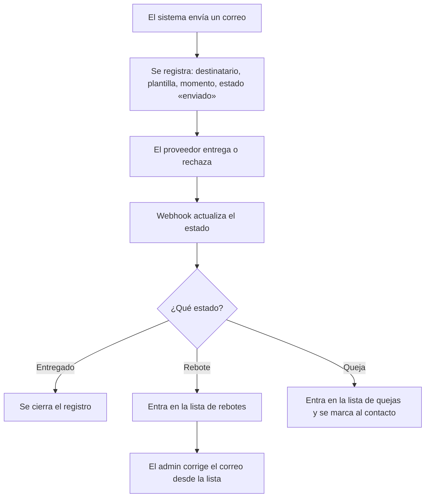
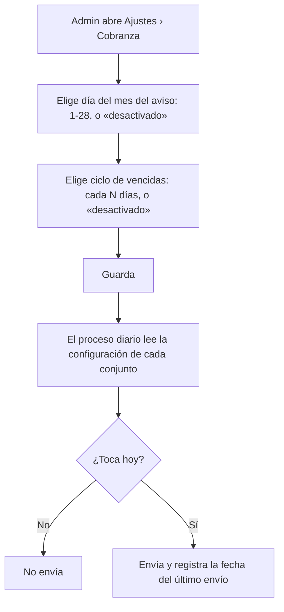

# PRD-V-FLOW-003 — Cobranza que llega: entrega medida y calendario del conjunto

| | |
|---|---|
| **ID** | `PRD-V-FLOW-003` (tentativo) |
| **Tipo** | `FLOW` — cambia el proceso de cobranza de punta a punta, que ya existe y corre a diario |
| **Portales** | **`ADMIN`** (alcance) · **`RESIDENTE`** (afectado: recibe mejor correo) · `SUPERADMIN` (afectado: ve la salud de entrega) · `PORTERIA` (no afectado) |
| **Módulo** | Comunicaciones · Cartera |
| **Usuario principal** | `tenant_admin` |
| **Responsable** | David |
| **Estado** | **Lista para desarrollo** — versión 1.0. D1, D2 y G5 cerradas por David el 21 de agosto de 2026 |
| **Dependencias** | **`PRD-V-FEAT-004`** para el adjunto del estado de cuenta. La medición de entrega no depende de nada |
| **Riesgo** | **Medio.** Toca procesos programados que ya corren en producción |
| **Reversibilidad** | **Total** por banderas |
| **Fase comercial** | **Comunicaciones es `libre` en prueba** (verificado en `TRIAL_MODULE_ACCESS`); Cartera es `preview` |

---

## 1. Resumen ejecutivo

Vivaru envía correo de cobranza y **no sabe si llega**. El correo sale por la API de Resend
(`functions/src/email.ts:124`) sin webhook, sin registro de entrega, sin rebotes y sin quejas.
Un residente con el correo mal escrito **nunca recibe nada y nadie se entera**.

Además, el calendario de cobranza **está en el despliegue, no en manos del administrador**:
`sendScheduledReminders` corre a las 9:00 y consume `billingReminderJobs`, que son
**recordatorios de una sola vez por campaña**, no un ciclo.

Esta PRD hace tres cosas: **medir la entrega**, **poner el calendario en manos del conjunto**, y
**adjuntar a cada residente su propio estado de cuenta**.

## 2. Problema y baseline

### Lo que existe, verificado

| Qué | Dónde | Estado |
|---|---|---|
| Envío transaccional | `functions/src/email.ts` — `sendNotificationEmail` | **Existe.** Remitente verificado |
| Catálogo de notificaciones | `src/features/notifications/catalog.ts` | **13 claves**, con override por conjunto |
| **Bandeja en producto** | Colección `notifications` + `use-notifications.ts` | **YA EXISTE**: leído/no leído, enlace y deduplicación |
| Procesos diarios | `functions/src/index.ts` | 7 programados, entre ellos `sendScheduledReminders` (9:00) y `updateOverdueStatements` (7:00) |
| **Medición de entrega** | — | **No existe.** Sin webhook, sin rebotes, sin quejas |
| **Ciclo de vencidas configurable** | — | **No existe.** `billingReminderJobs` es de una sola vez |
| **Día del mes del aviso** | — | **No existe.** Los horarios son fijos en el código |
| Adjunto del estado de cuenta | — | **No existe**; el documento tampoco (`PRD-V-FEAT-004`) |

> **Corrección a una suposición previa:** la bandeja de notificaciones dentro del producto
> **estaba anotada como hueco y no lo es**. Existe y funciona. Lo que sí es código muerto es
> `src/features/notifications/notification-center.tsx`, un componente con **cuatro
> notificaciones inventadas a mano** que no se renderiza en ninguna parte. **Debe borrarse**, no
> conectarse.

### Baseline

| Indicador | Hoy |
|---|---|
| Correos con estado de entrega conocido | **0 de todos los enviados** |
| Rebotes detectados y corregidos | **0. No se detectan** |
| Conjuntos que eligen su día de cobro | **0** |
| Correos de cobranza con el estado de cuenta del destinatario | **0** |

**Métrica de éxito:** conocer el estado de entrega del **100%** de los correos enviados, y que
la lista de rebotes se pueda accionar sobre el contacto sin salir del producto.

## 3. Usuarios, roles y permisos

| Rol | Ve | Puede | **NO puede** |
|---|---|---|---|
| `tenant_admin` | Entregas, rebotes y quejas de **su** conjunto; el calendario de cobranza | Configurar día del aviso y ciclo de vencidas; corregir el correo desde la lista de rebotes | Ver el contenido de correos de otro conjunto. Configurar por debajo del mínimo de R6. Operar si está `suspended` o `expired` |
| `superadmin` | Entregabilidad **de todos** los conjuntos | Todo | — |

> **Nota de portafolio — 21 ago 2026.** Lo que esta PRD asigna al rol `committee` **hoy no es
> alcanzable**: `canAccessPath` (`src/lib/auth/routing.ts:28`) lo deja **solo en
> `/admin/documents`**. A nivel de reglas **sí puede leer** —es miembro del conjunto— así que
> **el bloqueo es de navegación, no de permisos**. Ampliar su alcance merece **PRD propia**:
> decidir qué pantallas ve y comprobar que las reglas no le abran datos personales por el
> camino. **Hasta entonces, las filas de `committee` de esta tabla son intención declarada, no
> capacidad disponible.**

| `committee` | Resumen de entregabilidad, sin direcciones | Consultar | Ver direcciones individuales |
| `resident` | Nada de esto | — | Acceder |
| `security_guard` | Nada | — | Acceder |

**El consejo ve el resumen sin direcciones:** saber que el 8% de los correos rebota es
información de gobierno; saber **de quién** es dato personal de un vecino.

## 4. Objetivo, alcance y exclusiones

### Entra

1. **Registro de entrega por correo**: enviado, entregado, rebotado, queja.
2. **Webhook** del proveedor para recibir esos estados.
3. **Lista de rebotes accionable**, que lleva al contacto a corregir.
4. **Día del mes del aviso de cobro**, por conjunto.
5. **Ciclo de vencidas cada N días**, por conjunto, con interruptor de apagado.
6. **Adjuntar a cada residente su propio estado de cuenta** en el envío de cobranza.
7. **Firma y pie de página** configurables por conjunto.
8. Panel de salud de entrega para administración y superadmin.

### No entra, y por qué

| Excluido | Por qué |
|---|---|
| **Link de pago en el correo** | **Vivaru no tiene pasarela de pago integrada.** Prometer un link sin gateway es prometer lo que no existe. Cuando haya pasarela, es una PRD suya |
| **Bandeja de notificaciones en producto** | **Ya existe** (§2). Nada que construir |
| **Plantillas libres de comunicación** | El catálogo de 13 notificaciones ya admite override por conjunto. Plantillas libres son otra cosa y van a Fase 2 |
| **Programación de comunicados libres** | Fase 2. Lo urgente es el calendario de **cobranza**, no el de comunicados |
| **Canal SMS o WhatsApp** | Backlog. **WhatsApp hoy solo existe en el embudo de marketing**, no como canal a residentes |
| **Apertura y clics** | Medir aperturas exige rastreo con implicaciones de privacidad que nadie ha pedido. **Entrega y rebote sí; apertura no** |

## 5. Flujo funcional

### 5.1 Medir la entrega

### 5.2 El calendario del conjunto

**El día 29, 30 y 31 no se ofrecen**: no existen en todos los meses y un aviso que a veces no
sale es peor que uno que sale siempre el 28.

### 5.3 Casos límite

| Caso | Comportamiento |
|---|---|
| Residente sin correo | No se envía; **entra en la lista de rebotes como «sin dirección»**. Nunca se pierde en silencio |
| El webhook llega dos veces | Idempotente por id de mensaje del proveedor |
| El webhook no llega nunca | El registro queda en «enviado» y, pasado un plazo, en **«sin confirmar»**. Nunca en «entregado» |
| Rebote permanente repetido | El contacto se marca; el producto **deja de enviarle** y lo dice |
| Ciclo de vencidas con cero unidades vencidas | No envía nada. **No manda un correo vacío** |
| Conjunto `suspended` / `expired` | **No se envía nada.** Un conjunto que no opera no debe cobrar |
| Conjunto en `trial` | **Comunicaciones es `libre`**: se envía con normalidad. **No existe hoy ninguna cuota de correo durante la prueba** — verificado en `functions/src/email.ts` y `trial-modules.ts` |

## 6. Estados y transiciones

### El registro de envío

| Estado | Qué significa | Quién transiciona | Salida |
|---|---|---|---|
| **`enviado`** | Aceptado por el proveedor | Sistema | → `entregado` · `rebotado` · `queja` · `sin_confirmar` |
| **`entregado`** | Confirmado | Webhook | **Terminal** |
| **`rebotado`** | Rechazado | Webhook | **Terminal**; el contacto queda marcado |
| **`queja`** | Marcado como spam | Webhook | **Terminal**; el contacto queda marcado |
| **`sin_confirmar`** | Pasó el plazo sin noticia | Proceso diario | **Terminal** |

**`sin_confirmar` existe para no mentir.** Sin él, la ausencia de webhook se leería como éxito,
que es justo el problema que esta PRD resuelve.

## 7. Contrato de datos y multi-tenancy

### 7.1 Colección nueva: `emailDeliveries`

`tenantId` · `providerMessageId` · `recipientEmail` · `recipientUserId?` · `notificationKey` ·
`subject` · `status` · `sentAt` · `updatedAt` · `bounceType?` · `bounceReason?`

**Id del documento = `providerMessageId`**, para que la idempotencia del webhook la garantice la
base y no una comprobación previa.

### 7.2 Campos nuevos en `tenantSettings`

| Campo | Tipo | Nota |
|---|---|---|
| `billingCalendar.noticeDayOfMonth` | `number \| null` | 1–28. `null` = desactivado |
| `billingCalendar.overdueCycleDays` | `number \| null` | ≥ `MIN_CICLO` (R6). `null` = desactivado |
| `billingCalendar.lastNoticeSentAt` | `string` | Escrito por el proceso |
| `billingCalendar.lastOverdueSentAt` | `string` | Escrito por el proceso |
| `emailFooterHtml` | `string` | Pie del correo del conjunto |
| `emailSignatureHtml` | `string` | Firma del remitente |

### 7.3 Campo nuevo en `people`

`emailStatus`: `"ok" \| "bounced" \| "complained"`. **Lo escribe el webhook**, y gobierna R7.

### 7.4 Multi-tenancy, ciclo de vida y retención

- Todo lleva **`tenantId`**; toda consulta lo filtra.
- **`suspended` / `expired`** → **no se envía nada** (§5.3). Es más estricto que solo lectura, y
  a propósito.
- **`trial`** → **Comunicaciones es `libre`** (`TRIAL_MODULE_ACCESS.communications`). **No hay
  cuota de correo durante la prueba**, ni en `email.ts` ni en `trial-modules.ts`. Si algún día se
  quiere limitar el correo en prueba, **es una decisión de producto que esta PRD no toma**.
- **Retención:** `emailDeliveries` guarda una dirección de correo, que es dato personal. **Entra
  en la ventana de 12 meses** de `docs/politica-retencion-datos.md`, con el mismo tratamiento
  que ya aplica el job de anonimización.

## 8. Reglas de negocio

| # | Regla |
|---|---|
| **R1** | Todo correo enviado por el sistema deja registro **antes** de enviarse |
| **R2** | Un registro **nunca** pasa a `entregado` sin confirmación del proveedor |
| **R3** | El webhook es idempotente por id de mensaje |
| **R4** | Un destinatario sin dirección genera registro `rebotado` con motivo «sin dirección» |
| **R5** | El día del aviso solo admite 1–28, o desactivado |
| **R6** | El ciclo de vencidas tiene un **mínimo**, para que el producto no pueda usarse para hostigar |
| **R7** | A un contacto con `emailStatus` distinto de `ok` **no se le envía**, y se muestra al administrador para que lo corrija |
| **R8** | Un conjunto `suspended` o `expired` **no envía ningún correo de cobranza** |
| **R9** | El adjunto del estado de cuenta es **el de la unidad del destinatario**, nunca el de otra |
| **R10** | El consejo ve agregados de entregabilidad, **nunca direcciones** |

**R6 no es un detalle técnico.** Un ciclo de un día es un correo diario a alguien que debe
dinero, y eso tiene nombre en varias legislaciones. **`MIN_CICLO` es la decisión D1.**

**R9 es la que evita el peor error posible** de esta PRD: mandarle a un residente el estado de
cuenta de su vecino.

## 9. Notificaciones y correo

Esta PRD **no crea claves nuevas** en el catálogo: reutiliza `billing_new`, `billing_overdue` y
`billing_reminder`. Lo que cambia es **cuándo salen** (calendario del conjunto), **qué llevan**
(el estado de cuenta del destinatario) y **que se sabe si llegaron**.

El remitente sigue siendo el verificado de `functions/src/email.ts`. **No se promete ningún
plazo de respuesta humana.**

## 10. Criterios de aceptación

### Deben pasar

| # | Criterio |
|---|---|
| CA1 | Todo correo enviado deja registro con estado `enviado` |
| CA2 | El webhook de entrega lo pasa a `entregado` |
| CA3 | Un rebote lo pasa a `rebotado` y **marca al contacto** |
| CA4 | Un webhook repetido **no duplica** el registro |
| CA5 | Un destinatario sin dirección aparece en la lista de rebotes |
| CA6 | Un contacto marcado **deja de recibir** y se muestra al administrador |
| CA7 | El administrador fija el día 5 y el aviso sale el día 5, no antes |
| CA8 | Desactivar el aviso lo detiene, **sin desactivar el resto de notificaciones** |
| CA9 | El ciclo de vencidas cada 7 días envía solo a unidades con saldo vencido |
| CA10 | Un ciclo sin unidades vencidas **no envía nada** |
| CA11 | Cada residente recibe **su** estado de cuenta adjunto |
| CA12 | Un conjunto `suspended` **no envía** ningún correo de cobranza |
| CA13 | El consejo ve porcentajes de entrega **sin ninguna dirección** |

### Deben fallar

| # | Criterio |
|---|---|
| CF1 | Fijar el día 31 → **rechazado** |
| CF2 | Fijar un ciclo por debajo del mínimo → **rechazado** |
| CF3 | Un registro pasa a `entregado` sin webhook → **imposible** |
| CF4 | Un residente accede al panel de entregabilidad → **denegado** |
| CF5 | El consejo ve una dirección individual → **no aparece** |
| CF6 | Un administrador ve entregas de otro conjunto → **denegado** |
| CF7 | Un residente recibe adjunto el estado de cuenta de otra unidad → **imposible** (R9) |
| CF8 | Webhook con firma inválida → **rechazado** |
| CF9 | Consulta de `emailDeliveries` sin `where("tenantId")` → **denegada entera** |
| CF10 | Enviar cobranza desde un conjunto en `trial` → **permitido**: Comunicaciones es `libre`. **Es el comportamiento correcto, no un hueco** |

## 11. Arquitectura y dependencias

### 11.1 Cliente directo o callable

| Operación | Decisión | Por qué |
|---|---|---|
| **Recibir el webhook** | **Función HTTP con verificación de firma** | Entra desde fuera. **Sin verificar la firma, cualquiera podría marcar correos como entregados** |
| **Registrar el envío** | **Dentro de `sendNotificationEmail`** | Si el registro viviera aparte, un fallo entre ambos dejaría correos sin rastro |
| **Configurar el calendario** | **Cliente directo** | CRUD en `tenantSettings`, protegido por las reglas. Las validaciones de R5 y R6 van **también** en las reglas |
| **Enviar según calendario** | **Proceso programado**, el que ya existe | Se le añade la lectura de la configuración por conjunto |
| **Leer entregabilidad** | **Cliente directo** | Consulta con `tenantId` |

### 11.2 Reglas de Firestore

Bloque nuevo para `emailDeliveries`: **lectura para administración y superadmin; escritura solo
desde el servidor.** El consejo **no lee esta colección** — su resumen se sirve agregado.

En `tenantSettings`, las reglas deben validar **rango del día (1–28) y mínimo del ciclo**: si
solo se valida en el formulario, se salta con una escritura directa.

### 11.3 Índices, jobs y banderas

- **Índices:** `emailDeliveries` por `tenantId` + `status` + `sentAt`.
- **Jobs:** uno nuevo que cierra en `sin_confirmar` los registros pasados de plazo. Los dos
  existentes leen ahora la configuración del conjunto.
- **Banderas:** `email-delivery-tracking` y `billing-calendar`, separadas.

### 11.4 Dependencia

**`PRD-V-FEAT-004`** produce el estado de cuenta. Sin ella, el punto 6 del alcance no se puede
construir. **El resto de esta PRD no la necesita.**

### 11.5 Una limpieza que va dentro

**Borrar `src/features/notifications/notification-center.tsx`.** Es un componente muerto con
cuatro notificaciones inventadas. Que exista invita a que alguien lo conecte creyendo que es la
bandeja real, que está en otro sitio y sí funciona.

## 12. Riesgos y mitigaciones

| Riesgo | Señal | Mitigación |
|---|---|---|
| **Mandar a un residente el estado de cuenta de otro** | Reclamo grave de privacidad | R9 y CF7; el adjunto se resuelve por unidad del destinatario, no por lista |
| Webhook falsificado que marca todo como entregado | Métricas falsas | Verificación de firma (§11.1) y CF8 |
| El producto se usa para hostigar | Denuncia | R6 y el mínimo de D1 |
| Un conjunto se queda sin avisos por desactivar sin querer | Cartera que sube | El panel muestra «aviso desactivado» de forma visible |
| Se rompe un proceso que ya corre en producción | Correos que dejan de salir | Los dos procesos existentes **se modifican detrás de bandera**; con la bandera apagada leen los valores fijos de hoy |
| Coste | — | **Bajo.** Un documento por correo enviado. **Entra en retención** |

## 13. Despliegue, rollback y Story Map

**Orden:** reglas → functions (webhook, registro, calendario) → front, con las dos banderas
apagadas.

**Rollback:** total por bandera. Con `billing-calendar` apagada, los procesos vuelven a los
horarios fijos de hoy. Con `email-delivery-tracking` apagada, se deja de registrar y **el envío
no se ve afectado**: el registro nunca puede impedir que salga un correo.

**Validación:** staging cubre el webhook con envíos reales a direcciones de prueba, **incluida
una que rebote a propósito**. En producción, comprobar que los correos de los nueve conjuntos de
prueba siguen saliendo igual con las banderas apagadas.

### Story Map

**MVP** — registro de envíos · webhook · lista de rebotes accionable · día del aviso y ciclo de
vencidas por conjunto · borrar el componente muerto.

**Fase 2** — adjunto del estado de cuenta (necesita `FEAT-004`) · firma y pie configurables ·
panel de entregabilidad para superadmin.

**Fase 3** — plantillas libres · programación de comunicados · segundo canal.

## 14. Decisiones abiertas

### D1 · ¿Cuál es el mínimo del ciclo de vencidas?

Habitanto permite **1 día**: un correo diario a quien debe. Es legal en unos sitios y
cuestionable en otros, y **nos exponemos con muy poco beneficio**.

**Recomendación: mínimo 7 días**, y que el producto explique por qué al configurarlo. Semanal es
suficiente para recordar y difícil de llamar hostigamiento.

> **CERRADA el 21 ago 2026 — aceptada.** `MIN_CICLO = 7` días.

### D2 · ¿Qué plazo convierte «enviado» en «sin confirmar»?

**Recomendación: 48 horas.** Los rebotes duros llegan en minutos y los blandos en horas; pasadas
48, la ausencia de noticia es información, no espera.

> **CERRADA el 21 ago 2026 — aceptada.** 48 horas.

### D3 · Quién mira la lista de rebotes — **CERRADA**

> **CERRADA el 21 ago 2026.** **Aviso persistente en el panel del administrador**, con la lista
> accionable desde ahí. **No** una bandeja de tareas aparte. El administrador es quien puede
> corregir la dirección, y un indicador que no desaparece hasta llegar a cero es el mecanismo
> más barato que funciona: una lista que hay que acordarse de visitar, no se visita.

**Ninguna decisión abierta.**

## 15. Puertas

| Puerta | Estado |
|---|---|
| **G0 Necesidad** | ✅ Verificado: envío por API sin webhook; recordatorios de una sola vez; horarios fijos en código |
| **G1 Valor** | ✅ Baseline y métrica en §2 |
| **G2 Datos y permisos** | ✅ Definidos, con el matiz del consejo sin direcciones y la retención declarada |
| **G3 Riesgo** | ✅ Banderas, firma del webhook, y el registro nunca bloquea el envío |
| **G4 Aceptación** | ✅ 13 que pasan, 9 que deben fallar |
| **G5 Operación** | ✅ **Cerrada el 21 ago 2026.** La lista de rebotes vive detrás de un **aviso persistente en el panel del administrador**, que no desaparece hasta que no queda ninguno. Es él quien corrige la dirección |
| **G6 Escala** | ✅ Un documento por correo, con retención que lo acota |

**Lista para desarrollo.** Las siete puertas superadas y las tres decisiones, cerradas.

**Secuencia:** el punto 6 del alcance —adjuntar el estado de cuenta— necesita `PRD-V-FEAT-004`.
El resto no depende de nada.
