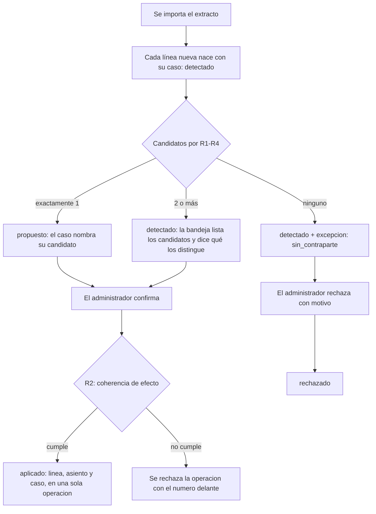

# PRD-V-FLOW-004 — El expediente de conciliación: de la evidencia a la aplicación, el rechazo o el reverso

| | |
|---|---|
| **ID** | `PRD-V-FLOW-004` — validado contra el índice: `FLOW-001`, `FLOW-002` y `FLOW-003` están tomados |
| **Alias de hoja de ruta** | `FIN-002`, fase `F1` de `docs/roadmap-finance.md` §7 |
| **Tipo** | `FLOW` — cambia un proceso de punta a punta que ya existe y corre hoy en `/admin/finanzas/conciliacion` |
| **Portales** | **`ADMIN`** (alcance) · `SUPERADMIN` (afectado: lee) · `RESIDENTE` y `PORTERIA` (no entran, y la regla lo dice) |
| **Módulo** | Finanzas · Conciliación bancaria |
| **Usuario principal** | `tenant_admin` |
| **Responsable** | David |
| **Estado** | **Lista para desarrollo** — versión 1.0. La cascada de la reversión (D1) la cerró David el 29 de agosto de 2026 |
| **Dependencias** | **`FIN-001`, cumplida y en producción desde el 20 ago 2026.** Nada más por delante |
| **Riesgo** | **Medio-alto.** Toca el enlace entre el extracto y el libro, y una de las escrituras vive en la callable que revierte pagos |
| **Reversibilidad** | **PARCIAL, y esto va en primera línea.** La bandera revierte la bandeja y el expediente. **No revierte la coherencia**: apagarla no debe devolver el producto al estado que permitió el defecto de §2. Ver §13 |
| **Fase comercial** | `finanzas` es **`preview`** en prueba (verificado en `TRIAL_MODULE_ACCESS`): se ve con datos de ejemplo y no se opera |

---

## 1. Resumen ejecutivo

La pantalla de conciliación **casa líneas de banco contra el libro y no comprueba nada**: ofrece
todos los asientos sin conciliar del conjunto ordenados por cercanía de monto, y escribe el
emparejamiento que se le pida. **De los 19 emparejamientos que hay en producción, uno es falso**
— una salida de banco de −300.000 casada contra un ingreso de +40.000 — y el producto lo cuenta
como conciliado.

Además, el emparejamiento **no deja rastro de por qué**: no hay dónde anotar que una línea no
tiene contraparte, ni qué se decidió, ni quién. Y cuando un pago se revierte, la línea de banco
**se queda conciliada contra un asiento anulado**.

Esta PRD crea el **expediente** (`ReconciliationCase`): un caso por línea de extracto, con
estados, candidatos calculados con reglas explicadas, motivos obligatorios en las salidas y
**cascada al revertir**. Su criterio de salida es el de `F1`: **un caso se rastrea desde la
evidencia recibida hasta la aplicación, el rechazo o el reverso.**

## 2. Problema y baseline

### Lo que existe, verificado el 28–29 de agosto de 2026

| Qué | Dónde | Estado |
|---|---|---|
| Pantalla de conciliación | `src/app/(admin)/admin/finanzas/conciliacion/page.tsx` — 413 líneas | **Existe**, con modal de casado y alta de cuentas |
| Importación de extracto CSV | `use-reconciliation.ts` — `importBankStatementLines` | **Existe.** Parsea montos LATAM y fechas. **No deduplica nada** |
| Casado y descasado | `matchLine` / `unmatchLine` | **Existen.** Escriben en lote, **sin ninguna validación** |
| Marca de conciliado en el asiento | `LedgerEntry.reconciled` + `bankStatementLineId` | **Existe** (candidato `D6` del catálogo de Habitanto, ya cubierto) |
| **Candidatos con criterio** | `page.tsx:167` | **No existe.** Devuelve **todos** los asientos sin conciliar, ordenados por `|monto|`. Sin filtro de signo, fecha ni cuenta |
| **Expediente** | — | **No existe.** `ReconciliationCase` da **cero apariciones** en todo el código |
| **Motivos y excepciones** | — | **No existen.** Una línea sin pareja solo puede quedarse «pendiente», muda |
| **Coherencia al revertir** | `revertirPago` (`functions/src/payments.ts:1495`) | **No existe.** Marca `reversedByEntryId` y **no toca `reconciled` ni la línea** |
| Veto de escritura sobre asientos de pago | `firestore.rules:657` | **Existe desde el 24 ago.** En un asiento `billingStatement`/`advance` el cliente **solo** puede tocar `reconciled`, `bankStatementLineId`, `reconciledAt` |

> **Dos trampas del frente, documentadas, que esta ficha da por sabidas.**
> **(1)** La conciliación estuvo **muerta y en verde** hasta el 24 de agosto: el veto de
> `ledgerEntries` rechazaba el `update`, porque Firestore evalúa el documento **resultante**.
> Ninguna estimación anterior al 24 vale. **(2)** Una regla de Firestore **no protege lo que
> escribe una callable**: el Admin SDK no las evalúa. Por eso §11.1 decide dónde vive el guardián.

### Baseline — producción (`hogaru-1`), medido, no supuesto

| Indicador | Hoy |
|---|---|
| Líneas de extracto | **27** (22 en `conjunto-las-playas`, 5 en `tenant-santa-maria`) |
| Conciliadas · pendientes | **19 · 8** |
| Expedientes | **0** ← la entrega |
| **Emparejamientos que violan la coherencia de efecto** | **1 de 19 (5,3%)**, y el producto lo muestra como bueno |
| Líneas pendientes con **candidato único** | **0 de 8.** Seis tienen 8–9 candidatos; una tiene 29 por monto y 0 por fecha; una tiene 0 |
| Líneas con clave de duplicado | **0.** Reimportar el mismo extracto crea 27 líneas nuevas en silencio |
| Casos con motivo escrito | **0.** No hay dónde escribirlo |
| Integridad del enlace línea ↔ asiento | **0 incoherencias**, 19/19 con contraparte viva |

**Por qué las 8 pendientes son el banco de pruebas y no hace falta sembrar.** Son exactamente los
tres arquetipos que el expediente tiene que distinguir:

| Arquetipo | Cuántas | Qué las define |
|---|---|---|
| **Fungibles** | **6** | Seis SPEI de MXN 3.000 el mismo día, idénticos salvo el sufijo `— T1-101`, `T1-102`… **El discriminante es el código de unidad del texto, no el monto ni la fecha** |
| **Sin contraparte** | **1** | Comisión bancaria de −180 con **cero** candidatos: no falta casar, falta registrar el asiento |
| **No identificada** | **1** | «Depósito en efectivo (sin identificar)» de 3.000, sin nada en su fecha |

**Métrica de éxito.** (a) **100%** de las líneas con expediente; (b) **cero** emparejamientos que
violen la coherencia de efecto —hoy 1 de 19—; (c) las 8 pendientes clasificadas: 6 en bandeja con
sus candidatos, 2 como excepción con motivo.

> **Lo que NO se puede medir todavía, y se dice:** minutos por línea y porcentaje de excepciones.
> **Producción no tiene clientes** —los nueve conjuntos son `isExample: true`, verificado el 29 de
> agosto—, así que nadie concilia a diario. `TBD`: se mide con el primer conjunto real, y es
> también el disparador de `PH-002`.

## 3. Usuarios, roles y permisos

| Rol | Ve | Puede | **NO puede** |
|---|---|---|---|
| `tenant_admin` | La bandeja y el expediente de **su** conjunto | Aplicar un caso, rechazarlo con motivo, reabrirlo, importar extracto | **Aplicar un emparejamiento incoherente** (R2). Escribir `reconciled` o `matchedLedgerEntryId` por su cuenta (R8). Borrar un caso (R9). Operar si el conjunto está `suspended` o `expired`. Ver otro conjunto |
| `superadmin` | Todos los conjuntos | Lo mismo, en cualquier conjunto | Saltarse R2: **la coherencia no tiene excepción por rol** |
| `resident` | **Nada** | — | Leer `reconciliationCases`. Las descripciones del extracto nombran unidades y personas |
| `security_guard` | **Nada** | — | Igual |
| `committee` | **Nada** | — | **Igual, y es deliberado**: el consejo no tiene cuentas bancarias, por la misma razón que en `bankAccounts` |

## 4. Objetivo, alcance y exclusiones

**Objetivo.** Que cada línea de extracto tenga un expediente que diga en qué estado está, qué
candidatos tenía, qué se decidió, quién lo decidió y por qué — y que un reverso de dinero **no
pueda dejar atrás una conciliación que ya no es cierta**.

### Entra

1. **`ReconciliationCase`**: un caso por línea, con estados versionados e historia de transiciones.
2. **Candidatos determinísticos** con reglas explicadas (R1–R4), y **propuesta solo cuando el
   candidato es único**.
3. **Coherencia de efecto obligatoria** al aplicar (R2). Es lo que cierra el defecto de §2.
4. **Duplicados del extracto** por clave natural, garantizada por la base (R5).
5. **Bandeja de excepciones** con los tres arquetipos y **motivo obligatorio** al rechazar.
6. **Cascada de la reversión (R7)**, en los tres caminos que anulan o borran un asiento.
7. **Relleno de los 27 casos existentes**, para que la pantalla diga la verdad sobre lo ya hecho.

### No entra, y por qué

| Excluido | Por qué |
|---|---|
| **Cierre de conciliación por fecha de corte** —depósitos en tránsito, cheques no cobrados, resumen de saldos— | **Decidido por escrito, no por criterio de esta ficha.** Son los candidatos `D1–D4` y viven en **`PH-002` — Lo que espera al primer pago real**, «sin PRD escrita a propósito». `roadmap-producto.md` lo dice literal: *«Contesta la pregunta abierta de `FIN-002`: no, todavía no»* |
| **Una línea contra varios asientos** | Un depósito que paga dos cuotas es real, pero **ninguna de las 27 líneas lo es**. Fase 2 |
| **Extraer el código de unidad del texto como discriminante automático** | Es la evolución natural de las 6 fungibles, y exige normalización de descripciones que hoy no existe. En la entrega 1 el discriminante **se le enseña a la persona**, no se aplica solo. Fase 2 |
| **Catálogo de motivos configurable por conjunto** | El catálogo nace cerrado (R6). Abrirlo sin haber visto qué motivos se usan de verdad es inventar complejidad |
| **Bandeja de ingresos no identificados como módulo aparte** | Es el candidato `D5`, que `FLOW-002` mandó a «PRD aparte» y `PH-002` no recoge. **Cae aquí**, como uno de los tres arquetipos — no como pantalla propia |
| **Interés de mora** | `PH-002` |
| **IA de cualquier tipo** | `F2` del roadmap de Finance, y su criterio de entrada es `F1` **más un conjunto de documentos reales**, que no existe |

## 5. Flujo funcional

### 5.1 Camino feliz — la línea que casa sola

### 5.2 La bandeja de excepciones

Tres grupos, que son los tres arquetipos medidos, más uno que nace de §2:

1. **Sin contraparte** — cero candidatos. Acción: registrar el asiento que falta, o rechazar con
   motivo `comision_bancaria` / `sin_contraparte`.
2. **Varios candidatos** — la bandeja los lista y **nombra el discriminante**: cuando los
   candidatos empatan en fecha y monto, se muestra la descripción de la línea y el concepto de
   cada asiento, que es lo único que los separa.
3. **No identificada** — el dinero llegó y no se sabe de quién. **Ojo: el sistema NO la distingue
   de «sin contraparte»**, y es deliberado — deducirlo del texto sería inventar. Las dos nacen
   `sin_contraparte`; **«no identificada» es una decisión que la persona registra** con el motivo
   `deposito_no_identificado`. Medido en el ensayo del relleno: de las 8 pendientes, **2 caen aquí**
   —la comisión de −180 y el depósito en efectivo—, y solo quien concilia sabe cuál es cuál.
4. **Conciliaciones a revisar** — casos `aplicado` que **incumplen R2**. Hoy hay **uno**. Ver §5.4.

### 5.3 Reverso — la cascada (R7)

Cuando el asiento contraparte de una línea conciliada se anula o se borra:

1. La línea se suelta: `reconciled: false`, `matchedLedgerEntryId: null`.
2. El caso pasa a **`reversado`**, con **motivo automático** que nombra el hecho —el id del
   asiento de reverso, o «asiento eliminado por el ciclo automático de egresos»—.
3. El caso vuelve a la bandeja como excepción, y desde ahí se puede aplicar o rechazar otra vez.

> **Por qué cascada y no bloqueo.** Es la decisión de David del 29 de agosto de 2026, y sigue el
> patrón que `FLOW-002` ya cerró dos veces: **`R8` bloquea** cuando aguas abajo hay trabajo manual
> que deshacer primero —los cruces de un anticipo—, y **`R15` cascada** cuando aguas abajo hay una
> consecuencia mecánica —el anticipo `open`—, con motivo automático. Una conciliación es lo
> segundo. Y el propio veto de `firestore.rules:657` ya trata el enlace de conciliación como **lo
> único que puede moverse** en un asiento de pago. **Negar la reversión bloquearía una corrección
> de dinero por una formalidad contable.**

### 5.4 El emparejamiento falso que ya está escrito

La línea `sVYB2DVgKFHXEZctNqkr` (−300.000, «Mantenimiento bomba de agua», `tenant-santa-maria`)
está conciliada desde el **20 de agosto** contra el asiento `igdiGS5OpFXW2LyI6gbz` (+40.000,
«Otros ingresos», seis días antes).

**No se corrige el dato.** El criterio ya estaba escrito en `roadmap-finance.md` §9: los datos
históricos de conjuntos de ejemplo no se corrigen hasta que entre un pago real, y **los nueve
conjuntos son `isExample: true`** (verificado el 29 de agosto). Lo que hace esta entrega es
**ponerle nombre**: el caso nace `aplicado` —porque eso es lo que pasó— con
`incoherencias: ["signo", "monto"]`, y aparece en la bandeja bajo «conciliaciones a revisar».
**El expediente no reescribe la historia; la hace legible.**

### 5.5 Casos límite

| Caso | Qué pasa |
|---|---|
| Se borra una línea de extracto conciliada | `deleteBankStatementLine` ya libera el asiento. Además, el caso pasa a `rechazado` con motivo automático `linea_eliminada` |
| Se importa un extracto con líneas que ya existen | R5: no se crean, y el resultado las cuenta como **omitidas por duplicadas**, no como error |
| Un asiento candidato se concilia con otra línea mientras la bandeja está abierta | Al aplicar, la operación relee y **falla explícitamente**: «ese movimiento ya fue conciliado» |
| Conjunto `suspended` o `expired` | La bandeja se ve; **ninguna acción escribe** (`tenantOperable`) |
| Conjunto en prueba | `finanzas` es `preview`: se ve con datos de ejemplo y no se opera (`previewModuleWritable`) |
| Un asiento sin `bankAccountId` | **16 de 93 no lo tienen.** No descarta: R1 solo compara cuando el asiento declara cuenta |

## 6. Estados y transiciones

| Estado | Qué significa | Quién lo provoca | Salida |
|---|---|---|---|
| **`detectado`** | La línea existe y nadie ha decidido nada | El sistema, al nacer la línea | `propuesto`, `aplicado`, `rechazado` |
| **`propuesto`** | Hay **exactamente un** candidato coherente | El sistema | `aplicado`, `rechazado`, `detectado` (si el candidato deja de estar libre) |
| **`aplicado`** | La línea está casada con un asiento | `tenant_admin` / `superadmin` | `reversado` (por un hecho), `detectado` (al descasar a mano) |
| **`rechazado`** | Se decidió que esta línea no casa. **Motivo obligatorio** | `tenant_admin` / `superadmin` | `detectado` (reabrir, con motivo) |
| **`reversado`** | Su asiento fue anulado o borrado. **Motivo automático** | El sistema, por cascada R7 | `aplicado`, `rechazado`, `detectado` |

**No hay estado terminal absoluto, y es deliberado.** `aplicado` es el cierre normal y `rechazado`
el cierre con motivo, pero los dos se reabren — **solo por un hecho** (un reverso, un borrado, una
decisión con motivo escrito), nunca en silencio. **Un estado sin dueño se atasca**: aquí el dueño
de todo lo que no es `aplicado` es el `tenant_admin` del conjunto, y la bandeja es su herramienta.

`version` sube **uno por transición** y la operación la exige: dos pestañas abiertas sobre el
mismo caso no se pisan, la segunda falla.

## 7. Contrato de datos y multi-tenancy

### 7.1 Colección nueva: `reconciliationCases`

| Campo | Tipo | Obligatorio | Quién escribe |
|---|---|---|---|
| `id` | string | Sí | **Derivado: es el id de su `bankStatementLine`.** Un caso por línea, garantizado por la base y no por una lectura previa |
| `tenantId` | string | **Sí** | Servidor |
| `bankAccountId` | string | Sí | Servidor |
| `bankStatementLineId` | string | Sí | Servidor |
| `status` | `detectado \| propuesto \| aplicado \| rechazado \| reversado` | Sí | Servidor |
| `version` | number | Sí | Servidor, +1 por transición |
| `candidateLedgerEntryIds` | string[] | Sí (puede ir vacío) | Servidor |
| `matchedLedgerEntryId` | string \| null | Sí | Servidor |
| `excepcion` | `sin_contraparte \| varios_candidatos \| no_identificada \| null` | Sí | Servidor |
| `incoherencias` | `("signo" \| "monto" \| "fecha" \| "cuenta")[]` | Sí (vacío = sano) | Servidor |
| `motivoCodigo` | ver R6 | En `rechazado` y `reversado` | Servidor, del catálogo |
| `motivoTexto` | string | Solo con `motivoCodigo: "otro"` | Servidor, desde el formulario |
| `history` | `{ de, a, cuando, quien, motivoCodigo, mecanismo }[]` | Sí | Servidor, **solo añade** |
| `createdAt` · `updatedAt` · `updatedBy` | — | Sí | Servidor |

### 7.2 Campo nuevo en `bankStatementLines`

`naturalKey: string` — `tenantId|bankAccountId|date|amount|descripción normalizada`. Ver R5.

### 7.3 Multi-tenancy, ciclo de vida y retención

- **Todo caso lleva `tenantId`**, y toda consulta de lista desde el cliente **filtra por él**: las
  reglas no filtran, **rechazan**; una consulta sin `where("tenantId","==",…)` se deniega entera.
- **Sin retención propia.** El caso vive lo que viva su línea de extracto. No guarda datos
  personales que no estén ya en la línea, así que no entra en las ventanas de
  `functions/src/data-retention.ts`.
- **`reconciliationCases` DEBE añadirse a `PURGEABLE_COLLECTIONS`**
  (`functions/src/trial-lifecycle.ts:177`). Esa lista ya borra `bankStatementLines` al purgar un
  ambiente vencido; sin este cambio **los casos quedarían huérfanos**.

## 8. Reglas de negocio

| | Regla |
|---|---|
| **R1** | **Un asiento es candidato de una línea si:** mismo `tenantId`; **si el asiento declara `bankAccountId`, coincide** —16 de 93 no lo declaran y eso no los descarta—; no está conciliado; no está anulado (`reversedByEntryId` ausente); y cumple R2 y R3 |
| **R2** | **Coherencia de efecto.** El **efecto contable** de un asiento es `(type === "ingreso" ? +1 : −1) × amount`, y **debe ser igual al `amount` de la línea, con su signo**, dentro de `TOLERANCIA_MONEDA` (0,005, la constante que ya existe en `payments.ts:248`). **La regla tiene dos mitades y cazan cosas distintas — la ficha 1.0 las confundía.** La **magnitud** es la que rechaza el par falso de §2, que está a **260.000** de distancia; cualquier comprobación de importe lo habría rechazado, así que lo que ese par demuestra es que **no había ninguna**, no que la mitad del signo sea la que lo caza. El **signo** protege de otra cosa: **casar una salida de banco contra una entrada del libro por el mismo importe**, que comparar valores absolutos aceptaría. Y el signo del propio asiento importa: un reverso lleva monto **negativo** —medido: `type: "ingreso"`, `amount: −1.120.000`—, así que su efecto es una salida de dinero. **Verificado contra los datos: la regla da coherentes 18 de los 19 pares y rechaza el falso** |
| **R3** | **Ventana de fecha: ±3 días.** Medido: el mayor desfase entre pares coherentes reales es **1 día**; el par falso estaba a **6**. La ventana lo excluye por segunda vez, de forma independiente de R2 |
| **R4** | **Se propone solo con candidato único.** Con dos o más el caso se queda en `detectado` y la bandeja **nombra el discriminante**. Medido: **ninguna de las 8 pendientes tiene candidato único**, así que una propuesta automática por monto y fecha habría acertado cero veces y sugerido mal seis |
| **R5** | **Duplicado del extracto = misma clave natural**: `tenantId`, `bankAccountId`, `date`, `amount` y **descripción normalizada** (minúsculas, sin acentos, espacios colapsados). **La descripción es obligatoria en la clave**: sin ella, las 27 líneas de producción producen **4 grupos de duplicados que suman 20 líneas legítimas**; con ella, **0**. La unicidad la garantiza la **base**, por id derivado —como `chartOfAccounts` con `{tenantId}_{code}`—, no una comprobación previa que dos pestañas ganan |
| **R6** | **Motivo obligatorio al salir por rechazo.** Catálogo cerrado: `comision_bancaria`, `sin_contraparte`, `deposito_no_identificado`, `duplicado_del_extracto`, `error_de_carga`, `otro` (exige texto). Un caso `rechazado` sin motivo **no se escribe** |
| **R7** | **Cascada de la reversión.** Anular o borrar un asiento conciliado **suelta su línea y pasa su caso a `reversado`** con motivo automático. Aplica en los **tres** caminos, y son distintos: `revertPayment` (callable, Admin SDK — la única vía para asientos `billingStatement`/`advance`), `reverseLedgerEntry` (cliente, alcanza `manual` y `expense`) y `deleteLedgerEntry` (cliente, borrado físico, alcanza `expense` — y hay líneas conciliadas de gasto: energía, nómina, mantenimiento) |
| **R8** | **El cliente deja de escribir el enlace.** `reconciled`, `matchedLedgerEntryId` y `bankStatementLineId` pasan a escribirse **solo** desde la callable. La regla se estrecha después del front, no antes (§13) |
| **R9** | **Un caso no se borra.** Se cierra con motivo. Es la misma convención contable que `reverseLedgerEntry` («nunca borrar, siempre anular») y que `E8` del catálogo de Habitanto |
| **R10** | **Aplicar es idempotente.** Reaplicar el mismo caso al mismo asiento no duplica nada, no sube `version` y no añade historia |

## 9. Notificaciones y correo

**Ninguna.** El expediente no envía correo ni notificación a nadie: es una herramienta de
escritorio del administrador y lo que produce lo mira quien está trabajando en la bandeja. No se
añade ninguna clave al catálogo de `src/features/notifications/catalog.ts`.

Se escribe **auditoría**, que es distinto: `writeAuditLog` con las acciones
`reconcile_case`, `reject_case` y `reverse_case`, siguiendo el patrón de `revert_payment`
(`functions/src/index.ts:4867`) — se audita **lo que el servidor hizo**, no lo que le pidieron.

## 10. Criterios de aceptación

### Deben pasar

| | Criterio |
|---|---|
| **CA1** | Importar un extracto crea una línea y **su caso `detectado`** por cada fila válida |
| **CA2** | Tras el relleno, **las 27 líneas de producción tienen caso**: 19 `aplicado`, 8 `detectado`. **Verificado en ensayo contra producción el 29 de agosto**: sale exactamente eso, y los 8 se reparten en **6 `varios_candidatos` y 2 `sin_contraparte`** |
| **CA3** | Una línea con **exactamente un** candidato coherente queda `propuesto` y el caso **nombra** ese candidato |
| **CA4** | **Las 6 líneas fungibles de 3.000 quedan `detectado`** con ≥2 candidatos listados. **Ninguna queda `propuesto`** |
| **CA5** | La comisión de **−180 queda `detectado`** con `excepcion: sin_contraparte` y **cero** candidatos |
| **CA6** | Aplicar un caso escribe **línea, asiento y caso, o ninguno de los tres** |
| **CA7** | **R7:** revertir un pago cuyo asiento estaba conciliado suelta la línea, deja el caso en `reversado` con motivo automático que **nombra el asiento de reverso**, y lo devuelve a la bandeja |
| **CA8** | Reimportar el mismo CSV **no crea ninguna línea** y reporta N **omitidas por duplicadas** |
| **CA9** | El par de −300.000 aparece como `aplicado` con `incoherencias: ["signo","monto"]` en «conciliaciones a revisar», **y ni la línea ni el asiento se reescriben** |
| **CA10** | El total de «conciliadas» de la cabecera **deja de contar** los casos con `incoherencias` no vacío |

### Deben fallar

| | Criterio |
|---|---|
| **CF1** | Aplicar la línea de −300.000 contra el asiento de +40.000 → **rechazado**, con los dos números en el mensaje. Lo rechazan **tres** reglas independientes —magnitud, signo y ventana de fecha—, y ninguna existía |
| **CF1b** | Aplicar una salida de banco de −3.000 contra un ingreso del libro de +3.000 → **rechazado por el signo de R2**. **Es el caso que solo la mitad del signo caza**, y producción no lo tiene: se construye |
| **CF2** | Un `resident` que lea `reconciliationCases` → **denegado** |
| **CF3** | Un `tenant_admin` que lea o escriba el caso de **otro** conjunto → **denegado** |
| **CF4** | El cliente que escriba `reconciled` o `matchedLedgerEntryId` directamente → **denegado por reglas** (R8) |
| **CF5** | Aplicar un caso en un conjunto `suspended` → **denegado** (`tenantOperable`) |
| **CF6** | Rechazar sin `motivoCodigo`, o con `otro` sin texto → **denegado** (R6) |
| **CF7** | Aplicar con una `version` desactualizada → **denegado** |
| **CF8** | Aplicar contra un asiento **anulado** (`reversedByEntryId` presente) → **denegado** |

### La falsación, que es obligatoria

Cada guardián se rompe a propósito y **tienen que fallar exactamente las pruebas que deben**:

- **Sustituir R2 por la comparación de valores absolutos** → tiene que fallar **una sola**
  prueba: la del signo, con un par de igual importe y sentido contrario. **CF1 sigue en verde, y
  eso es lo correcto** — el par falso de producción está a 260.000, así que lo rechaza también una
  comprobación de magnitud. La versión 1.0 de esta ficha decía lo contrario y **la falsación lo
  desmintió**: una prueba que dice cazar algo que ya cazaba otra regla no vigila nada. El caso del
  signo **no existe en producción y por eso se construye**, y se dice que es construido.
- **Poner la ventana de R3 en infinito** → CA5 debe seguir pasando (cero candidatos por monto) y
  CA4 debe empeorar. Distinguir las dos cosas.
- **Vaciar la recolección de candidatos** → CA3 y CA4 deben fallar. **Una puerta que se abre sobre
  un conjunto vacío no verifica nada**: la prueba lleva dentro la comprobación de que encontró
  algo.
- **Quitar la cascada de uno solo de los tres caminos de R7** → tiene que fallar **ese** camino. Un
  criterio que solo prueba `revertPayment` deja vivos los otros dos.

## 11. Arquitectura y dependencias

### 11.1 Cliente directo o callable — **callable, y no es discutible**

**Callable `reconcileCase`, `rejectCase` y `reopenCase`**, por cuatro razones y cualquiera basta:

1. **Escribe en tres colecciones** —`bankStatementLines`, `ledgerEntries`, `reconciliationCases`—
   y tiene que ser atómico.
2. **R2 es aritmética que el cliente no debe poder saltarse.** El defecto de §2 es exactamente eso.
3. **La cascada R7 tiene que vivir donde vive el reverso**, y el reverso ya es una callable.
4. **Una regla no puede sostener el invariante sola**: el Admin SDK no la evalúa. La regla queda
   como **refuerzo** —cierra el camino del cliente—, no como guardián.

**La regla sigue siendo necesaria** justamente por R8: sin estrecharla, el camino viejo queda
abierto al lado del nuevo.

### 11.2 Reglas de Firestore

- `reconciliationCases`: lectura para `tenantAdminOrSuper` del conjunto. **Escritura del cliente:
  ninguna** — solo el servidor. Es más estrecho que `bankStatementLines` a propósito.
- `bankStatementLines`: el `update` del cliente deja de poder tocar `reconciled` y
  `matchedLedgerEntryId` (R8), con la misma técnica del veto de `ledgerEntries`: mirar el
  documento **resultante** y acotar `affectedKeys()`.
- `ledgerEntries`: el veto de `firestore.rules:657` **se estrecha en el mismo sentido** — los
  campos de conciliación salen de la lista que el cliente puede tocar.

> **Al probar estas reglas: `updateDoc` es merge y la regla ve el documento RESULTANTE; `setDoc`
> no.** Es lo que dejó la conciliación muerta y en verde durante semanas. Se prueban **en las dos
> direcciones**: que lo legítimo pase y que lo prohibido no.

> **ESCRITAS Y PROBADAS EL 29 DE AGOSTO, Y SIN DESPLEGAR A PROPÓSITO.** 22 pruebas nuevas en
> `tests/firestore.rules.test.ts` (243 en total, en verde contra el emulador), y las cuatro
> falsaciones rompen exactamente la suya. **No se despliegan hasta que las callables y el front
> estén verificados en producción**, porque restringen lo que la pantalla actual hace: si entran
> antes, la conciliación deja de funcionar.
>
> **Y una comprobación que conviene repetir antes de desplegarlas:** el ruleset vivo de producción
> se leyó por la API de Rules el 29 de agosto y da **0 líneas de diferencia** contra el repositorio
> anterior a este cambio. Es decir, un `firebase deploy --only firestore:rules` **solo llevaría
> esto** y nada arrastrado — que es justo lo que no se puede dar por supuesto.
>
> **Dos pruebas de `FLOW-002` cambiaron de signo, y no es una regresión.** Afirmaban que el cliente
> SÍ podía marcar conciliado un asiento de cobro: era correcto para el producto de entonces, en el
> que la pantalla escribía el enlace, y es **exactamente el permiso que escribió el par falso**.
> Ahora afirman lo contrario, con la historia escrita al lado — el mismo campo ha cambiado de
> contrato dos veces en cinco días.

### 11.3 Índices, jobs y banderas

- **Índice**: `bankStatementLines` por `(tenantId, naturalKey)` — lo pide la comprobación de R5
  contra las **27 líneas antiguas**, que no tienen id derivado (§11.5).
- **Jobs**: ninguno nuevo. El cálculo de candidatos ocurre al pedir la bandeja.
- **Bandera**: `producto-expediente-conciliacion`, **nace apagada**, y tiene que poder encenderse
  **por conjunto** — que es la vía del canario. **El catálogo vive en CINCO sitios y los cinco hay
  que tocarlos**, o la bandera existe a medias:

  1. `src/lib/feature-flags/catalog.ts` — el tipo y la ficha
  2. `functions/src/feature-flags.ts` — `FeatureFlagKey` y `FEATURE_FLAG_DEFAULTS`
  3. `functions/scripts/mover-bandera.mjs` — `CLAVES` (global)
  4. `functions/scripts/mover-bandera-de-conjunto.mjs` — `CLAVES` (**por conjunto: el canario**)
  5. El documento `featureFlags/{clave}` en Firestore, y `featureFlagOverrides` para el override

  **El override manda sobre la global**; si se usa, se retira **después** de poner la global.

### 11.4 Qué gobierna la bandera, y qué no

La bandera gobierna **la bandeja, el expediente y las propuestas**. **No gobierna R2.** La
coherencia entra sin interruptor, porque apagarla devolvería el producto al estado que permitió el
par de −300.000. Esto hace la reversibilidad **parcial**, y por eso está declarado en el
encabezado y no escondido aquí.

### 11.5 El relleno, y un compromiso que se declara

Las 27 líneas existentes conservan su id. El relleno (a) crea su caso y (b) les escribe
`naturalKey`. **No se les cambia el id**, porque 19 asientos guardan referencias a ellas.

**Consecuencia honesta:** para las líneas antiguas, R5 se apoya en una **consulta** por
`naturalKey` —que dos importaciones simultáneas podrían ganar— y no en la base. Para todas las
nuevas, el id derivado lo cierra por construcción. La ventana es finita y se cierra sola cuando
las 27 dejen de existir. **Se dice en vez de dejarlo implícito.**

## 12. Riesgos y mitigaciones

| Riesgo | Señal que lo detecta | Mitigación |
|---|---|---|
| **La bandera se enciende y no pasa nada** porque el front desplegado no conoce la clave | La bandeja no aparece con la bandera en `true` | El criterio de encendido no es el documento: es **ver la bandeja pintada** en el navegador |
| **Se estrecha la regla antes que el front** y la pantalla actual deja de poder conciliar | Errores de permisos en producción | **El orden se invierte cuando la regla restringe** (§13) |
| **La cascada se implementa en un solo camino** de los tres | Una línea conciliada contra un asiento anulado | La falsación de §10 lo exige camino por camino |
| **R2 rompe una conciliación legítima** que hoy pasa | Alguno de los 18 pares coherentes deja de serlo | Medido antes de escribir: **18 de 19 la cumplen**, y el que no es el defecto |
| **El expediente se apoya en una regla** y una callable la esquiva | Un caso incoherente escrito por el servidor | §11.1: el guardián es la callable; la regla es refuerzo |
| **Se cuenta como hito una capacidad sobre tabla vacía** | — | **No aplica aquí, y es lo que distingue a este frente**: hay 27 líneas y 93 asientos contra los que verificar |
| **Nadie opera la bandeja** | Casos `detectado` que envejecen | **G5**: hoy no hay clientes; el dueño diario es el `tenant_admin` del primer conjunto real, y esa fecha es el disparador de `PH-002` |

## 13. Despliegue, rollback y Story Map

### Orden — **invertido, y por una razón concreta**

El orden de Vivaru es **reglas → functions → front**. **Aquí no**, porque la regla **restringe**
algo que el front hace hoy: si entra primero, la pantalla actual deja de poder conciliar.

1. **Functions** — las callables nuevas y la cascada R7 dentro de `revertPayment`.
2. **Front** — la bandeja y el expediente; deja de escribir el enlace directamente.
3. **Reglas** — se estrecha `bankStatementLines` y `ledgerEntries` (R8). **Solo cuando 1 y 2 estén
   verificados en producción.**
4. **Relleno** — script de una sola vez, **ensayo por defecto**, idempotente y con comprobación de
   huella antes de escribir, siguiendo `scripts/anular-recibo-000000001.mjs`.

**Producción no se despliega con un push a `master`:** hace falta el rollout manual, y lo lanza
David.

### Rollback

| Qué | Cómo se revierte |
|---|---|
| Bandeja y expediente | Bandera a `false` — global o por conjunto |
| Cascada R7 | **No se revierte por bandera.** Es corrección de integridad; volver atrás exige desplegar |
| R2 | **No se revierte.** Ver §11.4 |
| Reglas estrechadas | Redesplegar las anteriores. **Se leen por la API de Rules y se diferencian contra el repo**: «master = producción» no vale para reglas |
| Relleno | Los casos se borran; **las líneas y los asientos no se tocaron**, así que no hay nada que deshacer ahí |

### Qué se valida dónde

- **Emulador**: R2 en las dos direcciones, R5 con y sin descripción, R6, R8, y las reglas nuevas.
- **Staging**: el flujo entero, la cascada por los tres caminos, e importar dos veces el mismo CSV.
- **Solo en producción**: el relleno contra las 27 líneas reales, y **mirar la bandeja con los
  ojos**. En este proyecto, tres despliegues seguidos se corrigieron por lo que se vio en pantalla
  con las suites en verde.

### Story Map

| Fase | Actividades |
|---|---|
| **MVP (esta PRD)** | Expediente · estados y versión · candidatos R1–R4 · coherencia R2 · duplicados R5 · bandeja y motivos R6 · cascada R7 · reglas R8 · relleno |
| **Fase 2** | Discriminante automático por código de unidad · una línea contra varios asientos · catálogo de motivos por conjunto |
| **`PH-002`** | Cierre por fecha de corte, depósitos en tránsito, cheques no cobrados, resumen de saldos. **Disparador: el primer pago real** |

## 14. Decisiones abiertas

### D1 · ¿Revertir un pago conciliado se niega o cascadea? — **CERRADA**

**Cerrada por David el 29 de agosto de 2026: cascada**, siguiendo `R15` de `FLOW-002`. La línea se
suelta, el caso pasa a `reversado` con motivo automático y vuelve a la bandeja. Fundamento en §5.3.

### D2 · ¿Se corrige el par de −300.000 ya escrito? — **CERRADA**

**No se corrige.** El criterio ya estaba escrito en `roadmap-finance.md` §9 y los nueve conjuntos
son de ejemplo. El expediente **le pone nombre sin reescribirlo** (§5.4). **Se reabre el día que
un conjunto real emita pagos** — el mismo disparador de `PH-002`.

### D3 · ¿Quién opera la bandeja el día que haya un cliente? — **ABIERTA, y no bloquea**

Hoy no hay a quién preguntárselo: producción no tiene clientes. Es `G5` y se cierra con el primer
conjunto real. **No frena la construcción**; frena declararla productiva.

## 15. Puertas

| Puerta | Estado |
|---|---|
| **`G0` Necesidad** | ✅ **Medida.** 1 de 19 emparejamientos es falso; 0 de 8 pendientes tiene candidato único; reimportar duplica |
| **`G1` Valor** | ✅ Baseline en §2 y métrica en tres cifras |
| **`G2` Datos y permisos** | ✅ Contrato en §7, roles en §3 con la columna de lo prohibido, reglas en §11.2 |
| **`G3` Riesgo** | ✅ Validación en la callable, auditoría, rollback declarado **y su límite** |
| **`G4` Aceptación** | ✅ 10 criterios que pasan, 9 que fallan y la falsación de cada guardián |
| **`G5` Operación** | ⚠️ **Abierta a propósito.** Nadie concilia a diario porque no hay clientes. Es `D3`, y es lo que impide marcarla productiva — **no lo que impide construirla** |
| **`G6` Escala** | ✅ 27 líneas hoy. El cálculo de candidatos es sobre los asientos sin conciliar de un conjunto (74 en el mayor); si un conjunto real llega a miles, el cálculo se acota por la ventana de R3 |

**Lista para desarrollo.** Supera `G0`–`G3`. **No se marca productiva** hasta cerrar `G5`.
