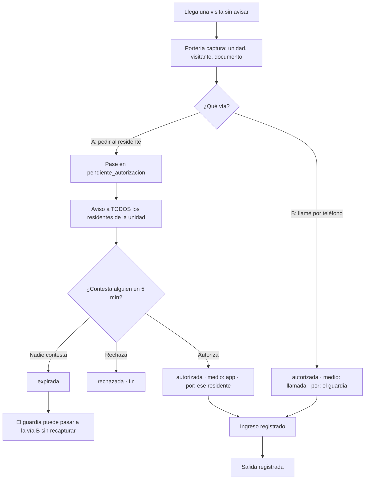

# PRD-V-FLOW-005 — Autorizar la visita que llega sin avisar

| | |
|---|---|
| **ID** | `PRD-V-FLOW-005` (tentativo hasta registrarlo en `docs/prd/README.md`) |
| **Tipo** | `FLOW` — cambia un proceso de punta a punta que ya existe: hoy toda visita nace de la mano del residente, por QR emitido de antemano |
| **Portales** | **`PORTERIA`** (alcance: captura y autoriza) · **`RESIDENTE`** (alcance: autoriza o rechaza) · **`ADMIN`** (alcance menor: lo ve en su bitácora) · `SUPERADMIN` (no tocado) |
| **Módulo** | Visitantes |
| **Usuario principal** | `security_guard` — es quien tiene al visitante delante y hoy no tiene camino |
| **Usuarios secundarios** | `resident` (decide) · `tenant_admin` (audita) |
| **Responsable** | David |
| **Estado** | Lista para desarrollo |
| **Dependencias** | **`PRD-V-PLAT-005` (push al residente).** No bloquea construir, sí bloquea que la vía A sirva de algo: sin push la petición cae en una campana que nadie mira |
| **Riesgo** | **Medio.** No toca dinero, pero **decide quién entra a una propiedad privada** y deja constancia de quién lo autorizó. Un fallo aquí es de seguridad física, no de datos |
| **Reversibilidad** | **Total por bandera.** Apagarla devuelve el flujo de QR intacto. Los pases creados quedan y no estorban |
| **Fase comercial** | Todos los planes |

---

## 1. Resumen ejecutivo

Hoy **toda visita nace de la mano del residente**: emite un QR de antemano y el visitante lo presenta. La visita que se presenta en portería **sin avisar** —que es la mayoría de las visitas reales de un conjunto— no tiene camino en el producto: el guardia la deja pasar por fuera del sistema, o no la deja pasar.

Esta ficha abre dos vías, y son distintas a propósito: **(A)** portería captura los datos y el residente **autoriza desde su teléfono**; **(B)** portería captura los datos, **llama por teléfono fuera de la plataforma** y, con el sí del residente, **autoriza ella misma declarando que llamó**.

Lo que hace útil el registro no es que la visita quede anotada, sino que quede anotado **quién autorizó y por qué medio**.

## 2. Problema y baseline

### 2.1 Lo que ya existe, y por qué no basta

La variante `registro_simple` (`src/lib/config/module-variants.ts`) ya trae **la mitad de la vía B**: botón «Registrar visita» en portería, formulario con unidad anfitriona, residente, nombre y documento, la callable `registerWalkInVisit` con permisos de guardia, registro de auditoría y aviso al residente.

**Pero no autoriza: consuma.** La callable crea el pase con `status: "inside"` y `checkInAt` ya puesto, y el residente recibe *«La portería registró el ingreso de X a tu unidad»* — **un hecho consumado**. No queda ninguna huella de que el guardia llamara ni de que nadie dijera que sí.

### 2.2 El baseline, medido el 30 de agosto de 2026

| Qué | Producción | Staging |
|---|---|---|
| Conjuntos con `registro_simple` | **0 de 8** | **0 de 9** |
| `visitorPasses` totales | 87 | 55 |
| **Registrados por portería** (`registeredByGuard`) | **0** | **0** |

**Cero en toda la historia de los dos ambientes.** No se rompe un flujo en uso: se estrena uno. Eso quita casi todo el riesgo de migración y hace que el momento sea el más barato posible.

### 2.3 La dicotomía que hay que romper

`registerWalkInVisit` **rechaza la operación si el conjunto no está en `registro_simple`**, y `registro_simple` a su vez **oculta el QR y la lista de pases programados**. Son excluyentes por diseño.

**Decisión de David (30 ago 2026): la visita repentina CONVIVE con el QR.** No es un tercer modo ni una extensión del modo simple. La razón es que **la visita no anunciada ocurre en todos los conjuntos**, tengan QR o no — y los diecisiete conjuntos de los dos ambientes están en `qr_full`, así que con la exclusividad actual esto no lo vería nadie.

## 3. Usuarios, roles y permisos

| Rol | Ve | Puede | **NO puede** |
|---|---|---|---|
| `security_guard` | Las visitas del día de su conjunto | **Capturar** una visita no anunciada · **pedir** autorización al residente (vía A) · **autorizar él declarando el medio** (vía B) · registrar entrada y salida | **Autorizar sin declarar el medio.** No puede editar los datos del visitante después de autorizada, ni cambiar la unidad anfitriona |
| `resident` | Las visitas de **su** unidad | **Autorizar o rechazar** una petición dirigida a su unidad | Autorizar la de **otra** unidad · autorizar una ya resuelta · registrar entrada o salida |
| `tenant_admin` | Todas las de su conjunto, con quién autorizó y por qué medio | Consultar y auditar | **Autorizar en nombre de un residente.** Si el administrador pudiera, la constancia dejaría de significar nada |
| `superadmin` | Lo mismo que el administrador | Lo mismo | Igual |
| Consejo | Nada | — | `canAccessPath` lo deja solo en `/admin/documents` |

## 4. Objetivo, alcance y exclusiones

**Objetivo:** que una visita no anunciada entre con **autorización trazable**, y que el residente se entere en el momento, no después.

**Entra:**
1. Captura en portería **en cualquier conjunto**, tenga QR o no.
2. **Vía A:** petición al residente, con espera de **5 minutos**.
3. **Vía B:** autorización del guardia **declarando el medio** (llamada telefónica), **sin espera**.
4. Estado nuevo *pendiente de autorización* y sus transiciones.
5. La constancia: quién autorizó, por qué medio y cuándo.
6. El residente ve la visita en su portal, con quién la autorizó.

**No entra, y por qué:**
- **Reconocimiento facial, lectura de cédula o biometría.** Fuera del producto por decisión anterior.
- **Lista de visitantes frecuentes / autorización permanente.** Es `authorizationType: "larga_duracion"`, que ya existe para el flujo de QR. Fase 2.
- **Que el residente inicie desde su teléfono una visita ya presente.** Sería un tercer camino y no lo pidió nadie.
- **Notificar al administrador de cada visita.** Ruido: lo ve en su bitácora cuando quiera.

## 5. Flujo funcional

**Validaciones y casos límite:**

| Caso | Qué debe pasar |
|---|---|
| La unidad **no tiene ningún residente registrado** | La vía A **no se ofrece**: no hay a quién preguntar. Solo vía B |
| **Dos residentes contestan a la vez** | Gana el primero que llega al servidor; el segundo recibe «ya la resolvió *nombre*», no un error |
| El residente **autoriza cuando ya expiró** | Se rechaza y se le dice que el guardia ya la resolvió por otra vía |
| El guardia **rechaza al visitante** sin preguntar | Permitido y anotado: es su trabajo |
| El conjunto está **suspendido o vencido** | La operación se **deniega**, como toda escritura. Ver §7 |

## 6. Estados y transiciones

Hoy el pase tiene `scheduled | inside | completed`. **No hay dónde vivir un «pendiente»**, y ese estado nuevo es el corazón de la ficha.

| Estado | Quién lo provoca | Sale a | Terminal |
|---|---|---|---|
| `pendiente_autorizacion` | El guardia (vía A) | `autorizada` · `rechazada` · `expirada` | No |
| `autorizada` | El residente (vía A) o el guardia (vía B) | `inside` | No |
| `rechazada` | El residente, o el guardia | — | **Sí** |
| `expirada` | **El reloj**, a los 5 minutos | `autorizada` por vía B | No |
| `inside` | El guardia | `completed` | No |
| `completed` | El guardia | — | **Sí** |

> **`expirada` tiene dueño y salida, que es lo que le faltaría si se dejara como un limbo.** La expiración **no se calcula con un job programado**: se deriva del sello de tiempo al leer, y el servidor la comprueba al resolver. Un `pendiente` de hace una hora **es** `expirada`, aunque nadie haya corrido nada. Así no hay estados atascados esperando a un cron que puede no haber corrido.

## 7. Contrato de datos y multi-tenancy

Se amplía `visitorPasses` con campos **aditivos** (ningún pase existente los tiene, y su ausencia significa «es del flujo de QR»):

| Campo | Tipo | Obligatorio | Quién escribe |
|---|---|---|---|
| `origen` | `"qr" \| "porteria"` | No (ausente = `"qr"`) | Servidor |
| `authorizationStatus` | `"pendiente" \| "autorizada" \| "rechazada" \| "expirada"` | Solo si `origen == "porteria"` | Servidor |
| `authorizedBy` | `uid` | Al autorizar | Servidor |
| `authorizedByName` | texto | Al autorizar | Servidor |
| `authorizationMedium` | `"app" \| "llamada"` | **Al autorizar, siempre** | Servidor |
| `authorizationRequestedAt` | timestamp | Vía A | Servidor |
| `authorizationResolvedAt` | timestamp | Al resolver | Servidor |

**Invariantes:**
- Todo documento lleva `tenantId` y **toda consulta de lista lo filtra** — las reglas rechazan, no filtran.
- **Ningún campo de autorización es escribible desde el cliente.** Un campo que sostiene un invariante y que el cliente puede escribir no sostiene nada.
- **`authorizationMedium` es obligatorio al autorizar.** Sin él, las dos vías serían indistinguibles y la constancia no valdría para nada — que es justo lo que esta ficha viene a arreglar.

**Retención:** la del pase, sin cambios. No se añade dato personal nuevo: nombre y documento del visitante ya se capturaban.

**Suspendido y vencido:** conjunto en `suspended` o `expired` → **solo lectura**, y esta operación **no es excepción**. Se comprueba en el servidor con `assertTenantOperable`, **no solo en las reglas**: una regla de Firestore no protege lo que escribe una callable — es lo que costó `CF8`.

**En prueba:** funciona igual. No invita a nadie por correo, así que no aplica la restricción de personas reales.

## 8. Reglas de negocio

- **R1** — Una visita de portería **no entra sin autorización**. `inside` solo se alcanza desde `autorizada`.
- **R2** — **Vale el primero que conteste** de la unidad (decisión de David). No hay titular ni jerarquía.
- **R3** — La vía A espera **5 minutos**. Pasados, la petición es `expirada`.
- **R4** — **La vía B no espera nada** y está disponible desde el primer momento, también antes de que expire la A.
- **R5** — **Toda autorización guarda quién y por qué medio.** Sin excepción.
- **R6** — Un pase resuelto **no se re-resuelve**. La segunda respuesta no es un error del sistema: se informa quién lo resolvió.
- **R7** — Si la unidad **no tiene residentes activos**, la vía A no se ofrece.
- **R8** — Esto **convive con el QR**: un conjunto en `qr_full` conserva su flujo intacto y gana este camino.

## 9. Notificaciones y correo

**El catálogo de avisos tiene hoy 13 claves y ninguna de visitas** (`functions/src/notification-catalog.ts`, con su espejo en `src/` y su guardián de sincronía). Entran dos:

| Clave | A quién | Relevancia | Por qué esa relevancia |
|---|---|---|---|
| `visita_autorizacion` | A **todos** los residentes activos de la unidad | **`alta`** | Hay una persona esperando en la puerta. Es el único aviso del producto con alguien parado al otro lado |
| `visita_resuelta` | A los demás residentes de la unidad | `baja` | Para que no contesten a algo ya resuelto |

**Van por el embudo único `createNotifications`**, que es lo que las hace llegar también al push de `PLAT-005` sin trabajo extra.

**Correo: no.** Un aviso que hay que atender en cinco minutos no se manda por un canal que se lee cada varias horas — y en Santa María **12 de 14 direcciones no reciben**.

**No se promete ningún plazo de respuesta humana.** Los 5 minutos son cuánto espera **el sistema**, no cuánto tarda una persona.

## 10. Criterios de aceptación

**CA1** — En un conjunto **con QR** (`qr_full`), portería puede capturar una visita no anunciada. Hoy el servidor lo rechaza.
**CA2** — La vía A crea el pase en `pendiente_autorizacion` y **avisa a todos los residentes activos** de la unidad.
**CA3** — Cualquiera de ellos autoriza, y el pase queda `autorizada` con `authorizedBy`, `authorizedByName` y `authorizationMedium: "app"`.
**CA4** — El segundo residente que responde ve **quién la resolvió**, no un error.
**CA5** — A los 5 minutos sin respuesta, el pase se lee como `expirada` **sin que haya corrido ningún job**.
**CA6** — Desde una `expirada`, el guardia autoriza por vía B **sin volver a teclear los datos**, y queda `authorizationMedium: "llamada"`.
**CA7** — La vía B está disponible **desde el primer segundo**, sin esperar a que expire la A.
**CA8** — Un pase `pendiente`, `rechazada` o `expirada` **no puede pasar a `inside`**.
**CA9** — El administrador ve, por cada visita de portería, **quién autorizó y por qué medio**.
**CA10** — El residente ve en su portal las visitas de su unidad con esa misma constancia.
**CA11** — En una unidad **sin residentes activos**, la vía A **no se ofrece**.

### Casos que DEBEN fallar

**CF1** — Un residente autoriza una visita de **otra unidad** → denegado.
**CF2** — El cliente escribe `authorizationStatus: "autorizada"` **directamente en Firestore** → denegado por reglas. *(La regla y la callable son dos puertas: hay que probar las dos.)*
**CF3** — Autorizar **sin** `authorizationMedium` → la callable lo rechaza.
**CF4** — El guardia intenta `inside` desde `pendiente_autorizacion` → denegado.
**CF5** — El **administrador** intenta autorizar en nombre del residente → denegado.
**CF6** — Un conjunto **suspendido** intenta registrar una visita → denegado **por el servidor**, no solo por las reglas.
**CF7** — Un residente responde a un pase **ya resuelto** → se informa, no se pisa.

> **Cada falsación se revierte por EDICIÓN, nunca con `git checkout`** sobre ficheros sin commitear.

## 11. Arquitectura y dependencias

### Decisión cliente contra callable — **CALLABLE, y no está reñido**

Cumple **cinco** de los criterios a la vez: hay lógica de negocio (la expiración y la carrera entre dos residentes), permisos cruzados (el residente resuelve un documento que **no creó él**), notificaciones, escritura en varias colecciones (pase + avisos + auditoría) y **datos que el cliente no debe poder falsificar** (quién autorizó y por qué medio).

**Y hay una razón dura, medida en las reglas de hoy:** el `update` de `visitorPasses` deja al residente tocar **solo lo que él creó** (`resource.data.createdBy == request.auth.uid`). Un pase creado por portería lleva el uid del guardia, así que **con las reglas actuales el residente no puede autorizarlo**. Abrir esa rama para que el cliente escriba el estado sería exactamente el agujero que la ficha viene a evitar.

**Callables nuevas:** `solicitarAutorizacionDeVisita` · `resolverAutorizacionDeVisita` (la usan residente y guardia, con ramas distintas).
**Se modifica:** `registerWalkInVisit` — deja de exigir `registro_simple` (R8) y deja de crear en `inside`.
**Reglas:** `visitorPasses` gana lectura para el residente de la unidad sobre pases que no creó, y **ninguna rama nueva de escritura** — los campos de autorización son de servidor.
**Bandera:** `producto-visita-no-anunciada`. **Recordar que el catálogo vive en CINCO sitios**, y que uno de ellos es el que permite encender **por conjunto**, que es la vía del canario.

## 12. Riesgos y mitigaciones

| Riesgo | Señal | Mitigación |
|---|---|---|
| **La vía A nace inservible** porque el residente no tiene push | Peticiones que expiran siempre | No encender esto donde el push no esté encendido. Hoy: solo Santa María |
| El guardia usa **siempre** la vía B porque es más rápida | `authorizationMedium` mayoritariamente `"llamada"` | **Es un dato, no un fallo.** Si pasa, el producto lo dirá y se decidirá entonces |
| **Carrera entre dos residentes** | CA4 | Resolución en transacción; el segundo lee el resultado del primero |
| La expiración depende de un job que no corre | Pases atascados en `pendiente` | **Por eso se deriva del sello de tiempo**, no de un cron |
| Una visita entra y **nadie registra la salida** | Ya existe el aviso de «salidas pendientes» en portería | Se reutiliza, no se construye |

## 13. Despliegue, rollback y Story Map

**Orden: reglas → functions → front.** Aquí sí es el clásico, porque **las reglas amplían** (dan lectura al residente sobre pases que no creó) y no restringen: desplegarlas antes no rompe nada, y al revés la pantalla llamaría a lo que aún no existe.

**Producción no se despliega con push a `master`:** rollout manual, esperando **por nombre** contra su recurso exacto.

**Rollback:** apagar la bandera. El flujo de QR queda intacto; los pases creados quedan y no estorban. Nada irreversible.

**Canario:** `tenant-santa-maria`, igual que el push y la conciliación — **y por la misma razón**: es el único conjunto donde el residente puede recibir la petición en el teléfono.

**Lo que solo se valida con dos dispositivos y dos personas:** la carrera de CA4 y el push de la petición. **No hay suite que lo sustituya**, igual que pasó con `PLAT-005`.

**MVP:** CA1–CA11 y las siete falsaciones.
**Fase 2:** visitante frecuente con autorización de larga duración · foto del visitante · que el residente inicie la vía A desde su teléfono.

---

## Puertas

| Puerta | Estado | Nota |
|---|---|---|
| `G0 Necesidad` | ✅ | El QR obliga a que toda visita nazca del residente, y la visita no anunciada no tiene camino. Medido: 0 registradas por portería en la historia de los dos ambientes |
| `G1 Valor` | ✅ **con reserva** | Baseline es **cero**, así que cualquier uso es mejora. **La métrica real —cuántas se autorizan por app contra por llamada— no se puede tener sin un conjunto operando**, y se dice en vez de inventarla |
| `G2 Datos y permisos` | ✅ | §7: campos aditivos, todos de servidor; roles con su columna de lo prohibido |
| `G3 Riesgo` | ✅ | Reversible por bandera; auditoría en cada autorización |
| `G4 Aceptación` | ✅ | CA1–CA11 con siete casos que deben fallar |
| `G5 Operación` | ⏸ | **Se abre con la primera portería usándolo a diario.** La llena un guardia, no un deploy — como el push y la conciliación |
| `G6 Escala` | ✅ | Una visita es una escritura y N avisos, con N = residentes de una unidad. Sin consultas nuevas de rango |

## Preguntas abiertas

Ninguna. Las cinco que tenía las cerró David el 30 de agosto de 2026: **el primero que conteste** · **5 minutos** · **la vía B no espera** · **constancia del medio, siempre** · **convive con el QR**.
