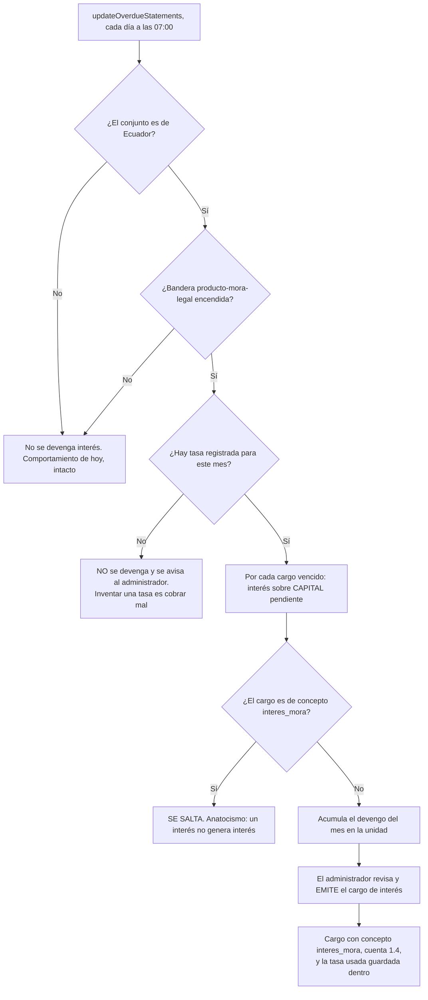
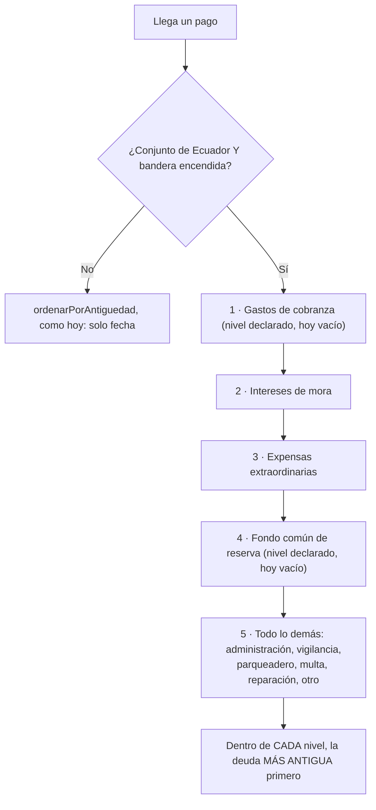

# PRD-V-FLOW-006 — Interés de mora legal y convenio de pago (Ecuador)

| Campo | Valor |
|---|---|
| **ID** | `PRD-V-FLOW-006` · candidato **`B5`** del inventario de Habitanto, fusionado con el convenio de pago |
| **Tipo** | `FLOW` — cambia un proceso de punta a punta que ya existe: **el camino del dinero**. No es un módulo nuevo al lado |
| **Portales — alcance** | `ADMIN` |
| **Portales — afectados** | `RESIDENTE`: ve el interés en su estado de cuenta y ve su convenio. No los crea ni los edita |
| **Módulo** | Cartera y Finanzas |
| **Usuario principal** | `tenant_admin` · **secundario** `resident` (solo lectura) · `committee` (lectura del agregado, ver `RN-12`) |
| **Responsable** | David |
| **Estado** | **Discovery** — escrita el 3 de septiembre de 2026 tras medir el código y con la investigación legal delante |
| **Dependencias** | **`docs/investigacion-legal-ecuador-mora.md`** (obligatoria) · `FLOW-002` (anticipos) **cerrada**: nada más está en vuelo sobre `aplicarPago`, verificado |
| **Riesgo** | 🔴 **ALTO — el más alto del portafolio hasta la fecha.** Toca `aplicarPago`, que está en producción y es el camino del dinero. Y el error de cálculo tiene consecuencia **legal**, no estética: aplicar mal la tasa es usura |
| **Reversibilidad** | **La bandera revierte el comportamiento entero.** Lo que NO se revierte solo son los cargos de interés ya emitidos: ver §13 |
| **Plan comercial** | Todos. **Solo aplica a conjuntos de Ecuador** — ver `RN-01` |

---

## 1 · Resumen ejecutivo

Un conjunto ecuatoriano **está obligado por ley a cobrar interés de mora** desde el día siguiente al
vencimiento, y hoy Vivaru no calcula ninguno. El Decreto 462 —firmado el 31 de julio de 2026, tres
semanas antes de la sesión con la administradora de Habitanto— fija además **a qué se aplica un pago
recibido**, y `aplicarPago` no cumple ese orden: reparte solo por fecha, sin mirar el concepto.

Esta ficha construye las tres cosas que la ley encadena: **el interés**, **el orden de imputación** y
**el convenio de pago**. Van juntas porque separarlas produce piezas que no cumplen — el día que
existan intereses, un `aplicarPago` que no los priorice reparte mal el dinero de un tercero.

El valor no es de conversión: es **cumplimiento**. Hoy un administrador ecuatoriano que use Vivaru
no puede cobrar lo que la ley le obliga a cobrar, y tampoco puede demostrar cómo aplicó un pago.

---

## 2 · Problema y baseline

### Cómo se resuelve hoy: no se resuelve, y una parte está mal

| Qué | Medido el 3 de septiembre de 2026 |
|---|---|
| Cálculo de interés de mora | **No existe.** `lateFee`, `collectionFee`, `dunning`: **0 apariciones** en `src/` y `functions/src/` |
| Convenio de pago | **No existe.** `paymentPlan`: **0**. Ojo: `agreement` da 341 apariciones y **es otra cosa** — `CommitteeAgreement`, los acuerdos del consejo |
| Orden de imputación del pago | **Existe y NO cumple.** `functions/src/payments.ts` → `ordenarPorAntiguedad` ordena por `dueDate ?? period` con desempate por `id`. **El concepto del cargo no entra en la decisión** |
| Gastos de cobranza | **No existe** como concepto ni como cuenta |
| Fondo común de reserva | **No existe** como concepto ni como cuenta |

### Y una cosa que SÍ existe, y cambia el tamaño de la ficha

**`interes_mora` ya es un `BillingConcept` de primera clase**, con cuenta **`1.4`** en el plan,
categoría de libro propia, etiqueta en el estado financiero (`financial-statement.ts:121`), opción en
el selector de cobros y forma gramatical en el aviso de recibo. **Lo que falta no es el concepto: es
el cálculo y el orden.**

### Dos gemelos que ya hacen bien lo que esta ficha necesita

- **La mora nace el día siguiente al vencimiento, sin requerimiento** — es exactamente lo que hace
  `calcularSaldo`: `vencimiento && vencimiento < hoy ? "overdue" : "pending"`. La regla legal ya está
  implementada; lo que falta es cobrar por ella.
- **`updateOverdueStatements` corre a diario** (`0 7 * * *`) y ya recorre los cargos pendientes para
  marcarlos vencidos. El devengo del interés tiene ahí su sitio natural.
- **El país del conjunto ya gobierna comportamiento**: `expense-distribution.ts:180`,
  `clearance-certificates.ts:126` y `coefficient-billing.ts:227` leen `tenantData.country`.

### Baseline de negocio: no lo hay, y hay que decirlo

**Producción tiene cero clientes reales**, así que no hay cartera vencida real sobre la que medir
interés cobrado ni convenios firmados. `G1` **no se supera**, igual que en `FEAT-007` y `FEAT-006`.
La métrica que sí se puede medir desde el primer día es de **corrección**, no de adopción: ver
`CA14`–`CA17`.

> **TBD-M1 — medición pendiente, no bloqueante.** No se pudo contar cuántos de los nueve conjuntos
> tienen `country` puesto: la credencial ADC caducó a mitad de sesión. **Hay que contarlo antes de
> construir**, porque `RN-02` depende de ese dato.

---

## 3 · Usuarios, roles y permisos

| Rol | Ve | Puede | **NO puede** |
|---|---|---|---|
| `tenant_admin` | El interés devengado por unidad, la tasa usada con su mes y segmento, y los convenios del conjunto | Emitir el cargo de interés · Crear, firmar y anular un convenio · **Condonar** interés con motivo obligatorio | **Editar el importe del interés a mano** — se recalcula o se condona, y las dos cosas dejan rastro · Cambiar la tasa de un cargo ya emitido · Crear un convenio en un conjunto ajeno |
| `resident` | El interés en **su** estado de cuenta, con la tasa y el período · **su** convenio y sus cuotas | Nada. **Solicitar** un convenio es Fase 2 (§4) | Ver el interés o el convenio de otra unidad · Modificar nada |
| `committee` | El **agregado** de cartera vencida e intereses del conjunto | Nada | **Ver el detalle por unidad** — ver `RN-12`, y es donde se paga la tensión de protección de datos |
| `security_guard` | Nada | Nada | Todo. La mora no toca portería |
| `superadmin` | La tasa registrada por mes y país, para operarla | Registrar la tasa del mes | **Emitir intereses ni convenios de un conjunto** — no es su operación |

---

## 4 · Objetivo, alcance y exclusiones

### Objetivo

Que un conjunto de Ecuador **pueda cobrar el interés que la ley le obliga**, que un pago parcial se
aplique **en el orden que la ley fija**, y que un convenio de pago **exista como documento con
cuotas y consecuencias**, todo ello demostrable ante una Asamblea.

### Entra en el MVP

1. **Registro de la tasa** del Banco Central: valor, mes, segmento y fuente. Dato externo, no cableado.
2. **Devengo del interés** sobre cargos vencidos, **siempre sobre capital**.
3. **Emisión del cargo de interés** con concepto `interes_mora` (que ya existe) y su cuenta `1.4`.
4. **Orden de imputación legal** en `aplicarPago`, **solo para conjuntos de Ecuador**.
5. **Convenio de pago**: entidad con reconocimiento de deuda, monto, plazo, interés pactado, cuotas,
   y **vencimiento anticipado a las dos cuotas incumplidas**.
6. **Condonación** del interés con motivo obligatorio.
7. Bandera `producto-mora-legal`, en los **cinco** sitios del catálogo.

### NO entra, y por qué

| Excluido | Por qué |
|---|---|
| **Gastos de cobranza** y **fondo común de reserva** como conceptos | Decisión de David: la cascada **deja sus niveles declarados y vacíos**. Crearlos toca el plan de cuentas (`PLAT-003`) y alarga la ficha. **Un nivel vacío no rompe nada**: si no hay cargos de ese tipo, el reparto baja al siguiente |
| **La notificación previa de 5 días** | Es el procedimiento del art. 19.4 y es una ficha propia. Sin ella **no se pueden aplicar restricciones legalmente** — ver `RN-13` |
| **Restricciones por recurso** | La ley separa lo restringible de lo que **nunca** se puede cortar (agua fría, parqueadero propio, movilidad de embarazadas). Hoy Vivaru solo tiene la compuerta de reservas. Es una ficha propia y **no se toca aquí** |
| **Liquidación con valor de título ejecutivo** (art. 19.5) | Necesita la aprobación de Asamblea, que no existe como flujo |
| **Reincidencia a 12 meses** (art. 19.7) | Se declara el campo en el contrato de datos para no migrar después, pero **no se construye** |
| **La publicación mensual obligatoria** | Sube de prioridad por la sanción al administrador, pero su gemelo ya existe (`monthlyFinancialArchive`, `ACTIVE` en producción) y es otra ficha |
| **México y Colombia** | La cascada es ley ecuatoriana. Ver `RN-01` |

---

## 5 · Flujo funcional

### Devengo y emisión del interés

**El devengo se calcula solo; la emisión la decide una persona.** Emitir automáticamente un cargo de
dinero contra una unidad, con una tasa que puede estar mal interpretada y cinco puntos pendientes de
abogado, es exactamente lo que no debe hacer un producto en su primera versión.

### Reparto de un pago — la cascada

### Convenio de pago

Camino feliz: el administrador crea el convenio sobre las unidades en mora → registra monto, plazo,
interés pactado y cuotas → el convenio queda `vigente` → cada cuota se paga o se incumple → **a la
segunda cuota incumplida el saldo entero vence** y el convenio pasa a `acelerado`.

### Errores y casos límite

| Caso | Comportamiento |
|---|---|
| El conjunto **no tiene `country`** | **Orden de hoy, sin interés.** No se supone Ecuador: suponerlo cobra dinero sin base. `RN-02` |
| **No hay tasa del mes** | No se devenga, y el administrador recibe un aviso. **Nunca se usa la del mes anterior** sin decirlo |
| El cargo vencido **es un interés** | Se salta. `RN-04` (anatocismo) |
| Se **condona** un interés ya emitido | Motivo obligatorio, queda el rastro, y el cargo pasa a `condonado`. No se borra |
| El conjunto está **`suspended` o `expired`** | **No se devenga ni se emite nada.** Es operación del conjunto y pasa por `tenantOperable`, al revés que el tema de `FEAT-007` |
| Conjunto **en prueba** | El módulo se comporta igual, pero **no se emiten cargos reales**: vista previa |
| Un pago **cubre de más** | El sobrante sigue el camino de `FLOW-002`: anticipo. Esta ficha no lo cambia |

---

## 6 · Estados y transiciones

### El cargo de interés

| Estado | Quién lo provoca | Salida |
|---|---|---|
| **Devengado** (no es un cargo aún; es un cálculo) | El trabajo diario | El administrador lo emite, o se recalcula al día siguiente |
| **Emitido** | `tenant_admin` | Se paga, o se condona |
| **Pagado** | Un pago aplicado por la cascada | Terminal |
| **Condonado** | `tenant_admin`, **con motivo obligatorio** | Terminal |

### El convenio

| Estado | Quién | Salida |
|---|---|---|
| **Borrador** | `tenant_admin` | Pasa a vigente al firmarse, o se descarta |
| **Vigente** | `tenant_admin` | Se cumple → `cumplido` · Dos cuotas impagas → `acelerado` · Se anula con motivo |
| **Acelerado** | **El sistema**, a la segunda cuota incumplida | Terminal a efectos del convenio: la deuda vuelve a cartera entera |
| **Cumplido** | La última cuota pagada | Terminal |
| **Anulado** | `tenant_admin`, con motivo | Terminal |

**Ningún estado depende de un tercero ni de un plazo que nadie mire**: el único automático es
`acelerado`, y lo dispara un contador que el propio producto lleva.

---

## 7 · Contrato de datos y multi-tenancy

### Colección nueva: `interestRates` — la tasa, como dato externo con fuente

| Campo | Tipo | Quién escribe |
|---|---|---|
| `country` | `"EC"` | `superadmin` |
| `month` | `YYYY-MM` | `superadmin` |
| `annualRate` | `number` — **anual**, en porcentaje | `superadmin` |
| `segment` | `string` — p. ej. `"productivo_corporativo"` | `superadmin` |
| `sourceUrl`, `capturedAt`, `capturedBy` | La fuente citable | `superadmin` |

**No lleva `tenantId`: es un dato de país, no de conjunto.** Lectura abierta a cualquier `signedIn`;
escritura **solo superadmin**.

### En el cargo de interés (`billingStatements`, documento existente)

Se añaden, **dentro del cargo**: `rateAnnual`, `rateMonth`, `rateSegment`, `baseCapital`,
`daysAccrued`. **Van copiados y no por referencia**, y esa es la decisión: si la tasa del mes se
corrige después, un cargo ya emitido **no puede cambiar de importe solo**. Sin esto el interés no se
puede defender ante una Asamblea.

### Colección nueva: `paymentAgreements` — el convenio

`tenantId` (**obligatorio**, y toda consulta de lista lo filtra) · `unitId` · `debtAcknowledged` ·
`principal` · `agreedRate` · `installments[]` (`dueDate`, `amount`, `status`) · `missedCount` ·
`status` · `signedAt`, `signedBy` · `reincidenceUntil` (**declarado y sin construir**, para no migrar
después) · auditoría de anulación con motivo.

### Invariantes de Vivaru

- **`tenantId` en todo documento de conjunto**, y las listas lo filtran: las reglas no filtran,
  rechazan.
- **`suspended` / `expired` → solo lectura.** Esta ficha **no es excepción** y pasa por
  `tenantOperable`: devengar y emitir cargos es operar el conjunto.
- **En prueba**: vista previa, sin emitir cargos reales.
- **Retención**: el cargo y el convenio viven lo que viva la cartera. **No entran** en las tres
  ventanas de 12 meses que ya corren cada noche.

---

## 8 · Reglas de negocio

| # | Regla | Se verifica en |
|---|---|---|
| `RN-01` | **La cascada legal y el interés SOLO aplican a conjuntos con `country === "EC"`.** México y Colombia conservan el orden por antigüedad, intacto | `CA1`, `CA2` |
| `RN-02` | **Un conjunto sin `country` usa el comportamiento de hoy.** No se infiere el país desde la moneda para decidir dinero | `CA3` |
| `RN-03` | La mora corre **desde el día siguiente al vencimiento, sin requerimiento previo**. Los días de gracia son política del conjunto, **más benigna que la ley**, y son configurables | `CA4` |
| `RN-04` | **ANATOCISMO — invariante, no preferencia.** El interés se calcula **siempre sobre capital**. Un cargo de concepto `interes_mora` **nunca** entra en la base. Tres normas concordantes lo prohíben y se sanciona como usura | `CA5` — **guardián dedicado** |
| `RN-05` | **La tasa del BCE es ANUAL.** Aplicarla como mensual cobra **doce veces de más, ilegalmente**. El prorrateo es `anual / 12` por mes o fracción — **supuesto declarado, `TBD-L2`** | `CA6` — **incluye el caso que debe fallar** |
| `RN-06` | Cada cargo de interés guarda **la tasa usada, su mes y su segmento**. Corregir la tasa del mes **no cambia** un cargo ya emitido | `CA7` |
| `RN-07` | **Sin tasa registrada del mes no se devenga nada**, y se avisa. Nunca se arrastra la del mes anterior en silencio | `CA8` |
| `RN-08` | El orden es la cascada de cinco niveles y, **dentro de cada nivel, la deuda más antigua primero** | `CA9` |
| `RN-09` | **Los niveles 1 y 4 quedan declarados y vacíos.** Un nivel sin cargos no rompe el reparto: baja al siguiente | `CA10` |
| `RN-10` | **El devengo es automático; la emisión la decide una persona.** Ningún cargo de dinero nace solo | `CA11` |
| `RN-11` | **Dos cuotas incumplidas aceleran el convenio entero.** El contador lo lleva el producto | `CA12` |
| `RN-12` | El consejo ve **el agregado**, nunca el detalle por unidad. La publicación mensual por unidad expone al moroso y en muchos conjuntos la unidad identifica a su propietario — `TBD-L4` | `CA13` |
| `RN-13` | **Esta ficha NO habilita ninguna restricción al moroso.** Restringir exige la notificación previa de 5 días, que es otra ficha. Construir la restricción aquí sería aplicarla sin el procedimiento que la legitima | `CA18` — debe fallar |
| `RN-14` | **No se cita ningún número de artículo** en el producto ni en un aviso al residente. Las fuentes secundarias se contradicen en la numeración y solo el Registro Oficial lo zanja — `TBD-L3` | `CA19` |

---

## 9 · Notificaciones y correo

| Quién | Cuándo | Canal |
|---|---|---|
| `tenant_admin` | **No hay tasa del mes** y hay cartera vencida | Correo transaccional por `functions/src/email.ts`, con el remitente verificado |
| `tenant_admin` | Hay interés devengado pendiente de emitir | El mismo canal, en el resumen que ya existe |
| `resident` | Se **emitió** un cargo de interés sobre su unidad | El aviso de cobro que ya existe. **`interes_mora` ya tiene su forma gramatical** en `aviso-recibo.ts:60` |
| `resident` | Su convenio quedó **acelerado** | El mismo canal |

**No se promete ningún plazo de respuesta humana.** Y **ningún aviso cita un número de artículo**
(`RN-14`).

---

## 10 · Criterios de aceptación

### El alcance por país

| # | Criterio | Cuándo se mide |
|---|---|---|
| `CA1` | Un conjunto con `country === "EC"` y la bandera encendida reparte un pago parcial por **la cascada** | Sobre un caso con cargos de al menos tres niveles distintos |
| `CA2` | **DEBE FALLAR:** un conjunto de México o Colombia reparte **exactamente igual que hoy**. Se compara el reparto antes y después del cambio sobre los mismos datos, y tiene que dar **el mismo resultado** | Antes y después, mismos datos |
| `CA3` | Un conjunto **sin `country`** reparte como hoy y **no devenga interés** | Con el campo ausente |

### El cálculo

| # | Criterio | Cuándo se mide |
|---|---|---|
| `CA4` | Un cargo vencido ayer devenga **un día**; uno que vence hoy, **cero** | Al día siguiente del vencimiento |
| `CA5` | **DEBE FALLAR — anatocismo.** Un cargo de concepto `interes_mora` vencido **no genera** interés. Y su falsación enrojece: al meterlo en la base, el guardián se pone rojo | En cada `npm test` |
| `CA6` | **DEBE FALLAR — la trampa de las doce veces.** Con tasa anual del 6,79 %, un mes sobre 1.000 da **≈5,66**, no 67,90. Si alguien aplica la anual como mensual, la prueba enrojece **con el número delante** | En cada `npm test` |
| `CA7` | Corregir la tasa de un mes **no cambia el importe** de un cargo ya emitido | Emitir, corregir la tasa, releer el cargo |
| `CA8` | **DEBE FALLAR:** sin tasa del mes no se devenga nada, y el administrador recibe el aviso | Con `interestRates` vacío para ese mes |

### El reparto

| # | Criterio | Cuándo se mide |
|---|---|---|
| `CA9` | Con cargos en los niveles 2, 3 y 5, un pago parcial cubre **primero el interés**, luego la extraordinaria, luego lo ordinario; y **dentro de cada nivel, el más antiguo** | Sobre un caso construido con las tres |
| `CA10` | Con los niveles 1 y 4 vacíos, el reparto **no se atasca**: baja al siguiente | Sin cargos de esos tipos, que es el estado de hoy |
| `CA11` | **DEBE FALLAR:** el trabajo programado **no emite** ningún cargo por su cuenta. Tras correrlo, el número de cargos de la unidad **no cambia** | Contar cargos antes y después |

### El convenio

| # | Criterio | Cuándo se mide |
|---|---|---|
| `CA12` | Con **dos** cuotas incumplidas el convenio pasa a `acelerado` y la deuda vuelve entera. Con **una**, no | En la segunda, y en la primera |
| `CA13` | **DEBE FALLAR:** el `committee` no puede leer el detalle de intereses ni convenios por unidad | Prueba de reglas |
| `CA18` | **DEBE FALLAR:** esta ficha **no habilita ninguna restricción nueva** al moroso. La compuerta de reservas sigue siendo la única, y se comporta igual que antes | Barrido del código y comparación de comportamiento |
| `CA19` | **Ningún texto del producto ni de un correo cita un número de artículo** del decreto | Barrido de las plantillas y del copy |

### Corrección, que es la métrica mientras no haya clientes

| # | Criterio |
|---|---|
| `CA14` | Un guardián recalcula el interés de una cartera de prueba y **cuadra al céntimo** con el cálculo esperado, usando `aMoneda` y `TOLERANCIA_MONEDA` — la lección de `FLOW-002`: los centavos rompieron dos guardianes que parecían correctos |
| `CA15` | La suma de lo repartido por la cascada **es igual** al importe del pago. Ni un céntimo aparece ni desaparece |
| `CA16` | El estado financiero suma los intereses en la cuenta **`1.4`**, que ya existe |
| `CA17` | **Falsación obligatoria de `CA15`**: al romper la cascada a propósito, la prueba enrojece |

---

## 11 · Arquitectura y dependencias

### La decisión obligatoria: **callable**, sin discusión

**Cloud Function callable**, y aquí no hay elección real:

- Es **lógica de negocio sobre dinero de terceros**, con una consecuencia legal si se calcula mal.
- Escribe en **varias colecciones** (cargo, asiento del libro, convenio).
- El cliente **no debe poder falsificar** ni el importe del interés ni el orden del reparto.
- Ya hay precedente y gemelo: `aplicarPago` es callable por exactamente estas razones, y `FLOW-002`
  cerró `CF8` precisamente porque **una regla de Firestore no protege lo que escribe una callable** —
  la guarda va **dentro** de la función.

`interestRates` es la excepción: escritura **solo superadmin**, y eso **sí** lo puede sostener una
regla de Firestore, porque es un CRUD sin lógica.

### Dónde vive el devengo

En **`updateOverdueStatements`** (`functions/src/index.ts:3541`, `0 7 * * *`) o en un trabajo hermano
que corra justo después. **No se crea un mecanismo nuevo**: ese trabajo ya recorre a diario los
cargos pendientes para marcarlos vencidos, que es el mismo barrido.

### Lo que se toca de lo que ya existe

- `functions/src/payments.ts` → `ordenarPorAntiguedad` gana un **nivel de agrupación previo**.
  **La función actual no se sustituye: se usa dentro de cada nivel**, que es lo que la ley pide como
  desempate. Su comentario sobre el desempate por `id` sigue siendo válido y por la misma razón.
- `functions/src/index.ts` → el trabajo programado.
- El plan de cuentas **no se toca**: `interes_mora` → `1.4` ya está, y su espejo está vigilado por
  `tests/plan-de-cuentas-espejo.test.ts`.

### Bandera

`producto-mora-legal`, en los **cinco** sitios del catálogo —`src/lib/feature-flags/catalog.ts`,
`functions/src/feature-flags.ts`, `seed-feature-flags.mjs`, `mover-bandera.mjs` y
**`mover-bandera-de-conjunto.mjs`**, que es la vía del canario y la que ya se olvidó una vez—.
**Nace apagada**, y **el servidor SÍ la comprueba**: a diferencia de otras, aquí la bandera gobierna
dinero, así que no puede ser solo un botón.

---

## 12 · Riesgos y mitigaciones

| # | Riesgo | Señal | Mitigación |
|---|---|---|---|
| `R1` | **Cobrar doce veces de más** aplicando la tasa anual como mensual. Ya estuvo a punto de pasar al investigar | `CA6`, con el número delante | El cálculo lleva la unidad en el nombre (`annualRate`) y el guardián compara contra un valor conocido |
| `R2` | **Anatocismo** — interés sobre interés. Se sanciona como usura y el juez ordena recalcular | `CA5` y su falsación | Invariante sostenido por guardián, no por comentario |
| `R3` | **Repartir mal el dinero de un tercero** en México o Colombia al tocar `aplicarPago` | `CA2`: el reparto tiene que dar **idéntico** | La cascada vive detrás de `country === "EC"` **y** de la bandera |
| `R4` | **El abogado contradice un supuesto** y hay cargos emitidos | — | La tasa va **copiada en el cargo** con mes y segmento: se puede recalcular y condonar con rastro. Es la razón de `RN-06` |
| `R5` | **Emitir cargos de dinero automáticamente** con una interpretación no confirmada | `CA11` | El devengo es automático; **la emisión la decide una persona** |
| `R6` | **Exponer al moroso** ante la comunidad al publicar por unidad | `CA13` | El consejo ve el agregado. `TBD-L4` lo cierra |
| `R7` | **Restringir sin el procedimiento** que lo legitima | `CA18` | Se declara explícitamente fuera de alcance |
| `R8` | Los **centavos**, que ya rompieron dos guardianes de `aplicarPago` que parecían correctos | `CA14` | `aMoneda` y `TOLERANCIA_MONEDA` desde el principio, no al final |

---

## 13 · Despliegue, rollback y Story Map

### Orden

**Reglas → functions → front.** Las reglas de `interestRates` y `paymentAgreements` **restringen**
(hoy esas colecciones no existen, así que nada puede romperse desplegándolas primero), y el front no
puede llamar a lo que aún no está.

**Las reglas se verifican leyendo el ruleset VIVO por la API y diferenciándolo contra el
repositorio**, no dando por hecho que `master` es producción: eso vale para el front y no para reglas.

### Rollback

| Nivel | Qué deja |
|---|---|
| **Bandera apagada** | La cascada y el devengo se apagan. El reparto vuelve al de hoy **en el acto**. Segundos |
| **Front / functions revertidos** | Igual, sin el código |
| **Los cargos de interés ya emitidos** | **NO se borran solos, y esto es lo único no reversible con un interruptor.** Se **condonan**, con motivo, que es la operación que la ficha ya contempla — y deja rastro, que es lo correcto para dinero |

### Qué se valida dónde

- **Staging**: todo el cálculo, la cascada, el convenio y las reglas.
- **Solo producción**: `CA2` sobre los conjuntos reales de México y Colombia — que el reparto no
  cambió.
- **Con ojos, sin sustituto**: el aviso al residente y la pantalla del convenio.

### Story Map

**Entrega 1 — el terreno legal, sin dinero en juego**
La colección `interestRates` con su pantalla de superadmin, y **el cálculo puro con sus guardianes
(`CA5`, `CA6`, `CA14`)**. No emite nada. **Al terminar, nadie ve un cambio.**

**Entrega 2 — la cascada**
El orden legal detrás de `country === "EC"` y la bandera, con `CA2` como red: los otros ocho
conjuntos reparten idéntico.

**Entrega 3 — el interés y el convenio**
Devengo diario, emisión manual, condonación con motivo, y el convenio con su aceleración a las dos
cuotas.

**Fase 2 — declarada, no aplazada en silencio**
Notificación previa de 5 días · restricciones **por recurso**, con su lista negra intocable ·
liquidación con valor de título ejecutivo · reincidencia a 12 meses · gastos de cobranza y fondo de
reserva como conceptos · publicación mensual obligatoria.

---

## Los supuestos que espera un abogado

**Se escribe con supuestos declarados** (decisión de David), y cada uno dice qué hacer si la
respuesta es otra:

| # | Supuesto usado | Si el abogado dice otra cosa |
|---|---|---|
| `TBD-L1` | El segmento del BCE es **Productivo Corporativo**, que es el del titular «Tasa Activa Referencial» | Cambia `segment` en `interestRates`; los cargos emitidos se recalculan o condonan |
| `TBD-L2` | El prorrateo es **lineal: anual / 12** por mes o fracción | Cambia la fórmula; `RN-06` permite recalcular |
| `TBD-L3` | **No se cita ningún artículo** en producto | Nada que cambiar: es la opción conservadora |
| `TBD-L4` | El consejo ve **solo el agregado** | Si se permite el detalle, se abre; abrirlo después es más fácil que cerrarlo |
| `TBD-L5` | El orden de imputación **NO admite pacto en contrario** | Si lo admite, se vuelve configurable por conjunto — y entonces `RN-01` se queda corto |

---

## Puertas

| Puerta | Estado | Evidencia |
|---|---|---|
| **`G0` Necesidad** | ✅ | El Decreto 462 existe, es de julio de 2026, y `aplicarPago` **no cumple su orden**, medido en `payments.ts` |
| **`G1` Valor** | ❌ **NO SE SUPERA** | **Cero clientes reales**: no hay cartera vencida sobre la que medir. `CA14`–`CA17` la sustituyen con métrica de **corrección**, que no es lo mismo. Misma situación que `FEAT-006` y `FEAT-007` |
| **`G2` Datos y permisos** | ✅ | Dos colecciones nuevas con `tenantId` y reglas; `interes_mora` y su cuenta `1.4` ya existen; el `country` del conjunto ya gobierna comportamiento en tres functions |
| **`G3` Riesgo** | 🟡 **PARCIAL** | Bandera, rollback en tres niveles y guardianes sí. **Pero cinco puntos esperan abogado** y los cargos emitidos solo se revierten condonando |
| **`G4` Aceptación** | ✅ | 19 criterios, **siete de ellos deben fallar**, y cada uno dice cuándo se mide |
| **`G5` Operación** | 🟡 | **Alguien tiene que registrar la tasa del BCE cada mes.** Hoy no hay nadie asignado, y sin tasa no se devenga. Es la puerta que más se olvida y aquí tiene dueño pendiente |
| **`G6` Escala** | ✅ | El devengo va dentro de un barrido que ya corre a diario. Sin lecturas nuevas por cargo |

> **No es «lista para desarrollo» hasta cerrar `G5`** —quién registra la tasa cada mes— y hasta que
> David acepte `G1` vacía como en las dos fichas anteriores. **`G3` queda en amarillo a propósito**:
> la ficha se puede construir con supuestos declarados, pero **la entrega 3 no debería encenderse en
> un conjunto con clientes reales** antes de las respuestas del abogado.

---

## Verificación del portafolio

| Comprobación | Resultado |
|---|---|
| **Colisión de identificador** | Ninguna. `FLOW-001` a `FLOW-005` ocupados; **`FLOW-006` libre** |
| **PRD en vuelo sobre `aplicarPago`** | **Ninguna.** `FLOW-002` está EN PRODUCCIÓN con todos sus criterios cumplidos, verificado |
| **Solapamiento** | `FLOW-002` (anticipos) comparte `aplicarPago` y **no se toca**: el sobrante sigue su camino. `PLAT-003` (plan de cuentas) **no se toca**: `1.4` ya existe. `FIX-001` toca la compuerta de reservas, que aquí queda **explícitamente fuera** |
| **Componentes compartidos** | `ordenarPorAntiguedad`, `calcularSaldo`, `aMoneda`, `updateOverdueStatements`, `aviso-recibo.ts`. Ninguno cambia de contrato |
| **Supuestos anulados al medir** | Dos. **`interes_mora` YA existe** como concepto con cuenta `1.4` —la ficha no lo crea—, y **`agreement` en el código NO es un convenio**: son los acuerdos del consejo. Buscar por ese nombre habría dado 341 falsos positivos |

---

*Escrita el 3 de septiembre de 2026 con la skill `crear-prd-vivaru`. Las cifras del código están
medidas contra `616c5b6`; las legales salen de `docs/investigacion-legal-ecuador-mora.md`, que se
hizo con búsqueda web el mismo día porque el decreto es posterior al corte de conocimiento.*
