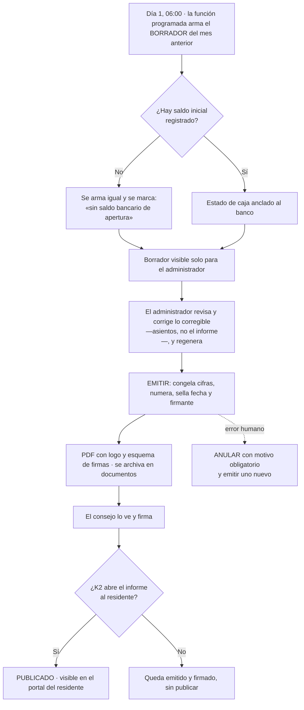

# PRD-V-FLOW-007 — Informe económico mensual anclado al banco, emitible y publicado

| Campo | Valor |
|---|---|
| **ID** | `PRD-V-FLOW-007` · §3.7 de la sesión con la administradora, más la obligación de publicación del Decreto 462 |
| **Tipo** | `FLOW` — cambia un proceso de punta a punta que **ya existe y ya corre solo**: generar → emitir → firmar → publicar el informe del mes |
| **Portales — alcance** | `ADMIN` · `RESIDENTE` (lo publicado) |
| **Portales — afectados** | `CONSEJO` (rol `committee`): hoy no llega al informe; con esta ficha lo ve y lo firma |
| **Módulo** | Finanzas y Reportes |
| **Usuario principal** | `tenant_admin` · **secundarios** `committee` (ve y firma), `resident` (ve lo publicado) |
| **Responsable** | David |
| **Estado** | **Discovery** — escrita el 3 de septiembre de 2026 tras medir el código |
| **Dependencias** | `PLAT-003` (plan de cuentas, **sembrado**: 189 cuentas) · `FLOW-004` (cuentas bancarias y saldo inicial, **en producción**) · `FEAT-003` (proveedores, **en producción, 0 filas**) · **NO depende de `FLOW-006`** y no toca `aplicarPago` |
| **Riesgo** | 🟠 **MEDIO-ALTO.** No toca el camino del dinero, pero **modifica una función programada que ya corre en producción** y **abre al residente una categoría de documento que hoy una regla desplegada le niega** |
| **Reversibilidad** | Bandera `producto-informe-mensual`. **Lo que no se revierte solo** es un informe ya publicado: se despublica, y queda el rastro. Ver §13 |
| **Plan comercial** | Todos. La **obligación legal** es de Ecuador; el informe anclado al banco sirve a los tres países |

---

## 1 · Resumen ejecutivo

El informe económico mensual es el documento que la administradora emite, firma y presenta cada mes,
y desde el Decreto 462 **publicarlo dejó de ser una comodidad: es obligación legal cuya sanción es
la remoción del administrador del cargo**. Vivaru ya genera un informe mensual solo, pero es un
resumen de ocho líneas que **no está anclado al banco, no lo firma nadie y el residente no lo puede
ver porque una regla desplegada se lo niega**.

Esta ficha convierte ese archivo automático en el documento que se firma: **saldo bancario inicial y
final reales**, ingresos y egresos por cuenta del plan, cuentas pendientes de cobro y deuda a
proveedores, **emitido y firmado dentro del producto** y **publicado** a quien corresponda.

El valor no es de conversión: es **cumplimiento** y **eliminación de un rodeo declarado en voz alta**
— hoy ella exporta, pasa a PDF, le pone el logo y el esquema de firmas por fuera, y lo vuelve a
subir.

---

## 2 · Problema y baseline

### Lo que ya existe, medido el 3 de septiembre de 2026

**Esto es lo que más cambió respecto de lo que suponíamos.** El bloque parecía terreno virgen y no
lo es: **cuatro de las seis partes de la columna vertebral ya están calculadas**.

| Pieza | Dónde | Estado |
|---|---|---|
| Informe mensual automático | `monthlyFinancialArchive`, `functions/src/index.ts:3802` | **`ACTIVE` en producción**, `0 6 1 * *`. Archiva 3 ficheros por conjunto |
| Estado financiero con jerarquía de cuentas | `buildFinancialStatement`, `src/features/finanzas/financial-statement.ts:199` | **Existe y ordena por el código del plan** (1.1, 1.2, 1.3…), no por monto |
| Saldo inicial del banco | `bankAccountBalances.openingBalance` | **Colección propia** desde `FLOW-002` (24 ago), editable en `/admin/finanzas/conciliacion` |
| Saldo final | `fundBalance = openingBalance + netResult` | **Ya se calcula.** No se llama `closingBalance` — por eso buscarlo da `0` |
| Cartera vencida por unidad | `CommitteeReport.billing.overdueUnits` y hoja «Morosos» del archivo | **Existe**: unidad, deuda y número de períodos |
| Deuda a proveedores | `summarizePayables`, `src/features/finanzas/payables.ts` | **Se calcula** (total, vencido, próximo, por categoría) — **pero no entra en ningún informe** |
| Firma de un informe | — | **NO existe.** Ver hallazgo 4 |
| Presupuesto contra ejecución | — | **NO existe.** Fuera de alcance: es `E6`, ficha aparte |

### Los cinco hallazgos que dan forma a esta ficha

**1 · El informe que la ley obliga a publicar lo genera un código duplicado que YA se desvió dos
veces.** `functions/` **no tiene módulo de estado financiero**: `monthlyFinancialArchive` reimplementa
el resumen en línea, con sus propias sumas. Y la deriva no es un riesgo hipotético — está registrada
en el propio código, por partida doble:

> `functions/src/payments.ts:267` — *«(`monthlyFinancialArchive`) siguió preguntando
> `category !== "alicuota"`»* · `payments.ts:324` — *«siguió calculando el porcentaje como…»*

Son las reglas `R12` y `R16`: se corrigieron en `src/` y **el informe archivado se quedó con la
fórmula vieja**. Dos veces. Ahora ese documento tiene sanción legal detrás.

**2 · El saldo del banco no entra en el informe, y no es que falte el concepto: es que el cable no
está puesto.** El parámetro existe, el dato existe, y **los tres consumidores pasan cero**:

| Llamada | Qué pasa como `openingBalance` |
|---|---|
| `src/app/(admin)/admin/finanzas/page.tsx:154` | `computeFundPosition(entries, cuotaIncome)` — **sin tercer argumento**, toma el default `0` |
| `src/app/(admin)/admin/finanzas/page.tsx:164` | `buildFinancialStatement(entries, cuotaParaEstado, 0, planInformes)` — **literal `0`** |
| `src/features/reports/use-committee-report.ts:573` | `buildFinancialStatement(periodLedger, …, 0, planInformes)` — **literal `0`** |

Esto es exactamente lo que la administradora describió sin saber el porqué: *«el nuestro es un
tablero de indicadores; el suyo es un estado de caja anclado al banco»*.

> 🔴 **Y tiene una consecuencia visible HOY, con la bandera de esta ficha apagada.**
> `/admin/finanzas` avisa **«Fondo insuficiente. El saldo de fondos es negativo… evita registrar
> nuevos egresos»** cuando `fundPosition.balance < 0` (`page.tsx:386-390`), y ese balance **ignora
> el saldo inicial**. Un conjunto con dinero en el banco y un mes de resultado negativo recibe un
> aviso falso que le dice que deje de pagar. **`CA9` lo convierte en guardián.**

**3 · La publicación no está «pendiente»: está DENEGADA por una regla desplegada.** El archivo
mensual se guarda con `category: "financiero"` y `category: "reporte"`, y las dos están en
`CATEGORIAS_SOLO_ADMINISTRACION` (`src/features/documents/use-documents.ts:43`). La consulta del
residente se hace con `oneOf` sobre las categorías visibles **porque la regla de Firestore la
rechazaría entera si no las nombrara**. Es decir: **el documento que la ley obliga a publicar es
invisible por construcción, y abrirlo pasa por `firestore.rules`, no por la interfaz.**

**4 · `firma` y `signature` existen y son OTRA COSA.** 403 y 273 apariciones, y **ninguna es la firma
de un informe**: `signedBy` es el **uid del residente que acepta** un acuerdo del consejo
(`committee-agreements/types.ts:41`) o un reglamento (`regulations/types.ts:8`). **No hay esquema de
firmas de un documento emitido** — administrador, presidente, período. Es el mismo patrón que
`agreement` en `FLOW-006`: **el nombre miente, y buscarlo por nombre habría dado la ficha por
construida**.

**5 · El consejo no llega al informe.** `canAccessPath` deja al rol `committee` **solo en
`/admin/documents`** (`src/lib/auth/routing.ts:29`). Ve el fichero archivado si alguien lo sube ahí;
no ve el informe. `K1` y `K2` pertenecen a **`PRD-V-PLAT-004`, que nunca se escribió** — esta ficha
**no lo escribe**: se lleva de él **solo el interruptor de `K2`** y lo declara en §4.

### Baseline

| Métrica | Hoy | Cómo se midió |
|---|---|---|
| Partes de la columna vertebral en el informe emitido | **2 de 6** — ingresos y egresos, como totales sin desglose | Las 8 filas de `Reporte-Comite-*.pdf`, `index.ts:3880-3907` |
| Informes con saldo bancario | **0** | Los tres consumidores pasan `openingBalance = 0` |
| Informes firmados dentro del producto | **0** | No existe el esquema de firmas |
| Informes visibles para el residente | **0**, y **por regla, no por olvido** | `CATEGORIAS_SOLO_ADMINISTRACION` |
| Veces que el informe archivado se desvió del de pantalla | **2** (`R12`, `R16`) | Comentarios de `payments.ts:267` y `:324` |

**`G1` no se supera**: producción tiene **cero clientes reales**, así que no hay adopción que medir.
Igual que en `FEAT-006`, `FEAT-007` y `FLOW-006`. La métrica que sí se mide desde el primer día es de
**corrección**: `CA8`–`CA12`.

> **`TBD-M1` — MEDIDO el 3 de septiembre de 2026 contra producción. La entrega 1 NO es un no-op.**
> `scripts/medir-saldo-inicial-flow-007.mjs` y `scripts/medir-partidas-flow-007.mjs`, los dos de solo
> lectura.
>
> | Qué se contó | Resultado |
> |---|---|
> | Conjuntos con **documento** de saldo inicial | **4 de 9** |
> | Conjuntos con saldo inicial **distinto de cero** | **2 de 9** — Las Playas 85.000 y Santa María **5.000.000** |
> | Conjuntos con **cuentas pendientes de cobro** | **5 de 9** (Santa María, 80.220.000) |
> | Conjuntos con **deuda a proveedores** | **4 de 9** (Queretarock y Qintilab, 4.890.000 cada uno) |
> | `vendors` | **0 filas**, y **ningún egreso lleva `vendorId`** |
>
> **Santa María es el conjunto del defecto vivo**: tiene cinco millones en el banco y recibe
> «Fondo insuficiente… evita registrar nuevos egresos» en cuanto un mes cierra en negativo.
>
> **Y la ADC NO estaba muerta.** `gcloud auth application-default print-access-token` acuñó un token
> y las lecturas de Firestore funcionaron a la primera. `invalid_rapt` es un desafío de reautenticación
> de operaciones sensibles, **no la caducidad de la credencial**: darlo por muerto sin ejercitarlo
> habría costado una sesión entera pidiendo un login que no hacía falta.

---

## 3 · Usuarios, roles y permisos

| Rol | Ve | Puede | **NO puede** |
|---|---|---|---|
| `tenant_admin` | El informe de cualquier mes, en borrador y emitido | Generar, corregir el borrador, **emitir**, firmar, publicar y despublicar | **Editar un informe ya emitido.** Para cambiarlo hay que anularlo con motivo y emitir otro |
| `committee` | Los informes **emitidos** de su conjunto | Firmar como consejo. Descargar el PDF | Editar cifras, emitir, publicar ni anular. **No ve el detalle por unidad** salvo que `K2` lo abra |
| `resident` | Los informes **publicados**, según `K2` | Descargar el PDF publicado | Ver borradores, ver informes no publicados, ver el detalle por unidad si `K2` lo tiene cerrado, y **ver nada de otro conjunto** |
| `security_guard` | Nada | Nada | Todo lo de esta ficha |
| `superadmin` | Nada nuevo | Nada nuevo | **No firma ni emite en nombre del conjunto.** La firma es del administrador y del consejo |

---

## 4 · Objetivo, alcance y exclusiones

### Entra

1. **Un solo informe.** El estado financiero se calcula en **código compartido** por la pantalla y
   por la función programada. Se acaba la reimplementación.
2. **Anclado al banco**: saldo inicial real, saldo final derivado, y el aviso de fondo insuficiente
   corregido.
3. **Las dos secciones que faltan**: cuentas pendientes de cobro y **deuda a proveedores**.
4. **Emisión firmable**: borrador → emitido, con logo del conjunto, período, esquema de firmas y
   cifras **congeladas**.
5. **Publicación**: al consejo siempre; al residente **según `K2`**, con el agregado por defecto.

### No entra, y por qué

| Fuera | Por qué |
|---|---|
| **Presupuesto contra ejecución** | Es `E6` y §3.8: obligación con ventana propia (Q1) y modelo de datos propio. Meterlo aquí duplica el tamaño |
| **`PRD-V-PLAT-004` (alcance del rol Consejo)** | Ocho PRD le dan capacidades que `canAccessPath` no le concede. Esta ficha **abre una ruta, no el rol**. `K1` sigue sin ficha |
| **Estado de cuenta por proveedor (`E4`)** | Aquí entra **el total que se les debe**, no el estado de cuenta de cada uno |
| **Cuentas por pagar en cuotas (§3.2)** | Cambia el modelo del egreso. La deuda a proveedores de este informe la suma igual |
| **Publicar el detalle de pago **por unidad** al residente** | 🔴 **Espera al abogado.** Ver `RN-11` y el `TBD-L` heredado de `FLOW-006` |
| **Firma electrónica con validez jurídica** | Aquí «firma» es **constancia de quién emitió y quién aprobó**, con nombre, cargo, fecha y sello del sistema. No se promete validez de firma electrónica certificada |

---

## 5 · Flujo funcional

**Errores y casos límite**

- **Sin asientos en el mes**: se emite igual, en ceros y **diciéndolo**. Un informe ausente es peor
  que un informe en cero, porque la obligación es mensual.
- **El administrador corrige un asiento después de emitir**: el informe emitido **no cambia**
  (`RN-05`). El corrector es la anulación con motivo.
- **Conjunto sin plan de cuentas**: cae al comportamiento de hoy, agrupando por categoría y ordenando
  por monto. `buildFinancialStatement` ya lo hace.
- **Conjunto suspendido o vencido**: **no emite ni publica** — es solo lectura. Sí se puede
  **descargar** lo ya emitido. Ver `RN-13`.

---

## 6 · Estados y transiciones

| Estado | Quién entra | Quién sale | Salida |
|---|---|---|---|
| `borrador` | La función programada, o el administrador al regenerar | `tenant_admin` | → `emitido`. **Se puede regenerar sobre sí mismo** |
| `emitido` | `tenant_admin` | `tenant_admin` | → `publicado` o → `anulado`. **Las cifras quedan congeladas** |
| `publicado` | `tenant_admin` | `tenant_admin` | → `emitido` (despublicar) o → `anulado` |
| `anulado` | `tenant_admin`, **con motivo obligatorio** | — | **Terminal.** No se borra: se conserva y se ve que fue anulado |

**Un borrador nunca caduca ni se borra solo**: la corrida del mes siguiente crea el suyo y no toca el
anterior. Un borrador sin emitir de hace tres meses es una señal de que nadie está cumpliendo la
obligación, y se ve.

---

## 7 · Contrato de datos y multi-tenancy

### Colección nueva: `monthlyReports`

| Campo | Tipo | Obligatorio | Quién escribe |
|---|---|---|---|
| `tenantId` | `string` | ✅ | Servidor |
| `period` | `"YYYY-MM"` | ✅ | Servidor |
| `status` | `borrador \| emitido \| publicado \| anulado` | ✅ | Servidor |
| `openingBalance` | `number` | ✅ (`0` si no hay) | Servidor |
| `openingBalanceSource` | `registrado \| ausente` | ✅ | Servidor — **distingue «cero real» de «no hay dato»** |
| `closingBalance` | `number` | ✅ | Servidor |
| `income` / `expenses` | `{ code, label, amount }[]` | ✅ | Servidor, **congelado al emitir** |
| `receivables` | `{ total, byUnit: { unitId, unitLabel, balance, periods }[] }` | ✅ | Servidor |
| `payables` | `{ total, overdue, byVendor: { vendorId?, vendorName, amount }[] }` | ✅ | Servidor |
| `issuedBy` / `issuedAt` | `uid` / `timestamp` | Al emitir | Servidor |
| `signatures` | `{ uid, name, role, signedAt }[]` | — | Servidor, vía callable |
| `publishedAt` / `publishedBy` | `timestamp` / `uid` | Al publicar | Servidor |
| `voidReason` / `voidedBy` / `voidedAt` | `string` / `uid` / `timestamp` | Al anular | Servidor, **motivo obligatorio** |
| `documentId` | `string` | Al emitir | Servidor — el PDF archivado |

**Invariantes de Vivaru que esta ficha respeta y declara:**

- Todo documento lleva **`tenantId`** y **toda consulta de lista lo filtra**. La del residente,
  además, filtra por `status == "publicado"` **porque la regla lo exige**, igual que hoy hace
  `useDocuments` con las categorías.
- **Conjunto `suspended` o `expired` → solo lectura.** No emite, no firma, no publica. Sí descarga.
- **Conjunto en prueba**: emite y publica con normalidad **dentro de su propio ambiente**. El informe
  lleva la marca de ejemplo que ya llevan sus datos (`isExample`).

**Retención**: el informe emitido **no se borra nunca** — es el respaldo de una obligación legal.
El borrador no emitido se puede purgar a los 24 meses. **Esto contradice el default de 12 meses de
`anonymizeExpiredVouchersDaily`**, así que se declara explícitamente y no se hereda.

### Categoría del documento

El PDF emitido se archiva con **una categoría nueva, `informe_mensual`**, y **no reutilizando
`financiero` ni `reporte`**. Razón: esas dos son «solo administración» **para todo lo demás que
llevan dentro** —comprobantes, históricos de cartera, expedientes—, y abrirlas al residente para
publicar el informe **abriría también todo eso**. Una categoría nueva es la diferencia entre publicar
un documento y abrir un cajón.

---

## 8 · Reglas de negocio

| # | Regla | Se verifica en |
|---|---|---|
| `RN-01` | **Hay una sola implementación del estado financiero.** La pantalla y la función programada llaman al mismo código. Ninguna suma se calcula dos veces | `CA1` — **compara números, no símbolos** |
| `RN-02` | El saldo inicial del informe es el **registrado en `bankAccountBalances`**, no cero | `CA2` |
| `RN-03` | **`saldo final = saldo inicial + ingresos − egresos`**, y se enseña como tal | `CA3` |
| `RN-04` | **Sin saldo inicial registrado, el informe se emite igual y lo DICE.** No se calla ni se inventa un cero | `CA4` |
| `RN-05` | **Un informe emitido congela sus cifras.** Cambiar un asiento después **no lo altera** | `CA5` — **debe fallar si cambia** |
| `RN-06` | **Un informe emitido no se edita.** Solo se anula, con motivo obligatorio, y se emite otro | `CA6` — debe fallar |
| `RN-07` | Los egresos van **desglosados por cuenta del plan**, en el orden del plan. Un total suelto no es un informe | `CA7` |
| `RN-08` | El informe incluye **cuentas pendientes de cobro** y **deuda a proveedores**, aunque valgan cero | `CA8` |
| `RN-09` | **Cero de verdad y cero por falta de dato se distinguen** en la cara del informe | `CA4`, `CA8` |
| `RN-10` | **El residente solo ve informes `publicado`**, y solo si `K2` abre el informe en su conjunto | `CA10`, `CA11` — **las dos deben fallar** |
| `RN-11` | 🔴 **El detalle de pago POR UNIDAD no se publica al residente en el MVP.** El agregado sí. Publicarlo expone al moroso y espera al abogado | `CA12` — debe fallar |
| `RN-12` | **La firma es constancia, no firma electrónica certificada.** Nombre, cargo, fecha y sello del sistema | `CA13` |
| `RN-13` | **Un conjunto suspendido o vencido no emite ni publica**, pero sí descarga lo ya emitido | `CA14` — debe fallar |
| `RN-14` | **Un informe anulado se conserva y se ve anulado.** Archivar no es esconder | `CA15` |

---

## 9 · Notificaciones y correo

| Cuándo | A quién | Canal | Qué dice |
|---|---|---|---|
| Informe **emitido** | Al consejo del conjunto | Correo transaccional, `functions/src/email.ts`, remitente verificado | Que hay un informe del mes disponible para su revisión y firma |
| Informe **publicado** | A los residentes | **El aviso existente del conjunto**, no un correo nuevo por informe | Que el informe del mes está publicado |
| Informe **anulado** | A quien lo hubiera firmado | Correo | Que el informe fue anulado, **con el motivo** |

**No se promete ningún plazo** de revisión ni de firma: el producto no controla cuándo firma una
persona. Y **no se notifica la creación del borrador** — es un evento de máquina, no de negocio.

---

## 10 · Criterios de aceptación

| # | Criterio | Se prueba |
|---|---|---|
| `CA1` | **Dado el mismo conjunto de asientos, el informe archivado y el de pantalla dan CIFRAS idénticas** — total de ingresos, total de egresos, resultado neto y cada línea por cuenta. **No vale comprobar que existe un import**: se comparan los números | `npm test` |
| `CA2` | Con `openingBalance = 5.000` registrado y un mes de resultado `−200`, el informe dice **saldo final 4.800** | `npm test` |
| `CA3` | La identidad `final = inicial + ingresos − egresos` se cumple **en los tres países** y con las tres monedas (COP en enteros, MXN/USD en centavos) | `npm test` |
| `CA4` | **Sin saldo inicial registrado**, el informe se emite y muestra «sin saldo bancario de apertura», y `openingBalanceSource` vale `ausente`. **No dice «$0»** | `npm test` |
| `CA5` | **DEBE FALLAR.** Emitido el informe, se cambia el monto de un asiento del período y se relee: **las cifras del informe emitido no cambian** | `npm test` |
| `CA6` | **DEBE FALLAR.** Un `update` sobre un informe `emitido` que toque cualquier cifra es **rechazado por la regla**, no solo escondido en la interfaz | Banco de reglas |
| `CA7` | Con el plan sembrado, los egresos salen en el **orden del plan** (1.1, 1.2, 1.3…) y no por monto | `npm test` |
| `CA8` | El informe trae **cuentas pendientes de cobro** y **deuda a proveedores** aunque las dos valgan cero, y el cero se ve como cero calculado | `npm test` |
| `CA9` | 🔴 **Regresión del defecto vivo.** Con saldo inicial `10.000` y resultado del mes `−500`, `/admin/finanzas` **NO muestra «Fondo insuficiente»**. Con saldo inicial `0` y el mismo resultado, **sí** | `npm test` |
| `CA10` | **DEBE FALLAR.** Un residente lee `monthlyReports` de su conjunto en estado `borrador` o `emitido`: **rechazado** | Banco de reglas |
| `CA11` | **DEBE FALLAR.** Un residente lee un informe `publicado` de **otro conjunto**: rechazado por `tenantId` | Banco de reglas |
| `CA12` | **DEBE FALLAR.** Con `K2` cerrado, el residente no ve ningún informe. Con `K2` abierto, ve el agregado y **no el detalle por unidad** | Banco de reglas + `npm test` |
| `CA13` | El PDF emitido lleva **logo del conjunto, período, y el bloque de firmas con nombre, cargo y fecha**. Sin firmas, el bloque aparece vacío y no se omite | Ojos, en staging |
| `CA14` | **DEBE FALLAR.** Un conjunto `suspended` intenta emitir: rechazado. **Descargar el ya emitido: permitido** | Banco de reglas |
| `CA15` | Un informe anulado **sigue apareciendo**, marcado como anulado y **con su motivo a la vista** | `npm test` |
| `CA16` | Anular **sin motivo** es rechazado por el servidor, no solo por el formulario | Banco de reglas |
| `CA17` | La función programada **procesa los nueve conjuntos** y un error en uno **no aborta los demás** — el `try/catch` por conjunto que ya tiene | `npm test` |
| `CA18` | **Falsación obligatoria.** Se rompe a propósito el cable del saldo inicial (volver a pasar `0`) y **enrojecen exactamente `CA2`, `CA3` y `CA9`**, y ninguna otra | Antes de dar la entrega por buena |

### Estado tras la entrega 1 — 3 de septiembre de 2026

| Criterio | Estado | Dónde vive |
|---|---|---|
| `CA1` | ✅ **Cumplido, y comparando NÚMEROS** | `tests/fixtures/estado-financiero-golden.json`, ocho casos escritos a mano, corridos por **los dos bancos** contra las dos copias. Más la identidad **byte a byte** del fichero |
| `CA2` `CA3` `CA4` `CA7` `CA8` | ✅ Cumplidos | El banco compartido |
| `CA9` | ✅ **El defecto vivo, cerrado** | `tests/flow-007-estado-financiero.test.ts`. Los tres consumidores leen el saldo real, y el aviso exige que el saldo **esté registrado** |
| `CA17` | ✅ Cumplido | El `try/catch` por conjunto, con las lecturas nuevas **dentro** — comprobado sobre el código |
| `CA18` | ✅ **Falsado, y el resultado NO fue el previsto** | Ver abajo |
| `CA5` `CA6` `CA10`–`CA16` | ⏳ Entregas 2 y 3 | ~~Cuatro de ellos son **banco de reglas: no se pueden correr en este equipo, no hay Java**~~ — **FALSO, y corregido el 3 de septiembre**: sí se pueden, y se corrieron en la entrega 2. Ver «Estado tras la entrega 2» |

> **`CA18` decía que enrojecerían «exactamente `CA2`, `CA3` y `CA9`», y no fue así — la predicción
> estaba mal, no la construcción.** Se rompieron **tres** cables, uno cada vez:
>
> | Falsación | Qué enrojeció |
> |---|---|
> | **F1** · el núcleo ignora el saldo inicial | `CA2`, `CA3`, `CA3bis` y **`CA8`**, en **los dos bancos** |
> | **F2** · los tres consumidores vuelven a pasar `0` | **solo** los dos guardianes de `CA9` |
> | **F3** · el espejo de `functions/` diverge una línea | **solo** la identidad byte a byte |
>
> **`CA8` entra en F1 porque su caso lleva 85.000 de apertura** —el saldo real de Las Playas—, así
> que depende legítimamente de ese cable. Y `CA9` **no** entra en F1 porque el aviso lo calcula
> `computeFundPosition`, que es otra función: son dos cables distintos y la ficha los había contado
> como uno. Que F2 y F3 enrojezcan **solo** lo suyo es lo que prueba que no hay guardián de más.
>
> **Y una falsación mintió antes de acertar:** F1 pareció dejar el banco de `src/` en verde. No era
> el banco, era el `grep` con el que se leyó la salida. **El instrumento también necesita control.**

### Estado tras la entrega 2 — 3 de septiembre de 2026

> ### 🔴 LO PRIMERO: **«no hay Java» ERA FALSO, y por eso los seis criterios de reglas SÍ se corrieron**
>
> La ficha, `docs/pendientes.md` y el traspaso de la sesión daban `CA6`, `CA10`, `CA11`, `CA12`,
> `CA14` y `CA16` por **imposibles de verificar en este equipo**. Se comprobó ejercitándolo, y no:
>
> - `/usr/bin/java` **es el stub de macOS**. Responde «Unable to locate a Java Runtime», que es
>   exactamente lo que se lee como «aquí no hay Java» — y por eso la afirmación sobrevivió a
>   `FEAT-007`, a `FLOW-007` entrega 1 y a dos redacciones de la cabecera de pendientes.
> - **El JDK está instalado local al usuario en `~/.local/jdk` (Temurin 21 LTS), y `CLAUDE.md` lo
>   documenta con el `export` exacto.** Arranca el emulador de Firestore y Storage sin una queja.
>
> **Es el mismo error que `invalid_rapt` con la ADC en la entrega 1: dar algo por muerto sin
> ejercitarlo, y propagarlo por escrito.** Costó cero minutos comprobarlo.

| Criterio | Estado | Dónde vive |
|---|---|---|
| `CA5` | ✅ **Cumplido, y falsado** | `functions/tests/flow-007-emision.emulator.test.ts`. Emitido el informe, se corrige un asiento del período y las cifras **no se mueven** — con el control de que recalcular hoy SÍ daría otro número |
| `CA6` | ✅ **Cumplido en el banco de reglas** | `tests/informe-mensual.rules.test.ts`. La escritura está cerrada al cliente **entera**: `update`, `setDoc`, cambio de estado, creación y borrado, y **tampoco el superadmin** |
| `CA10` `CA11` `CA12` | ✅ **Cumplidos, y DEBEN FALLAR — fallan** | El residente no lee `monthlyReports` en ningún estado, ni de su conjunto ni de otro. No es la interfaz: es que **no hay rama de residente** hasta la entrega 3 |
| `CA13` | 🟡 **Construido; falta MIRARLO** | El PDF lleva logo, período, secciones y bloque de firmas —vacío y **no omitido** cuando nadie ha firmado—. `functions/tests/flow-007-pdf-informe.test.ts` vigila que se construya; **que se VEA bien es de ojos, en staging** |
| `CA14` | 🟡 **La mitad del servidor, sí** | `issueMonthlyReport` lleva `assertTenantOperable` + `assertTenantContratado`, que es lo que de verdad frena: **la regla no protege lo que escribe una callable**. La mitad de reglas está cubierta por el cierre total de escritura |
| `CA15` | ✅ **Cumplido** | Un anulado conserva sus cifras, su motivo y su lectura. `anulado` es **terminal**: ni se reemite, ni se firma, ni lo resucita la corrida del día 1 |
| `CA16` | ✅ **Cumplido en el SERVIDOR** | `anularInforme` exige motivo y **recorta antes de mirarlo**, así que un motivo en blanco tampoco cuela. El formulario solo evita el viaje |

**Bancos: `npm test` 1732 · functions 824 · reglas 371 · emulador 301** (con dos rojos
**preexistentes** en `payments.emulator.test.ts`, medidos también sobre el árbol limpio).

> **Ocho falsaciones, y las ocho enrojecieron EXACTAMENTE lo suyo.** Borrar el bloque de reglas
> dejó rojas **solo las cuatro de lectura** —y las trece de escritura **siguieron verdes**, que es
> el hallazgo: una prueba de denegación pasa igual **sin ninguna regla**, porque el deny por
> defecto la satisface. Sin esa falsación, trece verdes no habrían probado que mi regla existe.
>
> Las otras siete: abrir el borrador al consejo (2 rojas), abrir una rama de residente (3: `CA10`,
> `CA11` y `CA12`), quitar la guarda de estado de `guardarBorrador` (2), quitar la relectura dentro
> de la transacción de `sellarEmision` (1), quitar la deduplicación de firmas (1), quitar el motivo
> obligatorio (1) y quitar el `try` del logo (1).

> **Y una prueba mía nació sin poder fallar.** El caso principal de `CA5` —«el informe sigue
> diciendo 4.800»— **es cierto por construcción** mientras el informe sea una instantánea guardada:
> ninguna de las ocho falsaciones lo tocó. Pasaría igual si el `update` del asiento fuera un no-op.
> Se le añadió **el control que le faltaba**: comprobar antes que recalcular hoy daría `0`. Solo
> entonces «no se movió» afirma algo. Es la distinción del 3 de septiembre: **una falsación en
> verde es falsación mala O hueco real de cobertura** — aquí era lo segundo.

> **El guardián de la taxonomía de documentos se habría quedado CIEGO ante la categoría nueva.**
> Extraía la unión con `/"([a-z]+)"/g`, sin guion bajo, así que **no habría visto `informe_mensual`
> y por tanto no habría podido echarla en falta**: habría dado «todo clasificado» sobre una
> taxonomía con un hueco. Medido: con la categoría sin clasificar y el `regex` viejo, **once
> pruebas en verde**. Es el patrón de `UX-004` —un guardián ciego en su propio caso—, y aquí lo
> destapó añadir la primera categoría compuesta.

> **`StatusBadge` no conocía `emitido` ni `anulado`** —sí `borrador` y `publicado`—, así que dos de
> los cuatro estados se habrían pintado en tono neutro con la clave cruda en minúscula. En
> castellano eso **se lee casi bien**, que es lo que hace que dure: el mismo fallo que se disimula a
> sí mismo de las diez claves sin traducir de `UX-003`.

> **Y un tropiezo propio que el banco cazó en el acto:** los casos de `construirInstantanea` nacieron
> con `type: "expense"` / `"income"`. **El asiento es castellano —`egreso` / `ingreso`—**, y el
> núcleo no lanza ante un tipo que no conoce: **simplemente no acumula**, y `totalIncome` salió en
> cero. Es exactamente lo que triplicó la deuda a proveedores al medir en producción, cometido
> dentro del banco que venía a vigilarlo.

---

> **`CA1` es el guardián que `R12` y `R16` no tuvieron.** Las dos derivas pasaron porque nada
> comparaba las dos implementaciones. **No se satisface grepeando un nombre**: un import o un
> comentario que mencione la función lo pondría en verde sin probar nada.

---

## 11 · Arquitectura y dependencias

### La decisión obligatoria: escritura directa o callable

**Callable, y sin discusión posible**, para emitir, firmar, publicar, despublicar y anular:

- Escribe en **tres sitios** — `monthlyReports`, `documents` y Storage.
- **Congela cifras**: si el cliente las enviara, el administrador podría emitir el número que
  quisiera. El servidor las recalcula y las sella.
- **Envía correo** al consejo.
- El sello de emisión (`issuedBy`, `issuedAt`) **no puede ser falsificable desde el cliente** —
  sostiene un documento con consecuencia legal, y un campo escribible desde el cliente no puede
  sostener un invariante.

**Lectura: directa desde el cliente**, protegida por reglas. Son consultas de lista con `tenantId` y
`status`, y las reglas las pueden proteger por completo.

### Dónde vive el cálculo

El estado financiero pasa a **código compartido entre `src/` y `functions/`**. Es el punto entero de
la entrega 1: **hoy no hay módulo de estado financiero en `functions/`**, y esa ausencia es la causa
mecánica de `R12` y `R16`.

### Lo demás

- **Colección nueva** `monthlyReports` con sus reglas.
- **Categoría nueva** de documento, `informe_mensual`, añadida a las visibles para el residente
  **en la regla y en la lista de la consulta a la vez** — separarlas hace que la consulta se rechace
  entera y la pantalla diga «sin documentos» teniendo varios, que es un fallo que este producto ya
  tuvo.
- **Índice** por `tenantId + period` y por `tenantId + status`.
- **Bandera** `producto-informe-mensual`, en **los cinco sitios del catálogo**, y encendible **por
  conjunto** para el canario.
- **Reutiliza** `buildSummaryPdf` / `pdf-resumen.ts` y `archiveXlsx` / `archiveBuffer`, que ya existen.
- **Se toca `monthlyFinancialArchive`**, que corre en producción: con la bandera apagada **debe
  producir exactamente lo que produce hoy**.

---

## 12 · Riesgos y mitigaciones

| # | Riesgo | Señal que lo detecta | Mitigación |
|---|---|---|---|
| `R1` | **Romper el archivo mensual de producción** al modificarlo | `CA17` y la comparación con la salida de hoy | Bandera apagada = comportamiento idéntico, byte a byte en las cifras |
| `R2` | **Abrir al residente más de lo que se quiere** al tocar categorías | `CA10`, `CA11`, `CA12` | **Categoría nueva**, no reutilizar `financiero` ni `reporte` |
| `R3` | **Exponer al moroso** publicando por unidad | `CA12` | El detalle por unidad **no se publica** en el MVP. `RN-11` |
| `R4` | **Anclar al banco no cambia nada** porque nadie registró saldo inicial | `TBD-M1` | **Contarlo antes de construir.** Si es cero en los nueve, la entrega 1 incluye pedir el dato |
| `R5` | ~~**Deuda a proveedores en cero** porque no hay proveedores registrados~~ **FALSIFICADO al medir (3 sep)** | `vendors` = **0** filas, pero **13 egresos en `registrado`** en 4 conjuntos | **La fuente no es `vendors`: son los EGRESOS no pagados.** El riesgo estaba escrito sobre la colección equivocada — quien cobra no está en `vendors`, está en la factura que nadie ha pagado. La cifra sale distinta de cero desde el primer día |
| `R6` | Un informe emitido con cifras mal, firmado y publicado | — | **La anulación con motivo es el único corrector**, y deja rastro |
| `R7` | La deriva vuelve dentro de seis meses | `CA1` en cada `npm test` | Es exactamente para eso |

---

## 13 · Despliegue, rollback y Story Map

**Orden: reglas → functions → front.** Aquí la regla **amplía** (el residente gana una categoría y
una colección), así que el orden normal aplica. *(Si en alguna entrega una regla llegara a
**restringir**, el orden se invierte — es la lección que este repositorio ya pagó.)*

### Entregas

| # | Qué | Reversible |
|---|---|---|
| **1** | ✅ **CONSTRUIDA (3 sep 2026).** Cálculo compartido, saldo inicial real, cuentas pendientes de cobro y deuda a proveedores, y el aviso de fondo insuficiente corregido. **Sin cambiar el modelo de datos ni tocar reglas** | Sí, bandera `producto-informe-mensual` |
| **2** | ✅ **CONSTRUIDA (3 sep 2026).** `monthlyReports` con sus cuatro estados, las cuatro callables (regenerar, emitir, firmar, anular), PDF con logo y bloque de firmas, archivado en categoría propia, y las reglas de la colección | Sí, bandera |
| **3** | **Publicación.** Categoría nueva, regla del residente, `K2` por conjunto, y la ruta del consejo | Sí, **y además el interruptor `K2`** |

### Rollback

1. **Apagar la bandera** — la pantalla y el archivo mensual vuelven al comportamiento de hoy.
2. **Despublicar** un informe concreto sin apagar nada: vuelve a `emitido`.
3. **Kill switch** si hubiera que apagar en los nueve a la vez, que va por encima de cualquier
   override por conjunto.

**Lo que no se revierte solo**: un informe ya publicado **fue visto**. Despublicar lo retira, no lo
desconoce. Por eso el detalle por unidad no entra en el MVP: **abrirlo después es fácil; cerrarlo
después de que la comunidad lo vio, no.**

### Qué se valida dónde

| Dónde | Qué |
|---|---|
| `npm test` | `CA1`–`CA5`, `CA7`–`CA9`, `CA15`, `CA17`, y la falsación `CA18` |
| Banco de reglas | `CA6`, `CA10`–`CA12`, `CA14`, `CA16` — ✅ **CORRIDOS el 3 de septiembre de 2026.** La línea anterior decía «este equipo no lo puede correr: no hay Java» y **era falsa**: `/usr/bin/java` es el stub de macOS, pero el JDK está en `~/.local/jdk` (documentado en `CLAUDE.md`) y levanta el emulador sin una queja. Ver la nota de abajo |
| Staging, con ojos | `CA13` (el PDF con logo y firmas) y la vista del residente |
| Producción | Que la corrida del día 1 produce lo mismo con la bandera apagada |

---

## 14 · Puertas

| Puerta | Estado | Por qué |
|---|---|---|
| **`G0` Necesidad** | ✅ | Obligación legal con **sanción de remoción del administrador**, y un rodeo manual descrito en voz alta por quien lo sufre |
| **`G1` Valor** | ❌ **NO SE SUPERA** | **Cero clientes reales.** `CA1`–`CA9` la sustituyen con métrica de **corrección**. Misma situación aceptada en `FEAT-006`, `FEAT-007` y `FLOW-006` |
| **`G2` Datos y permisos** | ✅ | Colección, campos, categoría nueva y los cuatro roles con lo que **no** pueden |
| **`G3` Riesgo** | 🟡 **PARCIAL** | Bandera, rollback en tres niveles y guardianes sí. **Pero el alcance de la publicación al residente espera al abogado** — por eso `RN-11` deja el detalle por unidad fuera |
| **`G4` Aceptación** | ✅ | 18 criterios, **siete deben fallar**, y uno es la falsación |
| **`G5` Operación** | ✅ | **El dueño es evidente y ya existe: el administrador del conjunto**, que hoy ya emite este informe a mano cada mes. Es la diferencia con `FLOW-006`, donde nadie tenía asignado registrar la tasa |
| **`G6` Escala** | ✅ | Nueve conjuntos, una corrida mensual, con `try/catch` por conjunto ya probado |

> **Es «lista para desarrollo» en cuanto David acepte `G1` vacía**, como en las tres fichas
> anteriores. **`G3` queda en amarillo a propósito**: las entregas 1 y 2 se pueden construir y
> encender sin esperar a nadie; **la entrega 3 abre datos financieros a los residentes**, y su
> alcance depende de la misma respuesta legal que ya espera `FLOW-006`.
>
> **Antes de la entrega 1, contar `TBD-M1`.** Si ningún conjunto tiene saldo inicial registrado, la
> entrega no cambia una sola cifra y se leería como un no-op — el error que este repositorio ya
> cometió con tres capacidades encendidas sobre tablas vacías.
