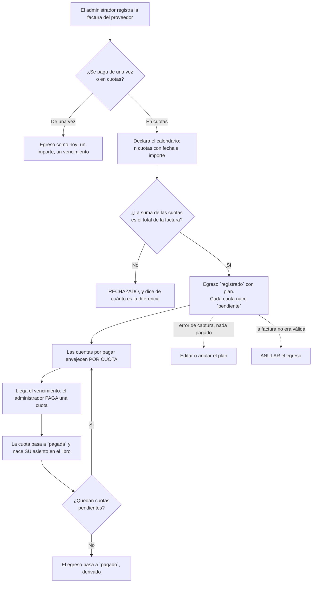

# PRD-V-FLOW-008 — Cuentas por pagar con calendario de cuotas

| Campo | Valor |
|---|---|
| **ID** | `PRD-V-FLOW-008` · §3.2 de la sesión con la administradora de Habitanto |
| **Tipo** | `FLOW` — cambia de punta a punta un proceso que **ya existe y ya mueve dinero**: registrar → causar → pagar → reportar un egreso |
| **Portales — alcance** | `ADMIN` |
| **Portales — afectados** | Ninguno. El residente y la portería no ven egresos, y **esta ficha no los abre** |
| **Módulo** | Finanzas · Egresos y cuentas por pagar |
| **Usuario principal** | `tenant_admin`. **Sin usuarios secundarios**: el consejo ve el total en el informe mensual, no el detalle |
| **Responsable** | David |
| **Estado** | 🟢 **LISTA PARA DESARROLLO** (4 sep 2026). Escrita tras medir el código y los datos de producción; **David cerró las dos preguntas abiertas y aceptó `G1` vacía el mismo día**. Ver §14 |
| **Dependencias** | `FEAT-003` (proveedores, **en producción con 0 filas**) · `PLAT-003` (plan de cuentas, **sembrado: 189 cuentas**) · `FLOW-004` (conciliación, **en producción**) · **`FLOW-007` no es dependencia: es CONSECUENCIA — esta ficha rompe su cifra de deuda a proveedores si no la corrige. Ver §11** |
| **Riesgo** | 🔴 **ALTO.** Cambia el modelo de un documento que **crea asientos en el libro**, y esos asientos son lo que concilia `FLOW-004`. No toca `aplicarPago` ni la cartera |
| **Reversibilidad** | Bandera `producto-egresos-en-cuotas`. **Lo que no se revierte solo** son las cuotas ya pagadas: cada una dejó su asiento, y un asiento conciliado no se retira sin soltar antes la conciliación. Ver §13 |
| **Plan comercial** | Todos. No es una obligación legal de ningún país: es un rodeo manual medido |

---

## 1 · Resumen ejecutivo

La administradora paga la póliza del seguro **en once cuotas**, y hoy teclea el cuadro de pagos
entero —once fechas y once importes— en su sistema, a mano. En Vivaru **no puede ni siquiera
intentarlo**: un egreso es un importe con **una** fecha, así que once cuotas son once egresos
sueltos que nadie relaciona entre sí.

Esta ficha convierte el egreso en lo que ya es en la vida real cuando hay un acuerdo de pago: **una
factura con un calendario de vencimientos**, donde cada cuota se paga por su cuenta, envejece por su
cuenta y deja su propio asiento en el libro.

El valor no es de conversión ni de cumplimiento: es **eliminar un rodeo manual** y, sobre todo,
**hacer que «lo que debemos» deje de ser una cifra plana**. Hoy una factura pagada a la mitad sigue
contando entera como deuda.

---

## 2 · Problema y baseline

### La cita que origina la ficha

> «La del seguro, yo pago en **once cuotas**. Le ingresamos todo el registro del **cuadro de pagos**
> en cuentas por pagar, **según las fechas** que tenemos que pagar.»
>
> Y al detallarlo: «le registro la factura completa y **al momento de pagar me permite editar el
> valor a pagar**», y se va saldando.

**Son dos mecanismos distintos y conviene no confundirlos**, porque solo uno entra aquí:

1. **El calendario** — el cuadro de pagos con sus fechas, conocido de antemano. Es lo que ella
   teclea y lo que hace que las cuentas por pagar envejezcan bien.
2. **El importe editable al pagar** — ir saldando un total contra un saldo corriente, sin
   calendario. Es **cómo lo resuelve Habitanto**, no lo que ella pidió.

**Esta ficha construye el 1.** El 2 queda fuera y §4 dice por qué.

### Lo que existe hoy en Vivaru, medido el 4 de septiembre de 2026

| Pieza | Estado |
|---|---|
| `Expense` | **Un importe (`amount`), una fecha de emisión (`issueDate`) y como mucho UN vencimiento (`dueDate`)** |
| `ExpenseStatus` | **`registrado` \| `pagado` \| `anulado`** — binario. No existe «pagado a medias» |
| Pago parcial de un egreso | **NO EXISTE.** No hay campo de importe pagado: se marca `pagado` y ya |
| Asiento en el libro | **`ledgerEntryId`, en singular.** Un egreso tiene UN asiento, creado al marcarlo `pagado` |
| Calendario de cuotas | **NO EXISTE.** `installment` aparece en **0 ficheros** de `src/` y `functions/src/` |
| Escritura | **Directa desde el cliente** (`createExpense` / `updateExpense` en `use-expenses.ts`), protegida por reglas |
| Deuda a proveedores | `sumarDeudaAProveedores` suma el **`amount` COMPLETO** de todo egreso en `registrado` |

### Baseline en producción — los 52 egresos

| Métrica | Hoy | Cómo se midió |
|---|---|---|
| Egresos totales | **52** — 39 `pagado`, 13 `registrado` | Colección `expenses` de `hogaru-1` |
| **Egresos SIN vencimiento** | **32 de 52** | El campo `dueDate` ausente |
| De los 13 que hoy son deuda, **sin vencimiento** | **8 de 13** | Ídem |
| Deuda a proveedores viva | **$9.814.750** | Suma de `amount` de los `registrado` |
| Egresos con calendario de cuotas | **0**, y no por falta de uso: **no se puede** | `installment` = 0 ficheros |
| Egresos con `vendorId` | **0 de 52** — el proveedor viaja como texto (`vendorName`) | `FEAT-003` está encendida sobre 0 filas |

> **EL DATO QUE MÁS DICE: el caso que motiva la ficha YA ESTÁ EN LA BASE, aplanado.** Entre los 52
> egresos hay uno descrito **«Póliza de seguro del inmueble (trimestral)»**, registrado como **un
> solo pago**. Es exactamente la factura que ella parte en cuotas, y el producto la guardó como si
> se pagara de una vez. **No hace falta imaginar el caso: ya lo estamos representando mal.**

> **Y un agravante que no se ve hasta contarlo: 32 de 52 egresos no tienen NI SIQUIERA una fecha de
> vencimiento.** Antes de discutir once fechas, la mitad de las cuentas por pagar del producto no
> puede envejecer con una sola. El calendario no es un lujo sobre una base sana: es el primer sitio
> donde ese dato se vuelve obligatorio.

### La métrica

**`G1` NO se supera**: producción tiene **cero clientes reales** —los nueve conjuntos son de
ejemplo—, así que no hay adopción que medir. Igual que en `FEAT-006`, `FEAT-007`, `FLOW-006` y
`FLOW-007`. Lo que sí se mide desde el primer día es **corrección**: `CA1`–`CA6` y `CA12`.

El día que haya un cliente, la métrica es **cuántas cuentas por pagar tienen vencimiento** —hoy 20
de 52— y **cuántos egresos se registran con plan**.

---

## 3 · Usuarios, roles y permisos

| Rol | Ve | Puede | **NO puede** |
|---|---|---|---|
| `tenant_admin` | Los egresos de su conjunto y su calendario de cuotas | Crear un egreso con plan, editar las cuotas **no pagadas**, **pagar una cuota**, anular una cuota no pagada y anular el egreso | **Editar una cuota ya pagada**, **borrar un egreso con cuotas pagadas**, y **cambiar el total de la factura por debajo de lo ya pagado** |
| `committee` | **Solo el TOTAL** de deuda a proveedores, dentro del informe mensual de `FLOW-007` | Nada aquí | **No ve el detalle por factura ni por proveedor.** Esta ficha **no** le abre `expenses`, que sigue siendo solo-administración |
| `resident` | **Nada** | Nada | Todo lo de esta ficha. Los egresos del conjunto no son suyos y la regla ya lo dice |
| `security_guard` | **Nada** | Nada | Todo lo de esta ficha |
| `superadmin` | Lo que ya ve por soporte | Nada nuevo | **No paga cuotas en nombre del conjunto.** Pagar es un acto del administrador |

---

## 4 · Objetivo, alcance y exclusiones

### Entra

1. **Un egreso puede llevar un calendario de cuotas**: n cuotas, cada una con su **número**, su
   **vencimiento** y su **importe**.
2. **Cada cuota se paga por separado**, y al pagarse **deja su propio asiento en el libro** con la
   fecha en que se pagó.
3. **La deuda a proveedores pasa a ser lo que FALTA**, no el importe de la factura. Es la corrección
   obligatoria de §11.
4. **El envejecimiento va por cuota**: «vencido» y «próximo a vencer» miran el vencimiento de cada
   cuota, no uno solo de la factura.
5. **Un egreso sin plan sigue funcionando exactamente igual que hoy.** Los 52 existentes no se
   migran ni se tocan.

### No entra, y por qué

| Fuera | Por qué |
|---|---|
| **Pagar una cuota por un importe distinto al previsto** | Es el mecanismo 2 de §2, y **no es lo que ella pidió**: es cómo lo resuelve Habitanto por no tener calendario. Admitirlo duplica la máquina de estados (una cuota pasaría a tener saldo propio) para cubrir un caso que el plan bien hecho ya resuelve — y mientras no haya nada pagado, **el plan se puede editar**. Ver `TBD-C1` |
| **Generar el plan solo** (cuotas iguales, mensuales, desde una fecha) | Es comodidad de captura, no capacidad. Se puede añadir después sin tocar el modelo, y meterlo ahora obliga a decidir redondeos del residuo antes de tener un caso real |
| **Intereses o recargos por una cuota vencida** | Es la deuda del conjunto **con un tercero**, y el contrato con ese tercero no lo gobierna Vivaru. No confundir con `FLOW-006`, que es la mora **del residente con el conjunto** |
| **Dividir un CARGO del residente en cuotas** (candidato `B8`) | Es el gemelo del lado del ingreso y **es otra ficha**: toca cartera, `aplicarPago` y el portal del residente. Nombrarlo aquí para que se vea la simetría, no para construirlo |
| **Estado de cuenta por proveedor** (candidato `E4`) | Aquí entra lo que se debe **por factura**; el estado de cuenta de cada proveedor es agregación por `vendorId`, y **hoy ningún egreso lleva `vendorId`** (0 de 52) |
| **Migrar los 52 egresos existentes** | Ninguno tiene plan y ninguno lo necesita. Migrar sería inventar un calendario que nadie pactó |

---

## 5 · Flujo funcional



**Errores y casos límite**

- **La suma de las cuotas no cuadra con el total**: se rechaza **diciendo la diferencia**. Un
  calendario que no suma la factura es un calendario que descuadrará la deuda para siempre.
- **Cero cuotas o una sola cuota**: una sola cuota es válida y equivale a un egreso normal con
  vencimiento. **Cero no**: un plan vacío no es un plan.
- **Se paga la cuota 5 antes que la 3**: **permitido**. La vida real no siempre paga en orden, y
  bloquearlo obligaría a mentir en el registro. El orden es de lectura, no una regla.
- **Se anula el egreso con cuotas ya pagadas**: **se conserva lo pagado**. Anular no borra asientos
  ya hechos; marca el egreso y **anula solo las cuotas pendientes**. Ver `RN-08`.
- **Se quiere bajar el total de la factura por debajo de lo ya pagado**: rechazado. Ver `RN-06`.
- **Conjunto suspendido o vencido**: **no registra ni paga** — solo lectura. Ver `RN-10`.
- **Conjunto en prueba**: Egresos es **módulo en vista previa**, así que se ve y no se opera, igual
  que hoy. `previewModuleWritable` ya lo veta y esta ficha **no es excepción**.

---

## 6 · Estados y transiciones

### La cuota

| Estado | Quién entra | Quién sale | Salida |
|---|---|---|---|
| `pendiente` | El administrador, al declarar el plan | `tenant_admin` | → `pagada` o → `anulada` |
| `pagada` | `tenant_admin`, al pagarla | — | **Terminal.** Dejó un asiento en el libro; deshacerlo es anular ese asiento, que es otra operación |
| `anulada` | `tenant_admin` | — | **Terminal.** Deja de contar como deuda y **no se paga** |

### El egreso

| Estado | Cómo se llega | Nota |
|---|---|---|
| `registrado` | Al crearlo | **Con plan, significa «quedan cuotas por pagar»** |
| `pagado` | **DERIVADO**: cuando ninguna cuota queda `pendiente` | **Nadie lo pone a mano cuando hay plan.** Ver `RN-04` |
| `anulado` | El administrador, sobre el egreso entero | Terminal. Las cuotas pendientes se anulan con él; **las pagadas se conservan** |

> **El estado del egreso con plan es una CONSECUENCIA, no un campo que alguien elige.** Si se
> pudiera marcar `pagado` a mano con cuotas pendientes, la deuda del conjunto bajaría sin que nadie
> pagara nada — y esa cifra es la que el consejo lee en el informe mensual.

**Nada caduca solo.** Una cuota vencida y sin pagar **sigue `pendiente` y se ve vencida**: que
alguien no haya pagado no es un estado, es un hecho que el envejecimiento tiene que mostrar.

---

## 7 · Contrato de datos y multi-tenancy

### El plan, dentro del egreso

Se añaden a `expenses` **dos campos**, y ninguno existente cambia de significado:

| Campo | Tipo | Obligatorio | Quién escribe |
|---|---|---|---|
| `installments` | `Installment[]` | — (**ausente = egreso sin plan, como hoy**) | Administración al crear/editar el plan; **servidor** al pagar |
| `paidAmount` | `number` | — | **SERVIDOR, siempre.** Lo ya pagado de esta factura |

```
Installment = {
  number:        number      // 1..n, único dentro del egreso
  dueDate:       "YYYY-MM-DD"
  amount:        number
  status:        "pendiente" | "pagada" | "anulada"
  paidAt?:       "YYYY-MM-DD"   // servidor
  paidBy?:       uid            // servidor
  paymentMethod?: PaymentMethod // el catálogo que ya existe
  bankAccountId?: string
  ledgerEntryId?: string        // servidor — el asiento de ESTA cuota
  voidReason?:   string         // motivo, obligatorio al anular una cuota
}
```

> **`ledgerEntryId` deja de ser uno y pasa a ser uno POR CUOTA, y ese es el cambio estructural de
> la ficha.** El campo `ledgerEntryId` del egreso **se conserva intacto** para los egresos sin
> plan —los 52 de hoy—, y con plan **no se usa**: cada cuota lleva el suyo. Mezclarlos dejaría dos
> sitios diciendo cuál es el asiento de un egreso, que es como nacen las derivas de este producto.

> **`paidAmount` lo escribe el SERVIDOR y no se deriva en el cliente.** Es lo que sostiene la deuda
> del conjunto, y **un campo escribible desde el cliente no puede sostener un invariante** — la
> lección que este repositorio ya pagó en `CF8` y volvió a aplicar en `FLOW-007`.

### Invariantes de Vivaru que se respetan y se declaran

- **Todo egreso lleva `tenantId`** y la consulta de lista ya lo filtra. Esta ficha **no cambia el
  alcance de lectura**: `expenses` sigue siendo **solo administración**, y por eso el plan puede
  vivir dentro del documento sin exponer nada nuevo.
- **Conjunto `suspended` o `expired` → solo lectura.** No registra, no paga, no anula. Sí consulta.
- **Conjunto en prueba** → Egresos es módulo en **vista previa**: se ve con datos de ejemplo y no
  se opera. **Esta ficha no es una excepción**, al contrario que el soporte.
- **Retención**: un egreso pagado **no se borra** — es el respaldo de una salida de dinero y su
  asiento vive en el libro. **No hereda** la ventana de 12 meses de
  `anonymizeExpiredVouchersDaily`, que es de datos personales de residentes y aquí no hay ninguno:
  lo que se guarda es el nombre de una empresa proveedora.

---

## 8 · Reglas de negocio

| # | Regla | Se verifica en |
|---|---|---|
| `RN-01` | **La suma de las cuotas es igual al total de la factura**, al céntimo. Un plan que no cuadra se rechaza **diciendo la diferencia** | `CA1` |
| `RN-02` | **Un plan tiene al menos una cuota**, y los números son **consecutivos desde 1 y sin repetir** | `CA2` |
| `RN-03` | **Cada cuota lleva vencimiento.** Sin fecha no hay calendario, y sin calendario esto es un egreso normal | `CA2` |
| `RN-04` | **El estado del egreso con plan es DERIVADO**: `pagado` cuando ninguna cuota queda `pendiente`. Nadie lo pone a mano | `CA3` — **debe fallar** |
| `RN-05` | **Pagar una cuota crea UN asiento en el libro**, por el importe de la cuota y con la fecha en que se pagó. Ni antes ni por el total | `CA4` |
| `RN-06` | **Lo pagado nunca supera el total**, y el total **no se puede bajar por debajo de lo ya pagado** | `CA5` — debe fallar |
| `RN-07` | **Una cuota `pagada` no se edita ni se reabre.** Corregirla es anular su asiento, que es otra operación | `CA6` — debe fallar |
| `RN-08` | **Anular el egreso conserva las cuotas pagadas** y anula solo las pendientes. Archivar no es esconder | `CA7` |
| `RN-09` | 🔴 **La deuda a proveedores es lo que FALTA por pagar**, no el importe de la factura. **Con plan son las CUOTAS VIVAS** —no `amount − paidAmount`, que cuenta de más en cuanto se anula una cuota—; sin plan, el importe completo | `CA8` — es la corrección de `FLOW-007` |
| `RN-10` | **Un conjunto suspendido o vencido no registra, no paga y no anula**; sí consulta | `CA9` — debe fallar |
| `RN-11` | **Un egreso SIN plan se comporta exactamente como hoy**, con la bandera encendida o apagada | `CA10` |
| `RN-12` | **Con la bandera APAGADA, el producto entero se comporta como hoy**, incluidas las cifras del informe mensual | `CA11` |
| `RN-13` | **Anular una cuota exige motivo**, y el motivo se conserva | `CA12` |

---

## 9 · Notificaciones y correo

| Cuándo | A quién | Canal | Qué dice |
|---|---|---|---|
| Una cuota vence **en los próximos días** | — | **NINGUNO en el MVP** | Ver abajo |
| Cuota pagada | — | Ninguno | Es un acto del propio administrador: avisarle de lo que acaba de hacer es ruido |

> **EL MVP NO MANDA NINGÚN AVISO, y es una decisión de David del 4 de septiembre de 2026 (`TBD-C2`), no un olvido.** El aviso útil sería «se te
> vence una cuota», y eso es un **proceso programado** que hoy no existe para egresos y que necesita
> antes dos cosas que no tenemos: **el vencimiento poblado** —32 de 52 egresos no lo traen— y
> alguien que atienda el aviso. Un recordatorio que llega sobre datos vacíos enseña a ignorarlo.
>
> **Lo que sí hace el MVP es que la deuda se VEA envejecida** en la pantalla que el administrador ya
> abre. La tarjeta «Cuentas por pagar» de Cartera ya distingue vencido y próximo a vencer
> (`summarizePayables`): con esta ficha esas dos cifras pasan a mirar **cada cuota**.

**Y no se promete ningún plazo**: el producto no controla cuándo alguien paga a un proveedor.

---

## 10 · Criterios de aceptación

| # | Criterio | Se prueba |
|---|---|---|
| `CA1` | Un plan cuyas cuotas **no suman el total** es rechazado, y el mensaje **dice la diferencia**. Con una factura de 1.100 y once cuotas de 99, dice que faltan 11 | `npm test` |
| `CA2` | **DEBE FALLAR.** Un plan con **cero cuotas**, con números **repetidos**, con números **no consecutivos**, o con una cuota **sin vencimiento**: rechazado en los cuatro casos | `npm test` |
| `CA3` | **DEBE FALLAR.** Marcar `pagado` un egreso que tiene cuotas `pendiente`: rechazado. El estado es derivado | `npm test` + banco de reglas |
| `CA4` | Pagada la cuota 3 de 11 de una factura de 1.100, **nace UN asiento de 100** con la fecha del pago, y **no uno de 1.100** | `npm test` |
| `CA5` | **DEBE FALLAR.** Pagadas 5 cuotas, editar el total de la factura a un importe **menor que lo ya pagado**: rechazado | `npm test` |
| `CA6` | **DEBE FALLAR.** Editar el importe o el vencimiento de una cuota **ya pagada**: rechazado. Y editar una **pendiente** del mismo plan: **permitido** | `npm test` + banco de reglas |
| `CA7` | Anulado un egreso con 5 de 11 pagadas: **las 5 pagadas siguen `pagada` con su asiento**, las 6 pendientes quedan `anulada`, y el egreso `anulado` | `npm test` |
| `CA8` | 🔴 **La corrección de `FLOW-007`.** Factura de 1.100 con 5 cuotas de 100 pagadas: la **deuda a proveedores vale 600**, no 1.100. Y en un egreso **sin plan**, sigue valiendo el importe completo | `npm test`, en **los dos** bancos |
| `CA9` | **DEBE FALLAR.** Un conjunto `suspended` intenta registrar un plan y pagar una cuota: rechazado las dos veces. **Consultar: permitido** | Banco de reglas + `npm test` |
| `CA10` | **Regresión.** Un egreso **sin plan** se crea, se marca pagado y genera **un** asiento por su importe — idéntico a hoy, con la bandera en cualquier estado | `npm test` |
| `CA11` | **Con la bandera APAGADA**, la deuda a proveedores y el informe mensual dan **exactamente las mismas cifras que hoy**, sobre los mismos datos | `npm test` |
| `CA12` | **DEBE FALLAR.** Anular una cuota **sin motivo**: rechazado por el servidor, no solo por el formulario | `npm test` |
| `CA13` | Una factura con cuotas vencidas y por vencer aparece en la tarjeta de Cartera con **lo vencido y lo próximo contados POR CUOTA**, no por factura | Ojos, en staging |
| `CA14` | **Falsación obligatoria.** Se rompe a propósito el cálculo de lo pendiente —volver a sumar el importe completo— y enrojecen **`CA8` y solo `CA8`** en los dos bancos | Antes de dar la entrega por buena |

> **`CA8` es el criterio que impide que esta ficha rompa la anterior.** `FLOW-007` acaba de entrar en
> producción con la deuda a proveedores calculada como **el `amount` completo de todo egreso en
> `registrado`**. En cuanto exista una factura con cuotas, esa cifra pasa a estar **mal**, y la lee
> el consejo en un documento con sanción legal detrás. **No es un criterio de esta ficha: es la
> reparación de la que ya está desplegada.**

---

## 11 · Arquitectura y dependencias

### 🔴 Lo primero: esta ficha ROMPE `FLOW-007` si no lo corrige

`sumarDeudaAProveedores`, en el núcleo del estado financiero, hace hoy esto:

```
if (egreso.status !== "registrado") continue;
total += egreso.amount ?? 0;
```

Suma **el importe completo de la factura**. Con calendario de cuotas eso deja de ser la deuda: una
póliza de 1.100 con cinco cuotas pagadas seguiría contando 1.100. La cifra la consumen **tres
sitios** —la tarjeta «Cuentas por pagar» de Cartera, el informe mensual emitible y el archivo
mensual automático— y los tres se equivocarían a la vez, porque los tres llaman a la misma función.
**Que sea una sola función es lo que hace barata la corrección**, y es exactamente el motivo por el
que `FLOW-007` la unificó.

> 🔴 **ESTO SE QUEDÓ CORTO, Y LO DESTAPÓ PAGAR UNA CUOTA DE VERDAD EN STAGING.** No eran tres:
> **eran cinco**, y los dos que faltaban **no llamaban a la función — la duplicaban**:
>
> | Dónde | Qué hacía |
> |---|---|
> | La tarjeta **«Por pagar»** de la pantalla de Egresos | Un bucle propio sumando `item.amount`. Pagada una cuota de once, **la cifra no bajaba** |
> | La **proyección de flujo de caja** | `outflow += e.amount` si el `dueDate` caía en la ventana: una póliza de once cuotas aparecía **entera** a treinta días |
>
> **La lección de método:** buscar *quién llama* a una función encuentra sus **consumidores, no
> quien la reimplementa sin llamarla**. Para eso hay que buscar el **concepto** —aquí, «sumar
> `amount` filtrando por `status`»—. Es «buscar por nombre miente» en la dirección de dar cero para
> algo que sí existe. Los dos derivan ya de las mismas primitivas, y tienen guardián con falsación.

**La corrección: la deuda de un egreso es `amount − paidAmount`**, y para uno sin plan `paidAmount`
vale 0, así que **el comportamiento de hoy queda intacto** (`CA10`, `CA11`).

> ⚠️ **Y hay que tocar el NÚCLEO, que tiene una regla propia:**
> `src/lib/finanzas/nucleo-estado-financiero.ts` **no importa NADA** y tiene copia **byte a byte**
> en `functions/src/`. Si el espejo enrojece, **no se edita el de `functions/`: se copia el de
> `src/` encima.**

### La decisión obligatoria: escritura directa o callable

**Partida, y las dos mitades tienen motivo distinto:**

| Operación | Cómo | Por qué |
|---|---|---|
| **Declarar y editar el plan** (nada pagado) | **Directa desde el cliente**, con reglas | Es captura de datos sobre una colección que **ya se escribe así** y que las reglas protegen entera. `RN-01`–`RN-03` son validaciones de forma que una regla puede comprobar |
| **Pagar una cuota** · **anular una cuota** · **anular el egreso** | **CALLABLE** | Escribe en **dos sitios** —la cuota y el libro—, mueve dinero, y **sella `paidAmount`, que sostiene la deuda del conjunto**. Si el cliente lo escribiera, bajar la deuda sería editar un número |

> **Esto CAMBIA el patrón de hoy**, y se dice: actualmente marcar un egreso como pagado es escritura
> directa y **el propio navegador crea el asiento**. Con una sola fecha y un solo importe eso era
> defendible. Con un plan deja de serlo: aparece un invariante —«lo pagado no supera el total» y «el
> estado se deriva de las cuotas»— y **un campo escribible desde el cliente no puede sostener un
> invariante**.
>
> **Y la guarda tiene que ir en los DOS lados.** Una regla de Firestore **no protege lo que escribe
> una callable** (Admin SDK no las evalúa), y una callable no protege lo que escribe el cliente
> directamente. Es la lección de `CF8`, donde el producto se negaba a facturarle a un conjunto
> suspendido y le dejaba cobrar. Las tres guardas de la callable: **quién** (`assertActiveTenantAdmin`),
> **estado del conjunto** (`assertTenantOperable`, y `assertTenantContratado` porque Egresos es
> módulo de vista previa) y **la bandera, comprobada en el servidor**.

### Lo demás

- **Sin colección nueva.** El plan vive **dentro del documento del egreso**, porque un cuadro de
  pagos es pequeño y acotado —decenas, no miles—, **siempre se lee con su factura**, y actualizar la
  cuota y el `paidAmount` derivado **en una sola escritura atómica** es justo lo que el invariante
  necesita. Si algún día un plan pasara de ~100 cuotas, esto deja de ser cierto y toca subcolección.
- **Reglas de `expenses`**: se endurecen. Hoy conceden `create, update` completos al administrador;
  pasan a **vetar** los campos que sella el servidor (`paidAmount`, y `status`/`paidAt`/`ledgerEntryId`
  de una cuota). **Es una regla que RESTRINGE, y eso invierte el orden de despliegue** — ver §13.
- **Ningún índice nuevo**: no hay consulta nueva. El plan se lee con el egreso y el envejecimiento
  se calcula en memoria, como ya hace `summarizePayables`.
- **Bandera** `producto-egresos-en-cuotas`, en **los CINCO sitios del catálogo** —los dos catálogos
  y los **tres** scripts—, y encendible **por conjunto** para el canario. Añadirla en cuatro la deja
  imposible de encender por conjunto, que es la vía del canario.
- **`FLOW-004` (conciliación) NO se toca, y encaja mejor que antes**: un caso empareja **una línea de
  banco con un asiento**, y con cuotas hay **un asiento por pago real**, que es justo lo que aparece
  en el extracto. Antes, once pagos contra un solo asiento no podían conciliarse.
- **`FEAT-003` (proveedores) no es dependencia**: el egreso ya conserva `vendorName` congelado y
  **ningún egreso lleva `vendorId`** (0 de 52). Esta ficha no lo cambia.

---

## 12 · Riesgos y mitigaciones

| # | Riesgo | Señal que lo detecta | Mitigación |
|---|---|---|---|
| `R1` | 🔴 **Romper la deuda a proveedores de `FLOW-007`**, que ya está en producción y la lee el consejo | `CA8` y `CA11` | La corrección va **en la misma entrega**, no después. Y `CA14` la falsa |
| `R2` | **Romper los 52 egresos existentes** al cambiar el modelo | `CA10` | El plan es **opcional**: sin `installments` el camino es idéntico. No hay migración |
| `R3` | **Asientos huérfanos o duplicados** al pagar cuotas | El cuadre del libro contra la suma de cuotas pagadas | La callable escribe cuota y asiento **en una transacción**; el id del asiento vive en la cuota |
| `R4` | **Anular un egreso cuyas cuotas ya se conciliaron** | `FLOW-004` ya lo cubre: borrar un asiento **suelta antes la conciliación**, y por eso lo hace el servidor | No se borran asientos de cuotas pagadas: `RN-08` los conserva |
| `R5` | **Nadie usa el plan** porque capturar once filas a mano es tedioso | Contar egresos con plan | Aceptado en el MVP. La generación automática está en §4 como exclusión **con su porqué**, y es lo primero que entra si el dato lo pide |
| `R6` | **La cifra de deuda cambia el día que se enciende** y alguien lo lee como un error | La comparación antes/después en el canario | Con la bandera apagada **no cambia nada** (`RN-12`). Al encender, la deuda **baja** solo donde haya cuotas pagadas — y esa bajada es la corrección, no una pérdida |
| `R7` | **Endurecer la regla de `expenses` deja fuera una escritura legítima** que hoy funciona | El banco de reglas, y la pantalla de Egresos | La regla se despliega **después** de que el front deje de escribir esos campos. Ver §13. **Seis pruebas del banco existen solo para esto** |
| `R8` | 🔴 **NUEVO (4 sep) · el array `installments` sostiene un invariante y lo escribe el CLIENTE.** Desde la entrega 2 la deuda se deriva de las cuotas vivas, así que un cliente manipulado podría marcarlas `pagada` o `anulada` y bajar la deuda **sin pasar por el servidor**. **Las reglas no pueden impedirlo: no iteran listas** | `paidAmount` dejaría de cuadrar con la suma de las cuotas `pagada` — **detectable, no impedido** | **DECISIÓN PENDIENTE DE DAVID.** El cierre completo es **mover la edición del plan a una callable**, lo que cambia §11 (que decidió escritura directa cuando la deuda venía de `paidAmount`, no de las cuotas). No se hizo por libre: es un cambio de alcance |

---

## 13 · Despliegue, rollback y Story Map

> ⚠️ **EL ORDEN SE INVIERTE, y hay que decirlo antes de empezar.** El de siempre es **reglas →
> functions → front**, y vale cuando la regla **amplía**. Aquí la regla **RESTRINGE**: pasa a vetar
> campos que hoy el navegador escribe. Desplegarla primero rompería la pantalla de Egresos en
> producción durante toda la ventana. El orden es:
>
> **functions → front → reglas.**
>
> Es la misma inversión que ya se pagó en `PLAT-002`, y la comprobación obligatoria antes de subir
> la regla es **diferenciar el ruleset desplegado contra el fichero del repositorio**, no `git diff`
> entre ramas: `functions/scripts/verificar-reglas-desplegadas.mjs <projectId>`.

### Entregas

| # | Qué | Reversible |
|---|---|---|
| **1** | ✅ **CONSTRUIDA (4 sep 2026), sin desplegar.** `installments` y `paidAmount` en el modelo, validación del plan, **la corrección de la deuda a proveedores** (`RN-09`, `CA8`) y el envejecimiento por cuota. El plan se declara y se ve; **no se paga todavía** | Sí, bandera |
| **2** | ✅ **CONSTRUIDA (4 sep 2026), sin desplegar.** Tres callables —pagar una cuota con su asiento, anular cuota con motivo, anular el egreso conservando lo pagado— y el estado derivado | Sí, bandera |
| **3** | ✅ **CONSTRUIDA (4 sep 2026).** Reglas de `expenses` endurecidas: `paidAmount` y los sellos de anulación son del servidor, con plan el estado no lo mueve el cliente, y una factura con cuotas pagadas no se borra | **No con bandera**: se revierte redesplegando las reglas anteriores |

### Rollback

1. **Apagar la bandera** — el plan deja de pintarse y la deuda vuelve a contar el importe completo.
2. **Lo que no se revierte solo**: las cuotas **ya pagadas** dejaron su asiento en el libro, y si
   alguno se concilió, retirarlo exige soltar antes la conciliación. **Apagar la bandera no borra
   dinero ya registrado**, ni debe.
3. **La entrega 3 no se revierte con bandera**: se redespliegan las reglas anteriores.

### Qué se valida dónde

| Dónde | Qué |
|---|---|
| `npm test` y functions | `CA1`–`CA8`, `CA10`–`CA12`, y la falsación `CA14` |
| Banco de reglas | `CA3`, `CA6`, `CA9` — **y SÍ se pueden correr aquí**: el JDK está en `~/.local/jdk` y `CLAUDE.md` lo documenta. *(La afirmación de que este equipo no tiene Java circuló en cuatro documentos y era falsa; se corrigió el 4 de septiembre de 2026.)* |
| Staging, con ojos | `CA13` — el envejecimiento por cuota en la tarjeta de Cartera, y la captura de un plan de once cuotas de principio a fin |
| Producción | Que con la bandera apagada la deuda a proveedores **no se mueve** |

---

## 13 bis · Estado tras la entrega 1 — 4 de septiembre de 2026

| Criterio | Estado | Dónde vive |
|---|---|---|
| `CA1` | ✅ **Cumplido, y el mensaje NOMBRA la diferencia** | «faltan $11» con once cuotas de 99 sobre una factura de 1.100 |
| `CA2` | ✅ **Cumplido — los cuatro casos fallan** | Plan vacío, números repetidos, con salto, sin vencimiento e importe no positivo |
| `CA8` | ✅ **Cumplido, y EN LOS DOS BANCOS** | Cuatro casos nuevos en `tests/fixtures/estado-financiero-golden.json`, que corren `npm test` **y** functions |
| `CA10` `CA11` | ✅ **Cumplidos** | Un egreso sin plan no cambia, y la cifra de los 13 egresos reales de producción sigue dando **9.814.750** |
| `CA13` | 🟡 **Construido; falta MIRARLO** en staging | El vencimiento por cuota en la tarjeta de Cartera y en la columna «Vence» |
| `CA3` `CA5` `CA6` `CA7` `CA9` `CA12` | ⏳ **Entregas 2 y 3** | Necesitan pagar y anular, que es la entrega 2 |
| `CA14` | ✅ **Falsado, y la predicción FALLÓ** | Ver abajo |

**Bancos: `npm test` 1748 · functions 830**, los dos en verde y el espejo del núcleo idéntico.

> **`CA14` decía que romper lo pendiente enrojecería «`CA8` y solo `CA8`», y NO fue así — la
> predicción estaba mal, no la construcción.** Enrojecieron **cuatro pruebas en tres criterios**:
> los dos casos de `CA8`, el `CA13` de la tarjeta y el guardián de «las categorías suman el total».
> El motivo es que `pendienteDelEgreso` **alimenta tres consumidores** —el total de la deuda, el
> total de la tarjeta y el reparto por categoría— y la ficha los contó como un cable. **Es
> literalmente lo que pasó con `CA18` en `FLOW-007`**, dos entregas antes.
>
> Las otras cinco falsaciones enrojecieron **exactamente lo suyo**: quitar el topado en cero (1),
> ignorar el plan al envejecer (3), quitar la comprobación del plan vacío (2), devolver el reparto
> por categoría al importe completo (1), y romper la aritmética **en las dos copias del núcleo a la
> vez** (6 en `src` y 2 en functions, **con el espejo idéntico** — así la falsación prueba la
> aritmética y no la divergencia).

### Lo que la construcción enseñó, y no estaba en la ficha

**1 · La aritmética corregida NO va detrás de la bandera, a propósito.** La bandera gobierna **poder
declarar un plan**, no las matemáticas del dinero: revertir una cifra a la versión equivocada es
volver a mentir. Es la misma decisión que `FLOW-007` tomó con el aviso falso de «Fondo insuficiente».
Lo que lo hace seguro es que **sin plan no hay `paidAmount`**, y sin bandera no hay plan.

**2 · El reparto por categoría de la tarjeta de Cartera también había que corregirlo**, y no estaba
escrito. Sumaba `e.amount` mientras el total pasaba a ser lo pendiente: la tarjeta habría enseñado
**un total y unas categorías que no lo suman**. Es el defecto de un widget contradiciéndose consigo
mismo, que es peor que estar mal — y el mismo que `FLOW-007` cazó entre su total y su desglose.

**3 · `npm test` enrojecía sin emulador por culpa de `FLOW-007`, y se arregló aquí.** El banco de
reglas del informe mensual se añadió a `vitest.rules.config.ts` **y no a las exclusiones de
`vitest.config.ts`**. Es el mismo descuido que ya tuvo `push-tokens.rules.test.ts`: **un rojo que
viene del entorno enseña a ignorar el color**. Los dos ficheros van siempre juntos.

**4 · El guardián del mapa de estados estaba CIEGO a partir del primer miembro de una unión.**
Leía `/status:\s*"([a-zA-Z_]+)"/`, así que ante `status: "pendiente" | "pagada" | "anulada"`
reclamaba la primera y **daba por buenas las otras dos**. Al ensancharlo aparecieron **seis claves
sin traducir preexistentes** —`cerrada`, `sent`, `invalid`, `used`, `applied`, `anulado`—, de
campañas de cobro, programación de envíos, invitaciones, anticipos y comprobantes. **Ninguna es de
esta ficha**: solo fue quien hizo visible el punto ciego. Es `UX-004` otra vez.

---

## 13 ter · Estado tras la entrega 2 — 4 de septiembre de 2026

| Criterio | Estado | Dónde vive |
|---|---|---|
| `CA3` | ✅ **Cumplido** | El estado del egreso es **derivado**: `pagado` solo cuando ninguna cuota queda pendiente |
| `CA4` | ✅ **Cumplido** | Pagar la cuota 3 de 11 crea **un asiento de 100**, no de 1.100, con la fecha del pago |
| `CA6` | ✅ **Cumplido — debe fallar y falla** | Una cuota **pagada** no se anula: dejó un asiento que puede estar conciliado |
| `CA7` | ✅ **Cumplido** | Anular la factura con 5 de 11 pagadas conserva **las 5 cuotas y sus 5 asientos** |
| `CA12` | ✅ **Cumplido en el SERVIDOR** | Anular sin motivo se rechaza, y el motivo se **recorta antes de mirarlo** |
| `CA5` `CA9` | ⏳ **Entrega 3** | Piden las reglas endurecidas |
| `CA13` | 🟡 **Falta MIRARLO** en staging | El vencimiento por cuota en la tarjeta y en la columna «Vence» |

**Bancos: `npm test` 1751 · functions 832 · reglas 371 · emulador 322**, con los dos rojos
**preexistentes** de `payments.emulator.test.ts`.

> ### 🔴 LA ENTREGA 2 CORRIGIÓ UN DEFECTO DE LA ENTREGA 1, DE ESTA MISMA JORNADA
>
> La entrega 1 calculaba la deuda como **`amount − paidAmount`**, que es lo que esta ficha escribió
> en `RN-09`. **Está mal en cuanto se anula una cuota sin anular la factura** —el proveedor perdona
> lo que queda—: una póliza de 1.100 con cinco cuotas pagadas y **seis anuladas** seguiría contando
> **600 de deuda que ya nadie debe**. Se midió con un caso a mano **antes** de escribir el pago.
>
> **La deuda de una factura con plan son sus CUOTAS VIVAS.** Y la razón de fondo es mejor que el
> caso que lo destapó: **las cuotas son la fuente de verdad y `paidAmount` es un acumulado que hay
> que mantener**. Derivar la deuda de lo que se mantiene es pedir que algún día se desincronice;
> derivarla de las cuotas no puede desincronizarse de sí mismo. `paidAmount` se conserva —lo sella
> el servidor y se enseña— pero **ya no sostiene la cifra**.
>
> **Y la regla nueva destapó un fixture propio que la vieja toleraba:** un caso de prueba llevaba
> `paidAmount: 500` con las once cuotas en `pendiente`. Incoherente, y `amount − paidAmount` lo daba
> por bueno.

### Lo que la entrega 2 enseñó

**1 · El asiento de una cuota tiene que tener la MISMA forma que el del egreso sin plan.**
`type: "egreso"`, `sourceType: "expense"`, `sourceId` el egreso, `reconciled: false`. Si tuviera
otra, **la conciliación dejaría de emparejarlo** y el estado financiero lo agruparía en otro sitio.
Lo único añadido es `installmentNumber`, para volver del asiento a su cuota. Hay prueba que lo fija.

**2 · La cuenta contable NO se recalcula en el servidor.** `codigoDeCategoriaDeEgreso` vive solo en
`src/`, y el documento del egreso **ya guarda su `accountCode`**. Recalcularlo sería una segunda
implementación de la misma regla — exactamente cómo nacieron `R12` y `R16`. Se lee del egreso.

**3 · Pagar va en TRANSACCIÓN, y no es cosmética.** Marcar la cuota y escribir el asiento son dos
escrituras: si solo cuajara la primera, el conjunto tendría **una cuota pagada que no aparece en el
libro** — dinero que salió y que ningún informe cuenta.

**4 · Anular una cuota NO comprueba la bandera**, igual que anular un informe o un paz y salvo:
apagarla no puede dejar cuotas vivas sin forma de retirarlas.

> **Cuatro falsaciones, cada una roja solo en lo suyo:** quitar la derivación del estado (3, y las
> tres son suyas), quitar la idempotencia del pago (1), anular también las cuotas pagadas (1), y
> permitir anular una cuota ya pagada (1).

---

## 13 quater · Estado tras la entrega 3 — 4 de septiembre de 2026

| Criterio | Estado |
|---|---|
| `CA5` | ✅ **Cumplido** — `paidAmount` no se inventa al crear ni se mueve al editar, **ni con `setDoc`** |
| `CA9` | ✅ **Cumplido** — un conjunto `suspended` no crea ni edita; un residente no toca `expenses` |
| `CA3` **en la regla** | ✅ **Cumplido** — con plan, el cliente **no cambia el estado**: ni a `pagado` ni a `anulado`, y no puede nacer `pagado` |

**Bancos: `npm test` 1755 · functions 832 · reglas 389 · emulador 322** (dos rojos preexistentes).

> ### 🔴 UN DEFECTO EN MI PROPIA REGLA, CAZADO CON UNA SONDA
>
> La regla usaba `changedKeys()` para vetar los sellos de anulación, y **dejaba pasar
> `voidReason`**. La causa, **medida con una sonda contra el emulador y no razonada**:
>
> > **`changedKeys()` son las claves que están en LOS DOS mapas con un valor distinto.
> > Una clave AÑADIDA no aparece.** Lo que hacía falta es **`affectedKeys()`** =
> > añadidas + borradas + cambiadas.
>
> Es exactamente el caso que la línea venía a bloquear —escribir un motivo de anulación
> donde no había ninguno—, así que la protección era **cero** en su propio escenario.
>
> ⚠️ **Y el mismo patrón está en OTROS CUATRO SITIOS del fichero**, todos preexistentes y de
> otras fichas: `firestore.rules:463` (`visitorInvitations`), **`:490` (`visitorPasses`, con
> `hasOnly` — ahí una clave añadida se colaría entera)**, `:561` y `:1239`. **No se tocaron**:
> son de otro alcance y cada uno necesita su propia falsación. Hay chip abierto.

### Lo que la entrega 3 enseñó

**1 · `installments` se guarda como `null` cuando no hay plan**, así que `'installments' in d` es
**cierto para los 52 egresos de producción**. Preguntar por la clave en vez de por el valor habría
bloqueado el flujo de siempre — y la falsación lo confirma: con `'installments' in d`, **enrojecen
las dos pruebas de «los egresos sin plan no notan la regla nueva»**.

**2 · La falsación que enseña es BORRAR EL BLOQUE**, y aquí sí cazó: revertir a la regla permisiva
enrojece **ocho** pruebas. A diferencia de `FLOW-007`, estas no son de denegación pura —comprueban
restricciones concretas—, así que el deny por defecto no las satisface.

> **Lo que estas reglas NO pueden hacer, y está escrito en el propio fichero:** el lenguaje **no
> itera listas**, así que no se puede comprobar cuota por cuota. Cerrar `paidAmount` deja cualquier
> manipulación **detectable** —dejaría de cuadrar con la suma de las cuotas `pagada`— pero no
> impedida. **La consecuencia de diseño es de David y está en `R8`.**

---

## 14 · Puertas

| Puerta | Estado | Por qué |
|---|---|---|
| **`G0` Necesidad** | ✅ | Rodeo manual **declarado en voz alta** por quien lo sufre, y **el caso ya está en la base aplanado** («Póliza de seguro del inmueble (trimestral)», un solo pago). Además, **32 de 52 egresos no tienen ni una fecha de vencimiento** |
| **`G1` Valor** | ❌ **NO SE SUPERA — y David aceptó su ausencia explícitamente (4 sep 2026)** | **Cero clientes reales.** `CA1`–`CA8` la sustituyen con métrica de **corrección**. Misma situación aceptada en `FEAT-006`, `FEAT-007`, `FLOW-006` y `FLOW-007`. **Aceptarla vacía NO la vuelve superada**: el día que haya un cliente, medir cuántas cuentas por pagar llevan vencimiento —hoy 20 de 52— y cuántos egresos se registran con plan es **deuda de esta ficha** |
| **`G2` Datos y permisos** | ✅ | Modelo, campos, quién escribe cada uno, y los cinco roles **con lo que NO pueden**. No abre ninguna colección a nadie nuevo |
| **`G3` Riesgo** | 🟡 **PARCIAL** | Bandera, rollback y guardianes sí. **Pero toca el núcleo del estado financiero y una cifra que ya está en producción** (`R1`), y **endurece una regla**, que invierte el orden de despliegue |
| **`G4` Aceptación** | ✅ | 14 criterios, **seis deben fallar**, y uno es la falsación |
| **`G5` Operación** | ✅ | **El dueño existe y ya hace la tarea**: la administradora teclea hoy el cuadro de pagos a mano. Es la misma prueba que superó `FLOW-007` y que `FLOW-006` no supera |
| **`G6` Escala** | ✅ | Un plan son decenas de cuotas, no miles; sin consulta nueva y sin índice nuevo |

> ✅ **ES LISTA PARA DESARROLLO** desde el 4 de septiembre de 2026: David aceptó `G1` vacía y cerró
> las dos preguntas, **las dos en «no en el MVP»**. No queda nada esperando a nadie.
>
> **`G3` queda en amarillo A PROPÓSITO**, y no se sube: no es incertidumbre, es que la entrega toca
> **una cifra que ya está en producción** (`R1`) y **endurece una regla** (`R7`). Las dos piden el
> cuidado que §11 y §13 describen, y el amarillo existe para que quien construya lo lea antes de
> empezar en vez de descubrirlo al desplegar.

### Preguntas abiertas — **CERRADAS las dos, por David, el 4 de septiembre de 2026**

| # | Pregunta | Decisión | Qué implica |
|---|---|---|---|
| **`TBD-C1`** | ¿Una cuota admite pagarse por un importe distinto al previsto? | ❌ **NO EN EL MVP** | La cuota **no tiene saldo propio**: `pendiente` es binario y se paga entera. Es el mecanismo 2 de §2, que es **cómo lo resuelve Habitanto por no tener calendario**, no lo que se pidió. Mientras no haya nada pagado, **el plan se edita**, y eso cubre el error de captura. Si aparece de verdad, entra como **entrega 4 sin rehacer lo anterior** |
| **`TBD-C2`** | ¿Se avisa de una cuota próxima a vencer? | ❌ **NO EN EL MVP** | **Ningún aviso, ningún proceso programado.** La necesidad la cubre el **envejecimiento en pantalla** (`CA13`), en la tarjeta que el administrador ya abre. Reabrirlo exige antes poblar el vencimiento: **32 de 52 egresos no lo traen** |

> **Las dos decisiones apuntan al mismo sitio, y conviene verlo: el MVP se queda con EL CALENDARIO Y
> NADA MÁS.** Ni saldo por cuota, ni recordatorios. Es lo que ella pidió con esas palabras —«le
> ingresamos todo el registro del cuadro de pagos según las fechas»— y lo que hace que la deuda del
> conjunto deje de ser una cifra plana. **Todo lo demás que se le parece está fuera y con su
> porqué**, en §4 y aquí.

---

## Procedencia

Escrita el **4 de septiembre de 2026**. Fuente del problema: **§3.2 de
`docs/sesion-administradora-habitanto.md`** —el transcript del 19 de agosto—, **no** el documento de
candidatos: ninguno de los diez candidatos de la categoría `E` cubre esto, lo que confirma que el
hueco salió de **escuchar** y no de navegar la aplicación.

Medido contra el código (`src/types/domain.ts`, `src/features/finanzas/use-expenses.ts`,
`payables.ts`, `nucleo-estado-financiero.ts`, `firestore.rules`) y contra **los datos de producción
de `hogaru-1`** el 4 de septiembre de 2026: 52 egresos, 39 `pagado` y 13 `registrado`, 32 sin
vencimiento, 0 con `vendorId`, y `installment` en **0 ficheros** del repositorio.
