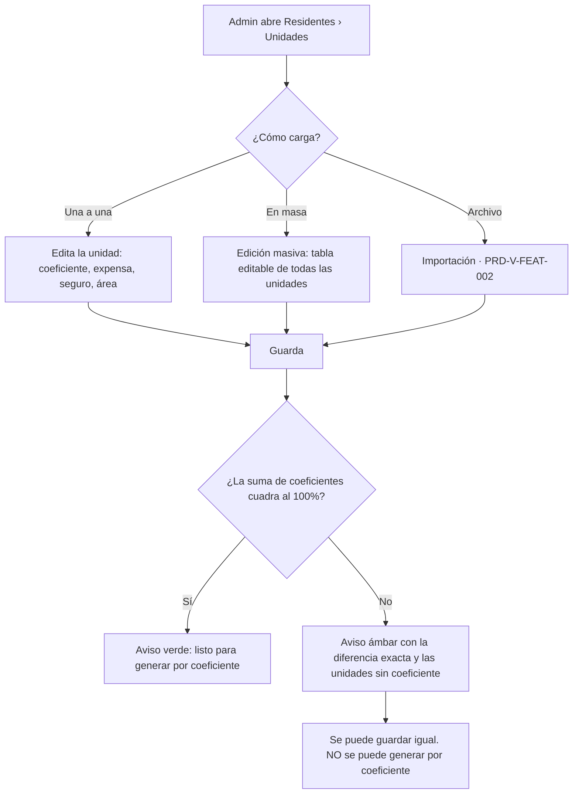
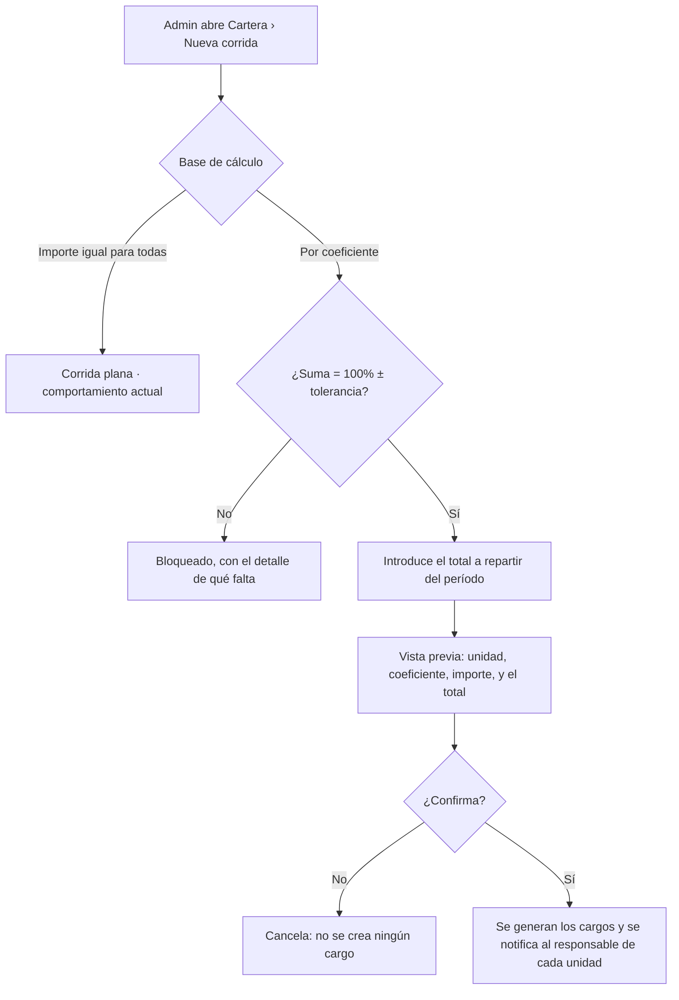

# PRD-V-PLAT-001 — Copropiedad: alícuota, expensa y responsable de la unidad

| | |
|---|---|
| **ID** | `PRD-V-PLAT-001` (tentativo hasta registrarlo en `docs/prd/README.md`) |
| **Tipo** | `PLAT` — redefine un contrato de datos compartido por **Residentes** y **Cartera**, y cambia lo que ve el residente. No cabe como `FEAT` de un módulo |
| **Portales** | **`ADMIN`** (alcance) · **`RESIDENTE`** (alcance: ve su alícuota y su expensa) · `SUPERADMIN` (afectado: alta de conjunto) · `PORTERIA` (no afectado) |
| **Módulo** | Residentes · Cartera |
| **Usuario principal** | `tenant_admin` / `admin_tenant` |
| **Usuarios secundarios** | `resident` · `committee` |
| **Responsable** | David |
| **Estado** | 🟢 **CONSTRUIDA, EN PRODUCCIÓN Y CON DATOS EN UN CONJUNTO.** Verificado el 3 de septiembre midiendo `units` (colección **raíz**, 93 documentos): el campo es `coefficient`, y **`tenant-santa-maria` tiene 18 de sus 19 unidades con coeficiente, sumando `100,0000` exacto**; los otros siete conjuntos con unidades siguen a cero. Bandera `producto-cobro-por-coeficiente` **encendida**. D1, D2, D3 y G5 cerradas por David el 21 de agosto de 2026. **Criterios SIN repasar contra producción** (3 sep 2026). |
| **Dependencias** | **Ninguna.** No depende del programa de IA ni de Albert |
| **Habilita** | El prorrateo de un gasto entre unidades, el certificado de paz y salvo y el voto ponderado por alícuota |
| **Solapamiento** | `PRD-V-FEAT-002` (Importación de datos del conjunto) — ver §11.4 |
| **Riesgo** | **Medio.** Toca cómo se calcula lo que cada unidad debe |
| **Reversibilidad** | **Total.** Es aditiva: sin coeficiente, la generación plana de hoy sigue funcionando igual (§13) |
| **Fase comercial** | Aplica a `trial` y `active`. Ver §7.3 |

---

## 1. Resumen ejecutivo

Vivaru cobra hoy **el mismo importe a todas las unidades de un conjunto**: la corrida de
cobro guarda un solo `unitAmount` y lo replica. En propiedad horizontal eso solo es correcto
cuando todas las unidades son iguales, que es la excepción, no la regla.

Esta PRD añade a la unidad su **coeficiente de copropiedad (alícuota)**, su **valor de expensa**
y **quién responde por sus cargos**, y hace que la generación de cobro lea esos datos en vez de
un importe único.

El valor es doble: permite cobrar lo que corresponde a cada unidad, y **es el dato del que
dependen** el prorrateo de un gasto, el certificado de paz y salvo y el voto ponderado.

**Se construye ahora porque hoy no hay ni un cliente real.** Cambiar la base de cálculo del
cobro cuando ya existan dos años de cargos emitidos no es una funcionalidad: es una migración.

## 2. Problema y baseline

### Lo que existe hoy, verificado en el código

| Qué | Dónde | Qué guarda |
|---|---|---|
| Unidad | `units` · `UnitItem` en `src/features/admin/services.ts:32` | `unitId`, `displayName`, `tower`, `type`, `status`, `ownerIds[]`, `residentIds[]`, `reservationExempt` |
| Persona | `people` · `PersonItem` | `fullName`, `documentNumber`, `unitId`, `tower`, `roleType`, `occupancyType`, `status` |
| Corrida de cobro | `BillingCampaign` en `src/types/domain.ts:294` | **`unitAmount`: un solo importe para todas las unidades** |
| Cargo | `BillingStatement` en `src/types/domain.ts:268` | `unitId`, `period`, `concept`, `amount`, `balance`, `status` |
| Permisos | `firestore.rules:205` | Lectura: cualquier miembro del conjunto. Escritura: `tenantAdminOrSuper` + `tenantOperable` |

### Lo que NO existe

- **No hay coeficiente de copropiedad.** En Vivaru «alicuota» es solo una categoría del libro
  (`LedgerCategory = "alicuota"`, etiquetada «Cuotas de administración» en
  `src/features/finanzas/financial-statement.ts:16`). No es un porcentaje por unidad.
- **No hay valor de expensa por unidad.** El importe vive en la corrida, no en la unidad.
- **No hay responsable designado del cargo.** El cargo apunta a `unitId`; no dice a quién se
  le cobra cuando la unidad tiene propietario e inquilino.
- **No hay área de la unidad**, que es la base alternativa de prorrateo cuando no hay escritura.

### Dos defectos del modelo actual que esta PRD debe resolver o declarar

1. **La relación persona↔unidad está guardada dos veces**, en formas que pueden discrepar:
   en la unidad como `ownerIds[]` / `residentIds[]`, y en la persona como `unitId` +
   `roleType`. Nada garantiza que coincidan.
2. **`PersonItem` tiene `roleType` y `occupancyType` con el mismo conjunto de valores**
   (`owner_occupant | tenant | investor | other`). Duplicación sin regla que las distinga.

### Baseline medible

**No hay volumen real que medir: cero clientes, cero pagos.** El baseline honesto es
estructural, no estadístico:

| Indicador | Hoy |
|---|---|
| Unidades que pueden cobrar un importe distinto entre sí | **0** |
| Conjuntos de producción con coeficiente cargado | ~~**0 de 9**~~ → **1 de 9** (`tenant-santa-maria`: 18 de sus 19 unidades, sumando `100,0000` exacto). Medido el 3 sep 2026 sobre `units`, que es colección **raíz** y no subcolección del conjunto |
| Formas de prorratear un gasto común | **Ninguna** |

**Métrica de éxito, medible desde el primer conjunto real:** que la suma de los cargos
generados por coeficiente en un período **cuadre exactamente** con el presupuesto repartido,
sin diferencia de redondeo sin dueño (§8, R6).

## 3. Usuarios, roles y permisos

| Rol | Ve | Puede | **NO puede** |
|---|---|---|---|
| `tenant_admin` / `admin_tenant` | Coeficiente, expensa, área y responsable de todas las unidades de **su** conjunto | Editarlos uno a uno y en masa; generar cobro por coeficiente | Editar unidades de otro conjunto. Generar por coeficiente si la suma no cuadra (§8, R2). Operar si el conjunto está `suspended` o `expired` |
| `resident` | **Su** coeficiente, **su** expensa y quién es el responsable de su unidad | Consultarlo | Editar ningún valor. Ver el coeficiente de otra unidad |
| `committee` | Igual que el residente, más el listado de coeficientes del conjunto | Consultar y exportar | Editar |
| `security_guard` | Nada de esto | — | Acceder a la pantalla |
| `superadmin` | Todo, en cualquier conjunto | Editar y corregir | — |

> **Nota de portafolio — 21 ago 2026.** Lo que esta PRD asigna al rol `committee` **hoy no es
> alcanzable**: `canAccessPath` (`src/lib/auth/routing.ts:28`) lo deja **solo en
> `/admin/documents`**. A nivel de reglas **sí puede leer** —es miembro del conjunto— así que
> **el bloqueo es de navegación, no de permisos**. Ampliar su alcance merece **PRD propia**:
> decidir qué pantallas ve y comprobar que las reglas no le abran datos personales por el
> camino. **Hasta entonces, las filas de `committee` de esta tabla son intención declarada, no
> capacidad disponible.**

**Por qué el consejo ve el listado completo y el residente no:** el coeficiente de cada unidad
es información de la copropiedad, y el consejo la necesita para revisar el reparto. El
residente solo tiene interés legítimo en el suyo. **Es una decisión, no una omisión.**

## 4. Objetivo, alcance y exclusiones

**Objetivo.** Que la unidad guarde lo que hace falta para cobrarle lo que le corresponde, y que
la generación de cobro lo use.

### Entra

1. Coeficiente de copropiedad por unidad.
2. Valor de expensa y valor de seguro por unidad.
3. Área en m² de la unidad.
4. Banderas de ocupación: ocupada y arrendada.
5. Responsable de los cargos de la unidad (quién paga).
6. Edición masiva de estos valores desde una pantalla del administrador.
7. Generación de cobro **por coeficiente** además de la plana que ya existe.
8. Visibilidad del coeficiente y la expensa para el residente y el consejo.
9. Validación de que la suma de coeficientes del conjunto cuadra.

### No entra, y por qué

| Excluido | Por qué |
|---|---|
| **Prorratear una cuenta por pagar entre unidades** | Es la PRD siguiente. Esta construye el dato del que depende |
| **Certificado de paz y salvo** | PRD aparte; depende de esta |
| **Voto ponderado por alícuota** | PRD aparte; depende de esta |
| **Bodegas, terrazas y parqueaderos como entidades** | Van con el certificado de expensas, no aquí |
| **Interés de mora** | PRD aparte |
| **Unificación de unidades** | Backlog `A12`. Fusionar unidades con coeficiente exige decidir qué pasa con la suma, y eso merece su propio diseño |
| **Resolver la duplicación `roleType`/`occupancyType`** | Se **declara** en §2 y se acota en §7.2, pero limpiarla es un `FIX` aparte para no mezclar una corrección con una capacidad nueva |

## 5. Flujo funcional

### 5.1 Cargar los coeficientes

**Se puede guardar un conjunto que no sume 100%.** Las escrituras reales tienen erratas y el
administrador necesita poder cargar lo que dice el documento antes de corregirlo. Lo que se
bloquea es **generar cobro** con una base que no cuadra.

### 5.2 Generar el cobro del período

**La vista previa antes de generar es obligatoria**, no un adorno: una corrida crea decenas de
cargos de golpe y hoy no hay forma de deshacerlos en lote.

### 5.3 Casos límite

| Caso | Comportamiento |
|---|---|
| Unidad `status: "inactive"` | **No** se le genera cargo, y **no** cuenta en la suma de coeficientes |
| Unidad sin coeficiente en un conjunto que sí usa coeficiente | Bloquea la generación y se nombra la unidad |
| Unidad exenta de un concepto | No se le genera ese concepto; su coeficiente **sí** cuenta para la suma |
| El total a repartir no divide exacto entre los coeficientes | Se reparte el residuo por resto mayor (§8, R6) |
| Unidad sin responsable designado | Cae en el primer propietario (`ownerIds[0]`); si no hay, bloquea |
| Conjunto `suspended` o `expired` | Solo lectura: se ven los coeficientes, no se editan ni se genera |

## 6. Estados y transiciones

Esta PRD **no introduce un ciclo de vida nuevo**. Los cargos siguen el de `BillingStatement`
(`pending → paid` / `overdue`), que no cambia.

Lo que sí introduce es un **estado derivado del conjunto**, sin persistencia propia:

| Estado del reparto | Cuándo | Quién lo cambia | Salida |
|---|---|---|---|
| **Sin base** | Ninguna unidad tiene coeficiente | Administración, al cargar | → Incompleto o Cuadrado |
| **Incompleto** | Hay coeficientes pero la suma ≠ 100% ± tolerancia | Administración | → Cuadrado, al corregir |
| **Cuadrado** | Suma = 100% ± tolerancia | Administración | → Incompleto, si edita y descuadra |

**Solo en Cuadrado se puede generar por coeficiente.** En los otros dos, la corrida plana sigue
disponible: **el conjunto nunca se queda sin poder cobrar.**

## 7. Contrato de datos y multi-tenancy

### 7.1 Campos nuevos en `units`

| Campo | Tipo | Obligatorio | Quién escribe | Nota |
|---|---|---|---|---|
| `coefficient` | `number` | No | Administración · Superadmin | Porcentaje con **6 decimales** (§14, D1). Ausente = la unidad no participa del reparto |
| `monthlyFeeAmount` | `number` | No | Administración · Superadmin | Valor de expensa de la unidad, en la moneda del conjunto |
| `insuranceFeeAmount` | `number` | No | Administración · Superadmin | Valor de seguro, si el conjunto lo cobra aparte |
| `areaSqm` | `number` | No | Administración · Superadmin | Base alternativa de reparto y dato del certificado |
| `occupied` | `boolean` | No | Administración | Ausente = se asume ocupada |
| `leased` | `boolean` | No | Administración | Gobierna a quién se cobra si el conjunto lo configura así |
| `billingResponsiblePersonId` | `string` | No | Administración | Id en `people`. Ausente = `ownerIds[0]` |
| `exemptConcepts` | `string[]` | No | Administración | Conceptos de `BillingConcept` que esta unidad no paga |

**Todos aditivos y opcionales.** Ninguna unidad existente requiere migración: sin
`coefficient`, el conjunto se queda en «Sin base» y sigue cobrando como hoy.

### 7.2 Lo que esta PRD NO toca del modelo

`ownerIds[]`, `residentIds[]`, `roleType` y `occupancyType` **se dejan como están**. El
responsable de cobro se resuelve por `billingResponsiblePersonId` y, si falta, por
`ownerIds[0]`. La duplicación de §2 queda **declarada y acotada**, no resuelta: resolverla es
un `FIX` aparte.

### 7.3 Multi-tenancy y ciclo de vida del conjunto

- Todos los campos viven en documentos de `units`, que ya llevan **`tenantId`**. Toda consulta
  de lista **debe filtrar `where("tenantId","==",...)`**: las reglas rechazan, no filtran.
- **`suspended` / `expired`** → solo lectura, por `tenantOperable` (`firestore.rules:48`). No
  hay excepción: esto no es soporte.
- **`trial`** → Cartera está en `preview` durante la prueba
  (`src/lib/config/trial-modules.ts`). El coeficiente **se puede cargar** en prueba —es parte
  de la puesta en marcha— pero **generar cobro sigue gobernado por la matriz de la prueba**,
  sin excepción.

### 7.4 Retención y borrado

El coeficiente y la expensa son **datos de la unidad, no de la persona**: no caducan con la
política de retención de 12 meses ni se anonimizan. `billingResponsiblePersonId` **sí** apunta
a una persona: al borrar esa persona, el campo se limpia y la unidad cae en `ownerIds[0]`.

## 8. Reglas de negocio

| # | Regla |
|---|---|
| **R1** | El coeficiente es un número entre `0` y `100`, con hasta 6 decimales |
| **R2** | Solo se puede generar cobro por coeficiente si la suma de los coeficientes de las unidades **activas** está en `100 ± 0.000001` |
| **R3** | Una unidad `inactive` no recibe cargos ni cuenta para la suma de R2 |
| **R4** | Una unidad sin coeficiente **no bloquea guardar**, pero **sí bloquea generar por coeficiente**, y se la nombra en el mensaje |
| **R5** | El cargo se emite a nombre del responsable: `billingResponsiblePersonId`, o `ownerIds[0]` si falta. **Sin ninguno de los dos, la unidad bloquea la corrida** |
| **R6** | Al repartir un total, cada importe se redondea a la unidad monetaria que el producto muestra, y **el residuo se asigna por resto mayor**: las unidades con mayor parte decimal truncada reciben una unidad monetaria más, hasta agotar el residuo. **La suma de los cargos generados es exactamente igual al total repartido** |
| **R7** | Una unidad con el concepto en `exemptConcepts` no recibe ese cargo, y su coeficiente **sí** cuenta para R2 |
| **R8** | Editar el coeficiente **no modifica cargos ya emitidos**. Solo afecta a corridas futuras |
| **R9** | El residente ve su coeficiente y su expensa; **nunca** los de otra unidad |
| **R10** | Toda edición de coeficiente, expensa o responsable queda registrada con autor y fecha |

**R8 es la que evita el desastre:** cambiar un coeficiente no puede reescribir la historia de
lo ya cobrado.

## 9. Notificaciones y correo

Esta PRD **no crea notificaciones nuevas**. Los cargos generados por coeficiente usan el mismo
aviso que los actuales, por `functions/src/email.ts` con el remitente verificado.

Un solo cambio de contenido: **el aviso al residente incluye el coeficiente aplicado y la base
repartida** cuando el cargo se generó por coeficiente. Sin eso, el residente ve un importe
distinto al de su vecino y no sabe por qué.

**No se promete ningún plazo de respuesta.**

## 10. Criterios de aceptación

### Deben pasar

| # | Criterio |
|---|---|
| CA1 | Un administrador guarda un coeficiente de 6 decimales en una unidad y lo ve al recargar |
| CA2 | Con la suma en 100%, la pantalla marca el conjunto como cuadrado |
| CA3 | Generar por coeficiente un total de X produce cargos cuya **suma es exactamente X** |
| CA4 | Un total que no divide exacto reparte el residuo por resto mayor y la suma sigue siendo exacta |
| CA5 | Una unidad `inactive` no recibe cargo y no cuenta en la suma |
| CA6 | Una unidad exenta del concepto no recibe cargo, y la suma de coeficientes sigue siendo 100% |
| CA7 | El residente ve su coeficiente y su expensa en su portal |
| CA8 | El consejo ve el listado completo de coeficientes |
| CA9 | La corrida plana existente sigue funcionando igual en un conjunto sin coeficientes |
| CA10 | La vista previa muestra unidad, coeficiente e importe antes de crear ningún cargo |
| CA11 | Cancelar en la vista previa **no crea ningún cargo** |
| CA12 | Editar un coeficiente no altera el importe de un cargo ya emitido |

### Deben fallar

| # | Criterio |
|---|---|
| CF1 | Generar por coeficiente con suma 99,8% → **bloqueado**, con la diferencia y las unidades sin coeficiente |
| CF2 | Guardar coeficiente `-1` o `101` → **rechazado** |
| CF3 | Un residente intenta ver el coeficiente de otra unidad → **denegado** |
| CF4 | Un guarda abre la pantalla de unidades → **denegado** |
| CF5 | Un administrador edita una unidad de otro conjunto → **denegado por reglas** |
| CF6 | Editar coeficientes en un conjunto `suspended` → **denegado** |
| CF7 | Generar con una unidad sin responsable ni propietario → **bloqueado**, nombrando la unidad |
| CF8 | Una consulta de unidades sin `where("tenantId")` → **denegada entera** |

## 11. Arquitectura y dependencias

### 11.1 La decisión obligatoria: cliente directo o callable

**Las dos, y por motivos distintos.**

| Operación | Decisión | Por qué |
|---|---|---|
| **Editar coeficiente, expensa, área, banderas y responsable** | **Escritura directa desde el cliente** | Es un CRUD sobre `units`, y `firestore.rules:205` ya lo protege por completo: `tenantAdminOrSuper` + `tenantOperable`. Meterlo en una función no añade seguridad y añade latencia |
| **Generar la corrida por coeficiente** | **Cloud Function callable** | Crea decenas de documentos en una operación, calcula el reparto y **dispara correo**. Nada de eso puede quedar en manos del cliente: un cliente manipulado podría emitir cargos con importes inventados |

**Es la misma frontera que ya usa la corrida plana.** No se inventa una nueva.

### 11.2 Reglas de Firestore

**No requieren cambios.** Los campos nuevos viven en documentos de `units`, ya cubiertos.
Lo que **sí** hay que añadir es validación de rango del coeficiente **en la callable y en el
formulario**; las reglas no son el sitio para validar un decimal.

### 11.3 Índices y jobs

- **Índices:** ninguno nuevo. Las consultas siguen siendo por `tenantId`.
- **Jobs programados:** ninguno nuevo.
- **Feature flag:** `billing-by-coefficient`, apagada por defecto. Permite desplegar el campo
  sin exponer la corrida por coeficiente hasta validarla.

### 11.4 Solapamiento con `PRD-V-FEAT-002`

`PRD-V-FEAT-002` (Importación de datos del conjunto) ya carga unidades y personas con mapeo de
columnas y catálogo de campos destino. **Los campos nuevos de esta PRD deben añadirse a ese
catálogo, no crear un importador paralelo.** Si esta PRD construye su propia carga masiva por
archivo, habrá dos importadores que divergirán.

**Recomendación:** la edición masiva de esta PRD es **una tabla editable en pantalla**, no una
carga de archivo. La carga por archivo se resuelve extendiendo el catálogo de `FEAT-002`.

### 11.5 Una dependencia que hay que mirar

`formatAmount` en `src/lib/currency.ts` formatea **con 0 decimales para las tres monedas**
(`COP`, `MXN`, `USD`). Para Colombia es correcto; para un conjunto en dólares —Ecuador o
Panamá— una expensa de `140.40` se mostraría como `$140`. El reparto de R6 debe redondear
**a la misma unidad que el producto muestra**, o la suma en pantalla no cuadrará con la real.

> **CERRADA el 21 ago 2026 — decimales por moneda.** `COP` con cero decimales; `MXN` y `USD`
> con dos. Redondear a unidad entera en las tres convertiría una expensa real de `140,40` en
> `140` para Ecuador, Panamá y México: eso no es formato, es dinero equivocado.
>
> **Efecto lateral que hay que asumir:** corregir `formatAmount` **cambia cómo se muestran
> todos los importes** de los conjuntos en `MXN` y `USD`, no solo los de esta PRD. Con cero
> clientes reales es el momento más barato de hacerlo. Va como **primera tarea del MVP**,
> antes que el reparto, porque R6 redondea a la unidad que el producto muestra.

## 12. Riesgos y mitigaciones

| Riesgo | Señal que lo detecta | Mitigación |
|---|---|---|
| Se cargan coeficientes mal y se cobra de más a alguien | La suma no da 100%; un residente reclama | R2 bloquea la generación; la vista previa muestra el importe antes de crear nada |
| El residuo de redondeo se pierde o se duplica | La suma de cargos ≠ total repartido | R6 y CA3/CA4 lo verifican en cada corrida |
| Un administrador cambia el coeficiente y espera que se recalculen los cargos viejos | Reclamo de inconsistencia | R8 lo define; el aviso al residente lleva el coeficiente aplicado |
| Se construye una segunda carga por archivo | Dos importadores divergen | §11.4 lo prohíbe explícitamente |
| Nadie carga los coeficientes y la funcionalidad queda muerta | Conjuntos en «Sin base» tras la puesta en marcha | Indicador de activación: % de conjuntos con reparto cuadrado |
| Coste | — | **Nulo.** Sin llamadas externas, sin IA, sin almacenamiento nuevo relevante |

## 13. Despliegue, rollback y Story Map

### Orden de despliegue

**Reglas → functions → front**, el orden del proyecto. Aquí las reglas no cambian, así que:
**functions (la callable de corrida por coeficiente) → front (formulario y vista previa)**,
con la bandera `billing-by-coefficient` apagada.

### Rollback

**Total y barato.** Apagar la bandera devuelve el producto a la corrida plana. Los campos
nuevos quedan en los documentos sin efecto: **nada los lee si la bandera está apagada.**

No hay migración de datos que revertir, porque **no hay migración**: los campos son aditivos y
opcionales.

### Qué se valida en staging y qué solo en producción

| Dónde | Qué |
|---|---|
| **Staging** | Todo lo funcional: carga, suma, vista previa, reparto, residuo, permisos por rol |
| **Producción** | Nada exclusivo. **Con cero clientes reales, producción no aporta ninguna validación que staging no dé** |

### Story Map

**MVP** — coeficiente, expensa y responsable en la unidad · edición una a una · validación de
la suma · corrida por coeficiente con vista previa · lectura para residente y consejo.

**Fase 2** — edición masiva en tabla · área y banderas de ocupación · exenciones por concepto ·
extensión del catálogo de `FEAT-002`.

**Fase 3** — el aviso al residente con el coeficiente aplicado y la base repartida.

## 14. Decisiones abiertas

Solo van aquí las que **cambian el alcance**. Las demás están resueltas arriba.

### D1 · ¿Seis decimales en el coeficiente?

Habitanto usa seis. Con 55 unidades, seis decimales son más precisión de la que ninguna
escritura tiene, pero **el coste de sobrar es cero y el de faltar es no poder cargar una
escritura real**.

**Recomendación: seis decimales.**

> **CERRADA el 21 ago 2026 — aceptada.** Seis decimales.

### D2 · ¿Quién paga cuando la unidad está arrendada?

Tres opciones: siempre el propietario; siempre quien figure como responsable; o que el conjunto
lo configure y el sistema aplique la regla.

**Recomendación: el responsable designado, con el propietario como valor por defecto.** Es lo
que hace R5, no requiere configuración por conjunto y admite la excepción caso a caso. La
tercera opción añade una regla de conjunto que nadie ha pedido todavía.

> **CERRADA el 21 ago 2026 — aceptada.** Responsable designado; propietario por defecto (R5).

### D3 · Redondeo y formato en USD y MXN — **CERRADA**

Ver §11.5. Resuelta: decimales por moneda.

## 15. Puertas

| Puerta | Estado |
|---|---|
| **G0 Necesidad** | ✅ El problema está medido en el código: `BillingCampaign.unitAmount` es un importe único |
| **G1 Valor** | ✅ Baseline estructural declarado; métrica de éxito definida en §2 |
| **G2 Datos y permisos** | ✅ Campos, roles y prohibiciones definidos y consistentes con `firestore.rules` |
| **G3 Riesgo** | ✅ Validación, bandera, rollback total y auditoría de edición |
| **G4 Aceptación** | ✅ 12 criterios que pasan y 8 que deben fallar |
| **G5 Operación** | ✅ **Cerrada el 21 ago 2026.** El administrador carga y mantiene los coeficientes. El control **no es una persona de Vivaru**: es R2 —el sistema no deja generar si la suma no cuadra al 100%— más la **visibilidad del listado completo para el consejo del conjunto**, que es el control natural de la copropiedad. **Vivaru no verifica escrituras** |
| **G6 Escala** | ✅ El reparto es aritmética sobre las unidades de un conjunto. Sin coste externo |

**Lista para desarrollo.** Las siete puertas superadas y las tres decisiones cerradas.

**Primera tarea del MVP:** corregir `formatAmount` por moneda (D3). R6 depende de ella.
