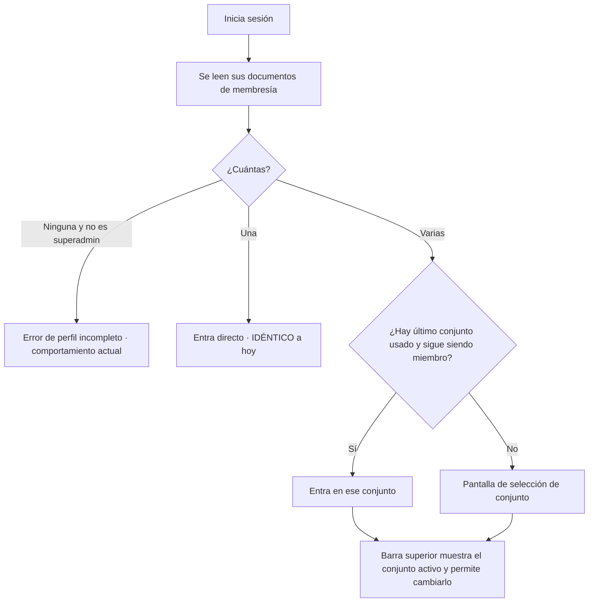
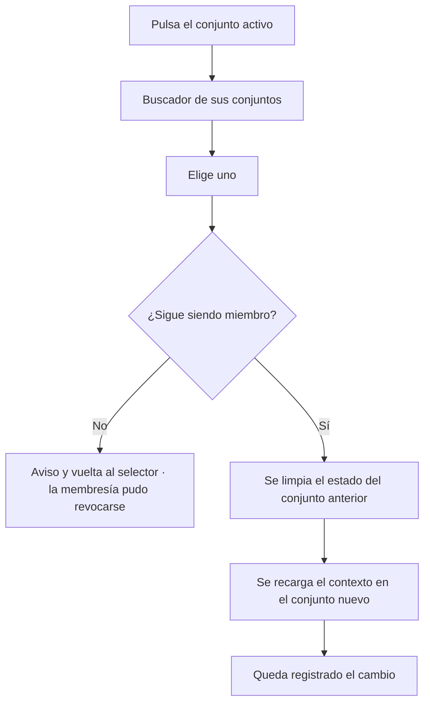

# PRD-V-PLAT-002 — Administradora: un administrador sobre varios conjuntos

| | |
|---|---|
| **ID** | `PRD-V-PLAT-002` (tentativo hasta registrarlo en `docs/prd/README.md`) |
| **Tipo** | `PLAT` — capacidad transversal: identidad, sesión, permisos y ciclo de vida del conjunto |
| **Portales** | **`ADMIN`** (alcance) · **`SUPERADMIN`** (alcance: alta y gestión de la administradora) · `RESIDENTE` (afectado: ve quién administra su conjunto) · `PORTERIA` (no afectado) |
| **Módulo** | Plataforma · Identidad y acceso |
| **Usuario principal** | `tenant_admin` / `admin_tenant` que lleva más de un conjunto |
| **Usuarios secundarios** | `superadmin` · `resident` |
| **Responsable** | David |
| **Estado** | 🟡 **ENTREGA 2 CONSTRUIDA, SIN DESPLEGAR** (11 sep 2026, rama `trabajo/admins-multiconjunto`, §16): el superadmin da acceso a varios conjuntos por persona desde la pestaña Admins. Servidor (`setTenantAdminAccess` con modo `simular`, alta con varios conjuntos, edición que ya no muda, E2-R8 en las tres acciones de `/admin/users`), consola y `/admin/users`. 35 pruebas de servidor con **ocho falsaciones** y 11 de pantalla con tres. Va **después** de `FIX-004`. **Y esta celda estaba mal en la bandera:** `producto-multiconjunto` está **ENCENDIDA por el valor global en los diez conjuntos de producción**, medido el 11 sep con `resolveFeatureFlag`. Decía «apagada y su documento no existe». **EN PRODUCCIÓN** desde la tarde del 25 de agosto de 2026 (`e41affa`) — versión 1.2. Validada antes en pantalla contra staging. §11.2 completa (eran **dieciocho** sitios, no once) · sesión con varias membresías, `lastActiveTenantId` y **selector** construidos y verificados por navegador con una cuenta de seis conjuntos: CA2, CA3, CA4, CA5, CA10 y **un cobro real en el segundo conjunto**. El **paso 3 está hecho** (entidad `managementCompanies`, sus dos callables de superadmin y `/superadmin/administradoras`) y **la medición de `storage.rules` se cerró**: las reglas entre servicios no funcionan en el servicio real, así que el claim **sigue** al conjunto activo — ver §11.3. **Desplegado y verificado contra su fuente**, con el radio del cambio de autoridad medido en **0** con el predicado real. **La bandera sigue APAGADA y su documento no existe** en producción, y **CA1 sigue sin observarse**: nadie tiene dos membresías, así que está cumplido por construcción y no visto |
| **Dependencias** | **Ninguna para el MVP.** La consolidación financiera depende del plan de cuentas gobernado (§4) |
| **Riesgo** | **Alto.** Toca la resolución de identidad. Un error aquí es un error de permisos |
| **Reversibilidad** | **Parcial.** El selector y la entidad son reversibles; el cambio de autoridad de §11.2 **no se revierte apagando una bandera**. Y **eran DIECIOCHO sitios, no once** — esta fila decía «once» y la auditoría de agosto buscó donde el número señalaba, dejando vivas **las seis del dinero** en `payments.ts` y `advances.ts` |
| **Fase comercial** | Decisión de David del 21 de agosto de 2026: **Vivaru se vende a conjuntos sueltos y a empresas administradoras.** Ambas rutas deben convivir |

---

## 1. Resumen ejecutivo

Vivaru asume hoy que **una persona pertenece a un conjunto**. Una empresa administradora que
lleva quince edificios necesitaría quince cuentas y quince contraseñas, y no tendría ninguna
vista de su cartera.

Esta PRD añade la **empresa administradora** como entidad por encima del conjunto, permite que
un mismo administrador **cambie de conjunto sin cerrar sesión**, y le da una **vista de su
cartera**.

El hallazgo que la abarata: **el almacenamiento y las reglas de Firestore ya lo soportan.** La
membresía ya es un documento por pareja conjunto-usuario, y las reglas resuelven permisos
leyendo ese documento, no el token. **Lo que no lo soporta es la sesión y once Cloud Functions.**

## 2. Problema y baseline

### Lo que ya funciona, verificado en el código

| Qué | Dónde | Consecuencia |
|---|---|---|
| Membresía por pareja | `tenantUsers/{tenantId}_{uid}` (`firestore.rules:12`) | **Un usuario ya puede ser miembro de N conjuntos.** No hace falta cambiar el almacenamiento |
| Las reglas resuelven por membresía | `tenantMember()`, `tenantRole()`, `sameTenant()` en `firestore.rules:16-39` | **Las reglas no requieren un solo cambio** |
| El único claim que usan las reglas | `request.auth.token.role == 'superadmin'` (`firestore.rules:9`) | El claim `tenantId` **no gobierna ningún permiso de Firestore** |

### Lo que lo impide

| # | Obstáculo | Dónde |
|---|---|---|
| **O1** | La sesión resuelve **un solo** `tenantId`: claim → `users/{uid}.tenantId` → documento de membresía | `src/features/auth/auth-context.tsx:162-266` |
| **O2** | `SessionUser.tenantId` es un campo único, no una lista | `src/types/domain.ts:74` |
| **O3** | Un `tenant_admin` sin `tenantId` lanza error: «Perfil incompleto» | `auth-context.tsx:298` |
| **O4** | **Once callables comparan el conjunto pedido contra el claim del token y deniegan si difiere** | `functions/src/index.ts` líneas 1349, 1490, 1589, 1674, 1749, 1796, 1913, 1928, 1963, 1993, 2036 |
| **O5** | No existe ninguna entidad por encima de `tenants` | `src/types/domain.ts:22` |

**O4 es el bloqueo duro.** El patrón es:

```
const tokenTenantId = normalizeText(request.auth.token?.tenantId);
if (tokenTenantId && tokenTenantId !== data.tenantId) { throw permission-denied }
const actor = await assertActiveTenantAdmin(data.tenantId, request.auth.uid);
```

Un administrador con claim `tenantId = A` que opere sobre el conjunto B **sería rechazado
aunque sea miembro legítimo de B**.

### Baseline medible

| Indicador | Hoy |
|---|---|
| Administradores con más de un conjunto | **0** — el producto no lo permite |
| Cuentas necesarias para llevar 15 conjuntos | **15** |
| Vistas de cartera de una administradora | **Ninguna** |

**Referencia de mercado, medida en el inventario:** la cuenta de administradora que exploramos
en Habitanto lleva **16 condominios** en una sola sesión, con buscador para saltar entre ellos.

**Métrica de éxito:** que una persona con N membresías entre una vez y opere los N conjuntos
sin volver a autenticarse, y que **ninguna operación cruce datos entre conjuntos** (§10, CF).

## 3. Usuarios, roles y permisos

**Esta PRD no crea ningún rol nuevo.** Es una decisión, y la más importante del diseño: una
administradora no es un rol, es **un `tenant_admin` con varias membresías**. Añadir un rol
obligaría a tocar `roles.ts`, las reglas y las once callables por segunda vez.

| Rol | Ve | Puede | **NO puede** |
|---|---|---|---|
| `tenant_admin` con **una** membresía | Exactamente lo de hoy | Lo de hoy | **Nada cambia para él.** No ve selector ni cartera |
| `tenant_admin` con **varias** membresías | Selector de conjunto y vista de cartera de los conjuntos en los que es miembro | Cambiar de conjunto activo; operar cada uno con sus propios permisos | Ver o tocar un conjunto donde **no** tenga documento de membresía. Operar un conjunto `suspended` o `expired` |
| `resident` | El nombre de la administradora de **su** conjunto | Consultarlo | Todo lo demás de esta PRD. **Un residente con dos unidades en dos conjuntos queda fuera de alcance (§4)** |
| `security_guard` | Nada | — | Acceder al selector |
| `superadmin` | Todas las administradoras y todos los conjuntos | Crear administradoras, asociar conjuntos, asignar y quitar membresías | — |

**La regla que lo hace seguro:** el conjunto activo lo elige el cliente, pero **la autoridad
sigue siendo el documento de membresía**. Si el cliente pide un conjunto del que no es miembro,
las reglas de Firestore lo deniegan sin que nadie tenga que programar la comprobación.

## 4. Objetivo, alcance y exclusiones

**Objetivo.** Que una empresa administradora opere su cartera desde una sola cuenta, sin que un
conjunto pueda ver los datos de otro.

### Entra

1. Entidad **empresa administradora**: nombre, identificación fiscal, país y contacto.
2. Asociación `conjunto → administradora`.
3. Sesión con **varias membresías** y un **conjunto activo**.
4. **Selector de conjunto** para quien tenga más de uno.
5. Corrección de las **once callables** de O4.
6. **Vista de cartera**: los conjuntos del administrador con indicadores operativos.
7. Alta y gestión de administradoras desde la consola de superadmin.
8. El residente ve qué empresa administra su conjunto.

### No entra, y por qué

| Excluido | Por qué |
|---|---|
| **Rol nuevo de «administrador de cartera»** | §3. Un rol nuevo multiplicaría el trabajo en reglas y callables |
| **Consolidado financiero entre conjuntos** | **Depende del plan de cuentas gobernado.** Consolidar sobre códigos de rubro libres da sumas falsas — es exactamente el defecto que Habitanto arrastra. La cartera de esta PRD lleva indicadores **operativos**, no un estado financiero consolidado |
| **Correo remitente propio por conjunto** (`M5` del backlog) | Exige verificar dominios por conjunto con el proveedor de correo: es una decisión de infraestructura, no del modelo de acceso. **PRD aparte** |
| **Residente con unidades en dos conjuntos** | Caso real pero distinto: el residente elige unidad, no conjunto. Se resuelve después y no bloquea esto |
| **Facturar a la administradora en vez de al conjunto** | Modelo comercial, no producto. Hoy el plan vive en `Tenant.planId` y ahí se queda |
| **Jerarquía de más de dos niveles** | Nadie la ha pedido. Administradora → conjunto y nada más |

## 5. Flujo funcional

### 5.1 Entrar con varias membresías



**Quien tiene una sola membresía no ve absolutamente nada nuevo.** Es la condición para que
esta PRD no rompa a los usuarios actuales.

### 5.2 Cambiar de conjunto



**«Se limpia el estado del conjunto anterior» no es un detalle de implementación: es la regla
de seguridad.** Cualquier dato en memoria del conjunto A que sobreviva al cambio a B es una
fuga.

### 5.3 Casos límite

| Caso | Comportamiento |
|---|---|
| Le revocan la membresía mientras opera | La siguiente operación es denegada por las reglas; se le devuelve al selector |
| Su único conjunto queda `suspended` | Entra en solo lectura, como hoy |
| Uno de sus conjuntos está `suspended` y otro `active` | Cada uno se comporta según su propio estado. **El estado no se hereda de la administradora** |
| Uno está en `trial` y otro `active` | Igual: la matriz de prueba se evalúa por conjunto |
| Un conjunto sin administradora asociada | Funciona exactamente como hoy. **La asociación es opcional** |
| Superadmin operando | Ve todos los conjuntos; su acceso no pasa por membresías |

## 6. Estados y transiciones

### Empresa administradora

| Estado | Qué significa | Quién transiciona | Salida |
|---|---|---|---|
| **`active`** | Opera con normalidad | Superadmin | → `inactive` |
| **`inactive`** | Registro conservado, sin conjuntos nuevos | Superadmin | → `active` |

**`inactive` NO suspende sus conjuntos.** Cada conjunto conserva su propio `TenantStatus`.
Mezclarlos permitiría cortarle el servicio a un conjunto que paga por un problema comercial de
su administradora — **y el cliente de ese conjunto no es la administradora**.

### Membresía

| Estado | Quién transiciona | Salida |
|---|---|---|
| **Existe** | Superadmin o el administrador del conjunto | Se revoca borrando el documento |
| **No existe** | — | Se crea al asignar |

**No se añade un campo de estado a la membresía.** Existe o no existe: es lo que las reglas ya
evalúan con `exists()`.

## 7. Contrato de datos y multi-tenancy

### 7.1 Colección nueva: `managementCompanies`

| Campo | Tipo | Obligatorio | Quién escribe |
|---|---|---|---|
| `id` | `string` | Sí | Sistema |
| `name` | `string` | Sí | Superadmin |
| `taxId` | `string` | No | Superadmin |
| `country` | `string` | Sí | Superadmin |
| `contactEmail` | `string` | No | Superadmin |
| `contactPhone` | `string` | No | Superadmin |
| `status` | `"active" \| "inactive"` | Sí | Superadmin |
| `createdAt` / `updatedAt` / `createdBy` | — | Sí | Sistema |

**Esta colección NO lleva `tenantId`**, porque vive por encima del conjunto. **No es la primera
sin `tenantId`** —`tenants`, `users`, `plans` y `featureFlags` tampoco lo llevan— pero **sí es la
primera que agrupa conjuntos**, y por eso su regla no se parece a ninguna de las existentes. Su regla es **lectura para los miembros de un conjunto asociado, escritura
solo para superadmin**. Debe declararse explícitamente y no puede caer en
`relaxedTenantCollection` (`firestore.rules:80`).

### 7.2 Campo nuevo en `tenants`

| Campo | Tipo | Obligatorio | Nota |
|---|---|---|---|
| `managementCompanyId` | `string` | **No** | Ausente = conjunto suelto. **Sin migración: los 9 conjuntos actuales siguen igual** |

### 7.3 Campo nuevo en `users`

| Campo | Tipo | Obligatorio | Nota |
|---|---|---|---|
| `lastActiveTenantId` | `string` | No | Comodidad, **no autoridad**. Si el usuario ya no es miembro, se ignora |

### 7.4 El claim `tenantId`

**Se conserva y deja de ser autoridad.** Hoy se escribe en `setCustomUserClaims` en once
sitios. Seguirá escribiéndose para no romper nada, pero pasa a significar **«el último conjunto
conocido»**, no «el único conjunto permitido».

**La autoridad es, y sigue siendo, el documento de membresía.** Es lo que ya hacen las reglas.

### 7.5 Multi-tenancy

- Ninguna consulta de datos de conjunto cambia: **siguen filtrando por `tenantId`**, ahora por
  el conjunto **activo**.
- **`suspended` / `expired`** → solo lectura, por conjunto, sin herencia de la administradora.
- **`trial`** → la matriz de módulos en prueba se evalúa **por conjunto activo**. Una
  administradora puede tener uno en prueba y otro contratado a la vez.

### 7.6 Retención y borrado

`managementCompanies` guarda datos de una empresa, no de personas: **fuera de la política de
retención de 12 meses**. `contactEmail` y `contactPhone` son datos de contacto profesional y se
borran al borrar la administradora.

## 8. Reglas de negocio

| # | Regla |
|---|---|
| **R1** | La autoridad sobre qué conjuntos puede operar un usuario es **el conjunto de sus documentos de membresía**, nunca el claim del token |
| **R2** | Un usuario con **una** membresía tiene exactamente el comportamiento de hoy: sin selector, sin cartera |
| **R3** | Al cambiar de conjunto activo, **todo estado del conjunto anterior se descarta** antes de cargar el nuevo |
| **R4** | El estado de la administradora **no altera** el `TenantStatus` de sus conjuntos |
| **R5** | Un conjunto pertenece **a lo sumo a una** administradora |
| **R6** | Asociar o desasociar un conjunto a una administradora **no crea ni borra membresías** de usuarios: son ejes independientes |
| **R7** | La vista de cartera lista **solo** los conjuntos donde el usuario tiene membresía, aunque la administradora tenga más |
| **R8** | Cada cambio de conjunto activo queda registrado con usuario, origen, destino y fecha |
| **R9** | Ninguna callable acepta un `tenantId` que no esté respaldado por una membresía del llamante |

**R7 es la que separa lo comercial de lo operativo:** la administradora puede tener 16
conjuntos y un asistente suyo tener acceso solo a 3.

## 9. Notificaciones y correo

**No se crean notificaciones nuevas.** El correo transaccional sigue saliendo por
`functions/src/email.ts` con el remitente verificado, y **sigue siendo por conjunto**: un aviso
al residente nombra su conjunto, no su administradora.

Un cambio de contenido menor: donde hoy el correo dice el nombre del conjunto, **puede añadir la
administradora** si el conjunto la tiene. Opcional, no bloqueante.

**No se promete ningún plazo de respuesta.**

## 10. Criterios de aceptación

### Deben pasar

| # | Criterio |
|---|---|
| CA1 | Un usuario con una sola membresía entra y **no ve selector ni cartera**: el flujo es idéntico al de hoy |
| CA2 | Un usuario con tres membresías ve el selector con sus tres conjuntos |
| CA3 | Cambia de conjunto y la Cartera, los Residentes y los Egresos muestran los del conjunto nuevo |
| CA4 | Tras cambiar, **ninguna pantalla muestra un dato del conjunto anterior** |
| CA5 | Vuelve a entrar y aterriza en el último conjunto usado |
| CA6 | Si le revocaron la membresía del último usado, aterriza en el selector sin error |
| CA7 | Superadmin crea una administradora, le asocia dos conjuntos y los ve asociados |
| CA8 | Un conjunto sin administradora funciona exactamente igual que antes |
| CA9 | Una administradora `inactive` **no cambia** el estado de sus conjuntos |
| CA10 | Con un conjunto `active` y otro `suspended`, el primero se opera y el segundo es solo lectura |
| CA11 | Las once callables de O4 aceptan la operación sobre cualquier conjunto donde el llamante es miembro |
| CA12 | El residente ve el nombre de la administradora de su conjunto |

### Deben fallar

| # | Criterio |
|---|---|
| CF1 | Pedir el conjunto B sin membresía en B → **denegado por reglas**, no por la interfaz |
| CF2 | Una callable llamada con `tenantId` de un conjunto sin membresía → **`permission-denied`** |
| CF3 | Manipular `lastActiveTenantId` a un conjunto ajeno → **no da ningún acceso** |
| CF4 | Un guarda intenta abrir el selector → **denegado** |
| CF5 | Un `tenant_admin` intenta crear o editar una administradora → **denegado** |
| CF6 | Operar en un conjunto `suspended` desde el selector → **denegado** |
| CF7 | Asociar un conjunto a una segunda administradora → **rechazado** (R5) |
| CF8 | Una consulta sin `where("tenantId")` tras cambiar de conjunto → **denegada entera** |

**CF1 y CF3 son los dos criterios que prueban que el diseño es seguro:** el cliente elige el
conjunto activo, y elegir mal no da acceso a nada.

## 11. Arquitectura y dependencias

### 11.1 La decisión obligatoria: cliente directo o callable

| Operación | Decisión | Por qué |
|---|---|---|
| **Leer las membresías propias** | **Cliente directo** | Consulta a `tenantUsers` por `uid`. Las reglas la protegen |
| **Cambiar el conjunto activo** | **Cliente directo** | No es una operación de servidor: es estado de sesión. **La seguridad no depende de dónde se elige, sino de que las reglas verifiquen la membresía en cada lectura** |
| **Crear o editar una administradora** | **Cloud Function callable** | Escribe en una colección **sin `tenantId`**, fuera del modelo que las reglas saben proteger por conjunto. Solo superadmin |
| **Asociar un conjunto a una administradora** | **Cloud Function callable** | Escribe en `tenants`, que gobierna facturación y ciclo de vida. No puede quedar en el cliente |
| **Indicadores de la vista de cartera** | **Cliente directo, N consultas** | Una por conjunto, cada una filtrando su `tenantId`. Sin agregación de servidor en el MVP |

### 11.2 El cambio que no es reversible con una bandera

Las comparaciones de O4 deben pasar de *«el conjunto pedido debe ser igual al del token»* a
*«el llamante debe ser miembro del conjunto pedido»*.

> **CORRECCIÓN (25 ago 2026): eran DIECIOCHO, no once.** Esta sección decía «las once» y listaba
> líneas de `index.ts`, así que la auditoría de `5219758` buscó ahí y retiró **doce**. Quedaron
> **seis** haciendo lo mismo en `functions/src/payments.ts:378` (`assertPuedeCobrar`) y
> `functions/src/advances.ts:112` (`assertPuedeOperarAnticipos`) — **las seis del dinero**:
> `applyPayment`, `revertPayment`, `previewPaymentAllocation`, `applyAdvance`,
> `undoAdvanceApplication` y `cancelAdvance`.
>
> Y eran **más duras** que las retiradas: aquellas decían `if (claim && claim !== pedido)` —
> inertes sin claim—; estas, `claim !== pedido` a secas.
>
> **El alcance de una auditoría se define por PATRÓN, no por fichero.** El grep bueno no era «las
> líneas que cita la ficha», era `grep -rn "tokenTenant" functions/src`. Cerrado en `dbb3f29`.

En el sitio revisado (`index.ts:1349`) la comprobación de membresía **ya existe justo después**
(`assertActiveTenantAdmin`), así que la guarda del claim es redundante y puede retirarse sin
perder seguridad. **Hay que verificar sitio por sitio que esa comprobación existe**, y añadirla
donde no.

> **Y en las seis del dinero NO existía.** La comparación con el claim era lo ÚNICO que ataba al
> llamante con el conjunto, así que borrarla a secas habría dejado a cualquier `tenant_admin`
> cobrar en cualquier conjunto. **Antes de retirar una guarda, la pregunta es qué otra cosa
> sostiene el invariante** — y si la respuesta es «ninguna», el arreglo es sustituir, no borrar.

**Es trabajo de auditoría, no de diseño, y es el mayor riesgo de esta PRD.**

### 11.3 Reglas — y son DOS ficheros, no uno

> **CORRECCIÓN (25 ago 2026).** Esta sección se titulaba «Reglas de Firestore» y concluía que las
> reglas no necesitaban un cambio. **Es falso, y el error fue el singular.** Hay dos ficheros de
> reglas: `firestore.rules` **sí** resolvía por membresía —de ahí la conclusión— y
> `storage.rules` **no**: su `delConjunto()` comparaba `request.auth.token.tenantId == tenantId`,
> y esa función es la base de `miembro`, `admin` y `porteria`, o sea de **todas** sus rutas.
>
> Consecuencia con el selector encendido: cambiar de conjunto dejaba **Firestore abierto y Storage
> cerrado entero** —documentos, comprobantes, notas de portería y evidencia de soporte—, sin más
> síntoma que un error de permisos.
>
> Lo encontró una **revisión adversarial**, no las suites: 59 pruebas de Storage pasaban porque
> ninguna ejercía a un administrador operando un conjunto distinto del de su claim.
>
> **Cuando una conclusión empieza con un plural —«las reglas», «los catálogos», «las
> callables»— hay que contar cuántos son antes de firmarla.** Ese mismo día el plural falló tres
> veces: dos ficheros de reglas, cinco sitios de catálogo de banderas, y dieciocho comparaciones
> del claim donde esta ficha decía once.

| Qué | Cambio |
|---|---|
| Colecciones de conjunto (`firestore.rules`) | **Ninguno.** Ya resuelven por membresía |
| **`storage.rules`** | **SÍ cambia.** `delConjunto` pasa a `firestore.exists(tenantUsers/{tenantId}_{uid})`, y **el rol sale de la membresía**, no del token: la misma persona puede administrar un conjunto y ser residente de otro. El superadmin sigue saliendo del token, porque no tiene membresía en ninguno |
| `managementCompanies` | **Bloque nuevo y explícito**: lectura para miembros de un conjunto asociado, escritura solo superadmin. **No puede caer en `relaxedTenantCollection`** |
| `tenants` | Sin cambio: `managementCompanyId` queda cubierto por la regla existente |

> **ABIERTO al cerrar el 25 de agosto:** el cambio de `storage.rules` usa **reglas entre
> servicios**, y **no se pudo verificar en el servicio real** — el emulador no es el servicio.
> Subir un documento en staging falla, y falla también en el conjunto donde el claim y el activo
> coinciden. La bisección quedó a medias. **Detalle y siguiente paso en la cabecera de
> `docs/pendientes.md`.** Si resulta que las reglas entre servicios no sirven, la alternativa es
> **emitir el claim al cambiar de conjunto**, que arregla esto de raíz pero **rompe el
> multipestaña**.

### 11.4 Índices, jobs y banderas

- **Índice nuevo:** `tenantUsers` por `uid`, para listar las membresías de una persona.
- **Jobs:** ninguno.
- **Bandera:** `producto-multiconjunto`, que gobierna **el selector**. **No gobierna §11.2**, que
  se despliega antes y es compatible hacia atrás.
  > Esta ficha la llamaba `multi-tenant-admin`. Se renombró al construirla: las dieciséis
  > existentes llevan prefijo de área y `FeatureFlagArea` lo exige. **Y vive en CINCO sitios, no
  > en cuatro**: el catálogo del cliente, el del servidor, el sembrador, el movedor global y el
  > movedor **por conjunto**. Nació sin el quinto, así que se podía encender para todos pero no
  > para uno solo — que es la vía del canario. Corregido en `ccc78e1`.

## 12. Riesgos y mitigaciones

| Riesgo | Señal | Mitigación |
|---|---|---|
| **Fuga entre conjuntos** al cambiar | Un dato del conjunto A aparece en B | R3 y CA4. Prueba manual obligatoria conjunto a conjunto |
| Retirar la guarda del claim **sin** comprobación de membresía detrás | Una callable acepta un conjunto ajeno | §11.2: revisión sitio por sitio, con CF2 por callable |
| El selector permite pedir un conjunto ajeno | — | **No es un riesgo real:** las reglas deniegan. CF1 lo prueba |
| Un usuario con una membresía ve algo distinto | Reclamo | R2 y CA1 |
| La administradora se confunde con el conjunto y alguien suspende quince clientes | Conjuntos suspendidos en bloque | R4 y CA9 |
| Confusión de a qué conjunto se está escribiendo | Cargos creados en el conjunto equivocado | El conjunto activo va **siempre visible** en la barra superior. Fue lo primero que se vio en Habitanto y funciona |
| Coste | — | **Nulo.** N consultas por N conjuntos del propio administrador |

## 13. Despliegue, rollback y Story Map

### Orden

**Reglas → functions → front**, en tres despliegues separados:

1. **Reglas** — bloque de `managementCompanies`. Inerte: nadie escribe todavía.
2. **Functions** — §11.2 (las once) y las callables de administradora. **Compatible hacia
   atrás**: un usuario con una membresía se comporta igual.
3. **Front** — selector, vista de cartera y consola de superadmin, con `multi-tenant-admin`
   apagada.

### Rollback

| Parte | Reversible |
|---|---|
| Selector y vista de cartera | **Sí**, apagando la bandera |
| Entidad administradora | **Sí**: sin `managementCompanyId`, un conjunto es un conjunto suelto |
| **§11.2, las once callables** | **No con una bandera.** Requiere revertir el despliegue de functions |

**Por eso §11.2 va en su propio despliegue y antes que el resto**: si algo falla, se revierte
solo eso, con el selector aún apagado y sin ningún usuario afectado.

### Validación

| Dónde | Qué |
|---|---|
| **Staging** | Todo. Se puede sembrar un usuario con tres membresías con `seed-tenant.mjs` |
| **Producción** | La comprobación de que **nada cambió** para los usuarios de una sola membresía. Con cero clientes reales, es lo único que producción aporta |

### Story Map

**MVP** — ~~membresías múltiples en sesión~~ ✅ · ~~selector con último usado~~ ✅ ·
~~las once callables~~ ✅ (**eran dieciocho**) · ~~entidad administradora y asociación desde
superadmin~~ ✅ — **el MVP está completo**.

**Fase 2** — vista de cartera con indicadores operativos · el residente ve su administradora ·
registro de cambios de conjunto.

> **Ojo al leer otros documentos:** la cabecera de `docs/pendientes.md` describía el frente 4 como
> «selector **y vista de cartera**», pero **la vista es Fase 2 según este Story Map**, no MVP. Y si
> se construye necesita otro nombre: **«Cartera» ya es `/admin/billing`** en la barra lateral
> (`admin-sidebar.tsx:76`), y CA3 usa la palabra con ese otro significado.

**Fase 3** — consolidado entre conjuntos, **cuando exista el plan de cuentas gobernado**.

## 14. Decisiones abiertas

### D1 · ¿Quién puede asignar membresías de un conjunto a un administrador?

Hoy `createTenantOperationalUser` lo hace un `tenant_admin` dentro de **su** conjunto. Si una
administradora quiere dar de alta a un asistente en cinco de sus conjuntos, o entra cinco veces,
o alguien puede asignarlo de una vez.

- **Opción A** — solo superadmin asigna en varios conjuntos. Seguro, y **convierte cada alta en
  un ticket de soporte**.
- **Opción B** — el administrador puede asignar en cualquier conjunto **donde él mismo sea
  miembro administrador**. Se apoya en la membresía que ya existe.

**Recomendación: B.** No inventa autoridad nueva —usa la que el usuario ya tiene— y evita que
el crecimiento de una administradora dependa de nuestro soporte. **A contradice además la
decisión de vender por autoservicio.**

> **CERRADA el 21 ago 2026 — aceptada la opción B.** Un `tenant_admin` puede asignar
> membresías en **cualquier conjunto donde él mismo sea administrador**, y solo ahí.

### D2 · ¿Qué indicadores lleva la vista de cartera?

Cerrado como **operativos, no financieros**, hasta que exista el plan de cuentas gobernado
(§4). Propuesta: unidades, residentes con acceso, PQRS abiertos, cargos vencidos y estado del
conjunto. **Confirmable en construcción**, no bloquea.

## 15. Puertas

| Puerta | Estado |
|---|---|
| **G0 Necesidad** | ✅ Decisión comercial de David del 21 ago 2026, y referencia medida: 16 condominios en una cuenta de Habitanto |
| **G1 Valor** | ✅ Baseline y métrica en §2 |
| **G2 Datos y permisos** | ✅ Modelo, roles y prohibiciones definidos. **La autoridad sigue siendo la membresía, que ya existe** |
| **G3 Riesgo** | ✅ **Cerrada con condición.** Hay rollback para todo salvo §11.2, que se aísla en su propio despliegue y va primero, con el selector apagado y ningún usuario afectado. **La condición: la auditoría sitio por sitio de las once callables es la primera tarea del MVP, con un CF2 por callable como criterio de cierre** |
| **G4 Aceptación** | ✅ 12 criterios que pasan y 8 que deben fallar, incluidos los dos que prueban que el diseño es seguro |
| **G5 Operación** | ✅ **Cerrada el 21 ago 2026.** **Superadmin** crea la administradora y le asocia el primer conjunto, en el alta comercial. A partir de ahí **el propio administrador asigna membresías** en los conjuntos donde ya es administrador (D1, opción B). **Vivaru no queda en el camino crítico** del crecimiento de una administradora |
| **G6 Escala** | ⚠️ La vista de cartera hace N consultas por N conjuntos. Con 16 es trivial; **con 200 habría que agregar en servidor**. Aceptable para el MVP, anotado como límite conocido |

**Lista para desarrollo**, con una condición explícita: **la auditoría de las once callables de
§11.2 es la primera tarea del MVP** y se despliega sola, antes que nada del resto.

---

## 16. Entrega 2 — el superadmin da acceso a varios conjuntos (11 sep 2026)

**Estado: construida, sin desplegar** (11 sep 2026, rama `trabajo/admins-multiconjunto`). **Va DESPUÉS
de `PRD-V-FIX-004`**, que cierra el camino por el que
hoy un conjunto cambia el rol de una cuenta ajena sin permiso ni aviso. Esta entrega le da esa
potestad **solo al superadmin, y con aviso**.

### 16.1 Por qué ahora

David, 11 sep 2026: «un mail de admin no puede estar en más de un solo conjunto… debería existir la
opción desde super admin, en la pestaña de admins, de seleccionar a qué conjuntos podría tener
acceso». **Lo que se vive como una regla no lo es**; es un efecto de tres cosas:

- `createTenantAdmin` rechaza **cualquier correo que ya tenga cuenta**, sea del rol que sea: «Ya
  existe un usuario con ese correo.» (`functions/src/index.ts:1338-1340`).
- `updateTenantAdmin` **muda** al administrador en vez de añadirle un conjunto: borra la membresía
  anterior (`:1483-1485`).
- El formulario de la pestaña Admins tiene **un solo** selector de conjunto
  (`src/app/(superadmin)/superadmin/admin-users/page.tsx:329-337`).

§3 prometía que el superadmin «asigna y quita membresías», y `D1` opción B que el propio admin lo
haga en sus otros conjuntos: **ninguna de las dos se construyó**. La única vía hoy es un script
(`functions/scripts/sembrar-membresias-multiconjunto.mjs`). Así se validó el MVP en staging, donde
`david.macar.18@hotmail.com` administra siete conjuntos.

### 16.2 Lo que ya funciona y lo que falta — medido el 11 sep 2026

**Ya funciona, sin tocar:** la membresía `tenantUsers/{conjunto}_{uid}` como autoridad, las reglas y
las comprobaciones del servidor por membresía, la sesión con varias membresías, `lastActiveTenantId`,
el selector y `switchActiveTenant`. **`producto-multiconjunto` está encendida** en los diez conjuntos
de producción, por el valor global.

**Falta:**

| Pieza | Hoy | Referencia |
|---|---|---|
| Pestaña Admins | Un conjunto por formulario; lista y filtro por `users.tenantId` | `admin-users/page.tsx:189, 211, 329-337` · `services.ts:360-382` |
| Alta con un correo existente | Rechazo en seco | `index.ts:1338-1340` |
| Edición | Muda al admin | `index.ts:1483-1485` |
| `/admin/users` del conjunto | Lista `users` por `users.tenantId`: **el admin compartido no aparece en su segundo conjunto** | `(admin)/admin/users/page.tsx:53` · `firestore.rules:319` |
| Acciones de un conjunto sobre un colega | **Actúan sobre la cuenta entera**: desactivar deshabilita la cuenta de Auth, borrar la borra, y cambiar el rol reescribe `users.role` y el claim | `index.ts:1728-1735`, `:2125-2127`, `:1823`, `:1832` |
| Un solo `users.role` | Una cuenta no puede ser residente en un conjunto y admin en otro | `auth-context.tsx:275` · `index.ts:416-423` |

**Las acciones sobre la cuenta entera hoy son inofensivas**, porque nadie tiene dos conjuntos. **El
día que alguien los tenga, el admin de un conjunto dejaría fuera de todos al admin compartido.** Por
eso entran aquí y no después.

**Baseline de producción:** 9 admins (Santa María tiene 2; Lomas de Sayilbedra y Tenant E2E, 0),
**nadie con dos membresías de admin**, 1 administradora (Sayil, con Lomas de Sayilbedra) y 1 cuenta
de residente en dos conjuntos (`david.macar.18@gmail.com`). **Ninguna cuenta mezcla roles.**

### 16.3 Decisiones de David — 11 sep 2026

| # | Decisión |
|---|---|
| **E2-D1** | El acceso se da **por persona**, desde la pestaña Admins, con una lista de conjuntos para marcar. **No por administradora**: R6 y R7 siguen en pie (el asistente con 3 de 16). La administradora es un **atajo para marcar** sus conjuntos, y no sigue los que se le asocien después |
| **E2-D2** | **Solo el superadmin**, en esta entrega. `D1` opción B sigue decidida y va en la siguiente: **esto no reabre `D1`** |
| **E2-D3** | Un **residente** puede recibir acceso de admin **con aviso previo** del superadmin. Pasa a admin y no ve su portal de residente mientras lo sea. **Su lado de residente se guarda**: si le quitan todos sus conjuntos de admin, vuelve a ser residente como antes |
| **E2-D4** | **La portería, no.** Su cuenta suele ser la del dispositivo de la puerta, a menudo compartido: se rechaza con el motivo |
| **E2-D5** | El defecto del alta de residente va **antes y aparte**: `PRD-V-FIX-004` |

### 16.4 Roles y permisos de esta entrega

| Rol | Puede | **NO puede** |
|---|---|---|
| `superadmin` | Marcar y desmarcar los conjuntos de admin de una persona. Dar acceso de admin a una cuenta de residente, tras el aviso. Desactivar la cuenta entera, como hoy | Dar acceso de admin a una cuenta de **portería** o de **superadmin**. Dejar a un admin **sin lado de residente** con cero conjuntos: para eso está «Desactivar» |
| `tenant_admin` con varios conjuntos | Operar cada uno con sus permisos y cambiar con el selector, como en el MVP | Darse acceso a otro conjunto: en esta entrega lo da solo el superadmin |
| `tenant_admin` que comparte conjunto con él | Ver al admin compartido en la lista de usuarios de su conjunto, **marcado como compartido** | Desactivarlo, cambiarle el rol o borrarlo: **su acceso lo gestiona Vivaru** |
| Residente convertido en admin | Entrar como admin de sus conjuntos | Ver su portal de residente mientras sea admin, algo que el superadmin conoce por el aviso |
| `security_guard` | Sin cambios | Recibir acceso de admin |

### 16.5 Flujo funcional

**Pestaña Admins (superadmin):**

- **Una fila por persona**, con **todos** sus conjuntos de admin, leídos de `tenantUsers`. El filtro
  por conjunto busca por membresía, no por `users.tenantId`.
- **Crear** pide nombre, correo, estado y **«Conjuntos con acceso»**, uno o más. Según el correo:
  - **no tiene cuenta** → como hoy, con una membresía por conjunto marcado;
  - **es un admin** → no se rechaza en seco: «Ese correo ya administra {sus conjuntos}. ¿Darle
    también acceso a {los marcados}?». Confirmar añade las membresías **sin tocar las que tiene**;
  - **es un residente** → el aviso de E2-D3, con su conjunto y su unidad, y el botón «Entiendo,
    darle acceso»;
  - **es portería o superadmin** → rechazo con el motivo.
- **Editar:** el selector único se sustituye por la lista para marcar. **Desmarcar quita solo ese
  acceso**, y ya no se muda a nadie. Si es su último conjunto:
  - **admin sin lado de residente** → no se permite; se ofrece «Desactivar»;
  - **residente convertido** → aviso: «Volverá a ser residente de {conjunto}, unidad {X}»; al
    confirmar, vuelve a residente.
- **Atajo de administradora:** en la lista para marcar, los conjuntos van agrupados por
  administradora, con «Marcar los N de {administradora}». **Solo marca casillas.**
- **Desactivar / Activar** siguen siendo de la **cuenta entera**, y el botón lo dice: «todos sus
  conjuntos».

**El aviso del residente**, con este texto:

> «Esta cuenta es residente de {conjunto}, unidad {X}. Si le das acceso de administrador, entrará
> como administrador y no verá su portal de residente mientras lo sea. Su ficha, su unidad y sus
> cargos no cambian. Si le quitas todos sus conjuntos de administrador, vuelve a ser residente
> como antes. Si necesita las dos cosas a la vez, dale el acceso de administrador con otro correo.»

**Al quitarle a alguien su conjunto activo**, su claim, `users.tenantId` y `lastActiveTenantId`
pasan a otro de sus conjuntos, y se le revocan las sesiones para que el claim nuevo se aplique. El
gemelo que ya lo hace es `resident-access.ts:166-175`.

**`/admin/users` de cada conjunto:** la lista sale de `tenantUsers` de ese conjunto, así que el admin
compartido aparece en todos los suyos con la marca «También administra otros conjuntos». Sus
acciones se rechazan **en el servidor** con «Esta persona tiene acceso a otros conjuntos; su acceso
lo gestiona Vivaru.», y la interfaz las deshabilita.

### 16.6 Estados de la cuenta

| Desde → hacia | Quién | Condición |
|---|---|---|
| Admin con N conjuntos ⇄ N ± 1 | superadmin | Un admin sin lado de residente conserva al menos uno |
| Residente → admin | superadmin | **Con aviso confirmado**, que el servidor exige |
| Admin ex-residente → residente | superadmin | Al quitarle su último conjunto de admin, con aviso |
| Portería → admin | — | **Prohibida** |
| Cualquier admin → desactivado | superadmin | Como hoy: la cuenta entera |

**Todas las transiciones de esta entrega son del superadmin.** Ninguna queda a medias: cada una es
una sola callable (§16.11).

### 16.7 Contrato de datos y multi-tenancy

- **Sin colecciones nuevas.** Las membresías de admin las crea y las borra la callable nueva, con la
  forma de `sembrar-membresias-multiconjunto.mjs:117-128`.
- **Un solo campo nuevo en `tenantUsers`, `compartida`, y es de SOLO presentación.** *(Corregido al
  construir: esta línea decía «sin campos nuevos».)* La lista de `/admin/users` de un conjunto **no
  puede saber** si una persona tiene otros conjuntos: las reglas no le dejan leer membresías ajenas.
  Así que el servidor escribe `compartida` en cada membresía de admin al dar o quitar acceso. La regla
  de `update` de `tenantUsers` es una lista blanca al revés (`firestore.rules:271-312`) y el propio
  admin puede reescribirlo **en la suya**; no importa, porque **no sostiene ningún permiso**: E2-R8
  consulta las membresías reales, y lo más que consigue es esconder o enseñar una etiqueta. Quién dio
  cada acceso vive en `auditLogs`.
- **El lado de residente:**
  - **En otro conjunto:** su membresía de residente **no se toca**. Mientras `users.role` sea
    `tenant_admin`, la sesión no la carga (`auth-context.tsx:275`). Volver a residente es reapuntar
    `users` y el claim a ella.
  - **En el mismo conjunto:** la membresía es **el mismo documento** (`{conjunto}_{uid}`) y pasa a
    `tenant_admin`. El lado de residente **se reconstruye de su ficha en `people`** —`authUid` y
    `unitId`—, que desde `FIX-004` solo escribe el servidor. **Por eso esta entrega depende de
    `FIX-004`**: con `authUid` escribible desde el cliente, la restauración creería a quien lo
    escribió.
  - Si al restaurar **ya no hay ficha**, la cuenta **se desactiva, no se borra**, y el aviso lo dice.
    *(Recomendación, confirmable en construcción.)*
- **`users.role`** es `tenant_admin` mientras la persona tenga al menos un conjunto de admin.
- **Suspendido, vencido y en prueba:** dar acceso se permite en cualquier estado. La operación ahí
  sigue las reglas de siempre —solo lectura en suspendido o vencido (`CA10`)— y **no se envía correo**,
  así que la regla B y la puerta de buzones no entran en juego.

### 16.8 Reglas de negocio

| # | Regla |
|---|---|
| **E2-R1** | Dar o quitar acceso de admin a un conjunto crea o borra **solo la membresía de ese conjunto**. Nunca toca las demás ni la cuenta |
| **E2-R2** | En esta entrega, **solo el superadmin** da o quita acceso de admin a una persona que ya existe |
| **E2-R3** | Una cuenta de **portería** o de **superadmin** no recibe acceso de admin |
| **E2-R4** | Una cuenta de **residente** recibe acceso de admin **solo con la confirmación del aviso**, y **la exige el servidor**, no la interfaz |
| **E2-R5** | El lado de residente de una cuenta convertida **se conserva** y vuelve cuando le quitan su último conjunto de admin |
| **E2-R6** | Un admin **sin lado de residente** conserva al menos un conjunto. Quitarle el último es desactivarlo |
| **E2-R7** | Al quitar el conjunto activo, **el claim, `users.tenantId` y `lastActiveTenantId` pasan a otro** de sus conjuntos, y sus sesiones se revocan |
| **E2-R8** | Desde un conjunto **no se desactiva, ni se cambia de rol, ni se borra** una cuenta con acceso a otros conjuntos |
| **E2-R9** | El admin compartido **aparece** en la lista de usuarios de cada conjunto donde tiene acceso |
| **E2-R10** | La administradora **solo marca casillas**: no crea vínculo persona–administradora ni da acceso a los conjuntos que se le asocien después (R6, R7) |
| **E2-R11** | Cada alta y baja de acceso queda en `auditLogs` **del conjunto afectado**, con quién la hizo |

### 16.9 Notificaciones y correo

**Sin correo nuevo** (§9). Una cuenta nueva recibe la invitación de hoy. **Un admin existente al que
se le da otro conjunto lo verá en su selector** al entrar. Si hace falta avisarle, va con `D1`-B,
que es cuando lo dará otra persona y no Vivaru. *(Recomendación.)*

### 16.10 Criterios de aceptación

**Deben pasar:**

| # | Criterio |
|---|---|
| CA13 | El superadmin crea un admin nuevo con dos conjuntos marcados → entra y **ve el selector con los dos** |
| CA14 | Marca un tercer conjunto a un admin existente → **aparece en su selector** y los otros dos siguen |
| CA15 | Crear con el correo de un admin existente **ofrece añadirle** los conjuntos marcados; confirmar lo hace **sin tocar sus membresías previas** |
| CA16 | Desmarcar un conjunto quita **solo ese** acceso: `CF1` lo deniega ahí y los demás siguen operables |
| CA17 | Desmarcar su **conjunto activo** → al volver a entrar aterriza en otro de sus conjuntos, sin error |
| CA18 | La pestaña Admins lista al admin **una vez**, con sus N conjuntos; filtrar por cualquiera lo encuentra |
| CA19 | «Marcar los N de {administradora}» marca **exactamente** los conjuntos asociados a ella |
| CA20 | Residente → admin: el aviso nombra **su conjunto y su unidad**; tras confirmar entra como admin, y su ficha, su unidad y sus cargos no cambian |
| CA21 | Ese residente convertido, al quitarle su último conjunto de admin, **vuelve a entrar como residente** de su unidad, con su estado de cuenta |
| CA22 | CA21 **en el mismo conjunto** (residente de A → admin de A → se le quita) → vuelve a residente de su unidad en A |
| CA23 | El admin compartido **aparece en `/admin/users` de cada uno** de sus conjuntos, marcado como compartido |
| CA24 | **Un admin de un solo conjunto no nota nada** (`CA1`): sin selector, y su lista y sus acciones como hoy |

**Deben fallar:**

| # | Criterio |
|---|---|
| CF9 | Dar acceso de admin a una cuenta de **portería** → rechazado, con el motivo |
| CF10 | Dar acceso de admin a la cuenta del **superadmin** → rechazado |
| CF11 | Llamar a la callable **sin la confirmación** sobre una cuenta de residente → **rechazado por el servidor** |
| CF12 | Un `tenant_admin` llama a la callable de dar acceso → **`permission-denied`** |
| CF13 | Desde `/admin/users` de un conjunto, **desactivar** a un admin compartido → rechazado; su cuenta sigue activa en todos sus conjuntos |
| CF14 | Ídem **borrarlo** → rechazado; la cuenta y sus membresías siguen |
| CF15 | Ídem **cambiarle el rol** → rechazado; su claim y `users.role` intactos |
| CF16 | Desmarcar el último conjunto de un admin **sin lado de residente** → rechazado |
| CF17 | Asociar un conjunto nuevo a la administradora **no da acceso** a quien se marcó antes con el atajo |
| CF18 | Desde Residentes, **quitar el acceso** de la ficha de un residente convertido en admin de ese conjunto → rechazado por la guarda existente (`resident-access.ts:73`), y **conserva la membresía de admin** |

**CF11, CF13 y CF15 son los que prueban que la entrega es segura**, y van **en rojo contra el código
de hoy** antes de escribir nada.

### 16.11 Arquitectura y dependencias

**Cliente o callable: callable.** Toca cuentas, claims y varias colecciones, y R4 y R8 no pueden
vivir en el cliente. **No hay cambio de reglas:** las membresías solo las escribe el servidor (el
cliente ya tiene `create, delete: if superadmin()`, `firestore.rules:269`), y la lista del conjunto
lee `tenantUsers`, que las reglas ya le permiten al admin de ese conjunto (`:263-267`).

- **Callable nueva de superadmin, declarativa: `setTenantAdminAccess`.** Recibe la persona y **el
  conjunto de conjuntos** marcados, calcula la diferencia y aplica E2-R1…R7 sobre **el estado
  final**. Así es idempotente, se audita en una sola operación, y «el último conjunto» se decide sobre
  lo que queda y no sobre cada paso. El orden es el de `revocarAccesoDeResidente`: **primero las
  membresías y `users`**, después el claim y la revocación de sesiones. *(Añadido al construir:)*
  **tiene un modo `simular`** que devuelve el plan —qué nace, qué se va, qué vuelve a residente, el
  rol final— y **su aviso**, sin tocar nada. La consola pinta ESE texto antes de confirmar, así que lo
  que lee el superadmin sale del mismo sitio que decide. La lógica vive en
  `functions/src/acceso-de-administradores.ts`.
- **`createTenantAdmin`:** acepta varios conjuntos. *(Corregido al construir:)* con un correo que ya
  existe **sigue respondiendo `already-exists` a secas**, como red para la carrera o la cuenta sin
  perfil. Quien ofrece añadir o muestra el aviso es la consola: **busca la cuenta por correo antes de
  crear** —el superadmin puede leer `users`— y le pide el plan a `setTenantAdminAccess`. A un admin
  que ya existe, lo marcado se le **suma** a sus conjuntos actuales, leídos de sus membresías y no de
  la lista filtrada de la pantalla: con un filtro puesto, el plan le habría quitado los suyos.
- **`updateTenantAdmin`:** deja de mudar. Sigue para nombre y estado.
- **`setOperationalUserStatus`, `updateOperationalUser` y `deleteOperationalUser`:** rechazan si el
  destino tiene membresías en otros conjuntos (E2-R8).
- **`/admin/users`:** lista `tenantUsers` con `where("tenantId", "==", activo)`.
- **Sin bandera nueva.** Es una herramienta de superadmin, y el selector ya va con
  `producto-multiconjunto`, encendida.
- **Dependencia dura: `FIX-004` desplegada antes** (§16.7).

### 16.12 Riesgos y mitigaciones

| Riesgo | Mitigación | Señal |
|---|---|---|
| **Error de permisos** (G3 de esta ficha: alto) | CF9–CF18 en rojo antes, falsación de cada guarda, emulador | Denegaciones inesperadas en `logClientError` |
| Quitar el conjunto activo deja el claim apuntando fuera, y Storage deniega | E2-R7, con el gemelo de la revocación de residentes | CA17 |
| Un conjunto deja fuera de todos al admin compartido | E2-R8 en el servidor | CF13–CF15 |
| La restauración del residente no encuentra su ficha | Se desactiva, no se borra, y el aviso lo dice | Auditoría de la baja |
| Dos pestañas en conjuntos distintos se pisan | Precio conocido de §11.3; no cambia | — |

### 16.13 Despliegue, rollback y validación

**Orden:** `FIX-004` entera → functions (callable nueva, `createTenantAdmin`, `updateTenantAdmin` y
las tres operativas) → front (pestaña Admins y `/admin/users`). **Sin reglas.**

**Rollback:** functions y front del commit anterior. **Las membresías dadas son datos válidos** y no
se deshacen con el rollback: se desmarcan, o se retiran con el script (`--retirar`).

**Validación:**

- **Emulador:** los CF en rojo antes y en verde después.
- **Staging:** con la cuenta de siete conjuntos y con **una cuenta de residente desechable** para
  CA20–CA22, creada **con permiso de David**.
- **Producción:** `updateTime` de cada function y el build del front. **Sin datos de prueba** salvo
  permiso expreso: el primer uso real es la validación.

**Story Map:** **entrega 2** = esto · **entrega 3** = `D1`-B, el admin da acceso en sus otros
conjuntos · **Fase 2** = cartera y el residente ve su administradora, sin cambios.

### 16.14 Puertas de la entrega 2

| Puerta | Estado |
|---|---|
| **G0 Necesidad** | ✅ Pedida por David el 11 sep; el hueco está medido: **ninguna vía del producto**, solo un script |
| **G1 Valor** | ✅ Baseline: **0** personas con dos conjuntos de admin en producción. Métrica: dar acceso a N conjuntos **desde la consola**, sin script ni soporte |
| **G2 Datos y permisos** | ✅ Sin datos nuevos; prohibiciones por rol en §16.4 |
| **G3 Riesgo** | ✅ **Con condición: `FIX-004` va antes.** Reversible salvo las membresías dadas, que se desmarcan |
| **G4 Aceptación** | ✅ 12 que pasan y 10 que deben fallar; tres de ellos en rojo antes de construir |
| **G5 Operación** | ✅ La opera el superadmin (David) hasta `D1`-B |
| **G6 Escala** | ✅ Una lectura de `tenantUsers` por conjunto; una operación por persona
