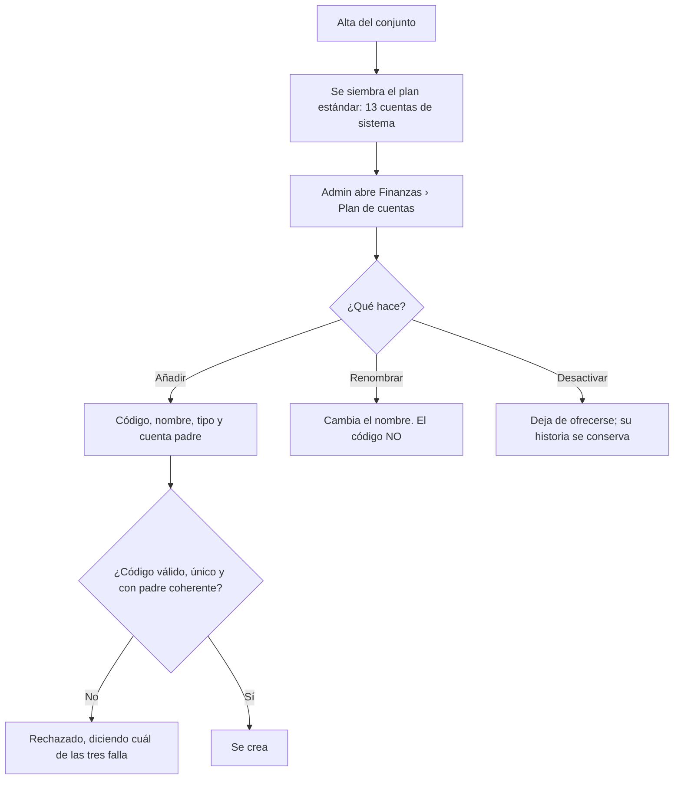

# PRD-V-PLAT-003 — Plan de cuentas gobernado y el concepto que llega al libro

| | |
|---|---|
| **ID** | `PRD-V-PLAT-003` (tentativo hasta registrarlo en `docs/prd/README.md`) |
| **Tipo** | `PLAT` — sustituye un vocabulario fijo en código por uno gobernado por dato, y lo usan Cartera, Egresos, el libro y el estado financiero |
| **Portales** | **`ADMIN`** (alcance) · **`SUPERADMIN`** (alcance: semilla y gobierno de códigos) · `RESIDENTE` (afectado: su cargo se nombra mejor) · `PORTERIA` (no afectado) |
| **Módulo** | Finanzas · transversal |
| **Usuario principal** | `tenant_admin` / `admin_tenant` |
| **Usuarios secundarios** | `committee` · `superadmin` |
| **Responsable** | David |
| **Estado** | **Lista para desarrollo** — versión **1.1**. D1 y D2 cerradas el 21 ago 2026. **La 1.1 (22 ago) corrige dos huecos que salieron al leer el código antes de construir: la semilla no cubría los conceptos de cargo (§2) y el cambio introducía un doble conteo (§2 y §5.2)** |
| **Dependencias** | Ninguna. **Habilita** el consolidado entre conjuntos de `PRD-V-PLAT-002`. **Secuencia obligatoria: va ANTES que `PRD-V-FLOW-002`** — las dos modifican `aplicarPago` y no pueden estar en vuelo a la vez |
| **Riesgo** | **Alto.** Toca la categoría de todos los asientos del libro |
| **Reversibilidad** | **Parcial.** La corrección de §5.2 **cambia lo que muestra el estado financiero** y no se deshace con una bandera (§13) |
| **Fase comercial** | Finanzas está en `preview` durante la prueba |

---

## 1. Resumen ejecutivo

El vocabulario contable de Vivaru **está escrito en el código**: trece categorías en un `type` de
TypeScript, repetidas en **seis ficheros distintos** —ocho apariciones entre los dos
vocabularios—, con dos mapas de etiquetas que **ya discrepan**.
Añadir un concepto es un despliegue.

Y hay algo peor, verificado: **el concepto del cargo nunca llega al libro.** `aplicarPago` y
`revertirPago` escriben `category: "alicuota"` fijo. Una **multa**, una **cuota extraordinaria**
o un **parqueadero**, al cobrarse, se contabilizan todos como «Cuotas de administración». **El
estado financiero de cualquier conjunto que cobre algo distinto de la cuota está mal.**

Esta PRD hace dos cosas: convierte el vocabulario en **un plan de cuentas por conjunto, con
códigos gobernados**, y **hace que el concepto del cargo llegue al asiento**.

## 2. Problema y baseline

### El vocabulario, y dónde vive

| Vocabulario | Valores | Ficheros que lo repiten |
|---|---|---|
| `ExpenseCategory` | 8 | `src/types/domain.ts` · `src/app/(admin)/admin/finanzas/egresos/page.tsx` · `src/features/finanzas/schemas.ts` · `src/features/finanzas/financial-statement.ts` |
| `BillingConcept` | 7 | `src/types/domain.ts` · `src/features/finanzas/financial-statement.ts` · `src/features/billing/use-billing-statements.ts` · `functions/src/index.ts` |
| `LedgerCategory` | `ExpenseCategory` + 5 | `src/types/domain.ts:435` |

**Dos mapas de etiquetas distintos para claves que se solapan:**
`CATEGORY_LABELS` (`financial-statement.ts:15`) dice **«Intereses de mora»**;
`BILLING_CONCEPT_LABELS` (`functions/src/index.ts:2875`) dice **«Interés de mora»**. El residente
recibe una etiqueta en el correo y ve otra en el estado financiero.

### El defecto grande

```
functions/src/payments.ts:266   category: "alicuota",      ← aplicarPago
functions/src/payments.ts:578   category: "alicuota",      ← revertirPago
```

**Fijo, sin leer el `concept` del cargo.** Consecuencias medibles:

- Un conjunto que cobra multas no puede saber cuánto recaudó por multas.
- Una cuota extraordinaria para el ascensor se mezcla con la cuota ordinaria.
- El reparto de `PRD-V-FLOW-001` se contabilizará como cuota de administración.
- El consolidado entre conjuntos de `PRD-V-PLAT-002` **sumaría categorías falsas**.

### El defecto que este cambio INTRODUCIRÍA — descubierto el 22 de agosto de 2026

**Hoy el libro no cuenta dos veces el recaudo, y funciona por accidente.**

```
src/features/finanzas/use-ledger.ts:220
  if (entry.category !== "alicuota") ledgerIncome += entry.amount;

src/app/(admin)/admin/finanzas/page.tsx:125
  cuotaIncome = statements.reduce((sum, s) => sum + (s.paymentAmount ?? 0), 0)
```

`cuotaIncome` suma el pagado de **todos** los cargos, sin mirar el concepto —multas y
parqueaderos incluidos—. Y el libro excluye del ingreso los asientos de categoría
`alicuota`, «para no duplicar». Como `aplicarPago` escribe `alicuota` **para todo**, hoy todo
queda excluido y se cuenta exactamente una vez.

**En cuanto R6 escriba la cuenta del concepto, esa exclusión deja de morder.** Un asiento de
`multa` ya no es `alicuota`, así que **entra en `ledgerIncome`** — y sigue estando en
`cuotaIncome`. **Se cuenta dos veces.** Y ocurre precisamente en los conjuntos que cobran algo
distinto de la cuota, que son los que esta PRD dice arreglar.

**La corrección no es parchear la lista de exclusión: es dejar de mirar la categoría.** El
propio comentario del código dice la intención —*«se cuenta vía `cuotaIncome`, derivado de
Cartera, fuente completa»*—, así que lo que hay que excluir es **lo que viene de un cargo**,
no lo que se llama de cierta forma. Los asientos de cobro llevan `sourceType:
"billingStatement"`. Excluir por origen sobrevive a cualquier concepto futuro; excluir por
`"alicuota"` era una coincidencia que iba a durar hasta hoy.

**Por qué no estaba escrito:** R10 demuestra que sí se conocía la exclusión, pero razonaba
sobre el anticipo **desapareciendo** del libro. El caso simétrico —los demás conceptos
**apareciendo dos veces**— no se miró. Es la misma forma de error que este repositorio ya tiene
catalogada: una frase cierta que deja de serlo al cambiar lo que hay debajo.

### Baseline

| Indicador | Hoy |
|---|---|
| Conceptos de ingreso distinguibles en el estado financiero | **1** (`alicuota`), de 7 posibles |
| Ficheros a tocar para añadir un concepto | **4 como mínimo** (6 si toca los dos vocabularios), en dos paquetes que no se importan |
| Conjuntos que pueden definir su propio plan de cuentas | **0** |

**Métrica de éxito:** que el estado financiero de un conjunto que cobró multas, extraordinarias
y cuota ordinaria **muestre las tres por separado y sumen el total recaudado**.

## 3. Usuarios, roles y permisos

| Rol | Ve | Puede | **NO puede** |
|---|---|---|---|
| `tenant_admin` | El plan de cuentas de **su** conjunto | Crear cuentas, renombrarlas, desactivarlas | **Cambiar el código de una cuenta ya usada** (§8, R4). **Borrar** una cuenta con movimientos (R5). Borrar o renumerar las cuentas de sistema (R3). Operar si el conjunto está `suspended` o `expired` |
| `committee` | El plan y el estado financiero por cuenta | Consultar y exportar | Editar |
| `resident` | El nombre de la cuenta en su propio cargo | Consultarlo | Ver el plan completo |
| `security_guard` | Nada | — | Acceder |
| `superadmin` | Todos los planes | Todo, incluida la corrección de un código mal puesto | — |

> **Nota de portafolio — 21 ago 2026.** Lo que esta PRD asigna al rol `committee` **hoy no es
> alcanzable**: `canAccessPath` (`src/lib/auth/routing.ts:28`) lo deja **solo en
> `/admin/documents`**. A nivel de reglas **sí puede leer** —es miembro del conjunto— así que
> **el bloqueo es de navegación, no de permisos**. Ampliar su alcance merece **PRD propia**:
> decidir qué pantallas ve y comprobar que las reglas no le abran datos personales por el
> camino. **Hasta entonces, las filas de `committee` de esta tabla son intención declarada, no
> capacidad disponible.**


## 4. Objetivo, alcance y exclusiones

**Objetivo.** Que cada conjunto tenga su plan de cuentas, que añadir un concepto no sea un
despliegue, y que **el asiento diga la verdad sobre qué se cobró**.

### Entra

1. **Plan de cuentas por conjunto**: código, nombre, tipo (ingreso/egreso), cuenta padre, estado.
2. **Códigos gobernados**: formato validado, únicos por conjunto e **inmutables una vez usados**.
3. **Semilla** con las categorías actuales ligadas por `systemKey`, **más las cuentas de ingreso
   que los conceptos de cargo necesitan y hoy no existen** (§8 R11). No son trece: son
   **dieciséis con `systemKey`**, más las dos cuentas padre — **18 documentos**.
4. **Un solo catálogo de etiquetas**, y el fin de los dos mapas que discrepan.
5. **El concepto del cargo llega al asiento** al cobrar y al revertir.
6. Estado financiero **agrupado por cuenta**, con jerarquía.
7. Cuenta por defecto en el egreso y en el cargo.

### No entra, y por qué

| Excluido | Por qué |
|---|---|
| **Partida doble** | El libro de Vivaru es de caja. Convertirlo en contabilidad de doble entrada es otro producto |
| **Bitácora transversal de anulaciones** (`E8`) | **Fase 2** de esta misma PRD (§13). Es valiosa y no cabe en el MVP sin diluirlo |
| **Notas de crédito y débito tipadas** (`E9`) | Backlog. Exige diseñar el instrumento, no solo la cuenta |
| **Recalcular asientos históricos** | **Ver §5.2.** Los asientos ya escritos con `alicuota` se quedan como están |
| **Plan de cuentas compartido entre conjuntos** | Tentador para una administradora, pero obliga a decidir quién manda. Anotado para `PLAT-002` Fase 3 |

## 5. Flujo funcional

### 5.1 Definir el plan



**El gobierno del código es lo que separa esto del plan de cuentas de Habitanto**, que vimos con
rubros repetidos con el mismo número y códigos escritos a mano con puntos de más. Allí el
consolidado entre condominios no puede agrupar por rubro. **Aquí el código se valida y, una vez
usado, no se cambia.**

### 5.2 El concepto que llega al libro — y la línea que hay que decir en voz alta

Al cobrar, el asiento pasa a llevar **la cuenta que corresponde al concepto del cargo**, en vez
de `alicuota` fijo.

> **Esto cambia lo que muestra el estado financiero desde el día del despliegue.** Un conjunto
> que venía viendo todo su recaudo en «Cuotas de administración» empezará a verlo repartido.
> **No es un error nuevo: es el error viejo dejando de ocurrir.**
>
> **Los asientos ya escritos no se recalculan** (§4). Habrá un antes y un después en la serie
> histórica, y el producto debe decirlo donde se note.

**Con cero clientes reales, el «antes» son nueve conjuntos de prueba.** Es el momento más barato
que va a haber.

**Y no viaja sola: con ella va la corrección de la exclusión del libro (§2).** Escribir la cuenta
del concepto sin arreglar `use-ledger.ts:220` **duplica el ingreso** de todo cargo que no sea la
cuota ordinaria. **Las dos van en el mismo despliegue y detrás de la misma bandera**
(`producto-concepto-al-libro`): separarlas es desplegar el doble conteo y llamarlo incremento.

### 5.3 Casos límite

| Caso | Comportamiento |
|---|---|
| Concepto de cargo sin cuenta equivalente | Cae en la cuenta de sistema `otros_ingresos` y **se avisa al administrador**. Nunca se pierde |
| Cuenta desactivada con movimientos | Se conserva en los informes; no se ofrece en operaciones nuevas |
| Se intenta borrar una cuenta de sistema | **Bloqueado** (R3) |
| Se intenta cambiar el código de una cuenta usada | **Bloqueado** (R4) |
| Cuenta padre desactivada con hijas activas | **Bloqueado**: primero se desactivan las hijas |
| Conjunto `suspended` / `expired` | Solo lectura |

## 6. Estados y transiciones

| Estado de la cuenta | Qué significa | Quién transiciona | Salida |
|---|---|---|---|
| **`active`** | Se ofrece en operaciones nuevas | Administración | → `inactive` |
| **`inactive`** | No se ofrece; sigue en los informes | Administración | → `active` |

**Sin estado terminal.** Una cuenta con movimientos no se borra nunca: borrarla dejaría asientos
apuntando al vacío.

## 7. Contrato de datos y multi-tenancy

### 7.1 Colección nueva: `chartOfAccounts`

| Campo | Tipo | Obligatorio | Nota |
|---|---|---|---|
| `tenantId` | `string` | **Sí** | |
| `code` | `string` | Sí | Formato gobernado. **Único por conjunto. Inmutable una vez usado** |
| `name` | `string` | Sí | Editable siempre |
| `type` | `"ingreso" \| "egreso"` | Sí | |
| `parentCode` | `string` | No | Jerarquía de un nivel en el MVP |
| `systemKey` | `LedgerCategory` | No | Solo en las cuentas sembradas. **Es el puente con lo que ya existe** |
| `status` | `"active" \| "inactive"` | Sí | |
| `createdAt` / `updatedAt` / `createdBy` | — | Sí | |

### 7.2 Cambios en lo que existe

| Dónde | Cambio | Compatibilidad |
|---|---|---|
| `LedgerEntry` | `+ accountCode?: string` | **`category` se conserva y se sigue escribiendo.** Los informes leen `accountCode` y, si falta, caen en `category` |
| `BillingStatement` | `+ accountCode?: string` | Se resuelve desde `concept` al generar |
| `Expense` | `+ accountCode?: string` | Se resuelve desde `category` al registrar |
| `aplicarPago` / `revertirPago` | Dejan de escribir `"alicuota"` fijo | **Escriben la cuenta del cargo.** §5.2 |
| `LedgerCategory` (`src/types/domain.ts:442`) | **+ `multa`, `reparacion`, `parqueadero`** | Consecuencia forzosa: `category` se sigue escribiendo, así que si `aplicarPago` escribe el concepto, el tipo tiene que admitirlo o no compila |
| `use-ledger.ts:220` · `financial-statement.ts` | **La exclusión pasa a mirar el origen**, no la categoría | Sin esto, el cambio **duplica el ingreso** (§2). Durante la convivencia se excluye por `sourceType === "billingStatement"` **o** `category === "alicuota"`, que cubre lo histórico |
| Mapas de etiquetas | Los dos se sustituyen por el nombre de la cuenta | Fin de la discrepancia de §2 |

**`category` no se retira.** Retirarlo obligaría a migrar todos los asientos existentes y a tocar
`use-ledger.ts` y `financial-statement.ts` a la vez. La convivencia es fea y es lo correcto.

### 7.3 Multi-tenancy y ciclo de vida

- `chartOfAccounts` lleva **`tenantId`**; toda consulta lo filtra.
- **`suspended` / `expired`** → solo lectura.
- **`trial`** → Finanzas está en `preview`: **el plan se ve sembrado y no se edita** hasta
  contratar.

### 7.4 Retención

El plan de cuentas **no contiene datos personales**. Fuera de la política de retención.

## 8. Reglas de negocio

| # | Regla |
|---|---|
| **R1** | Todo conjunto nuevo nace con el plan estándar sembrado, ligado por `systemKey` |
| **R2** | El código sigue un formato validado, es **único por conjunto** y **no puede repetirse** |
| **R3** | Las cuentas de sistema **no se borran ni se renumeran**. Sí se renombran y se desactivan |
| **R4** | Una cuenta **con al menos un movimiento** no puede cambiar de código |
| **R5** | Una cuenta con movimientos **no se borra**; se desactiva |
| **R6** | Al cobrar un cargo, el asiento lleva **la cuenta del concepto del cargo** |
| **R7** | Al revertir, el asiento negativo lleva **la misma cuenta que el original** |
| **R8** | Un concepto sin cuenta equivalente cae en `otros_ingresos` **y se avisa**. Nunca se descarta |
| **R9** | Un informe agrupa por `accountCode`; si el asiento no lo tiene, usa `category` |
| **R10** | El anticipo de `PRD-V-FLOW-002` usa **su propia cuenta** y **nunca se excluye del libro** como se excluye `alicuota` |

| **R11** | El mapa **`BillingConcept` → cuenta es explícito y vive en un solo sitio.** Dos resoluciones no son obvias y hay que escribirlas: el cargo `administracion` va a la cuenta de **ingreso** `alicuota` —no a la de egreso homónima— y el cargo `otro` va a `otros_ingresos`. Las tres que hoy no tienen cuenta (`multa`, `reparacion`, `parqueadero`) **se siembran**, no caen en R8 |
| **R12** | La exclusión que evita el doble conteo mira el **origen** del asiento (`sourceType === "billingStatement"`), no su categoría. Durante la convivencia acepta también `category === "alicuota"` para lo histórico |

**R8 no es la red del mapa incompleto.** Si los conceptos conocidos cayeran en `otros_ingresos`,
la métrica de éxito de §2 fallaría el primer día — `multa` es justo el ejemplo que usa. R8 es
para lo que alguien añada después, no para lo que ya sabemos que existe.

**R7 importa más de lo que parece:** si el reverso cayera en otra cuenta, la reversión no
anularía nada — dejaría un positivo en una y un negativo en otra.

## 9. Notificaciones y correo

No se crean notificaciones. **Un cambio de contenido con consecuencia:** el aviso de cargo al
residente pasa a usar **el nombre de la cuenta**, con lo que desaparece la discrepancia
«Interés de mora» / «Intereses de mora» de §2.

## 10. Criterios de aceptación

### Deben pasar

| # | Criterio |
|---|---|
| CA1 | Un conjunto nuevo nace con las **dieciséis** cuentas de `systemKey` sembradas (18 documentos con los dos padres), y **los siete conceptos de cargo resuelven a una cuenta propia** (ninguno cae en `otros_ingresos`) |
| CA2 | El administrador crea una cuenta con código válido y la usa en un egreso |
| CA3 | **Cobrar un cargo de concepto `multa` escribe un asiento en la cuenta de multas, no en cuotas de administración** |
| CA4 | Revertir ese pago escribe el negativo **en la misma cuenta** |
| CA5 | El estado financiero de un conjunto con cuota, extraordinaria y multa **muestra las tres por separado y suman el total** |
| CA6 | Renombrar una cuenta cambia la etiqueta en el estado financiero y en el correo, **a la vez** |
| CA7 | Desactivar una cuenta la retira de los selectores y la conserva en los informes |
| CA8 | Un asiento antiguo sin `accountCode` sigue apareciendo, agrupado por su `category` |
| CA9 | Un concepto sin cuenta equivalente cae en `otros_ingresos` y **avisa** |
| CA10 | El anticipo aparece en su propia cuenta y **suma al ingreso del período** |
| CA11 | **Un conjunto con cuota, multa y parqueadero cobrados muestra el ingreso total IGUAL antes y después de encender `producto-concepto-al-libro`** — cambia el reparto, no la suma |
| CA12 | Cobrar un cargo de concepto `administracion` escribe en la cuenta de ingreso `alicuota`, no en la de egreso «Administración» |

### Deben fallar

| # | Criterio |
|---|---|
| CF1 | Dos cuentas con el mismo código en un conjunto → **rechazado** |
| CF2 | Cambiar el código de una cuenta con movimientos → **bloqueado** |
| CF3 | Borrar una cuenta con movimientos → **bloqueado** |
| CF4 | Borrar o renumerar una cuenta de sistema → **bloqueado** |
| CF5 | Código con formato inválido → **rechazado, diciendo por qué** |
| CF6 | Desactivar una cuenta padre con hijas activas → **bloqueado** |
| CF7 | Un residente abre el plan de cuentas → **denegado** |
| CF8 | Editar el plan en `trial` → **bloqueado por la matriz de prueba** |
| CF9 | Consulta de `chartOfAccounts` sin `where("tenantId")` → **denegada entera** |
| CF10 | Un asiento originado en un cargo **no puede sumarse a `ledgerIncome`** — si aparece ahí, el ingreso está duplicado |

## 11. Arquitectura y dependencias

### 11.1 La decisión obligatoria: cliente directo o callable

| Operación | Decisión | Por qué |
|---|---|---|
| **Crear, renombrar y desactivar cuentas** | **Cliente directo** | CRUD que las reglas protegen con `tenantAdminOrSuper` + `tenantOperable`. Las validaciones de formato y unicidad viven en el formulario **y** en las reglas |
| **Sembrar el plan al crear un conjunto** | **Callable** — dentro del alta que ya existe | Escribe trece documentos y debe ser atómico con el alta |
| **Escribir la cuenta en el asiento** | **Ya es callable** | `aplicarPago` y `revertirPago` lo son. **Solo cambia qué valor escriben** |

**La unicidad del código no puede quedar solo en el cliente.** La regla de Firestore debe
apoyarse en un id de documento derivado del código —`{tenantId}_{code}`— para que la unicidad la
garantice la base, no una comprobación previa que dos pestañas pueden ganar a la vez.

### 11.2 Reglas de Firestore

Bloque nuevo para `chartOfAccounts`, con el id derivado de §11.1. **Debe impedir la escritura si
`request.resource.data.code` no coincide con el id**, o la unicidad se puede burlar.

### 11.3 Índices, jobs y banderas

- **Índices:** `chartOfAccounts` por `tenantId` + `type` + `status`; `ledgerEntries` por
  `tenantId` + `accountCode` + `date`.
- **Jobs:** ninguno. **Los asientos históricos no se migran** (§4).
- **Banderas:** `producto-plan-de-cuentas` (editar el plan) y **`producto-concepto-al-libro`**
  (§5.2), separadas a propósito: la segunda cambia lo que muestra el estado financiero y merece
  encenderse sola.
  **Renombradas al construir (1.1):** la PRD las llamaba `chart-of-accounts` y
  `concept-to-ledger`, y el catálogo exige `<area>-<capacidad>` en castellano —lo dice
  `src/lib/feature-flags/catalog.ts`—. Gana el código (regla 6 del portafolio).
  **Y van registradas en los CUATRO sitios del catálogo**, no en dos: tocar solo los dos
  primeros deja la bandera imposible de encender, sin síntoma. Ya pasó con las tres banderas de
  producto de agosto de 2026.

### 11.4 Qué habilita

El **consolidado entre conjuntos** de `PRD-V-PLAT-002` Fase 3. Sin códigos gobernados, sumar dos
conjuntos por nombre de rubro da cifras falsas — que es el defecto que Habitanto arrastra con 16
condominios.

## 12. Riesgos y mitigaciones

| Riesgo | Señal | Mitigación |
|---|---|---|
| **El estado financiero cambia y alguien lo lee como un error** | Consulta del administrador | §5.2 lo dice explícitamente; bandera propia; con cero clientes reales el impacto es nueve conjuntos de prueba |
| Dos cuentas con el mismo código por concurrencia | Informes que agrupan mal | Id derivado del código (§11.1): lo garantiza la base |
| Un reverso cae en otra cuenta y no anula | Cuentas descuadradas | R7 y CA4 |
| El plan se ensucia como el de Habitanto | Códigos duplicados, puntos de más | R2, R3, R4 y CF1–CF5. **Es el objetivo declarado del diseño** |
| Un concepto se pierde al no tener cuenta | Ingreso sin clasificar | R8: cae en `otros_ingresos` **y avisa** |
| Convivencia `category` / `accountCode` que se olvida y diverge | Informes inconsistentes | R9 define la precedencia; CA8 la prueba |
| **Doble conteo del recaudo** al dejar de escribir `alicuota` | Ingreso total inflado tras encender la bandera | **R12**: excluir por origen y no por categoría. **CA11** lo prueba comparando la suma antes y después. Las dos piezas van en el mismo despliegue (§5.2) |
| Coste | — | **Nulo** |

## 13. Despliegue, rollback y Story Map

### Orden

1. **Reglas** — `chartOfAccounts` con id derivado.
2. **Functions** — semilla en el alta; `accountCode` en `aplicarPago` y `revertirPago`, **detrás
   de `producto-concepto-al-libro`**.
   **En el mismo incremento, y no en otro:** la corrección de la exclusión del libro (§2, R12).
   El front que lee y la función que escribe cambian a la vez porque **el defecto vive entre los
   dos**.
3. **Front** — plan de cuentas, selector en egreso y cargo, informes por cuenta.

### Rollback

| Parte | Reversible |
|---|---|
| Edición del plan | **Sí**, por bandera |
| Semilla | **Sí** mientras no se use: las cuentas quedan inertes |
| **`producto-concepto-al-libro`** | **Sí por bandera para los asientos futuros. No para los ya escritos** con la cuenta correcta — y **no se quieren revertir**: son los correctos |

### Validación

| Dónde | Qué |
|---|---|
| **Staging** | Todo, con un conjunto que tenga cuota, extraordinaria y multa cobradas |
| **Producción** | Que el estado financiero de los nueve conjuntos de prueba **cambie como se espera** al encender `producto-concepto-al-libro`, y no de otra forma |

### Story Map

**MVP** — plan sembrado y editable · códigos gobernados · **el concepto llega al libro** ·
informes por cuenta · catálogo único de etiquetas.

**Fase 2** — **bitácora transversal de anulaciones** (`E8` del backlog): un solo registro de todo
lo anulado en el conjunto —pagos revertidos, cargos anulados, corridas anuladas, egresos
anulados— con motivo obligatorio, fecha y autor.

**Fase 3** — jerarquía de más de un nivel · plan compartido entre conjuntos de una administradora.

## 14. Decisiones abiertas

### D1 · ¿Qué formato tiene el código?

Habitanto usa numeración jerárquica libre —`1.1`, `3.23`— y **se le ensució**: vimos dos rubros
`3.9` distintos y códigos con puntos de más.

- **Opción A** — numérico jerárquico validado: `N` para categoría, `N.M` para cuenta, dos
  niveles, sin repetir.
- **Opción B** — código corto alfanumérico sin jerarquía, y la jerarquía solo por `parentCode`.

**Recomendación: A.** Es lo que un contador espera leer, la jerarquía se ve en el propio código,
y validarlo es trivial. El defecto de Habitanto **no fue elegir el formato: fue no validarlo.**

> **CERRADA el 21 ago 2026 — aceptada la opción A.** Numérico jerárquico validado, dos
> niveles, único por conjunto e inmutable una vez usado.

### D2 · ¿El plan es por conjunto o por administradora?

Con `PRD-V-PLAT-002` aprobada, una administradora con quince conjuntos podría querer un plan
único para poder comparar.

**Recomendación: por conjunto en el MVP**, con el plan compartido en Fase 3. Un plan compartido
obliga a decidir quién puede editarlo y qué pasa con un conjunto que se va de la administradora
— y ninguna de las dos preguntas tiene respuesta todavía.

> **CERRADA el 21 ago 2026 — aceptada.** Plan **por conjunto** en el MVP; compartido entre
> conjuntos de una administradora en Fase 3.

**Ninguna decisión abierta.**

## 15. Puertas

| Puerta | Estado |
|---|---|
| **G0 Necesidad** | ✅ Dos problemas medidos con archivo y línea: el vocabulario en ocho ficheros y `category: "alicuota"` fijo |
| **G1 Valor** | ✅ Baseline y métrica en §2 |
| **G2 Datos y permisos** | ✅ Definidos. Unicidad garantizada por la base, no por el cliente |
| **G3 Riesgo** | ⚠️ **Parcial.** Hay banderas y precedencia de lectura, pero §5.2 **cambia lo que ve el usuario** y eso no se revierte del todo. **Se acepta porque hoy no hay ni un cliente real** |
| **G4 Aceptación** | ✅ **12 que pasan, 10 que deben fallar** (1.1: CA11 y CF10 cierran el doble conteo, CA12 la colisión de `administracion`) |
| **G5 Operación** | ✅ El administrador mantiene su plan; el superadmin gobierna la semilla. **Nadie tiene que operar esto a diario** |
| **G6 Escala** | ✅ Decenas de cuentas por conjunto |

**Lista para desarrollo**, con el riesgo de G3 aceptado explícitamente: §5.2 cambia lo que ve el
usuario, y hoy el «antes» son nueve conjuntos de prueba.

**Nota de la 1.1 (22 ago 2026), que vale más que los dos arreglos:** las dos correcciones salieron
de **leer el código antes de construir**, no de una revisión del documento. La 1.0 pasó una
revisión cruzada contra las otras ocho PRD y ninguna de las dos apareció, porque las dos viven
**entre** ficheros —el mapa de conceptos entre dos vocabularios, y el doble conteo entre la
función que escribe y la pantalla que lee—. Un documento cotejado contra otros documentos no
encuentra eso.
