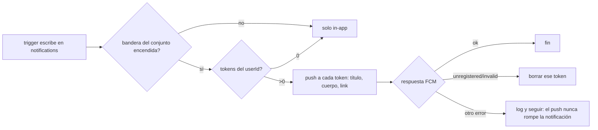

# PRD-V-PLAT-005 — Notificaciones push al residente

| | |
|---|---|
| **ID** | `PRD-V-PLAT-005` (tentativo hasta registrarlo en `docs/prd/README.md`; `PLAT-004` está reservado para «Alcance del rol Consejo») |
| **Tipo** | `PLAT` — tercer canal del sistema de notificaciones, transversal a todos los módulos que hoy escriben en `notifications` |
| **Portales** | **`RESIDENTE`** (alcance: registro del dispositivo y recepción) · `ADMIN` (afectado: fase 2, control por plantilla) · `SUPERADMIN` (afectado: solo la consola de banderas existente) · `PORTERIA` (no afectado) |
| **Módulo** | Notificaciones · transversal |
| **Usuario principal** | `resident` |
| **Usuarios secundarios** | `tenant_admin` (fase 2) |
| **Responsable** | David |
| **Estado** | **En desarrollo — MVP CONSTRUIDO** (29 ago 2026, versión 0.4): bandera en los cinco sitios, reglas de `pushTokens` con 13 pruebas, emisor en el embudo `createNotifications`, manifest, SW por route handler, invitación y baja en el portal del residente. Cuatro falsaciones pasadas, cada una enrojeciendo exactamente su prueba. **Pendiente: staging y la validación 📱 (CA1, CA5, CA9)** |
| **Dependencias** | Ninguna. **D-CONSOLA CERRADA el 29 ago 2026:** David generó el par VAPID en los dos proyectos y las claves públicas están cableadas en `apphosting.yaml` y `apphosting.staging.yaml` (87 caracteres cada una, verificadas parseando el YAML; la privada no sale de FCM) |
| **Riesgo** | **Medio.** No toca dinero ni permisos existentes; el riesgo es molestar (push de más) y prometer un canal que nadie encendió (adopción) |
| **Reversibilidad** | **Total.** La bandera apaga registro y envío; los tokens quedan escritos y dejan de usarse. Sin push no se pierde nada: el aviso in-app sigue siendo el registro de verdad |
| **Fase comercial** | En prueba (trial) el canal queda **apagado** — ver §7.3 |

---

## 1. Resumen ejecutivo

El residente solo se entera de un aviso de Vivaru si abre la aplicación: el canal in-app exige
visita y el correo está cerrado por defecto en las 13 plantillas — y en el único conjunto con
datos, 12 de 14 direcciones no reciben. Esta PRD añade el **push web** como tercer canal: el
aviso que ya se escribe en `notifications` llega además al hub de notificaciones del teléfono,
sin app en las tiendas, usando el FCM que ya está en el stack. El valor esperado es que un aviso
de relevancia alta (cobro, pago rechazado, respuesta a un ticket) se entere **el día que ocurre**,
no el día que el residente vuelve a entrar.

## 2. Problema y baseline

**Cómo se entera un residente hoy — medido, no leído:**

| Canal | Estado | Evidencia |
|---|---|---|
| In-app (campana) | Único canal vivo | `notifications`: **507 documentos** en producción (29 ago 2026) |
| Correo | Cerrado por defecto en **todas** las plantillas (`emailDefault: false`); lo abre el admin por conjunto, y ninguno lo ha abierto | `notification-catalog.ts` + hallazgo de direcciones: 12 de 14 miembros de Santa María con buzón que no recibe |
| Push | **No existe** | `registerWebPush` en `src/lib/firebase/messaging.ts` con **cero consumidores**; sin service worker, sin manifest, sin lado emisor (`admin.messaging()`: 0 apariciones), `pushTokens`: 0 documentos |

**El baseline honesto:** producción no tiene clientes reales, así que no hay tasa de lectura que
mejorar todavía. La métrica se define ahora y se mide desde el primer conjunto real:

- **Métrica primaria:** % de avisos de relevancia `alta` leídos (campo `read`) dentro de las
  24 h de creados, con push contra sin push.
- **Métrica de adopción:** dispositivos registrados / residentes activos del conjunto.

**Por qué ahora y no «cuando haya clientes»:** mismo criterio que `FIN-002` — llegar listos. Pero
con la lección de las capacidades encendidas y quietas a la vista: **este canal no lo llena un
deploy, lo llena un residente que instale**. La ficha no se marca productiva hasta que exista uno
(G5).

## 3. Usuarios, roles y permisos

| Rol | Ve | Puede | Prohibido |
|---|---|---|---|
| `resident` | La invitación a activar avisos en su portal; el estado de sus dispositivos en su perfil | Aceptar o rechazar el permiso; registrar hasta `N` dispositivos propios; darlos de baja | Registrar tokens de otro usuario; ver tokens ajenos; recibir push de otro conjunto |
| `tenant_admin` | Nada nuevo en MVP. Fase 2: interruptor de push por plantilla, junto al de correo | Fase 2: activar/desactivar push por plantilla de su conjunto | Ver o tocar tokens de nadie; mandar push arbitrario (no existe «enviar push» como acción: el push solo nace de una notificación) |
| `security_guard` / `security` | Nada | Nada | Todo lo de este canal |
| `committee` | Nada | Nada | Todo lo de este canal |
| `superadmin` | La bandera en la consola de flags existente | Encender/apagar la bandera global o por conjunto | Leer el contenido de tokens (no hay pantalla que los muestre) |

## 4. Objetivo, alcance y exclusiones

**Objetivo:** todo aviso que hoy se escribe en `notifications` para un usuario con dispositivos
registrados llega además como push al hub del sistema operativo del dispositivo, con la bandera
encendida para su conjunto.

**Entra (MVP):**

1. Manifest de web app y service worker de FCM (`ADMIN` y `RESIDENTE` comparten dominio; el
   manifest es uno).
2. Registro del dispositivo desde el portal del residente: invitación con gesto explícito,
   obtención del token FCM y escritura en `pushTokens`.
3. Envío en el embudo único `createNotifications`: cada documento escrito dispara el push a los
   tokens del `userId`, si la bandera del conjunto está encendida.
4. Limpieza de tokens muertos: el envío que FCM responde como `unregistered`/`invalid` borra el
   token (lado servidor).
5. Baja manual: el residente puede quitar sus dispositivos desde su perfil.

**No entra (y por qué):**

- **Control por plantilla (`pushDefault`)** — fase 2. En MVP el push refleja el hub in-app
  completo: es el comportamiento de cualquier app nativa y evita duplicar ahora el patrón
  overrides/editor. La palanca gruesa (bandera por conjunto) y la fina (permiso del dispositivo)
  existen desde el día uno.
- **Push al `tenant_admin` o a portería** — el registro solo se ofrece en el portal del
  residente. El lado emisor no distingue roles (manda a los tokens del `userId`), así que
  extenderlo después es solo ofrecer el registro en otro portal.
- **Campañas o push manual** — no existe «redactar un push». El push es sombra de la
  notificación, siempre.
- **App nativa / App Store** — expresamente fuera; es la alternativa cara que esta PRD evita.

## 5. Flujo funcional

**Registro (una vez por dispositivo):**

1. El residente entra a su portal con sesión iniciada. Si la bandera de su conjunto está
   encendida, no ha rechazado antes y el navegador soporta push, ve una invitación no modal.
2. En iPhone/iPad sin instalar: la invitación **no pide permiso** (no serviría) — explica añadir
   la web a la pantalla de inicio (Compartir → Añadir a pantalla de inicio) y termina ahí.
3. Con soporte real (Android/desktop, o iOS ya instalado): al tocar «Activar», se pide el permiso
   del navegador. Concedido → token FCM → documento en `pushTokens`. Denegado → no se vuelve a
   invitar (el permiso del navegador queda denegado y solo el usuario puede revertirlo).
4. «Ahora no» → la invitación se silencia un tiempo (valor en código, no configurable).

**Envío (cada vez que nace una notificación):**

**Errores y límites:** el push es best-effort con el mismo contrato que el correo en
`deliverResidentNotifications`: **su fallo jamás impide ni revierte el aviso in-app**. Un lote a
muchos residentes (p. ej. `billing_batch`) envía por chunks y no reintenta.

## 6. Estados y transiciones

El canal no introduce estados operables nuevos sobre la notificación. El único ciclo de vida
nuevo es el del **token**:

| Estado | Cómo se entra | Quién lo saca | Salida |
|---|---|---|---|
| Activo | El residente registra el dispositivo | — | → Borrado |
| Borrado | (a) el residente lo da de baja · (b) el servidor lo purga al recibir `unregistered`/`invalid` · (c) el admin del conjunto no puede | Residente o servidor | Terminal (el documento se elimina, no se archiva) |

Ningún estado queda sin dueño: un token que muere en el dispositivo (app desinstalada, permiso
revocado) lo purga el **siguiente envío** — no hace falta job.

## 7. Contrato de datos y multi-tenancy

### 7.1 Colección nueva: `pushTokens`

Id del documento: **el propio token** (idempotencia natural: re-registrar el mismo dispositivo
sobrescribe, no duplica — lección de `id-de-documento-es-global`: el token FCM ya es único
globalmente, no hay dos usuarios con el mismo).

| Campo | Tipo | Obligatorio | Quién escribe |
|---|---|---|---|
| `userId` | string (uid) | Sí | Cliente (dueño) al crear; inmutable |
| `tenantId` | string | Sí | Cliente al crear; inmutable |
| `createdAt` | Timestamp | Sí | Cliente |
| `lastUsedAt` | Timestamp | No | Servidor, en cada envío |
| `platform` | string (`android` `ios` `desktop` `otro`) | No | Cliente |

- **Toda consulta de lista filtra `tenantId`** (invariante de la casa) y además `userId`; el
  índice compuesto que haga falta se declara en `firestore.indexes.json`.
- **Retención y borrado:** el token se borra, no se archiva — es una credencial de entrega, no un
  registro de negocio. Al archivar o borrar una membresía, los tokens del usuario en ese conjunto
  se purgan en la misma operación de servidor.
- El envío lee `pushTokens` con Admin SDK (las reglas no aplican al servidor).

### 7.2 Reglas de acceso (resultado esperado, no sintaxis)

Crear: solo autenticado, `userId == request.auth.uid`, `tenantId` del propio conjunto
(`sameTenant`). Leer/borrar: solo el dueño (y superadmin). Actualizar desde cliente: **no**
(inmutable salvo el servidor); si el token cambia, el cliente crea el documento nuevo — el id es
otro. Nadie más lee la colección: ni el `tenant_admin` (no necesita ver credenciales de entrega).

### 7.3 Suspendido, vencido y en prueba

- **Suspendido/vencido:** el push no decide nada — es sombra de la notificación. Si el trigger no
  escribe el aviso (p. ej. un suspendido no factura, lección CF8), no hay push. Los avisos que sí
  nazcan (soporte, que es excepción declarada de solo-lectura) sí empujan. Registrar un
  dispositivo nuevo en conjunto suspendido: **permitido** — leer avisos es lectura.
- **En prueba (trial):** la bandera nace apagada y **no se enciende para trials** en MVP. Un
  trial no puede invitar personas reales, así que no hay residente que registre; encenderla solo
  añadiría el prompt al admin de prueba en vista previa. Se declara para que nadie lo «arregle».

## 8. Reglas de negocio y validaciones

- **R1 — El push nunca existe solo.** Todo push proviene de un documento de `notifications`
  escrito en la misma operación. No hay API, pantalla ni script que mande push sin aviso.
- **R2 — El servidor comprueba la bandera.** `isFeatureEnabled(clave, tenantId)` se evalúa en el
  lado emisor, no solo en el front (una bandera que el servidor no comprueba es solo un botón).
- **R3 — El fallo del push no rompe nada.** Igual que el correo: try/catch por token, log y
  seguir.
- **R4 — Un token pertenece a un solo usuario.** Si un dispositivo se registra con otra sesión,
  el documento (id = token) se reescribe con el nuevo `userId`: el dueño anterior deja de recibir
  en ese dispositivo. Es el comportamiento correcto para un teléfono compartido o prestado.
- **R5 — Sin permiso no hay pregunta repetida.** Denegado el permiso del navegador, la invitación
  no reaparece. «Ahora no» silencia, no insiste.
- **R6 — El contenido del push es el del aviso.** Título y cuerpo salen del mismo
  `resolveNotificationCopy` (con overrides del conjunto) que el in-app; el push no tiene copy
  propio que mantener.
- **R7 — Tope de dispositivos por usuario: 5** (D1, cerrada el 29 ago; el valor vive en código):
  el registro que excede borra el más viejo por `createdAt`.

## 9. Notificaciones y correo

Esta PRD **es** un canal; no crea avisos nuevos ni toca los existentes. Las 13 plantillas del
catálogo y los avisos directos (`createNotifications`) quedan idénticos en copy, disparadores y
correo. El remitente de correo (`functions/src/email.ts`, dominio verificado) no interviene.
**Ninguna promesa de plazo:** el push llega «cuando FCM lo entregue», y el texto de la invitación
al residente no promete inmediatez.

## 10. Criterios de aceptación

Verificables con navegador y dispositivo real; los que exigen teléfono se marcan 📱 (no los ve
Playwright — y un verde sin falsación no cuenta).

- **CA1** — Con bandera encendida y dispositivo Android registrado, crear un aviso (p. ej.
  responder un ticket del residente) hace aparecer el push en el hub del sistema **con la app
  cerrada**. 📱
- **CA2** — Tocar el push abre la web en el `link` del aviso.
- **CA3 (debe fallar)** — Con la bandera del conjunto **apagada** y token registrado, el mismo
  disparo **no** produce push, y el aviso in-app sí aparece.
- **CA4 (debe fallar)** — Un usuario autenticado no puede crear en `pushTokens` un documento con
  `userId` ajeno ni con `tenantId` de otro conjunto (prueba de reglas con **transacción/patrón
  real del cliente**, no `setDoc` de conveniencia — lección de `el-banco-probaba-otro-camino`).
- **CA5** — En iPhone sin instalar, la invitación muestra el paso «añadir a pantalla de inicio» y
  **no** dispara el prompt de permiso. Tras instalar y aceptar, el push llega al hub de iOS. 📱
- **CA6** — Registrar el mismo dispositivo dos veces deja **un** documento en `pushTokens`.
- **CA7** — Un token revocado (permiso quitado en el sistema) queda borrado de `pushTokens`
  después del siguiente envío que lo alcance.
- **CA8 (debe fallar)** — El envío push que lanza excepción no impide que el documento de
  `notifications` exista (falsar apagando la red hacia FCM en el emulador).
- **CA9** — La baja desde el perfil borra el documento y el dispositivo deja de recibir. 📱
- **CA10** — Un aviso a un usuario **sin** tokens no produce error ni log de fallo (0 tokens es
  el caso normal, no una excepción).

**Falsación exigida (lección del 29):** cada CA se rompe a propósito y se comprueba que enrojece
**esa** prueba y no otra — y CA3 se prueba además con la bandera en el estado contrario al del
ambiente donde se validó primero (cuarta forma: el defecto que solo se ve con la bandera al
revés).

## 11. Arquitectura y dependencias

**¿Cliente directo o callable?** — **Mixto, y cada mitad por su razón:**

- **Registro de token: escritura directa del cliente** sobre `pushTokens`. Es CRUD de propiedad
  propia que las reglas protegen por completo (dueño, conjunto, inmutables). Una callable aquí
  sería complejidad inventada.
- **Envío: servidor, dentro de `createNotifications`** (`functions/src/index.ts:480`). Es **el
  embudo único**: las 13 plantillas pasan por él vía `deliverResidentNotifications` y los ~10
  avisos directos también. Un solo punto de cambio cubre el catálogo entero — el gemelo bueno es
  cómo el correo ya vive dentro de `deliverResidentNotifications`. El cliente no puede falsificar
  un push porque no existe superficie cliente de envío.

**Piezas:**

| Pieza | Dónde | Nota |
|---|---|---|
| Manifest | `src/app/manifest.ts` (no existe hoy) | `display: "standalone"`; iconos **ya generados** (D2): `public/brand/icon-192.png`, `icon-512.png` y `apple-touch-icon.png` (180, el que iOS usa en pantalla de inicio) — solo emblema, blanco sobre `#0b3c5d`, contraste 11,55:1, sin canal alfa (alphaMin 255 medido) |
| Service worker | `public/firebase-messaging-sw.js` (no existe hoy) | Estático; la config de Firebase no puede leer env en runtime → se decide entre generarlo en build o servirlo por route handler. **Recomendación: route handler**, que reutiliza las `NEXT_PUBLIC_*` ya definidas en `apphosting.yaml` |
| Registro cliente | `src/lib/firebase/messaging.ts` | **Ya existe y está bien** — por fin gana su primer consumidor |
| Envío servidor | `functions/src/index.ts` → `createNotifications` | `admin.messaging().sendEachForMulticast` con `webpush.fcmOptions.link` |
| Clave VAPID | `NEXT_PUBLIC_FIREBASE_VAPID_KEY` en `apphosting.yaml` **y** `apphosting.staging.yaml` | **CABLEADA en los dos** (29 ago, D-CONSOLA cerrada), con `BUILD` porque el cliente la inlinea. Par por proyecto: la de staging no sirve en producción. Trampa conocida: una variable puesta a mano en la consola le gana al archivo |
| Bandera | `producto-notificaciones-push` | Nace apagada. **El catálogo vive en CINCO sitios y los cinco se tocan** (los cuatro ficheros + el documento en Firestore), o no se puede encender por conjunto — que es la vía del canario |
| Índice | `firestore.indexes.json` | `pushTokens (tenantId, userId)` si la consulta compuesta lo exige |
| Reglas | `firestore.rules` | Bloque nuevo `match /pushTokens/{token}` según §7.2 |

**Orden de despliegue — el general, no el invertido:** reglas → functions → front. Aquí ninguna
pieza restringe algo que el front ya haga (el caso de `FLOW-004` era el contrario), así que
aplica el orden por defecto. El front sin functions no rompe: registra tokens que nadie usa aún.

## 12. Riesgos y mitigaciones

| Riesgo | Señal que lo detecta | Mitigación |
|---|---|---|
| **Molestar:** el MVP empuja todo el hub, incluidos avisos de relevancia `baja` (2 de 13 plantillas) | Residentes desactivando permiso (tokens purgados creciendo) | Aceptado a propósito en MVP; la fase 2 (`pushDefault` por plantilla) es la respuesta si la señal aparece |
| **Adopción cero en iOS** por la fricción de instalar | `platform: ios` en 0 tras semanas de un conjunto real | Guía visual en la invitación; medirlo antes de invertir más |
| **Tokens huérfanos** inflan envíos fallidos | Ratio de `unregistered` por lote | Purga en el propio envío (§6); no hace falta job |
| **El push «funciona» y no se ve** — desplegado, bandera encendida, y cero dispositivos: quinta capacidad encendida y quieta | `pushTokens` en 0 con la bandera encendida | G5 explícita: no se marca productiva sin un dispositivo real recibiendo |
| **Copy con datos sensibles en pantalla bloqueada** (deuda, importes) | Revisión de las 13 plantillas antes de encender | El título/cuerpo ya son los del in-app, pensados para verse; revisar las 4 de cobranza expresamente |
| **Coste** | — | FCM es gratuito; el coste es cero por diseño |

## 13. Despliegue, rollback y Story Map

- **Staging primero**, con la bandera por conjunto en el tenant de pruebas; la validación 📱 exige
  un Android y un iPhone de verdad — **no hay suite que sustituya el teléfono en la mano**.
- **Validación con la bandera en los DOS estados** en cada ambiente (lección de la cuarta forma).
- **Rollback:** apagar la bandera detiene envío e invitación. Los ficheros nuevos (manifest, SW)
  son inertes sin ella. Los tokens escritos quedan y no estorban. Nada irreversible.
- **MVP:** manifest + SW + registro residente + envío en el embudo + purga + baja en perfil +
  CA1–CA10.
- **Fase 2:** `pushDefault`/interruptor por plantilla en el editor del admin (espejo del patrón
  `emailEnabled` en `notification-templates-card.tsx`), y ofrecer el registro en el portal admin.
- **Fase 3 (exploración):** resumen diario en vez de push por aviso para relevancia `media`/`baja`.

## Puertas

| Puerta | Estado | Nota |
|---|---|---|
| `G0 Necesidad` | ✅ | Canal in-app requiere visita; correo cerrado y con direcciones muertas (12/14) |
| `G1 Valor` | ✅ con reserva | Baseline real imposible sin clientes; métrica definida en §2 y medible desde el primer conjunto |
| `G2 Datos y permisos` | ✅ | §7: colección nueva, reglas de dueño, invariantes de tenant |
| `G3 Riesgo` | ✅ | Reversibilidad total por bandera; push nunca rompe el aviso |
| `G4 Aceptación` | ✅ | CA1–CA10 con casos que deben fallar y falsación exigida |
| `G5 Operación` | ⏸ | **Se abre con el primer dispositivo real recibiendo.** Igual que la conciliación: la llena un residente, no un deploy |
| `G6 Escala` | ✅ | FCM multicast por chunks; coste cero; purga inline |

## Preguntas abiertas

Ninguna. Las dos de la 0.1 se cerraron el 29 ago 2026:

1. **D1 — CERRADA:** tope de **5** dispositivos por usuario (decisión de David).
2. **D2 — CERRADA:** iconos generados desde `vivaru-logo.svg` con `sharp` — **solo el emblema**,
   no el lockup con la palabra: a 180 px el nombre quedaba en el límite de lo legible y el
   emblema solo es la convención de icono. Blanco sobre `--brand-700` (`#0b3c5d`), contraste
   **11,55:1** calculado, opacidad total verificada (alphaMin 255 en los tres). Nota: el SVG
   fuente trae un moteado de vectorizado en la torre central, visible solo a 512 — se hereda a
   propósito; limpiarlo sería tocar el activo de marca, no esta ficha.
