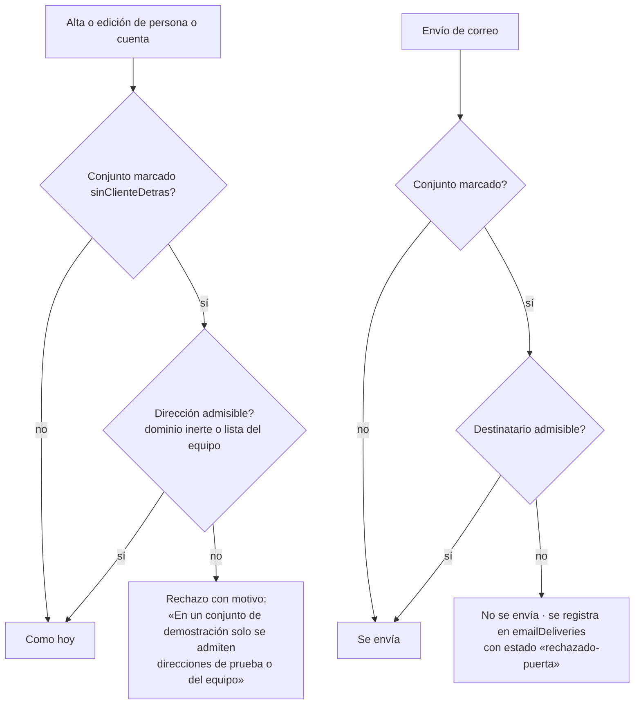

# `PRD-V-PLAT-006` — Buzones reales en conjuntos sin cliente: la puerta

| | |
|---|---|
| **Tipo** | `PLAT` — capacidad transversal: dato personal y correo, en todos los caminos de alta |
| **Portales** | `ADMIN` (alcance: alta y edición de personas y cuentas) · `SUPERADMIN` (alcance: la marca del conjunto y la lista del equipo) · `RESIDENTE` y `PORTERIA` no se ven afectados |
| **Módulo** | Residentes y unidades · Cuentas · correo transaccional (`functions/src/email.ts`) |
| **Usuario principal** | `superadmin` (marca los conjuntos y mantiene la lista). `tenant_admin` la sufre: es a quien se le rechaza una dirección |
| **Estado** | **Discovery — bloqueada por TRES decisiones de David (§0).** Es la «fase 2» de `DATO-001` del roadmap. Medida el 2 sep 2026 contra producción; **nada construido a propósito**, porque el criterio con que se apuntó el chip es imposible por construcción |
| **Dependencias** | `DATO-001` (limpieza del 27 ago, hecha) · `PRD-V-FLOW-003` (el canal de correo y el adjunto que convierte un correo molesto en fuga) · `PRD-V-FEAT-002`/`FEAT-006` (la importación es un camino de alta) · el trial self-service (`createTrialWorkspace`, `createTenantFromLead`) |
| **Riesgo** | **Medio.** Mal cortada rompe el trial: un prospecto se registra con su correo real y su conjunto nace `isExample: true` |
| **Reversibilidad** | Total detrás de una bandera. La marca del conjunto es un campo que se puede quitar; la lista del equipo, un documento |

---

## 0 · Lo que la medición cambió de la ficha antes de escribirla

El chip de `docs/pendientes.md` decía: *«rechazar buzones reales en conjuntos `isExample`, o
repetir la limpieza cada tanto»*. Se midió antes de construir, y **el criterio no se puede
construir tal cual**. Tres hechos, los tres contados en producción el 2 de septiembre de 2026:

1. **`isExample` no marca «conjunto del equipo»: marca «datos de ejemplo», y lo llevan los
   NUEVE conjuntos de producción — incluidos los dos del trial** (`queretarock-229-fc4c57` y
   `residencial-qintilab-mx-9c1293`, con `trialEndsAt` y `status: expired`). El trial nace con
   `isExample: true` porque `trial-seed.ts` siembra datos de ejemplo, y **su administrador se
   registra con su correo real por diseño**. Una puerta «`isExample` ⇒ solo buzones inertes»
   rechazaría el alta de cualquier prospecto. Es un criterio imposible por construcción, la
   misma trampa que `CA9` de `FEAT-006` la noche anterior: preguntar qué hay en el dato en el
   instante en que se mide.
2. **`DATO-001` limpió siete direcciones por su FORMA y dejó ONCE.** Su patrón era «nombre de
   pila suelto en gmail»; no cazó `medi.paty@gmail.com`, `Caro_ap_03@outlook.com`,
   `joa.peprz@hotmail.com` y ocho más. Están en `people`, en dos conjuntos: seis en
   `pXHEn5iWKWgX4sDF9tVp` (creadas el 17 may 2026 por `admin@lasplayas.com`) y cinco en
   `tenant-santa-maria` (21 may y 5 jun, por `admin@santamaria.co`). Todas anteriores a
   `DATO-001`, todas `active`, ninguna con cuenta de Auth salvo `luiseoteror@gmail.com`, y
   **ninguna ha recibido correo** (`emailDeliveries` tiene 2 filas en total, 0 a ellas). No se
   sabe de quién son los buzones: la lección de `DATO-001` es que la forma no lo dice.
3. **El equipo valida con buzones reales dentro de conjuntos de ejemplo, y eso es correcto.**
   `conjunto-las-playas` tiene cinco cuentas `david.macar.18+…@hotmail.com`; `PLAT-005` se
   validó con un iPhone real y un correo real. Una puerta en el alta que rechace «buzones reales»
   sin lista del equipo **rechaza la validación del producto**.

Y un cuarto dato que no decide nada pero hay que saber: **28 cuentas de Auth llevan dominios
inventados por las semillas** (`santamaria.co` ×6, `elnogal.co` ×4, `privadapalmas.mx` ×4,
`lasplayas.com`, `bromelias.co` ×2, más `demo.grupovivaru.com` ×9 en `people`). Son dominios
que **podrían existir**: el 27 de agosto se midió que **2 de 14 direcciones de Santa María
reciben**. `TBD`: de quién son esos dominios. Esta ficha no los toca (§4).

### Las tres decisiones que la bloquean

| | Decisión | Recomendación, con el porqué |
|---|---|---|
| **D1** | **Qué marca a un conjunto como «sin cliente detrás»** — el criterio de la puerta | **Un campo explícito en `tenants/{id}`, `sinClienteDetras: true`, escrito por el superadmin** sobre los siete conjuntos que no son trial. **No derivarlo** de `isExample` (lo llevan los trials) ni de la ausencia de `trialEndsAt` (un valor como sustituto de un hecho; cf. `la-suite-no-encadena`). Cuando entre el primer cliente, su conjunto nace sin la marca y nada cambia |
| **D2** | **Qué dirección se ADMITE en un conjunto marcado** | Dos listas y nada más: (a) **dominios inertes** —`ejemplo.vivaru.app`, `demo.grupovivaru.com`, `hogaru.test`, `demo.co`— en un catálogo del código, y (b) **la lista del equipo** en `config/correosDelEquipo` —dominios (`qintilab.com`) y direcciones exactas o con `+alias` sobre buzones que el equipo controla—, editable solo por el superadmin. Todo lo demás se rechaza. La (b) es la que permite seguir validando con un iPhone |
| **D3** | **Dónde está la puerta**: en la ENTRADA (alta y edición de la persona o la cuenta), en la SALIDA (el envío), o en las dos | **Las dos, y la salida PRIMERO.** La salida es un solo punto (`sendNotificationEmail` y `sendAccountEmail`) y **protege también las once que ya están dentro** y cualquier error futuro; la entrada hace visible el error a quien teclea. Si solo cabe una en la jornada: **la salida**. La entrada sola, que es lo que decía el chip, deja las once vivas y no protege de la importación de un padrón |

**Hasta que las tres estén tomadas, esta ficha no está «lista para desarrollo».** Lo que sí queda
construido y no depende de ellas: el barrido que las midió,
`functions/scripts/informe-correos-en-conjuntos-de-ejemplo.mjs`, en seco y con las direcciones
enmascaradas, para volver a contar en cualquier sesión.

---

## 1 · Resumen ejecutivo

Los nueve conjuntos de producción son de ejemplo y no tienen un cliente detrás, pero contienen
direcciones de correo de personas que no son del equipo: hoy once en `people`, y el 27 de agosto
fueron siete más. Cualquier flujo que envíe correo —el alta ya lo hace, y la cobranza adjuntaría el
estado de cuenta— le escribe a un desconocido sobre un conjunto donde no vive. Esta ficha pone una
puerta: en un conjunto marcado como sin cliente, solo se admite y solo se envía a direcciones
inertes o del equipo. El valor es dejar de depender de limpiezas periódicas por patrón, que ya
demostraron dejar pasar la mitad.

## 2 · Problema y baseline (medido el 2 sep 2026, `hogaru-1`)

| Medida | Valor |
|---|---|
| Conjuntos en producción · con `isExample: true` · con `trialEndsAt` | 9 · 9 · 2 |
| `people` en conjuntos de ejemplo · con dominio no inerte y no del equipo | 68 · **11** |
| `tenantUsers` · `users` · cuentas de Auth con dominio inventado por semilla | 41 · 40 · 28 |
| Correos entregados (`emailDeliveries`) · a las once | 2 · 0 |
| Direcciones que `DATO-001` limpió el 27 ago por su forma | 7 (22 documentos + 6 de Auth) |
| Limpiezas necesarias hasta hoy para el mismo problema | 2 (y la segunda encontró lo que la primera no vio) |

**Métrica de éxito:** el barrido da **0** direcciones no admitidas en conjuntos marcados, y
**0** entregas de correo a direcciones no admitidas desde conjuntos marcados, medido en
`emailDeliveries`. Se mide en `fin`, no al desplegar: la puerta de entrada no cambia lo que ya
está dentro (§0.2).

## 3 · Usuarios, roles y permisos

| Rol | Puede | Prohibido |
|---|---|---|
| `superadmin` | Marcar y desmarcar `sinClienteDetras` en un conjunto · editar `config/correosDelEquipo` · ver el informe del barrido | Nada nuevo prohibido |
| `tenant_admin` | Crear, editar e importar personas y cuentas como hoy; recibe un rechazo con motivo cuando la dirección no es admisible en un conjunto marcado | Marcar el conjunto · editar la lista del equipo · ver la lista del equipo |
| `resident` · `security_guard` | Nada cambia | Nada cambia |

## 4 · Objetivo, alcance y exclusiones

**Entra:** la marca del conjunto (D1) · las dos listas (D2) · la puerta de salida y la de entrada
(D3) detrás de **una** bandera `producto-puerta-de-buzones`, apagada al nacer · el barrido en
seco que mide el estado.

**No entra, y por qué:**

- **Las once direcciones que ya están dentro.** Limpiarlas es `sanear-correos-de-prueba.mjs`,
  que ya existe, **una vez David diga de quién son** (§0.2). Esta ficha las protege por la
  salida; no las cambia.
- **Los dominios inventados por las semillas** (`santamaria.co`, etc.). Son las cuentas de
  entrada de las demos; cambiarlas es cambiar cómo entra el equipo. `TBD` aparte.
- **El trial.** Sus conjuntos no se marcan; su administrador es un prospecto con correo real.
- **Un conjunto con cliente.** No se marca y nada de esto lo toca.

## 5 · Flujo funcional

## 6 · Estados y transiciones

No introduce ciclo de vida. La marca es un booleano con dueño (`superadmin`); un envío
rechazado es una fila terminal en `emailDeliveries` con `status: "rechazado-puerta"`, que la
misma bandeja de rebotes de `FLOW-003` ya sabe enseñar.

## 7 · Contrato de datos y multi-tenancy

| Dónde | Campo | Tipo | Quién escribe | Retención |
|---|---|---|---|---|
| `tenants/{id}` | `sinClienteDetras` | `boolean`, opcional, ausente = falso | `superadmin` (consola o script) | Vive con el conjunto |
| `config/correosDelEquipo` | `dominios: string[]` · `direcciones: string[]` | minúsculas, sin espacios | `superadmin` | Sin retención especial; **no contiene datos de terceros** |
| `emailDeliveries/{id}` | `status: "rechazado-puerta"` · `motivo` | existente + un valor nuevo | servidor | La retención de `FLOW-003` |

Invariantes: todo documento sigue llevando `tenantId`; la lista del equipo es **global**, no del
conjunto, porque el equipo es el mismo en los nueve. Un conjunto `suspended` o `expired` sigue en
solo lectura: la puerta no lo abre. En un conjunto en prueba (trial) la puerta **no aplica**
porque no se marca.

## 8 · Reglas de negocio

| | Regla |
|---|---|
| `RN-1` | La marca `sinClienteDetras` la escribe solo el superadmin. **Nunca se deriva** de `isExample`, `status` ni `trialEndsAt` |
| `RN-2` | Una dirección es admisible en un conjunto marcado si su dominio está en el catálogo de inertes **o** en `config/correosDelEquipo.dominios`, o si la dirección exacta está en `config/correosDelEquipo.direcciones`. La comparación es en minúsculas y **sin quitar el `+alias`**: `david+res1@…` se admite solo si está listada tal cual o su dominio lo está |
| `RN-3` | Con la bandera encendida, en un conjunto marcado **no se escribe** `people.email`, `tenantUsers.email` ni `users.email` con una dirección no admisible — ni por el cliente ni por una callable — y **no se envía** ningún correo a una dirección no admisible |
| `RN-4` | Un envío rechazado por la puerta **deja fila** en `emailDeliveries`. Rechazar en silencio es peor que enviar: nadie se entera de que el dato está mal |
| `RN-5` | La puerta de entrada rechaza con motivo legible; la de salida no interrumpe la operación que la disparó (un cobro que no pudo avisar sigue siendo un cobro; cf. `error-despues-del-commit`) |
| `RN-6` | Con la bandera apagada nada cambia, **y la marca se puede poner igual**: encender es un instante, y la marca es la que cuesta pensar |

## 9 · Notificaciones y correo

No añade correos. Quita: los que iban a direcciones no admisibles desde conjuntos marcados. El
remitente y el canal siguen siendo los de `email.ts`.

## 10 · Criterios de aceptación

| | Criterio | Cómo se mide |
|---|---|---|
| `CA1` | En un conjunto marcado y con la bandera encendida, crear una persona con `alguien@gmail.com` **falla** con el motivo de `RN-3`, desde el formulario y desde la importación | Regla probada contra el emulador con el patrón real del cliente (`addDoc`/`updateDoc`); la callable, por prueba unitaria |
| `CA2` | La misma alta con `alguien@ejemplo.vivaru.app` **pasa** | Ídem |
| `CA3` | La misma alta con una dirección listada en `config/correosDelEquipo` **pasa**, y con su `+alias` no listado **falla** | Ídem |
| `CA4` | **Debe seguir funcionando:** `createTrialWorkspace` con `prospecto@gmail.com` crea el conjunto y envía la invitación. El trial no se marca | Prueba de la callable + un trial real en staging |
| `CA5` | Con la bandera encendida, un envío desde un conjunto marcado a una dirección no admisible **no sale** y deja `emailDeliveries` con `rechazado-puerta` | Prueba de `sendNotificationEmail` por el cuerpo que va a Resend (patrón de `email-enlace-del-ambiente.test.ts`): cero llamadas a `fetch`, una fila |
| `CA6` | Con la bandera **apagada**, `CA1` pasa y `CA5` envía: la bandera es el freno de verdad y el servidor la comprueba | Las mismas pruebas con la bandera al revés |
| `CA7` | En un conjunto **no marcado**, nada de lo anterior aplica aunque la bandera esté encendida | Ídem |
| `CA8` | `superadmin` marca y desmarca; `tenant_admin` **no puede** escribir `sinClienteDetras` ni leer `config/correosDelEquipo` | Reglas contra el emulador |
| `CA9` | El barrido en seco da 0 no admisibles en los siete marcados **después** de correr `sanear-correos-de-prueba.mjs` sobre las once — no antes (§2, la métrica se mide en `fin`) | Correr el informe |

Casos que **deben fallar**: `CA1`, la mitad de `CA3`, `CA5`, y la escritura de `CA8` por el
`tenant_admin`.

## 11 · Arquitectura y dependencias

- **Cliente directo o callable.** Las tres colecciones ya se escriben por caminos distintos:
  `people` desde el cliente bajo reglas; `tenantUsers` y `users` solo por callables. Así que la
  puerta de entrada va **en dos sitios que comparten un solo predicado**: en `firestore.rules`
  para `people` (`create`/`update` cuando el correo cambia: leer `tenants/{tenantId}` y
  `config/correosDelEquipo` cuesta dos lecturas por escritura, aceptable) y en un helper
  `buzonAdmisibleEnConjunto(tenantId, email)` de `functions/src` para las callables de alta
  (`createTenantAdmin`, `createTenantOperationalUser`, `provisionResidentTemporaryAccess`,
  `resendAccountInvite`) y para la importación cuando pase por servidor.
- **La puerta de salida** vive en `email.ts`, delante del `fetch`: es el único sitio por el que
  sale todo correo (27 functions lo alcanzan, contadas el 2 sep).
- **Catálogo de dominios inertes** en un módulo compartido por front y functions, con guardián
  de que las reglas, el helper y el front leen la **misma** lista (cinco copias es la trampa de
  `guardian-ciego-en-su-propio-caso`).
- **Bandera** `producto-puerta-de-buzones`, en los cinco sitios del catálogo de banderas, con
  `default: false` y encendible por conjunto.
- **Sin índices nuevos.** Sin jobs.

## 12 · Riesgos

| Riesgo | Señal |
|---|---|
| Marcar un conjunto de trial por error y rechazar al prospecto | `CA4` en staging antes de encender; `emailDeliveries` con `rechazado-puerta` en un conjunto con `trialEndsAt` |
| La lista del equipo se queda corta y el equipo no puede validar | El mismo rechazo, con motivo; se amplía la lista, no se apaga la bandera |
| Dos copias del catálogo divergen | El guardián de §11 |
| La puerta de salida oculta un envío legítimo | `RN-4`: nada se rechaza sin fila |

## 13 · Despliegue, rollback y story map

Orden **reglas → functions → front** (la regla restringe, así que primero la regla: cf.
`siguiente-sesion-nivel1`). Rollback: apagar la bandera; las reglas nuevas deben ser inertes con
la bandera apagada, y eso se prueba (`CA6`). Se valida en staging con un trial real (`CA4`) y una
persona rechazada con ojos (`CA1`); en producción solo se enciende tras marcar los siete y
sanear las once.

**MVP:** D1, D2, salida, barrido. **Después:** entrada (reglas + callables), importación por
servidor.

## Puertas

| | |
|---|---|
| `G0 Necesidad` | **Superada.** Medida dos veces (27 ago y 2 sep), y la segunda encontró lo que la primera dejó |
| `G1 Valor` | **Superada.** Baseline en §2; métrica en `fin` |
| `G2 Datos y permisos` | **Abierta: D1 y D2** |
| `G3 Riesgo` | **Abierta: D3**, y el trial como caso que debe seguir funcionando |
| `G4`–`G6` | No aplican hasta cerrar D1–D3 |
