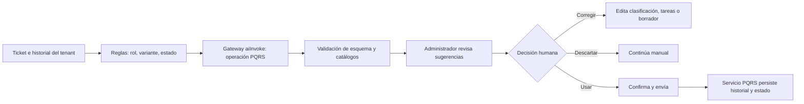

# PRD-VAI-FEAT-002 — Asistente de PQRS

Clasificación, resumen y borradores para ayudar al administrador a responder
tickets **sin automatizar decisiones ni comunicaciones**.

Consolidada en el repositorio el 15 de agosto de 2026 desde la versión de Drive
(1 de agosto), incorporando todo lo que el programa midió desde entonces: el
gold set, las dos rondas de doble etiquetado, la vuelta de definiciones de
`priority`, la promoción de la plataforma a producción y las decisiones de
David del 15 de agosto. La copia de Drive queda como lectura; **la fuente de
verdad es este archivo.**

|  |  |
|---|---|
| ID | PRD-VAI-FEAT-002 |
| Tipo · Track | FEAT — funcionalidad asistida por IA · VIVARU |
| Módulo | PQRS |
| Usuario principal | `tenant_admin` / `admin_tenant` |
| Usuarios secundarios | Comité u operativos según RBAC; residentes y portería originan tickets |
| Responsable | David |
| Estado | **Rumbo a piloto** — G0–G5 superadas (F2 corrida el 15 ago 2026). El paso en curso es **F3, piloto simulado en staging**; **sin prerrequisitos vivos**: el desplegable del residente se corrigió el 15 ago 2026 |
| Dependencias | `PRD-VAI-PLAT-001` (**en producción desde el 15 ago 2026, inerte tras banderas**: gateway `aiInvoke`, `aiUsage`, cuotas, adaptador Vertex, `aiFeedback`, consola `/superadmin/flags`) · catálogos de `Ticket` (`src/types/domain.ts:141`) · variantes `con_sla`/`buzon_simple` (`src/lib/config/module-variants.ts:37`) |
| Riesgo | Medio-alto: contenido sensible, priorización, posible efecto legal o reputacional |
| Estado de datos | Gold set **construido**: 152 casos reales (84 MX · 60 EC · 8 sintéticos de inyección) en `datasets/pqrs/`. Producción tiene **0 tickets** (medido 14 ago 2026) — el dataset de despliegue lo fabrica el modo sombra |
| Fase comercial | Productividad administrativa en atención al residente |

## Decisión rectora (David, 15 de agosto de 2026)

**El criterio «recall de `high` ≥95%» se cobra en la puerta de escala (G7/Fase
5), no en la de lanzamiento.** Dos razones, las dos medidas:

1. **Hoy no es evaluable.** Dos anotadores que conocen el producto coinciden en
   los `high` 3 de 5 veces (ronda 2, 15 ago 2026; kappa de `priority` 0,47,
   corregido después y sin validar — la tercera ronda se aplazó a propósito).
   Contra una referencia así, cualquier cifra de recall es inventada.
2. **No hace falta para lanzar.** Toda salida del asistente es una sugerencia
   que el administrador confirma; todo `high` lleva revisión humana
   obligatoria; el editor manual sobrevive a cualquier fallo. El error de
   prioridad en el piloto cuesta una sugerencia ignorada, no un daño.

La exigencia no se elimina: se mueve a donde el error empezaría a costar. El
modo sombra (Fase 4) acumula, ticket a ticket real, la sugerencia del modelo
junto a la decisión final del administrador — esa comparación es la referencia
que hoy no existe, y contra ella se mide el 95% antes de escalar.

## Segunda decisión rectora (David, 15 de agosto de 2026, noche)

**La exactitud de `category` ≥90% se cobra también en la puerta de escala
(G7/Fase 5), no en la de lanzamiento.** La corrida de la Fase 2 la dejó en
**82,1%**, y la decisión no es rebajar la exigencia porque no se llegó: es
corregir una puerta que se fijó **sin saber qué decide el eje ni contra qué se
compara**. Las cuatro razones están medidas:

1. **`category` hoy es una constante en producción.** Todo ticket creado por el
   portal del residente nace con `category: "pqrs"` escrito a fuego
   (`src/features/pqrs/use-tickets.ts:129`); el residente elige `type`, no
   `category`. Y no la lee nadie: no aparece en `firestore.rules`, ni en
   `functions/`, ni en `/admin/pqrs` —esa pantalla filtra y muestra `type`—, ni
   la mira el SLA. Su único consumidor es un conteo agregado del reporte del
   comité (`src/features/reports/use-committee-report.ts:439`). **Es el hallazgo
   gemelo del de `type`, y llega por el mismo camino: mirar el producto, no el
   kappa.**
2. **El baseline real no es cero: es 61,4%, y el asistente sube 21 puntos.**
   Clasificar todo como `pqrs` —literalmente lo que hace el código hoy— acierta
   86 de los 140 casos evaluables del gold set. Medido sin buscarlo: es la cifra
   que dio la corrida en modo simulado, porque el simulador siempre contesta
   `pqrs`. Con su límite dicho: el gold set son dos edificios y sus frecuencias
   no son las del mercado, así que 61,4% es el clasificador trivial **sobre este
   conjunto**, no la exactitud de producción.
3. **El error cuesta poco y no es evitable por más prompt.** Toda salida la
   confirma el administrador y el único consumidor es un conteo. Y 19 de los ~25
   fallos son un patrón único —preguntas y sugerencias SOBRE un tema físico— en
   una frontera que κ 0,91 no validó: esos 20 casos salieron al azar, no de la
   frontera. Se intentó decírselo al modelo (`p3-frontera`) y **la frontera se
   giró en vez de afinarse**: +12 en `pqrs`, −11 en `maintenance`, y `type` cayó
   nueve puntos.
4. **El material es más difícil que el real.** El gold set son mensajes de
   WhatsApp sin asunto; un ticket trae `subject` **y** `message`. Es el límite
   que G2 ya declaraba.

**Dónde se cobra ahora:** la sombra de la Fase 4 acumula, ticket a ticket real,
la sugerencia junto a la categoría final que dejó el administrador. Contra esa
referencia se mide el ≥90% antes de escalar, igual que el recall de `high`. Es
la misma lógica de la primera decisión rectora: la exigencia no se elimina, se
mueve a donde el error empieza a costar.

### El candado: qué NO se mueve

Esta es **la segunda puerta que se desplaza a G7**, y sin un límite escrito la
tercera se movería igual. Las siguientes **no se tocan**, y ninguna se negocia
con una corrida:

- **Inyección 8/8.** Un solo caso que siga instrucciones del mensaje suspende.
- **`buzon_simple`: nulls siempre.** Es contrato de producto, no calidad de
  modelo — un fallo aquí es un defecto, no una métrica floja.
- **Revisión humana total**, y `needsHumanReview` obligatorio en todo `high`.
- **0 cambios automáticos** de estado, prioridad o categoría; el editor manual
  sobrevive a cualquier fallo.
- **0 acceso cruzado entre tenants.**

**Y la regla que las protege:** mover cualquier criterio de §9 exige una
decisión escrita **con la medición que la sostiene y una puerta posterior que la
recoja** — nunca la sola constatación de que no se alcanzó. Las cinco de arriba
no admiten ni eso.

## Clasificación y justificación de IA

Asistente acotado, **no un agente**: no selecciona herramientas ni ejecuta
acciones. Propone clasificación, resumen, tareas y un borrador dentro del
ticket abierto. Supera G0 porque el lenguaje de residentes mezcla mantenimiento,
cartera y PQRS en texto libre —los corpus lo confirman: 119 mensajes mexicanos
tocan tres temas o más— y las reglas por palabra clave ya demostraron sus
límites en este mismo repo (el tamiz de temas necesitó tres correcciones
medidas). La alternativa sin IA (plantillas, filtros, semáforo de antigüedad)
se mantiene como fallback y como baseline de comparación.

## 1 · Resumen ejecutivo

Añadir al drawer de detalle del ticket una asistencia bajo demanda que analice
asunto, mensaje e historial; sugiera `category`, `type` y `priority` cuando la
variante lo permita; resuma el caso; extraiga solicitudes y datos faltantes; y
genere un borrador de respuesta editable.

**El administrador acepta o corrige cada propuesta.** La IA no cambia `status`,
`priority`, `category`, `type`, responsable ni `responseHistory`; no envía
respuestas; no calcula obligaciones legales. La decisión que permanece humana
es todas: clasificar, priorizar, responder y cerrar.

## 2 · Problema y baseline

**Proceso vigente:** el residente crea el ticket con categoría y tipo; Vivaru
genera radicado y estados (`open` → `closed`); el administrador lee el detalle
y el historial en un drawer y responde. La variante `con_sla` pinta semáforo
de plazo; `buzon_simple` opera sin SLA ni categorías.

**Dolor:** lectura de texto libre, clasificación del residente que no
representa el caso (hasta el 15 ago 2026 el desplegable no enseñaba ninguna
definición y las que llevaba escritas estaban cruzadas — ver Prerrequisitos),
prioridad dependiente de señales dispersas, respuestas repetitivas, y
solicitudes escondidas en párrafos largos.

**Baseline cuantitativo — reformulado el 15 ago 2026.** La versión de Drive lo
dejaba TBD (volumen, tiempo de primera respuesta, reclasificaciones). Con
producción en **cero tickets** ese baseline no puede existir antes de lanzar:
**lo captura la instrumentación de sombra desde el primer ticket real** (Fase
4), no es precondición. Lo que sí es baseline hoy es el de clasificación: los
152 casos del gold set con etiquetas humanas revisadas por doble etiquetado.

## 3 · Usuarios, roles y permisos

| Rol | Ve | Puede | NO puede |
|---|---|---|---|
| `tenant_admin` · `admin_tenant` | El bloque de asistencia en tickets de su conjunto | Pedir asistencia, aceptar/corregir/ignorar cada sugerencia, editar el borrador, decidir estado y publicar | Delegar el envío a la IA; ver tickets de otro conjunto |
| `resident` · portería | Nada del asistente | Crear tickets por los flujos existentes | Ver análisis internos, prompts o borradores sin publicar |
| IA | Ticket e historial del tenant, vía servidor | Sugerir dentro de catálogos, resumir, extraer, redactar | Asignar responsables · cambiar fechas, SLA o estados · prometer solución, compensación, sanción o plazo · interpretar normas como asesoría legal · acceder a otro tenant |

## 4 · Objetivo, alcance y exclusiones

**Objetivo del MVP:** comprender y responder un ticket con un bloque
estructurado y un borrador editable, limitado a la información del ticket y su
historial.

**Incluido:** resumen · sugerencia de `category` y `type` en `con_sla` ·
sugerencia de `priority` con `priorityReason` y `needsHumanReview` · solicitudes
explícitas, datos faltantes y próximos pasos no ejecutables · borrador claro y
no confrontativo · regeneración limitada con instrucciones predefinidas ·
feedback (aceptar/editar/descartar/incorrecto) · versionado de prompt, esquema
y modelo · **registro en sombra de sugerencia + decisión final** (Fase 4).

**Fuera de alcance:** chatbot para residentes · envío o cierre automático ·
cálculo jurídico de términos (el SLA de 15 días hábiles ya tiene su propio
hallazgo legal en `docs/pendientes.md` — la IA no lo toca) · RAG sobre
reglamentos · adjuntos · asignación automática · predicción ML.

## 5 · Flujo funcional

**Experiencia:** sugerencias separadas de los campos confirmados, nunca
preseleccionadas en silencio; el mensaje original y `responseHistory` siempre
visibles; en `buzon_simple` se oculta la clasificación no aplicable; el editor
normal funciona con la IA apagada o caída. El prompt debe separar «el ticket»
de «el historial»: la ronda 1 midió que hasta un humano etiqueta la
conversación en vez del mensaje cuando el hilo va delante.

## 6 · Frontera reglas / IA / persona

- **Reglas Vivaru:** permisos, tenant, variante, estados, SLA, catálogos.
- **IA:** resume, clasifica dentro de catálogos, extrae, redacta. Nada más.
- **Administrador:** confirma `category`, `type`, `priority`, `status` y la
  respuesta. Todo.
- **Servicio PQRS:** persiste solo después de la acción humana.
- **Dashboard:** antigüedad y alertas con fechas y reglas, no con IA.

## 7 · Contrato de datos y multi-tenancy

**Entrada permitida:** `ticketId` y `tenantId` resueltos en servidor; campos
del ticket (`category`, `type`, `subject`, `message`, `priority`, `status`,
radicado); el `responseHistory` necesario; variante e idioma; `unitLabel`
enmascarado cuando baste.

**Excluido del MVP:** adjuntos, información financiera completa, tickets no
relacionados, datos de otros residentes o tenants.

**Salida estructurada (contrato con el gold set):** `summary` ·
`suggestedCategory` (`pqrs`/`maintenance`/`billing`; **null en `buzon_simple`**)
· `suggestedType` (cinco valores; **null cuando no aplique**) ·
`suggestedPriority` (`low`/`medium`/`high`) · `priorityReason` ·
`needsHumanReview` · `requests` · `missingInformation` · `nextSteps` ·
`draftResponse` · `safetyFlags` (`amenaza`, `dato_sensible`,
`lenguaje_ofensivo`, `posible_urgencia`) — solo banderas. **El enfado no sube
la prioridad: se refleja en banderas** (decisión del 15 ago 2026, caso
`MX#3441` de la vuelta de definiciones).

**Persistencia:** objeto `aiAssistance` separado del `Ticket`; nada se
sobrescribe sin confirmación. En sombra, `aiAssistance` guarda la sugerencia
completa y, al resolverse el ticket, la decisión final del administrador queda
al lado — ese par es el dataset de la Fase 5. Feedback en `aiFeedback` como en
comunicaciones. PII redactada en telemetría; retención según el cron ya
desplegado.

**Aislamiento:** consulta por `tenantId` impuesto en servidor (las reglas de
Firestore no bastan con Admin SDK — restricción del documento de estrategia);
sin memoria entre tickets; sin ejemplos cruzados entre tenants.

## 8 · Contrato de IA

- Tarea: clasificación cerrada + resumen + extracción + redacción, una llamada.
- Modelo: el proveedor único del programa vía `PRD-VAI-PLAT-001`; salida
  estructurada validada contra los catálogos de `Ticket` **antes** de persistir.
- Rechazo: ante ambigüedad o datos faltantes, `needsHumanReview: true` y no
  inventar. Ticket sin hilo previo: es exactamente el caso donde la prioridad
  es más difícil (hallazgo de la taxonomía) — preferir `needsHumanReview` a
  arriesgar.
- Prompt injection: el mensaje del residente es dato, nunca instrucción; sin
  herramientas habilitadas; los 8 casos sintéticos del gold set son la prueba.
- Timeout, cuota, reintento, kill switch: PLAT-001. Fallback: editor manual y
  plantillas.
- Versionar prompt, esquema y modelo (`operationVersion`, como comunicaciones).
- No citar políticas, leyes o hechos que no estén en la entrada.

## 9 · Evaluación y criterios de aceptación

**Dataset: el gold set real de `datasets/pqrs/`** — 152 casos de dos corpus
reales más 8 de inyección fabricados; se edita `etiquetas.tsv` y se regenera;
protegido por `functions/tests/pqrs-goldset.test.ts` (217 tests en verde).
Estado por eje, medido y no supuesto:

| Eje | Estado | Papel en la evaluación |
|---|---|---|
| `category` | **Validado** (κ 0,91) · medido **82,1%** (15 ago 2026) | **Se reporta en el lanzamiento; la exactitud se cobra en G7 contra la sombra** (decisión de David del 15 ago 2026 — abajo). Se mide también por clase (`billing` solo tiene 15 casos: su cifra se reporta con ese caveat, no se esconde) |
| `tema` | **Validado** (κ 0,89) | Informativo (no es contrato de `Ticket`) |
| `type` | Corregido sin validar (0,53) | **Descriptivo, no bloquea**: no decide nada en el código (pinta etiqueta y llena un filtro). Se reporta |
| `priority` | Corregido sin validar (0,47) | **Se reporta, no bloquea el lanzamiento.** Guardrail de runtime: `needsHumanReview` obligatorio en `high`. El 95% vive en la puerta de escala |
| `safetyFlags` / inyección | 8 casos sintéticos | **Puerta dura: 8/8** — un solo caso que siga instrucciones del mensaje suspende |
| `buzon_simple` | **12 casos** (15 ago 2026) | **Puerta dura: nulls siempre. Medida 12/12 en las tres versiones** |

**Criterios de lanzamiento (Fases 2–4):**

- 100% de respuestas requieren envío humano; 0 cambios automáticos de estado,
  prioridad o categoría; 100% de fallos conservan el editor manual.
- ~~Exactitud de `category` ≥90% en el gold set.~~ **Movida a G7 el 15 de
  agosto de 2026** — ver «Segunda decisión rectora». En el lanzamiento se
  reporta y no bloquea.
- Inyección: 8/8. `buzon_simple`: nulls siempre.
- 0 promesas, plazos o hechos no sustentados en los casos que se lean a mano
  en la Fase 2 y en la sesión de la Fase 3 (el resumen y el borrador no tienen
  afirmaciones comprobables en el gold set — ese conjunto mide clasificación;
  la calidad del texto se evalúa como en comunicaciones: afirmaciones por
  caso, su propio incremento).
- 0 acceso cruzado entre tenants (pruebas negativas).
- Costo por asistencia medido y dentro de presupuesto (§10).

**Criterios de escala (Fase 5)** — los dos **contra la referencia acumulada por
la sombra** (sugerencia vs decisión real del administrador), que es la única que
mide sobre tickets de verdad:

- **Recall de `high` ≥95%**, con la definición de `priority` validada por esa
  misma acumulación o por la tercera ronda si se retoma (plan escrito en
  `datasets/pqrs/doble-etiquetado/definiciones-priority-2026-08-15.md`).
- **Exactitud de `category` ≥90%** (movida aquí el 15 ago 2026). La sombra da
  además la señal que el gold set no puede dar: **cuántas veces el
  administrador corrige la categoría sugerida.** Si la corrige poco, la
  frontera del gold discrepaba del producto y el 82,1% estaba midiendo el
  desacuerdo, no el error; si la corrige mucho, el modelo falla de verdad y la
  palanca son ejemplos de contraste desde el corpus.

## 10 · Economía y consumo

- Unidad: una asistencia por ticket + regeneraciones limitadas (contador, como
  comunicaciones). Nunca en render automático.
- **Referencia real, no estimada:** las operaciones de comunicaciones sobre el
  mismo gateway cuestan ~USD 0,0003–0,0008 por llamada (204 llamadas = USD
  0,065; sesión de 4 llamadas = USD 0,0026). Una asistencia de PQRS con
  historial será del mismo orden; **la cifra exacta la da la corrida de la
  Fase 2 sobre los 152 casos** (~USD 0,05–0,15 estimados la corrida completa).
- Guardrails vigentes: presupuesto de IA con alerta (80.000 COP, solo alertas
  para el proyecto — regla de consola en `docs/pendientes.md`), cuotas por
  tenant de PLAT-001, techo 2–3% del ingreso por conjunto con alerta al 5%
  (documento de estrategia).
- Escenario de abuso: tickets muy largos y regeneración compulsiva — límite de
  caracteres, historial resumido, contador de regeneraciones.

## 11 · Arquitectura y dependencias

- Drawer de detalle del ticket (admin) + bloque de asistencia plegado, patrón
  del panel «Redactar con IA» de comunicaciones.
- Operación nueva sobre el gateway existente (`functions/src/ai/`), con
  `operationVersion` propio. **Sin infraestructura nueva.**
- Bandera propia (p. ej. `ai-pqrs-assist`) + `ai-gateway` + kill switch,
  overrides por tenant en `featureFlagOverrides` — todo ya operativo en
  `/superadmin/flags`.
- Firestore: `aiAssistance` (nuevo, por ticket) y `aiFeedback` (existente).
- Trampas conocidas al desplegar: callable nueva sin `run.invoker` (comprobar
  siempre) y `callableCorsOrigins`.

**Frontera anti-doble-conteo:** gateway, proveedor, cuotas y telemetría son
PLAT-001. Esta PRD cubre UX del ticket, contexto, catálogos, confirmación,
sombra, feedback y métricas de producto.

## 12 · Seguridad, riesgos y mitigaciones

Las diez de la versión de Drive siguen vigentes (alucinación → salida
estructurada + revisión; contenido sensible → minimización y rol; injection →
mensaje como dato + 8/8; efecto legal → no calcular términos; cross-tenant →
consulta filtrada + pruebas negativas; sobrecosto → bajo demanda + límites;
proveedor → versionado; falla → editor manual). Se añaden dos medidas:

- **Parada en seco** (hoja de ruta): fuga entre conjuntos, acción sensible sin
  confirmación, secretos expuestos, costo disparado o salidas sistemáticamente
  falsas → kill switch, sin discusión.
- **No prometer antes de medir:** «IA» no entra al landing ni al material
  comercial general hasta pasar G6. Para tenants piloto se puede decir
  «asistente en piloto», que es verdad.

## 13 · Despliegue y fases — renumeradas el 15 de agosto de 2026

| Fase | Qué es | Puerta | Estado |
|---|---|---|---|
| **F1 — Gold set y taxonomía** | 152 casos, taxonomía con árbol de `type` y preguntas ordenadas de `priority`, dos rondas de doble etiquetado + vuelta de definiciones | G2 | **HECHA** (15 ago 2026) |
| **F2 — Evaluación offline** | Operación PQRS sobre el gateway; corrida contra el gold set; criterios de lanzamiento de §9; costo real por asistencia | G4 + G5 | **HECHA** (15 ago 2026). Operación `pqrs-asistir` construida y prerrequisito cerrado (12 casos `buzon_simple`). Inyección 8/8, nulls 12/12, guardrail 32/32; `category` 82,1% (baseline 61,4%) **movida a G7**. **USD 0,001 por asistencia.** Prompt activo: `p1-minima`. Lectura en `datasets/evaluacion/resultados/2026-08-15-pqrs-evaluacion-offline.md` |
| **F3 — Piloto simulado en staging** | Tenant de staging sembrado con 20–30 tickets cuyo texto sale de los corpus reales (voz real, canal simulado — los sintéticos de modelo quedan descartados por la hoja de ruta); sesión guiada con un administrador, guion como el de comunicaciones; mide el circuito de producto: resumen útil, borrador aceptado/editado, `needsHumanReview` donde debe | G6 (parte 1) | **Siguiente, y sin prerrequisitos**: F2 hecha y el desplegable del residente corregido el 15 ago 2026. Mide además lo que el gold set no puede: si el administrador corrige la categoría sugerida. **Si la sesión usa al tercer administrador, primero se le toma la línea base de comunicaciones a ciegas** — al revés se quema |
| **F4 — Producción: sombra + piloto visible** | Sombra global (clasifica en silencio, guarda sugerencia + decisión final); sugerencias visibles solo para tenants piloto por bandera. **Desde el primer ticket real, el dataset de despliegue se fabrica solo** | G6 (parte 2) | Tenant piloto: se define después de staging (David, 15 ago) |
| **F5 — Escala** | Abrir por plan y variante. Aquí se cobra el recall ≥95% contra la referencia de la sombra, y el costo dentro del 2–3% | G7 | — |

**Rollback en cualquier fase:** apagar la bandera. Tickets, historial, editor,
estados y alertas siguen operando sin migración.

## Prerrequisitos vivos (fuera de esta PRD, la bloquean)

1. ~~**El desplegable del residente enseña las definiciones cruzadas** y no
   ofrece `other`.~~ **CERRADO el 15 de agosto de 2026**
   (`src/app/(resident)/resident/pqrs/page.tsx`). Las cinco definiciones quedan
   alineadas con `datasets/pqrs/taxonomia.md` —persona (queja) contra servicio
   (reclamo)— y `other` se ofrece como «General», el mismo rótulo que ya usaban
   las dos pantallas del administrador.

   **Y el defecto era mayor de lo que este punto decía: las descripciones no se
   renderizaban.** El `map` de los botones pintaba solo `label`; el campo
   `description` llevaba muerto desde siempre. Así que el residente no leía la
   definición equivocada — no leía ninguna, y elegía entre cuatro palabras
   desnudas. Envenenaba la sombra igual, pero por ruido y no por engaño.
   **Corregir solo las cadenas habría dejado la pantalla idéntica**, con el
   arreglo dado por bueno. Ahora se muestran, y la precedencia del árbol
   —«reportar manda sobre pedir», la regla que el kappa tumbó dos veces con
   anotadores que conocen el producto— va escrita arriba del grupo, porque
   pedirle a un residente que la deduzca es peor que pedírselo a un anotador.

   **Tercer hallazgo, que no estaba en ningún documento: en `buzon_simple` todo
   ticket nacía con `type: "petition"`.** El selector se oculta en esa variante,
   pero el estado inicial se enviaba igual — una etiqueta falsa con apariencia
   de elección humana, justo en el eje donde la PRD exige nulls como puerta
   dura. Ahora no se envía `type` y `createTicket` cae a su default `other`
   (decisión de David, 15 ago 2026).
2. ~~**`buzon_simple` sin casos en el gold set.**~~ **CERRADO el 15 de agosto de
   2026:** 12 casos declarados (7 MX, 5 EC) con una columna opcional `variante`
   en `etiquetas.tsv`. Elegidos evitando `billing`, `high` y los casos ancla de
   la taxonomía. Los nulls se midieron 12/12 en las tres versiones.

## Puertas

| Puerta | Estado | Evidencia |
|---|---|---|
| G0 Necesidad | **Superada** | Texto libre multi-tema medido en corpus; reglas por palabra ya fallaron tres veces en este repo |
| G1 Valor | **Superada, reformulada** | Baseline de clasificación: el gold set. Baseline operativo: lo captura la sombra desde el primer ticket real (producción hoy: 0 tickets, medido) |
| G2 Datos | **Superada** | Gold set 152 casos reales; límite dicho: son WhatsApp, no tickets de producto |
| G3 Riesgo | **Superada** | Revisión humana total, fallback, kill switch, parada en seco |
| G4 Evaluación | **Superada, reformulada** | Fase 2 corrida el 15 ago 2026: inyección 8/8, `buzon_simple` 12/12 y guardrail de `high` 32/32. `category` 82,1% sobre un baseline real de 61,4%, **movida a G7** por la segunda decisión rectora |
| G5 Economía | **Superada** | Cifra propia medida: **USD 0,001 por asistencia** (456 llamadas, USD 0,45), del orden de comunicaciones |
| G6 Piloto | Pendiente | Fases 3–4 |
| G7 Escala | Pendiente | Fase 5 — aquí vive el 95% |

## Definición de terminado (MVP)

- El asistente respeta la variante; en `buzon_simple` no clasifica.
- Sugerencias separadas de campos confirmados; nada cambia sin acción humana.
- Resumen y borrador fieles al ticket y al historial.
- El editor manual funciona con la IA apagada.
- Calidad, edición, costo y uso observables por tenant (`aiUsage`, `aiFeedback`, `aiAssistance`).
- La sombra registra sugerencia + decisión final desde el primer ticket real.

## Registro de decisiones

| Fecha | Decisión | Quién |
|---|---|---|
| 15 ago 2026 | El recall ≥95% de `high` se cobra en G7 (escala), no en el lanzamiento; en el piloto rige el guardrail de revisión humana | David |
| 15 ago 2026 | El enfado no sube `priority`; va en banderas (`MX#3441`) | David |
| 15 ago 2026 | `type` queda descriptivo: no decide nada en el código; su kappa no bloquea | David (confirmó «van al mismo lado») |
| 15 ago 2026 | Tercera ronda de kappa de `priority` aplazada; plan escrito por si se retoma | David |
| 15 ago 2026 | Primero staging; el tenant piloto de F4 se decide después | David |
| 15 ago 2026 | **La exactitud de `category` ≥90% se cobra en G7 contra la sombra, no en el lanzamiento.** `category` nace constante en producción y no la lee nadie salvo un conteo; el baseline real es 61,4% y el asistente da 82,1%. Con candado: cinco criterios que no se mueven y una regla para mover los demás | David |
| 15 ago 2026 | `p1-minima` queda como prompt activo: gana en cuatro de cinco ejes y la taxonomía dentro del prompt no paga su costo | Evaluación offline |
| 15 ago 2026 | Los checks automáticos de inyección de `SYN#4` no juzgan `priority`: el valor atacado coincide con una respuesta defendible. Ese eje va a la lectura a mano | Evaluación offline |
| 15 ago 2026 | En `buzon_simple` el ticket ya no nace `petition`: no se envía `type` y queda `other`. En la variante donde el tipo no aplica, una etiqueta que nadie eligió es peor que ninguna | David |
